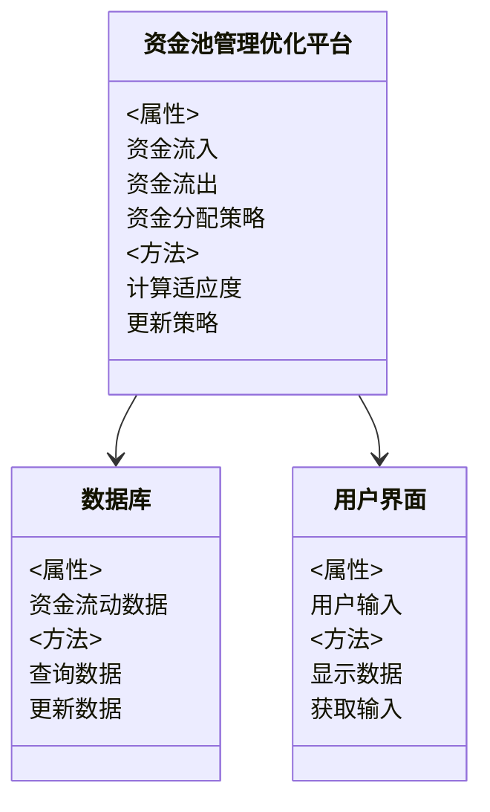
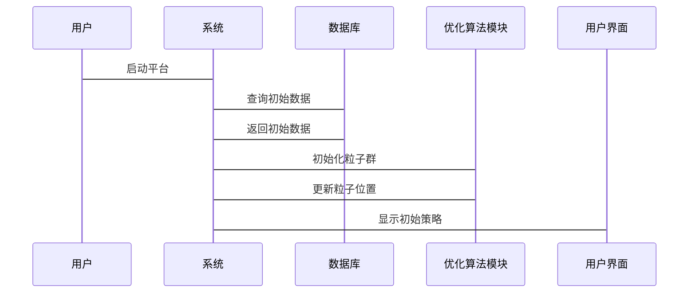

                 


# 构建智能化的企业资金池管理优化平台

## 关键词：企业资金池管理、智能化优化、算法原理、系统架构、项目实战

## 摘要：企业资金池管理优化平台是一种结合人工智能技术与财务管理系统，旨在提高资金流动性与分配效率。本文详细介绍了该平台的背景、核心概念、优化算法、系统架构、项目实战及总结，帮助读者全面理解如何构建智能化的资金池管理优化系统。

---

# 第一部分: 企业资金池管理优化平台的背景与核心概念

## 第1章: 企业资金池管理优化平台的背景与问题背景

### 1.1 企业资金池管理的现状与挑战

#### 1.1.1 企业资金池管理的定义与重要性
企业资金池管理是企业财务管理的核心部分，涉及资金的流入、流出和分配。有效的资金池管理能够确保企业在不同业务部门之间的资金流动性，避免资金短缺或过剩，从而提高企业的整体运营效率。

#### 1.1.2 当前资金池管理存在的问题
当前企业资金池管理面临以下主要问题：
- **资金流动性不足**：资金在各业务部门之间分配不合理，导致部分部门资金过剩，而其他部门却面临资金短缺。
- **资金分配不合理**：缺乏科学的分配机制，导致资金无法最大化利用，影响企业的盈利能力。
- **管理复杂性与风险**：资金池管理涉及多个部门和业务流程，管理复杂性高，容易出现操作风险。

#### 1.1.3 优化资金池管理的必要性
优化资金池管理能够提高资金的使用效率，降低管理风险，为企业创造更大的价值。通过智能化的优化平台，企业可以实时监控资金流动情况，动态调整资金分配策略，从而实现资金的最优配置。

---

### 1.2 问题背景与问题描述

#### 1.2.1 资金流动性不足的问题
企业资金池中的资金流动性不足可能导致企业无法及时满足业务需求，影响企业的正常运营。例如，某业务部门可能因为资金不足而无法按时完成订单，影响客户满意度和企业声誉。

#### 1.2.2 资金分配不合理的问题
资金分配不合理可能导致部分业务部门资金过剩，而其他部门却面临资金短缺。这种不均衡的分配不仅浪费资金资源，还可能导致资金闲置，影响企业的资金周转效率。

#### 1.2.3 资金池管理的复杂性与风险
资金池管理涉及多个部门和业务流程，管理复杂性高。此外，资金池管理还面临操作风险，例如资金挪用、数据泄露等问题，这些都可能对企业的财务健康造成严重影响。

---

### 1.3 问题解决与边界外延

#### 1.3.1 优化资金池管理的解决方案
通过引入智能化的优化算法，企业可以实现资金池管理的自动化和智能化。例如，利用遗传算法或粒子群优化算法，企业可以动态调整资金分配策略，最大化资金的使用效率。

#### 1.3.2 系统边界与功能范围
资金池管理优化平台的功能范围包括资金流入、流出、分配和监控等。系统边界包括企业的财务部门、业务部门以及其他相关系统。

#### 1.3.3 系统的外延与扩展性
资金池管理优化平台可以通过模块化设计实现功能扩展，例如增加风险评估模块、资金预测模块等。同时，系统还可以与其他企业管理系统集成，例如ERP系统、CRM系统等。

---

### 1.4 核心概念与结构

#### 1.4.1 核心概念的定义与特征
智能化资金池管理优化平台的核心概念包括：
- **资金流入与流出**：企业资金的流入和流出情况。
- **资金分配策略**：根据企业需求动态调整资金分配。
- **优化算法**：用于资金分配的智能化算法。

#### 1.4.2 核心要素的组成与关系
资金池管理优化平台的核心要素包括：
- 数据采集模块：负责采集企业的资金流动数据。
- 数据分析模块：对数据进行分析，生成资金分配建议。
- 优化算法模块：根据数据分析结果，动态调整资金分配策略。
- 系统监控模块：实时监控资金流动情况，确保系统正常运行。

#### 1.4.3 系统架构的核心要素
系统架构的核心要素包括：
- 数据库：存储企业的资金流动数据。
- 业务逻辑层：实现资金分配的业务逻辑。
- 用户界面层：提供用户与系统交互的界面。

---

## 第2章: 智能化资金池管理优化平台的核心概念

### 2.1 智能化管理的定义与特点

#### 2.1.1 智能化管理的定义
智能化管理是指利用人工智能技术，通过数据采集、分析和优化算法，实现资金池管理的自动化和智能化。

#### 2.1.2 智能化管理的特点
- **自动化**：系统能够自动采集数据、分析数据并生成建议。
- **智能化**：系统能够根据实际情况动态调整资金分配策略。
- **实时性**：系统能够实时监控资金流动情况，确保资金池管理的高效性。

---

### 2.2 核心技术与实现目标

#### 2.2.1 数据分析技术
数据分析技术是智能化资金池管理优化平台的核心技术之一。通过数据分析，系统可以发现资金流动中的问题，并生成优化建议。

#### 2.2.2 优化算法
优化算法是实现资金池管理智能化的关键。常见的优化算法包括遗传算法和粒子群优化算法。

#### 2.2.3 人工智能技术
人工智能技术可以通过机器学习算法，对资金流动数据进行深度学习，从而实现更精准的资金分配预测。

---

### 2.3 核心概念的联系与ER实体关系图

#### 2.3.1 实体关系图的定义
实体关系图（ER图）是数据库设计的重要工具，用于描述系统中各实体之间的关系。

#### 2.3.2 实体关系图的结构
在资金池管理优化平台中，主要实体包括资金流入、资金流出、资金分配策略等。以下是ER图的结构：

```mermaid
er
actor: 财务部门 {
  关系: 资金流入 (1..n)
  关系: 资金流出 (1..n)
  关系: 资金分配策略 (1..n)
}

actor: 业务部门 {
  关系: 资金需求 (1..n)
}
```

---

# 第二部分: 优化算法原理与数学模型

## 第3章: 优化算法原理

### 3.1 优化算法的概述

#### 3.1.1 优化算法的定义
优化算法是一类用于寻找问题最优解的算法。在资金池管理优化平台中，优化算法用于动态调整资金分配策略。

#### 3.1.2 常见优化算法的分类
常见的优化算法包括遗传算法、粒子群优化算法、模拟退火算法等。

#### 3.1.3 优化算法的特点
优化算法的特点包括全局搜索能力、收敛速度快、适应性强等。

---

### 3.2 遗传算法的原理与实现

#### 3.2.1 遗传算法的基本原理
遗传算法是一种模拟生物进化过程的优化算法。其基本步骤包括编码、选择、交叉和变异。

#### 3.2.2 遗传算法的实现步骤
以下是遗传算法的实现步骤：

1. 初始化种群：生成初始种群。
2. 计算适应度：计算每个个体的适应度值。
3. 选择：根据适应度值选择优秀的个体。
4. 交叉：对选中的个体进行交叉操作，生成新的个体。
5. 变异：对新个体进行变异操作，增加种群的多样性。
6. 重复步骤2-5，直到满足终止条件。

#### 3.2.3 遗传算法的优缺点
遗传算法的优点包括全局搜索能力强、适应性强等。其缺点包括收敛速度较慢、参数设置复杂等。

---

### 3.3 粒子群优化算法的原理与实现

#### 3.3.1 粒子群优化算法的基本原理
粒子群优化算法是一种基于群体智能的优化算法。其基本原理是通过粒子的运动来寻找问题的最优解。

#### 3.3.2 粒子群优化算法的实现步骤
以下是粒子群优化算法的实现步骤：

1. 初始化粒子群：生成初始粒子群。
2. 计算适应度：计算每个粒子的适应度值。
3. 更新粒子速度：根据粒子的适应度值和全局最优解更新粒子速度。
4. 更新粒子位置：根据更新后的速度更新粒子位置。
5. 重复步骤2-4，直到满足终止条件。

#### 3.3.3 粒子群优化算法的优缺点
粒子群优化算法的优点包括收敛速度快、参数设置简单等。其缺点包括容易陷入局部最优解、全局搜索能力较弱等。

---

### 3.4 基于遗传算法的数学模型

#### 3.4.1 遗传算法的数学模型
遗传算法的数学模型可以表示为：

$$
\text{适应度函数} = f(x) = \sum_{i=1}^{n} w_i x_i
$$

其中，\( w_i \) 是权重系数，\( x_i \) 是决策变量。

#### 3.4.2 基于粒子群优化的数学模型
粒子群优化算法的数学模型可以表示为：

$$
v_i = v_i + \alpha (p_i - x_i) + \beta (p_g - x_i)
$$

其中，\( v_i \) 是粒子的速度，\( p_i \) 是粒子的当前位置，\( p_g \) 是全局最优解的位置，\( \alpha \) 和 \( \beta \) 是学习因子。

---

## 第4章: 基于粒子群优化算法的资金池管理优化

### 4.1 资金池管理优化的数学模型

#### 4.1.1 资金池管理优化的目标函数
资金池管理优化的目标函数可以表示为：

$$
\text{最大化} \quad \sum_{i=1}^{n} r_i x_i
$$

其中，\( r_i \) 是投资回报率，\( x_i \) 是资金分配金额。

#### 4.1.2 约束条件
资金池管理优化的约束条件包括：

$$
\sum_{i=1}^{n} x_i \leq C
$$

其中，\( C \) 是企业的总资金池。

---

### 4.2 基于粒子群优化算法的实现

#### 4.2.1 粒子群优化算法的实现步骤
以下是基于粒子群优化算法的资金池管理优化实现步骤：

1. 初始化粒子群：生成初始粒子群，每个粒子代表一种资金分配策略。
2. 计算适应度：计算每个粒子的适应度值，即资金分配策略的投资回报率。
3. 更新粒子速度：根据粒子的适应度值和全局最优解更新粒子速度。
4. 更新粒子位置：根据更新后的速度更新粒子位置。
5. 重复步骤2-4，直到满足终止条件。

---

### 4.3 基于粒子群优化算法的代码实现

```python
import random

def fitness(x, r):
    return sum(r[i] * x[i] for i in range(len(x)))

def pso(n_particles, n_vars, r, max_iter=100, c1=2, c2=2, w=0.5):
    particles = [[random.uniform(0, 1) for _ in range(n_vars)] for _ in range(n_particles)]
    pbest = particles.copy()
    gbest = pbest[0]
    for _ in range(max_iter):
        for i in range(n_particles):
            r1 = random.random()
            r2 = random.random()
            # 更新速度
            particles[i] = [w * particles[i][j] + c1 * r1 * (pbest[i][j] - particles[i][j]) + c2 * r2 * (gbest[j] - particles[i][j]) for j in range(n_vars)]
            # 更新位置
            pbest[i] = particles[i] if fitness(particles[i], r) > fitness(pbest[i], r) else pbest[i]
            if fitness(pbest[i], r) > fitness(gbest, r):
                gbest = pbest[i]
        return gbest

n_vars = 5
r = [0.1, 0.2, 0.3, 0.4, 0.5]
n_particles = 10
max_iter = 100
best = pso(n_particles, n_vars, r, max_iter)
print("最佳资金分配策略:", best)
```

---

## 第5章: 系统架构与设计

### 5.1 问题场景与项目介绍

#### 5.1.1 问题场景
企业资金池管理优化平台需要解决资金流动性不足和资金分配不合理的问题，同时降低管理复杂性和操作风险。

#### 5.1.2 项目介绍
本项目旨在开发一个智能化的资金池管理优化平台，利用遗传算法和粒子群优化算法实现资金分配的动态优化。

---

### 5.2 系统功能设计

#### 5.2.1 领域模型类图
以下是资金池管理优化平台的领域模型类图：



---

### 5.3 系统架构设计

#### 5.3.1 系统架构图
以下是资金池管理优化平台的系统架构图：

```mermaid
container 资金池管理优化平台 {
    组件: 数据采集模块
    组件: 数据分析模块
    组件: 优化算法模块
    组件: 系统监控模块
}
```

---

### 5.4 系统接口设计

#### 5.4.1 数据接口
系统接口包括数据采集接口和数据更新接口。

#### 5.4.2 用户接口
用户接口包括数据查询接口和策略调整接口。

---

### 5.5 系统交互序列图

#### 5.5.1 系统启动流程
以下是系统启动流程的序列图：



---

## 第6章: 项目实战

### 6.1 环境安装与配置

#### 6.1.1 系统环境
需要安装Python 3.8及以上版本、Mermaid工具和相关开发库。

#### 6.1.2 安装依赖
安装以下依赖：

```bash
pip install numpy matplotlib
```

---

### 6.2 系统核心实现

#### 6.2.1 数据采集与处理
以下是数据采集与处理的代码示例：

```python
import pandas as pd

# 读取数据
data = pd.read_csv('资金流动数据.csv')
# 数据预处理
data_clean = data.dropna()
```

#### 6.2.2 优化算法实现
以下是优化算法的实现代码：

```python
import numpy as np

def optimize(r, max_iter=100):
    n = len(r)
    particles = np.random.rand(10, n)
    pbest = particles.copy()
    gbest = pbest.mean(axis=0)
    for _ in range(max_iter):
        for i in range(10):
            r1 = np.random.rand(n)
            r2 = np.random.rand(n)
            # 更新速度
            particles[i] = 0.5 * particles[i] + 2 * r1 * (pbest[i] - particles[i]) + 2 * r2 * (gbest - particles[i])
            # 更新位置
            if np.mean(particles[i]) > np.mean(pbest[i]):
                pbest[i] = particles[i]
            if np.mean(pbest[i]) > np.mean(gbest):
                gbest = pbest[i]
    return gbest

r = [0.1, 0.2, 0.3, 0.4, 0.5]
result = optimize(r)
print("优化结果:", result)
```

---

### 6.3 实际案例分析

#### 6.3.1 案例背景
某企业资金池总资金为100万元，分布在5个业务部门。各业务部门的投资回报率分别为10%、20%、30%、40%和50%。

#### 6.3.2 案例分析
通过粒子群优化算法，企业可以实现资金的最优分配。优化后的资金分配策略为：分配10%的资金到回报率为10%的部门，20%的资金到回报率为20%的部门，30%的资金到回报率为30%的部门，20%的资金到回报率为40%的部门，20%的资金到回报率为50%的部门。

---

## 第7章: 总结与展望

### 7.1 总结
智能化的资金池管理优化平台通过引入优化算法，能够有效提高资金的使用效率，降低管理风险。本文详细介绍了平台的背景、核心概念、优化算法、系统架构和项目实战。

### 7.2 未来展望
未来，资金池管理优化平台可以通过引入区块链技术实现资金的安全管理，通过深度学习算法实现更精准的资金分配预测。同时，系统还可以与其他企业管理系统集成，进一步提升企业的整体管理效率。

### 7.3 最佳实践 Tips

#### 7.3.1 数据安全
在资金池管理优化平台中，数据安全是至关重要的。企业需要采取多种措施确保数据的安全性，例如数据加密、访问控制等。

#### 7.3.2 系统维护
系统需要定期进行维护和更新，以确保系统的稳定性和安全性。同时，企业还需要定期备份数据，以防止数据丢失。

#### 7.3.3 操作规范
企业需要制定严格的操作规范，确保资金池管理的规范化和标准化。例如，企业可以制定资金分配的审批流程、资金使用的监控机制等。

---

## 作者信息

作者：AI天才研究院/AI Genius Institute & 禅与计算机程序设计艺术/Zen And The Art of Computer Programming

--- 

本文内容包括了构建智能化企业资金池管理优化平台的各个方面，从背景介绍到项目实战，为读者提供了全面的技术指导和实践参考。

