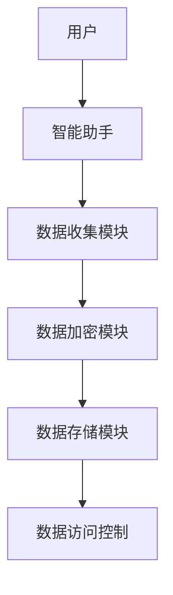
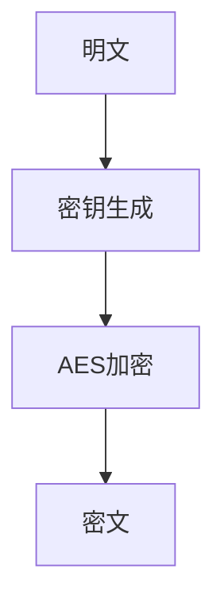
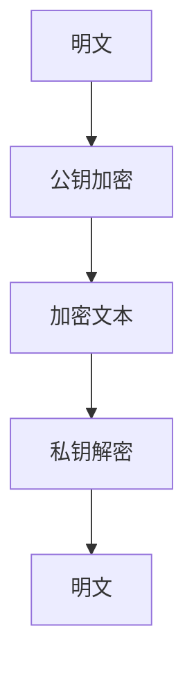
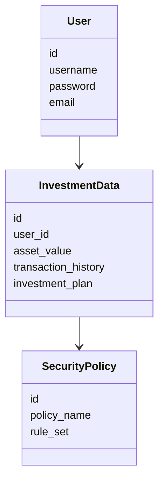
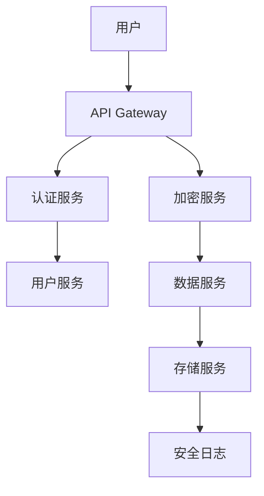
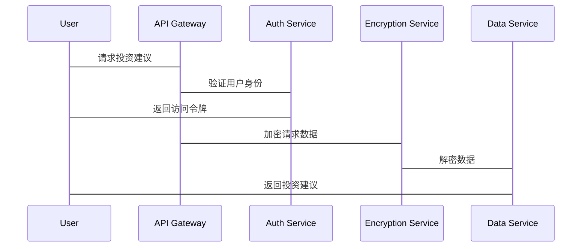

                 


# 确保投资理财智能助手的数据安全与隐私保护

**关键词**：数据安全、隐私保护、投资理财、智能助手、加密算法、系统架构

**摘要**：  
随着人工智能技术的快速发展，投资理财智能助手逐渐成为用户管理和优化财务的重要工具。然而，这类工具在收集和处理用户敏感数据时，也面临着数据泄露和隐私侵犯的巨大风险。本文从技术角度深入分析投资理财智能助手在数据安全与隐私保护方面的关键问题，并提出相应的解决方案。通过详细阐述数据安全的核心概念、加密算法的实现原理、系统架构设计以及实际案例分析，本文旨在为相关从业者提供理论支持和实践指导，确保用户数据的安全性和隐私性。

---

## 第一部分：数据安全与隐私保护的背景与重要性

### 第1章：投资理财智能助手的背景与挑战

#### 1.1 投资理财智能助手的定义与作用
投资理财智能助手是一种基于人工智能技术的金融工具，旨在通过数据分析、算法优化和用户交互，帮助用户进行投资决策、资产配置和风险管理。这类工具通常具备以下功能：  
- 提供市场分析和投资建议；  
- 自动化资产配置和风险管理；  
- 个性化财务规划与优化；  
- 实时数据监控与预警。  

#### 1.2 数据安全与隐私保护的重要性
投资理财智能助手的核心功能依赖于对用户敏感数据的处理，包括但不限于：  
- 用户的个人信息（如身份证号、联系方式）；  
- 财务数据（如银行账户、投资记录）；  
- 行为数据（如用户的点击、输入习惯）。  

这些数据的泄露可能导致用户的财务损失、身份盗窃，甚至对企业声誉造成重大影响。因此，数据安全与隐私保护不仅是技术问题，更是法律和道德责任。

#### 1.3 当前存在的主要问题与挑战
在实际应用中，投资理财智能助手面临以下问题：  
1. **数据收集与处理的透明度不足**：用户往往不清楚自己的数据被如何使用和存储。  
2. **数据加密技术的选型不当**：部分系统采用弱加密算法或未加密处理，导致数据易被破解。  
3. **权限管理不完善**：缺乏严格的访问控制机制，可能导致数据被未经授权的人员访问。  
4. **法律法规的合规性问题**：不同国家和地区对数据隐私的保护有不同的法律要求，如欧盟的GDPR（通用数据保护条例）和中国的《个人信息保护法》。

---

## 第二部分：数据安全与隐私保护的核心概念

### 第2章：核心概念与联系

#### 2.1 数据安全与隐私保护的核心原理
- **数据分类与分级**：根据数据的重要性、敏感性将其分为不同的级别，采取差异化的保护措施。  
- **加密技术**：通过加密算法对敏感数据进行处理，确保数据在传输和存储过程中的安全性。  
- **权限管理与身份认证**：通过身份认证（如OAuth、JWT）和权限控制（如RBAC、ABAC），确保只有授权的用户或服务能够访问敏感数据。  

#### 2.2 核心概念对比与特征分析
以下表格对比了数据安全与隐私保护的核心概念：

| **概念**       | **数据安全**                     | **隐私保护**                     |
|----------------|----------------------------------|----------------------------------|
| **目标**       | 防止数据被未经授权的访问或篡改    | 避免用户数据被泄露或滥用          |
| **技术手段**   | 加密、访问控制、数据备份         | 数据匿名化、加密、隐私计算        |
| **适用场景**   | 数据存储、传输、处理             | 数据共享、第三方服务、公开披露    |
| **法律要求**   | 数据保护法、GDPR、CCPA            | 同上，隐私保护是数据安全的基础要求 |

#### 2.3 实体关系图与流程图
##### 数据流的ER实体关系图
```mermaid
erd
  user {
    User
    id (主键)
    username
    password
    email
  }
  investment_data {
    InvestmentData
    id (主键)
    user_id (外键, User.id)
    asset_value
    transaction_history
    investment_plan
  }
  security_policy {
    SecurityPolicy
    id (主键)
    policy_name
    rule_set
  }
  User --> InvestmentData
  InvestmentData --> SecurityPolicy
```

##### 数据处理流程的Mermaid流程图


---

## 第三部分：数据安全与隐私保护的算法原理

### 第3章：加密算法的原理与实现

#### 3.1 常见加密算法及其应用场景
- **对称加密算法（AES）**：适用于大规模数据加密，速度快，适合实时传输场景。  
- **非对称加密算法（RSA）**：适用于需要公钥和私钥的场景，如数字签名和安全通信。  
- **哈希函数（SHA-256）**：适用于数据完整性校验和不可逆的加密（如密码存储）。  

#### 3.2 加密算法的Mermaid流程图
##### AES加密流程图


##### RSA加密流程图


#### 3.3 加密算法的Python实现
##### AES加密示例
```python
from cryptography.fernet import Fernet

# 生成密钥
key = Fernet.generate_key()
cipher = Fernet(key)

# 加密
plaintext = b"Sensitive investment data"
ciphertext = cipher.encrypt(plaintext)

# 解密
decrypted_text = cipher.decrypt(ciphertext)
print(decrypted_text)
```

##### RSA加密示例
```python
from cryptography.hazmat.primitives.asymmetric.rsa import (
    generate_private_key, RSAAlgorithm
)

# 生成密钥对
key = generate_private_key(RSAAlgorithm(
    modulus_size=2048,
    exponent=65537,
))
public_key = key.public_key()

# 加密
message = b"Critical financial information"
encrypted_message = public_key.encrypt(message)

# 解密
original_message = key.decrypt(encrypted_message)
print(original_message)
```

---

## 第四部分：系统分析与架构设计方案

### 第4章：系统架构设计

#### 4.1 问题场景介绍
投资理财智能助手需要处理以下场景：  
- 用户注册与登录；  
- 资产信息录入与管理；  
- 投资策略生成与优化；  
- 数据备份与恢复。

#### 4.2 系统功能设计
##### 领域模型类图


##### 系统架构图


##### 接口设计与交互序列图


---

## 第五部分：项目实战

### 第5章：投资理财智能助手的实现与分析

#### 5.1 环境安装与配置
- 安装必要的Python库：`cryptography`、`pyjwt`、`flask`。
- 配置数据库：使用PostgreSQL或MySQL存储用户数据和投资记录。

#### 5.2 系统核心实现
##### 数据加密模块实现
```python
from cryptography.fernet import Fernet

def encrypt_data(data, key):
    cipher = Fernet(key)
    return cipher.encrypt(data)

def decrypt_data(ciphertext, key):
    cipher = Fernet(key)
    return cipher.decrypt(ciphertext)
```

##### 数据访问控制实现
```python
from flask import Flask
from flask_restful import Api
from flask_jwt import JWT

app = Flask(__name__)
app.config['JWT_SECRET_KEY'] = 'your-secret-key'
jwt = JWT(app)

# 定义用户模型
class UserResource(Resource):
    def get(self):
        # 获取用户数据
        pass

    def post(self):
        # 更新用户数据
        pass

api = Api(app)
api.add_resource(UserResource, '/users')
```

#### 5.3 代码解读与分析
- **数据加密模块**：在数据传输和存储过程中使用AES加密算法，确保敏感数据的安全性。  
- **权限管理**：通过JWT实现身份认证，并结合RBAC（基于角色的访问控制）确保只有授权用户能够访问特定资源。  
- **日志记录**：记录所有敏感操作的日志，便于后续的审计和问题排查。

#### 5.4 实际案例分析
##### 案例：防止数据泄露
- **问题描述**：某投资理财智能助手由于未加密传输数据，导致用户的资产信息被中间人截获。  
- **解决方案**：在数据传输过程中启用HTTPS协议，并对敏感字段进行加密处理。  
- **代码实现**：
  ```python
  # 启用HTTPS
  from flask import request

  @app.before_request
  def before_request():
      if request.is_secure:
          return
      # 重定向到HTTPS
      return redirect(request.url.replace('http://', 'https://'))
  ```

---

## 第六部分：总结与展望

### 第6章：总结与最佳实践

#### 6.1 本章小结
投资理财智能助手的数据安全与隐私保护是一个复杂但至关重要的问题。通过合理的数据分类、强大的加密算法、完善的权限管理以及严格的法律法规遵守，可以有效降低数据泄露的风险。

#### 6.2 最佳实践
1. **数据分类与分级**：根据数据的重要性和敏感性，制定差异化的保护策略。  
2. **加密技术的选择**：根据场景选择合适的加密算法，如AES用于数据存储，RSA用于身份认证。  
3. **权限管理**：采用基于角色的访问控制（RBAC）或基于属性的访问控制（ABAC），确保最小权限原则。  
4. **安全审计与监控**：定期进行安全审计，部署实时监控系统，及时发现并应对潜在威胁。  
5. **用户教育与隐私告知**：向用户明确告知数据收集和使用的目的，增强用户的信任感。

#### 6.3 注意事项
- **避免过度收集数据**：只收集必要的用户信息，减少数据泄露的风险。  
- **定期更新安全策略**：根据最新的安全威胁和法律法规调整安全措施。  
- **团队协作与培训**：确保开发、运维和管理团队了解数据安全的重要性，并接受定期培训。

#### 6.4 拓展阅读
- 《数据加密与安全传输》  
- 《身份认证与访问控制》  
- 《投资理财系统的法律法规合规性》  

---

**作者**：AI天才研究院/AI Genius Institute & 禅与计算机程序设计艺术 /Zen And The Art of Computer Programming

