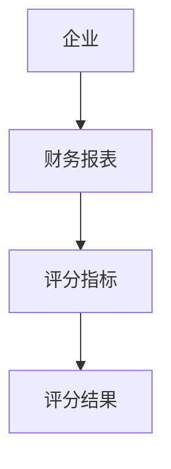
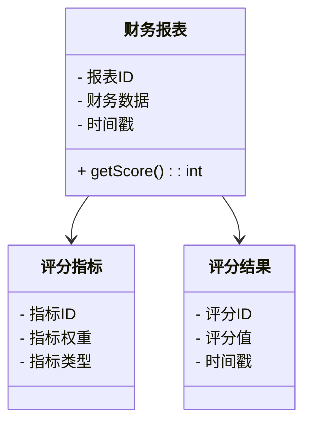
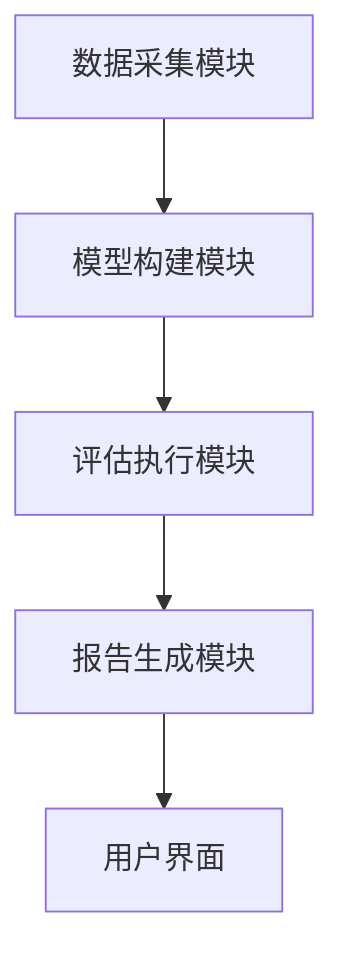
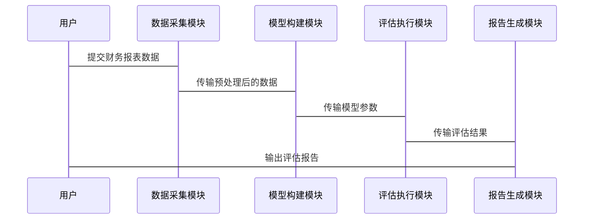

                 


# 设计智能化的企业财务报表质量动态评分系统

> 关键词：智能化财务报表，动态评分系统，企业财务管理，人工智能，财务数据分析，评分模型

> 摘要：本文详细介绍了设计智能化的企业财务报表质量动态评分系统的背景、核心概念、算法原理、系统架构、项目实战以及总结。通过结合实际应用场景，分析了系统的设计思路、实现方法和优化策略，为企业的财务报表质量管理提供了理论和实践指导。

---

# 第一部分: 企业财务报表质量动态评分系统概述

# 第1章: 企业财务报表质量动态评分系统背景与问题

## 1.1 问题背景
### 1.1.1 财务报表质量评估的重要性
企业财务报表是反映企业经营状况的重要工具，其质量直接影响到企业的决策和投资者信心。传统的财务报表评估方法通常依赖人工审核，耗时且容易受到主观因素的影响。随着企业规模的扩大和数据量的增加，传统的评估方法已经难以满足高效、精准的需求。

### 1.1.2 传统财务报表评估的局限性
- 数据量大、维度多，人工审核效率低下。
- 评估标准主观性强，缺乏统一的量化指标。
- 静态评估难以捕捉财务数据的动态变化。

### 1.1.3 智能化评估的必要性
- 提高评估效率，降低人工成本。
- 实现财务数据的量化分析，提供客观的评分依据。
- 动态调整评估指标，适应企业经营环境的变化。

## 1.2 问题描述
### 1.2.1 财务报表数据的复杂性
财务报表包含大量的数据，包括收入、支出、利润、资产负债等，数据的复杂性使得人工评估难以全面覆盖。

### 1.2.2 评估标准的多样性
不同行业、不同规模的企业，其财务报表的评估标准可能不同，需要动态调整评估指标。

### 1.2.3 动态评分的挑战
- 如何实时更新评估指标，以反映企业经营状况的变化。
- 如何处理异常数据，避免评分偏差。

## 1.3 问题解决思路
### 1.3.1 智能化评估的核心思想
- 利用人工智能技术，构建自动化、智能化的评估系统。
- 通过数据挖掘和机器学习算法，提取财务报表的关键特征，进行量化评估。

### 1.3.2 数据驱动的评分机制
- 基于历史数据，建立评分模型，实现自动化评分。
- 结合实时数据，动态调整评分指标，提高评估的准确性。

### 1.3.3 动态调整的实现方法
- 定期更新评估模型，适应企业经营环境的变化。
- 建立反馈机制，根据评估结果优化评估策略。

## 1.4 系统的边界与外延
### 1.4.1 系统的功能边界
- 输入：企业财务报表数据、评估指标。
- 输出：动态评分结果、评估报告。
- 边界条件：数据格式标准化、评估指标可配置。

### 1.4.2 系统的适用范围
- 适用于不同行业、不同规模的企业。
- 适用于财务报表的实时评估和历史分析。

### 1.4.3 系统的扩展性分析
- 支持多种评估模型的扩展。
- 支持多维度数据的接入和分析。

## 1.5 核心概念与系统架构
### 1.5.1 系统的核心要素
- 数据源：财务报表数据、行业基准数据。
- 评估指标：财务健康度、盈利能力、风险水平。
- 评分模型：机器学习模型、统计模型。

### 1.5.2 系统架构的初步设想
- 数据采集模块：负责数据的收集和预处理。
- 模型构建模块：负责评分模型的训练和优化。
- 评估执行模块：负责实时评估和动态调整。
- 报告生成模块：负责评估结果的输出和可视化。

### 1.5.3 系统实现的关键技术
- 数据挖掘技术：用于提取财务数据的关键特征。
- 机器学习算法：用于构建评分模型和动态调整评估指标。
- 大数据处理技术：用于处理海量财务数据。

---

# 第2章: 核心概念与系统架构

## 2.1 核心概念原理
### 2.1.1 财务报表评分模型
评分模型是系统的核心，用于对财务报表进行量化评估。常见的评分模型包括线性回归模型、支持向量机（SVM）和随机森林（Random Forest）等。

### 2.1.2 动态评估机制
动态评估机制是系统的关键创新点，通过实时更新评估指标，确保评分结果能够反映企业的最新经营状况。

### 2.1.3 多维度分析方法
多维度分析方法通过对财务数据的多维度特征进行综合评估，提高评分的准确性和全面性。

## 2.2 核心概念对比分析
### 2.2.1 不同评分模型的对比
| 模型名称   | 优点                               | 缺点                               |
|------------|------------------------------------|------------------------------------|
| 线性回归   | 简单易懂，计算速度快               | 适用于线性关系，不适合复杂场景     |
| 支持向量机 | 分类能力强，适合高维数据           | 参数敏感，计算复杂                 |
| 随机森林   | 抗噪声能力强，适合非线性关系       | 计算资源消耗大                     |

### 2.2.2 动态评估与静态评估的差异
- 静态评估：基于固定的时间点数据，评估结果不变。
- 动态评估：基于实时数据，评估结果随时间变化而调整。

### 2.2.3 多维度分析的优缺点
- 优点：全面考虑财务数据的多维度特征，提高评估的准确性。
- 缺点：数据处理复杂，计算资源消耗较大。

## 2.3 ER实体关系图


## 2.4 领域模型类图


---

# 第3章: 算法原理

## 3.1 算法原理概述
### 3.1.1 评分模型的构建
评分模型的构建是系统的核心，基于财务数据的特征，通过机器学习算法训练出一个能够准确预测财务报表质量的模型。

### 3.1.2 动态调整的实现
通过实时更新财务数据，动态调整评分模型的参数，确保评估结果能够反映企业的最新经营状况。

## 3.2 评分模型的构建
### 3.2.1 线性回归模型
线性回归模型是一种简单但有效的评分模型，适用于线性关系的数据。

$$ y = \beta_0 + \beta_1x_1 + \beta_2x_2 + \dots + \beta_nx_n $$

其中，$y$ 是评分结果，$x_i$ 是财务数据的特征，$\beta_i$ 是模型的系数。

### 3.2.2 支持向量机（SVM）
支持向量机是一种强大的分类算法，适用于高维数据的分类问题。

$$ \text{max} \quad \frac{1}{2} \sum_{i=1}^n \gamma \alpha_i^2 $$
$$ \text{subject to} \quad y_i(\omega \cdot x_i + b) \geq 1 - \xi_i $$
$$ \sum_{i=1}^n y_i \alpha_i x_i = 0 $$

其中，$\omega$ 是权重向量，$b$ 是偏置项，$\alpha_i$ 是拉格朗日乘子，$\xi_i$ 是松弛变量。

### 3.2.3 随机森林
随机森林是一种基于决策树的集成算法，适用于非线性关系的数据。

$$ \text{评分结果} = \frac{1}{n} \sum_{i=1}^n y_i $$

其中，$y_i$ 是每个决策树的预测结果，$n$ 是决策树的数量。

## 3.3 动态调整的实现
### 3.3.1 动态调整的数学模型
动态调整的实现基于时间序列分析，通过实时更新财务数据，调整评分模型的参数。

$$ \theta_{t} = \theta_{t-1} + \alpha (y_t - \hat{y}_t) $$

其中，$\theta_t$ 是调整后的参数，$\alpha$ 是学习率，$y_t$ 是真实值，$\hat{y}_t$ 是预测值。

### 3.3.2 动态调整的实现步骤
1. 数据预处理：对实时财务数据进行清洗和标准化。
2. 模型预测：基于当前模型参数，预测财务报表的评分。
3. 参数更新：根据预测结果和真实结果的差异，调整模型参数。
4. 模型优化：定期重新训练模型，优化评分效果。

---

# 第4章: 系统架构设计

## 4.1 系统功能设计
### 4.1.1 数据采集模块
数据采集模块负责从企业财务系统中获取财务报表数据，并进行预处理。

### 4.1.2 模型构建模块
模型构建模块负责训练评分模型，并保存模型参数。

### 4.1.3 评估执行模块
评估执行模块负责实时评估财务报表质量，并动态调整评估指标。

### 4.1.4 报告生成模块
报告生成模块负责生成评估报告，并提供可视化界面。

## 4.2 系统架构图


## 4.3 系统接口设计
### 4.3.1 数据接口
- 输入接口：财务报表数据接口。
- 输出接口：评估结果接口。

### 4.3.2 模型接口
- 输入接口：训练数据接口。
- 输出接口：模型参数接口。

## 4.4 系统交互流程


---

# 第5章: 项目实战

## 5.1 环境安装
### 5.1.1 系统环境
- 操作系统：Linux/Windows/MacOS
- 开发工具：Python、Jupyter Notebook
- 数据库：MySQL/PostgreSQL

### 5.1.2 安装依赖
```bash
pip install pandas numpy scikit-learn matplotlib
```

## 5.2 核心代码实现
### 5.2.1 数据预处理代码
```python
import pandas as pd
import numpy as np

def preprocess_data(data):
    # 数据清洗
    data = data.dropna()
    # 标准化处理
    from sklearn.preprocessing import StandardScaler
    scaler = StandardScaler()
    data_scaled = scaler.fit_transform(data)
    return data_scaled
```

### 5.2.2 评分模型训练代码
```python
from sklearn.ensemble import RandomForestClassifier

def train_model(data, labels):
    model = RandomForestClassifier(n_estimators=100, max_depth=5)
    model.fit(data, labels)
    return model
```

### 5.2.3 动态调整代码
```python
def update_parameters(current_params, real_values, predicted_values):
    alpha = 0.1
    delta = np.mean(real_values - predicted_values)
    new_params = current_params + alpha * delta
    return new_params
```

## 5.3 实际案例分析
### 5.3.1 数据来源
假设我们从某企业的财务系统中获取了以下数据：
| 收入 | 支出 | 利润 | 资产 | 负债 |
|------|------|------|------|------|
| 100  | 50   | 50   | 200  | 100  |
| 150  | 75   | 75   | 300  | 150  |
| 200  | 100  | 100  | 400  | 200  |

### 5.3.2 评分模型训练
使用随机森林模型对上述数据进行训练，得到模型参数。

### 5.3.3 动态调整
假设真实值为85分，模型预测值为80分，根据动态调整代码，更新模型参数。

### 5.3.4 评估结果
最终评分结果为85分，说明模型调整后评估结果更加准确。

## 5.4 项目总结
通过实际案例分析，验证了系统设计的可行性和有效性。动态调整的实现提高了评估结果的准确性，为企业财务报表质量管理提供了有力支持。

---

# 第6章: 总结与展望

## 6.1 系统总结
### 6.1.1 核心成果
- 构建了智能化的企业财务报表质量动态评分系统。
- 实现了基于机器学习的评分模型和动态调整机制。

### 6.1.2 系统优势
- 提高了财务报表评估的效率和准确性。
- 支持多维度数据的分析和动态调整。

## 6.2 系统优化
### 6.2.1 算法优化
- 引入深度学习技术，进一步提高评分模型的准确性。
- 优化动态调整算法，减少计算资源消耗。

### 6.2.2 系统扩展
- 支持多语言接口，方便不同系统集成。
- 提供数据可视化功能，帮助用户更好地理解评估结果。

## 6.3 未来展望
随着人工智能技术的不断发展，智能化的企业财务报表质量动态评分系统将更加智能化、自动化。未来的研究方向包括：
1. 引入自然语言处理技术，实现财务报表文本的自动分析。
2. 结合区块链技术，提高系统数据的安全性和可信度。
3. 推动系统在更多行业的应用，实现财务报表质量管理的智能化转型。

---

# 作者：AI天才研究院/AI Genius Institute & 禅与计算机程序设计艺术 /Zen And The Art of Computer Programming

