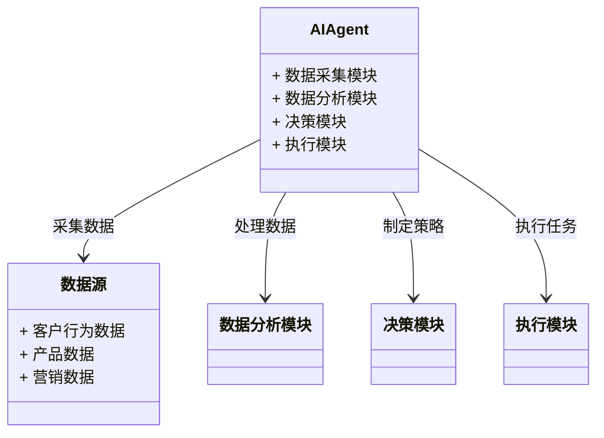
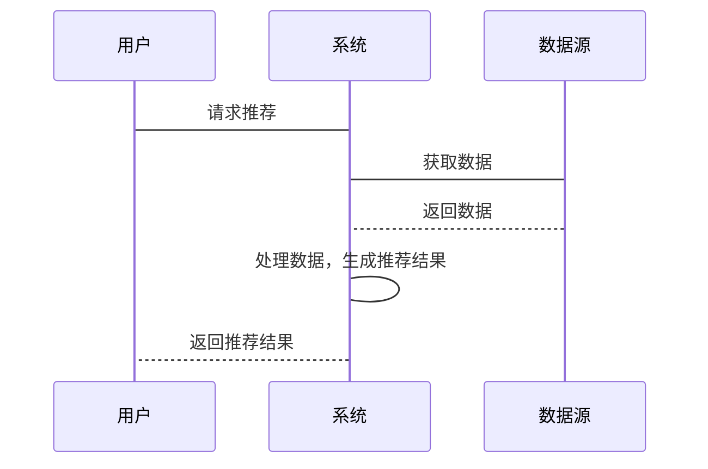

                 


# AI Agent在企业客户价值分析与精准营销中的应用

> 关键词：AI Agent, 客户价值分析, 精准营销, 机器学习, 数据驱动营销

> 摘要：本文探讨了AI Agent在企业客户价值分析与精准营销中的应用。通过分析AI Agent的基本概念、算法原理、系统设计及项目实战，详细阐述了如何利用AI技术提升客户价值分析的准确性和效率，并实现精准营销。本文结合实际案例，提供了从理论到实践的全面指导，帮助企业在数字化转型中提升竞争力。

---

## 第1章: 背景介绍

### 1.1 AI Agent的基本概念

#### 1.1.1 AI Agent的定义与特点
AI Agent（人工智能代理）是一种能够感知环境、自主决策并执行任务的智能实体。它具备以下特点：
- **自主性**：能够自主决策，无需外部干预。
- **反应性**：能够实时感知环境变化并做出反应。
- **学习能力**：通过机器学习算法不断优化自身的决策能力。
- **交互性**：能够与人类或其他系统进行有效交互。

#### 1.1.2 企业客户价值分析的定义与重要性
客户价值分析是通过量化手段评估客户为企业带来的整体价值，包括收入贡献、利润贡献、客户生命周期价值等。其重要性体现在：
- 帮助企业识别高价值客户，优化资源配置。
- 提高客户满意度和忠诚度，降低客户流失率。
- 为精准营销提供数据支持。

#### 1.1.3 精准营销的定义与目标
精准营销是指基于客户数据和行为分析，制定个性化的营销策略，以提高营销效果和客户转化率。其目标包括：
- 提高营销活动的ROI（投资回报率）。
- 增强客户体验，提升品牌忠诚度。
- 实现精准客户触达，降低营销成本。

### 1.2 AI Agent在企业中的应用背景

#### 1.2.1 当前企业营销面临的挑战
- 数据量大、维度多，传统方法难以高效处理。
- 客户行为复杂多变，难以预测和分析。
- 竞争加剧，企业需要快速响应市场变化。

#### 1.2.2 AI技术在营销中的应用现状
- AI技术已在客户画像、需求预测、个性化推荐等领域广泛应用。
- 通过自然语言处理（NLP）和计算机视觉技术，提升客户交互体验。

#### 1.2.3 AI Agent在客户价值分析与精准营销中的优势
- 能够实时处理海量数据，提供实时客户价值评估。
- 通过机器学习算法，实现精准客户分群和个性化推荐。
- 支持自动化决策，提高营销效率。

### 1.3 问题描述与解决方案

#### 1.3.1 客户价值分析中的常见问题
- 数据孤岛问题：客户数据分散在不同系统中，难以整合分析。
- 数据质量差：数据不完整或存在噪声，影响分析结果。
- 分析方法单一：传统统计方法难以应对复杂客户行为。

#### 1.3.2 精准营销中的痛点
- 精准度不足：难以实现真正意义上的个性化营销。
- 营销成本高：传统营销方式效率低，投入大。
- 客户体验差：一刀切的营销策略难以满足客户需求。

#### 1.3.3 AI Agent如何解决这些问题
- 通过整合多源数据，提供全面的客户画像。
- 利用机器学习算法，实现精准客户分群和个性化推荐。
- 支持自动化决策，降低营销成本，提升客户体验。

---

## 第2章: 核心概念与联系

### 2.1 AI Agent的原理与核心要素

#### 2.1.1 AI Agent的核心原理
AI Agent通过感知环境、分析数据、制定策略和执行任务来实现目标。其核心流程包括：
1. 数据采集：从多种数据源获取客户行为数据。
2. 数据处理：清洗、整合和预处理数据。
3. 模型训练：利用机器学习算法训练客户价值分析模型。
4. 决策与执行：基于模型结果制定营销策略并执行。

#### 2.1.2 AI Agent的主要组成部分
- **感知模块**：负责数据采集和环境感知。
- **分析模块**：负责数据处理和模型训练。
- **决策模块**：负责制定营销策略。
- **执行模块**：负责任务执行和反馈收集。

#### 2.1.3 AI Agent与传统营销工具的区别
| 特性 | AI Agent | 传统营销工具 |
|------|-----------|---------------|
| 数据处理能力 | 强大，支持海量数据 | 有限，依赖人工分析 |
| 决策能力 | 自主决策，支持实时调整 | 依赖人工制定策略 |
| 精准度 | 高，基于机器学习 | 较低，依赖经验判断 |

### 2.2 客户价值分析的关键指标

#### 2.2.1 客户生命周期价值（CLV）
CLV是客户在其生命周期内为企业带来的总收入减去成本。计算公式如下：
$$ CLV = \text{客户收入} \times \text{客户生命周期} - \text{客户获取成本} $$

#### 2.2.2 客户满意度（CSAT）
CSAT是衡量客户对产品或服务的满意程度的指标，通常通过问卷调查收集数据。

#### 2.2.3 客户保留率与忠诚度
客户保留率是企业在一定时间内保留客户的比例，客户忠诚度是客户对企业产品或服务的依赖程度。

### 2.3 精准营销的策略与实施

#### 2.3.1 精准营销的核心策略
- **客户分群**：基于客户特征和行为数据，将客户分为不同群体。
- **个性化推荐**：基于客户偏好，推荐相关产品或服务。
- **动态调整**：根据实时数据，动态调整营销策略。

#### 2.3.2 数据驱动的营销方法
- 数据采集：通过多种渠道收集客户数据。
- 数据分析：利用机器学习算法分析数据，提取客户特征。
- 数据应用：将分析结果应用于实际营销活动中。

#### 2.3.3 AI Agent在精准营销中的具体应用
- **客户画像构建**：通过AI Agent整合多源数据，构建客户画像。
- **需求预测**：基于历史数据和行为分析，预测客户需求。
- **个性化推荐**：利用推荐算法，为不同客户推荐个性化产品。

---

## 第3章: 算法原理讲解

### 3.1 客户价值分析的算法选择

#### 3.1.1 常见的客户价值分析算法
- **线性回归**：用于预测客户生命周期价值。
- **决策树**：用于客户分群和分类。
- **聚类分析**：用于客户群体划分。

#### 3.1.2 选择适合AI Agent的算法
选择算法时需考虑数据类型、数据量和业务需求。例如，使用线性回归预测客户价值，使用聚类分析划分客户群体。

### 3.2 精准营销中的推荐算法

#### 3.2.1 基于协同过滤的推荐算法
协同过滤是一种基于用户行为相似性推荐商品的算法。其基本思路是：如果两个用户在历史行为上相似，那么他们可能会喜欢相同的产品。

#### 3.2.2 基于内容的推荐算法
基于内容的推荐算法是通过分析产品本身的特征，向用户推荐相似的产品。

#### 3.2.3 混合推荐算法
混合推荐算法是将协同过滤和基于内容的推荐算法结合起来，以提高推荐的准确性和多样性。

### 3.3 算法实现与优化

#### 3.3.1 算法实现步骤
1. 数据预处理：清洗数据，处理缺失值和异常值。
2. 模型训练：选择合适的算法，训练模型。
3. 模型评估：使用测试数据评估模型性能。
4. 模型优化：调整参数，优化模型性能。

#### 3.3.2 算法优化方法
- **参数调优**：通过网格搜索等方法找到最优参数。
- **特征工程**：选择合适的特征，提高模型性能。
- **模型融合**：将多个模型的结果进行融合，提高预测准确率。

#### 3.3.3 算法评估指标
| 指标 | 定义 |
|------|------|
| 准确率 | 正确预测的比例 |
| 召回率 | 找到所有正样本的比例 |
| F1分数 | 准确率和召回率的调和平均数 |

---

## 第4章: 系统分析与架构设计方案

### 4.1 问题场景介绍

#### 4.1.1 客户价值分析的场景描述
某电商企业希望通过分析客户行为数据，识别高价值客户，并制定个性化营销策略。

#### 4.1.2 精准营销的系统需求
系统需要具备数据采集、分析、决策和执行功能，能够支持实时客户价值评估和个性化推荐。

### 4.2 系统功能设计

#### 4.2.1 领域模型设计（Mermaid类图）


#### 4.2.2 系统架构设计（Mermaid架构图）


#### 4.2.3 系统接口设计
- 数据接口：与数据源系统对接，获取客户行为数据。
- API接口：提供给前端调用，返回推荐结果。

### 4.3 系统交互设计

#### 4.3.1 系统交互流程（Mermaid序列图）


#### 4.3.2 用户与系统的交互界面设计
- 用户界面：展示推荐结果和营销策略。
- 管理界面：监控系统运行状态，调整参数。

#### 4.3.3 系统反馈机制
系统会根据客户反馈调整推荐策略，优化推荐结果。

---

## 第5章: 项目实战

### 5.1 环境安装与配置

#### 5.1.1 开发环境的选择
推荐使用Python 3.8及以上版本，安装Jupyter Notebook作为开发环境。

#### 5.1.2 Python库的安装与配置
安装以下Python库：
- `pandas`：数据处理
- `numpy`：数值计算
- `scikit-learn`：机器学习算法
- `xgboost`：梯度提升算法
- `matplotlib`：数据可视化

#### 5.1.3 数据库的搭建与连接
使用MySQL数据库存储客户行为数据，安装`pymysql`库，连接数据库。

### 5.2 核心功能实现

#### 5.2.1 客户数据的采集与处理
```python
import pandas as pd
from sklearn.impute import SimpleImputer

# 读取数据
data = pd.read_csv('customer.csv')

# 处理缺失值
imputer = SimpleImputer(missing_values=np.nan, strategy='mean')
imputed_data = imputer.fit_transform(data)
```

#### 5.2.2 AI Agent的训练与部署
```python
from sklearn.model_selection import train_test_split
from sklearn.linear_model import LinearRegression

# 划分训练集和测试集
X_train, X_test, y_train, y_test = train_test_split(X, y, test_size=0.2)

# 训练模型
model = LinearRegression()
model.fit(X_train, y_train)

# 预测结果
y_pred = model.predict(X_test)
```

#### 5.2.3 精准营销策略的实现
```python
from sklearn.metrics import accuracy_score

# 评估模型
accuracy = accuracy_score(y_test, y_pred)
print(f'准确率: {accuracy:.2f}')
```

### 5.3 代码实现与解读

#### 5.3.1 数据预处理代码
```python
import pandas as pd
import numpy as np

# 读取数据
data = pd.read_csv('customer.csv')

# 处理缺失值
data = data.dropna()

# 数据标准化
from sklearn.preprocessing import StandardScaler
scaler = StandardScaler()
scaled_data = scaler.fit_transform(data)
```

#### 5.3.2 AI Agent训练代码
```python
from sklearn.model_selection import train_test_split
from sklearn.ensemble import RandomForestClassifier

# 划分训练集和测试集
X_train, X_test, y_train, y_test = train_test_split(X, y, test_size=0.2)

# 训练模型
model = RandomForestClassifier()
model.fit(X_train, y_train)

# 预测结果
y_pred = model.predict(X_test)
```

#### 5.3.3 精准营销策略实现代码
```python
from sklearn.metrics import classification_report

# 评估模型
print(classification_report(y_test, y_pred))
```

---

## 第6章: 数学模型与公式讲解

### 6.1 客户价值分析的数学模型

#### 6.1.1 线性回归模型
线性回归模型用于预测客户生命周期价值，公式如下：
$$ y = \beta_0 + \beta_1x_1 + \beta_2x_2 + ... + \beta_nx_n + \epsilon $$

#### 6.1.2 逻辑回归模型
逻辑回归模型用于客户分群，公式如下：
$$ P(y=1|x) = \frac{e^{\beta_0 + \beta_1x_1 + ... + \beta_nx_n}}{1 + e^{\beta_0 + \beta_1x_1 + ... + \beta_nx_n}} $$

### 6.2 精准营销中的推荐算法

#### 6.2.1 协同过滤算法
协同过滤算法基于相似用户的偏好进行推荐，公式如下：
$$ sim(i, j) = \frac{\sum_{k=1}^n (r_{ik} - \bar{r_i})(r_{jk} - \bar{r_j})}{\sqrt{\sum_{k=1}^n (r_{ik} - \bar{r_i})^2} \sqrt{\sum_{k=1}^n (r_{jk} - \bar{r_j})^2}}} $$

#### 6.2.2 基于内容的推荐算法
基于内容的推荐算法通过计算产品相似度进行推荐，公式如下：
$$ sim(i, j) = \frac{\sum_{k=1}^m w_k |f_{ik} - f_{jk}|}{\sqrt{\sum_{k=1}^m w_k^2} \sqrt{\sum_{k=1}^m w_k^2}}} $$

---

## 第7章: 项目总结与展望

### 7.1 项目总结

#### 7.1.1 核心成果
通过AI Agent实现了客户价值分析和精准营销，提高了营销效率和客户满意度。

#### 7.1.2 经验与教训
- 数据质量对模型性能影响巨大，需重视数据清洗和特征工程。
- 系统设计需充分考虑扩展性和可维护性。
- 模型部署需结合实际业务需求，避免过度优化。

### 7.2 未来展望

#### 7.2.1 技术发展
- AI Agent将更加智能化，具备自适应学习能力。
- 多模态数据处理能力将提升，支持图像和视频数据的分析。

#### 7.2.2 应用场景扩展
- 在金融、教育、医疗等领域进一步推广AI Agent的应用。
- 结合区块链技术，提升数据安全性和可信度。

---

## 作者

作者：AI天才研究院/AI Genius Institute & 禅与计算机程序设计艺术/Zen And The Art of Computer Programming

