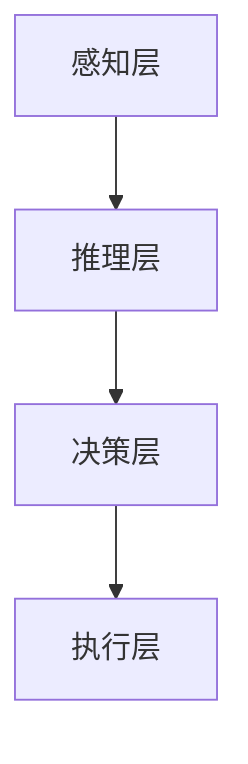

                 


# AI Agent的认知计算与心智模型构建

> 关键词：AI Agent, 认知计算, 心智模型, 算法原理, 系统架构

> 摘要：  
本文深入探讨了AI Agent的认知计算与心智模型构建的核心理论、算法实现和系统架构。通过分析心智模型的结构与功能，结合认知计算的数学基础，详细讲解了如何从理论到实践构建高效、智能的AI Agent系统。文章内容涵盖背景介绍、核心概念、算法原理、系统架构、项目实战以及最佳实践，旨在为读者提供全面的技术指导。

---

# 第一部分: AI Agent的认知计算与心智模型概述

---

# 第1章: AI Agent的认知计算与心智模型概述

## 1.1 AI Agent的基本概念

### 1.1.1 什么是AI Agent
AI Agent（人工智能代理）是指能够感知环境、自主决策并执行任务的智能实体。它可以是一个软件程序、机器人或其他智能系统，具备以下核心特征：
- **自主性**：无需外部干预，自主完成任务。
- **反应性**：能够感知环境并实时响应。
- **目标导向**：基于目标驱动行为。
- **学习能力**：通过经验改进性能。

### 1.1.2 AI Agent的分类
AI Agent可以根据功能、智能水平和应用场景进行分类：
1. **按功能分**：
   - **工具型Agent**：用于完成特定任务（如计算器、天气预报器）。
   - **社会型Agent**：具备社交能力，能够与其他Agent或人类交互（如虚拟助手）。
2. **按智能水平分**：
   - **反应式Agent**：基于当前感知做出反应。
   - **认知式Agent**：具备复杂推理和决策能力。
3. **按应用场景分**：
   - **服务型Agent**：用于商业或生活服务（如智能客服）。
   - **工业型Agent**：应用于工业自动化（如机器人）。

### 1.1.3 AI Agent的核心特征
- **环境感知**：通过传感器或数据输入获取环境信息。
- **决策推理**：基于感知信息进行推理和决策。
- **行动执行**：根据决策结果执行操作。
- **学习优化**：通过经验优化性能。

---

## 1.2 认知计算的背景与意义

### 1.2.1 认知计算的定义
认知计算是一种模拟人类认知过程的计算范式，旨在通过算法和模型模拟人类的感知、推理、学习和决策能力。

### 1.2.2 认知计算与传统计算的区别
| 特性 | 传统计算 | 认知计算 |
|------|----------|----------|
| 数据处理 | 线性、结构化 | 非线性、语义化 |
| 决策方式 | 基于规则 | 基于推理和学习 |
| 应用场景 | 简单任务（如排序、计算） | 复杂任务（如图像识别、自然语言处理） |

### 1.2.3 认知计算在AI Agent中的作用
- **提升决策能力**：通过推理和学习，使AI Agent能够处理复杂任务。
- **增强适应性**：使AI Agent能够动态调整行为以适应环境变化。
- **实现人机协作**：通过模拟人类认知，使AI Agent能够与人类更自然地交互。

---

## 1.3 心智模型的定义与构建目标

### 1.3.1 心智模型的定义
心智模型是AI Agent的核心组件，用于模拟人类的认知过程，包括感知、推理、学习和决策。

### 1.3.2 心智模型的构建目标
1. **模拟人类认知**：使AI Agent具备类似人类的思考和决策能力。
2. **实现自主学习**：通过数据和经验不断优化模型。
3. **支持复杂任务**：能够处理非结构化和动态变化的任务。

### 1.3.3 心智模型与认知计算的关系
- **心智模型**是认知计算的实现载体。
- **认知计算**为心智模型提供数学和算法支持。
- 两者协同进化，共同推动AI Agent的智能化。

---

## 1.4 本章小结
本章从AI Agent的基本概念出发，介绍了认知计算的背景与意义，并详细阐述了心智模型的定义与构建目标。通过对比传统计算与认知计算的差异，强调了认知计算在AI Agent中的重要性。

---

# 第二部分: 心智模型的核心概念与数学基础

---

# 第2章: 心智模型的核心概念

## 2.1 心智模型的结构与功能

### 2.1.1 心智模型的层次结构
心智模型通常分为以下几个层次：
1. **感知层**：负责接收和处理环境信息。
2. **推理层**：对感知信息进行理解和推理。
3. **决策层**：基于推理结果做出决策。
4. **执行层**：将决策转化为具体行动。

### 2.1.2 心智模型的功能模块
- **感知模块**：负责数据的采集和预处理。
- **推理模块**：基于知识库和推理规则进行逻辑推理。
- **决策模块**：根据推理结果选择最优行动方案。
- **学习模块**：通过经验优化模型参数。

### 2.1.3 心智模型的动态特性
心智模型具备动态更新和自适应能力，能够根据环境变化调整自身的知识库和推理规则。

---

## 2.2 认知计算的基本原理

### 2.2.1 认知计算的核心算法
认知计算的核心算法包括：
- **神经网络**：用于模式识别和特征提取。
- **符号逻辑推理**：用于基于规则的决策。
- **强化学习**：用于通过试错优化行为。

### 2.2.2 认知计算的数学模型
认知计算的数学模型通常基于概率论和统计学，例如：
- **贝叶斯网络**：用于概率推理。
- **马尔可夫链**：用于状态转移建模。

### 2.2.3 认知计算的实现方法
1. **基于规则的方法**：通过预定义规则进行推理。
2. **基于学习的方法**：通过机器学习算法自动学习规则。

---

## 2.3 心智模型与认知计算的关系

### 2.3.1 心智模型对认知计算的支撑
心智模型为认知计算提供了知识表示和推理框架，使其能够处理复杂的认知任务。

### 2.3.2 认知计算对心智模型的优化
认知计算通过算法优化心智模型的推理效率和准确性。

### 2.3.3 心智模型与认知计算的协同进化
随着认知计算技术的进步，心智模型的复杂性和智能化不断提升；反过来，心智模型的应用需求也推动了认知计算技术的发展。

---

## 2.4 本章小结
本章详细讲解了心智模型的结构与功能，并从算法和数学模型的角度分析了认知计算的基本原理。最后，探讨了心智模型与认知计算的关系及其协同发展的趋势。

---

# 第三部分: 心智模型的数学模型与算法实现

---

# 第3章: 心智模型的数学模型

## 3.1 心智模型的数学表达

### 3.1.1 心智模型的基本变量
心智模型的数学表达通常涉及以下变量：
- **输入变量**：环境感知数据。
- **状态变量**：模型内部状态。
- **输出变量**：决策结果。

### 3.1.2 心智模型的方程组
以下是一个简单的数学模型示例：
$$
s_{t+1} = f(s_t, a_t, u_t)
$$
其中，$s_t$ 表示当前状态，$a_t$ 表示动作，$u_t$ 表示环境输入，$f$ 表示状态更新函数。

### 3.1.3 心智模型的优化目标
目标函数通常为：
$$
\min_{\theta} \mathbb{E}[L(s_t, a_t)]
$$
其中，$L$ 表示损失函数，$\theta$ 表示模型参数。

---

## 3.2 认知计算的数学基础

### 3.2.1 线性代数基础
- **矩阵运算**：用于数据变换和特征提取。
- **向量空间模型**：用于表示数据的语义空间。

### 3.2.2 概率论与统计学基础
- **概率分布**：用于建模不确定性。
- **贝叶斯定理**：用于概率推理。

### 3.2.3 优化算法基础
- **梯度下降**：用于机器学习模型的参数优化。
- **拉格朗日乘数法**：用于约束优化问题。

---

## 3.3 心智模型的算法实现

### 3.3.1 算法选择与优化
- **神经网络**：用于非线性特征学习。
- **决策树**：用于分类和回归任务。
- **强化学习**：用于动态环境中的策略优化。

### 3.3.2 算法实现的步骤
1. **数据预处理**：清洗和归一化数据。
2. **模型训练**：使用训练数据优化模型参数。
3. **模型评估**：通过验证集评估模型性能。
4. **模型部署**：将模型应用于实际场景。

### 3.3.3 算法实现的代码示例

以下是一个简单的神经网络实现示例：
```python
import tensorflow as tf

# 定义模型
model = tf.keras.Sequential([
    tf.keras.layers.Dense(64, activation='relu'),
    tf.keras.layers.Dense(10, activation='softmax')
])

# 编译模型
model.compile(optimizer='adam', loss='sparse_categorical_crossentropy', metrics=['accuracy'])

# 训练模型
model.fit(x_train, y_train, epochs=10, batch_size=32)
```

---

## 3.4 本章小结
本章从数学模型的角度分析了心智模型的实现方法，并详细讲解了认知计算的数学基础和算法实现。通过代码示例，读者可以更好地理解算法的具体实现步骤。

---

# 第四部分: 心智模型的系统架构与实现

---

# 第4章: 心智模型的系统架构

## 4.1 系统架构的设计原则

### 4.1.1 模块化设计
系统架构应遵循模块化设计，确保各模块之间的松耦合。

### 4.1.2 层次化设计
将系统划分为多个层次，如数据层、计算层、应用层，便于管理和扩展。

### 4.1.3 可扩展性设计
设计时应考虑未来的扩展需求，如新增功能或算法优化。

---

## 4.2 心智模型的系统架构图

### 4.2.1 系统架构的Mermaid图


### 4.2.2 系统模块的交互关系
- 感知层负责接收环境数据。
- 推理层对数据进行理解和推理。
- 决策层基于推理结果做出决策。
- 执行层将决策转化为具体行动。

### 4.2.3 系统架构的优缺点分析
- **优点**：模块化设计便于维护和扩展。
- **缺点**：可能增加系统复杂性，需 careful 设计模块之间的交互。

---

## 4.3 系统接口设计

### 4.3.1 系统接口的定义
- **输入接口**：接收环境数据和用户指令。
- **输出接口**：输出决策结果和执行动作。
- **通信接口**：与其他系统或Agent进行交互。

### 4.3.2 接口的实现方式
- **REST API**：用于远程调用。
- **消息队列**：用于异步通信。

### 4.3.3 接口的测试与验证
- **单元测试**：测试单个模块的功能。
- **集成测试**：测试系统整体的交互和流程。

---

## 4.4 本章小结
本章从系统架构的角度分析了心智模型的实现方式，通过Mermaid图展示了系统模块的交互关系，并讨论了系统接口的设计与测试方法。

---

# 第五部分: 心智模型的项目实战与应用

---

# 第5章: 项目实战

## 5.1 项目背景与目标

### 5.1.1 项目背景
假设我们正在开发一个智能客服AI Agent，旨在通过自然语言处理技术为用户提供高效的咨询服务。

### 5.1.2 项目目标
- **实现用户意图识别**：准确理解用户的问题。
- **构建知识库**：存储常见问题及解决方案。
- **实现对话交互**：通过自然语言理解与用户进行对话。

### 5.1.3 项目范围
- **数据收集**：收集用户咨询数据。
- **模型训练**：训练意图识别和对话生成模型。
- **系统集成**：将模型部署到实际应用中。

---

## 5.2 项目核心实现

### 5.2.1 环境搭建
- **安装Python和相关库**：如TensorFlow、Keras、NLTK。
- **搭建开发环境**：配置IDE和虚拟环境。

### 5.2.2 核心代码实现

#### 5.2.2.1 意图识别模型
```python
import tensorflow as tf
from tensorflow.keras import layers

# 定义模型
model_intent = tf.keras.Sequential([
    layers.Dense(64, activation='relu'),
    layers.Dense(10, activation='softmax')
])

# 编译模型
model_intent.compile(optimizer='adam', loss='sparse_categorical_crossentropy', metrics=['accuracy'])

# 训练模型
model_intent.fit(x_train_intent, y_train_intent, epochs=10, batch_size=32)
```

#### 5.2.2.2 对话生成模型
```python
import tensorflow as tf
from tensorflow.keras import layers

# 定义模型
model_dialogue = tf.keras.Sequential([
    layers.Embedding(1000, 64),
    layers.LSTM(64),
    layers.Dense(64, activation='relu'),
    layers.Dense(10000, activation='softmax')
])

# 编译模型
model_dialogue.compile(optimizer='adam', loss='sparse_categorical_crossentropy', metrics=['accuracy'])

# 训练模型
model_dialogue.fit(x_train_dialogue, y_train_dialogue, epochs=10, batch_size=32)
```

### 5.2.3 代码解读与分析
- **意图识别模型**：使用神经网络进行分类任务，识别用户意图。
- **对话生成模型**：使用LSTM进行序列预测，生成对话回复。

---

## 5.3 项目应用与案例分析

### 5.3.1 应用场景介绍
智能客服AI Agent可以通过以下方式为用户提供服务：
1. **意图识别**：准确理解用户的问题。
2. **知识库查询**：快速检索解决方案。
3. **对话交互**：通过自然语言理解与用户进行对话。

### 5.3.2 案例分析
假设用户咨询：“我的订单状态如何查询？”

1. **意图识别**：模型识别出用户意图是“查询订单状态”。
2. **知识库查询**：系统从知识库中检索相关解决方案。
3. **对话生成**：生成回复：“您可以通过订单号在我们的网站上查询订单状态。”

### 5.3.3 案例总结与反思
- **优点**：提高了用户体验，减少了人工客服的工作量。
- **不足**：需要不断优化模型，以提高意图识别和对话生成的准确性。

---

## 5.4 本章小结
本章通过一个实际项目案例，详细讲解了心智模型的项目实战过程。从环境搭建到核心代码实现，再到应用与案例分析，展示了如何将理论应用于实际。

---

# 第六部分: 心智模型的未来展望与最佳实践

---

# 第6章: 未来展望与最佳实践

## 6.1 心智模型的未来发展趋势

### 6.1.1 智能化提升
随着AI技术的进步，心智模型将越来越智能化，具备更强的推理和决策能力。

### 6.1.2 多模态融合
未来的AI Agent将具备多模态感知能力，能够处理图像、语音等多种数据类型。

### 6.1.3 自适应优化
心智模型将具备更强的自适应能力，能够动态调整自身参数以应对复杂环境。

---

## 6.2 最佳实践

### 6.2.1 知识库管理
- **定期更新**：保持知识库的准确性和时效性。
- **多源融合**：结合多种数据源，提高知识的全面性。

### 6.2.2 模型优化
- **持续学习**：通过在线学习不断优化模型。
- **模型组合**：结合多种算法，提高模型的泛化能力。

### 6.2.3 系统安全
- **数据隐私保护**：确保用户数据的安全性。
- **系统容错设计**：设计容错机制，防止系统崩溃。

---

## 6.3 小结与注意事项

### 6.3.1 小结
心智模型是AI Agent的核心组件，其构建与优化需要结合理论与实践，不断探索与创新。

### 6.3.2 注意事项
- **数据质量**：数据质量直接影响模型性能，需重视数据清洗和特征工程。
- **算法选择**：根据具体任务选择合适的算法，避免盲目追求复杂模型。
- **系统测试**：通过充分的测试确保系统的稳定性和可靠性。

---

## 6.4 拓展阅读

### 6.4.1 推荐书籍
1. 《深度学习》—— Ian Goodfellow
2. 《人工智能：一种现代的方法》—— Stuart Russell

### 6.4.2 推荐论文
1. "Attention Is All You Need"（注意力机制论文）
2. "Transformers Are All You Need"（变换器模型论文）

---

# 作者：AI天才研究院/AI Genius Institute & 禅与计算机程序设计艺术 /Zen And The Art of Computer Programming

---

**总结**：本文从理论到实践，全面探讨了AI Agent的认知计算与心智模型构建的核心技术。通过系统的分析和具体的案例，为读者提供了丰富的知识和实践指导。希望本文能够为AI领域的研究和应用提供有价值的参考。

