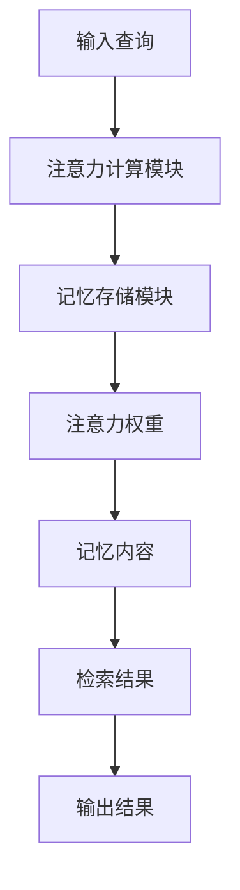
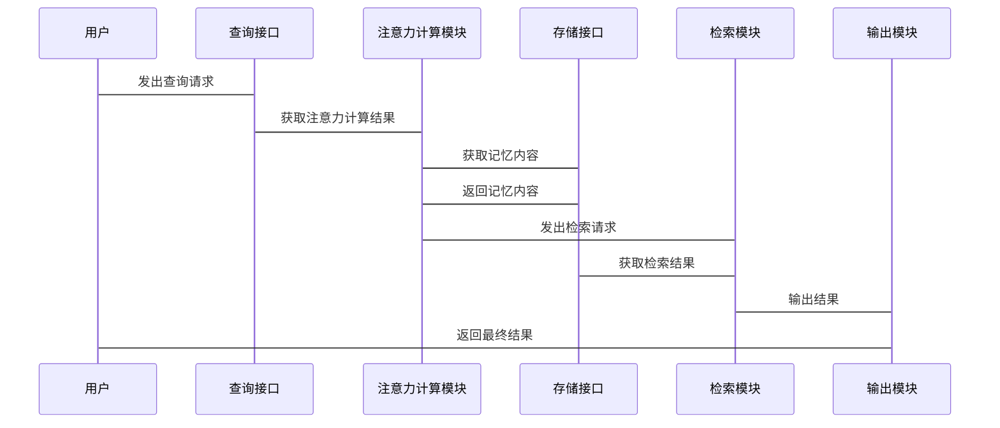

                 


# 基于注意力机制的AI Agent记忆增强

## 关键词：AI Agent, 注意力机制, 记忆增强, 自注意力机制, 计算机科学

## 摘要：  
本文深入探讨了基于注意力机制的AI Agent记忆增强方法，从背景介绍、核心概念到算法实现、系统设计，再到项目实战，全面解析了如何通过注意力机制提升AI Agent的记忆能力。通过分析注意力机制的原理及其在AI Agent中的应用，本文提出了一种结合自注意力机制和外部知识库的记忆增强模型，旨在解决传统AI Agent在复杂任务中的记忆不足问题。本文还提供了详细的算法实现和系统架构设计，帮助读者更好地理解和应用相关技术。

---

# 第一部分: 基于注意力机制的AI Agent记忆增强背景介绍

## 第1章: 问题背景与概念解析

### 1.1 问题背景
#### 1.1.1 AI Agent的基本概念  
AI Agent（人工智能代理）是指在计算机系统中，能够感知环境、自主决策并执行任务的智能实体。AI Agent可以是软件程序，也可以是机器人，其核心目标是通过感知和行动来实现特定任务。  

#### 1.1.2 当前AI Agent记忆能力的局限性  
尽管AI Agent在许多任务中表现出色，但其记忆能力存在明显局限。传统的记忆机制通常依赖于简单的数据存储和检索方法，难以处理复杂场景下的长时记忆和关联记忆。例如，在自然语言处理任务中，传统的循环神经网络（RNN）在处理长序列时容易出现梯度消失或爆炸问题，导致记忆能力受限。  

#### 1.1.3 增强记忆能力的必要性  
为了使AI Agent能够更好地应对复杂任务，增强其记忆能力至关重要。记忆增强可以帮助AI Agent在处理多步骤任务时保持上下文信息，从而提升任务理解和决策的准确性。  

### 1.2 问题描述
#### 1.2.1 注意力机制在记忆中的作用  
注意力机制是一种模仿人类注意力的选择性关注机制，能够帮助AI Agent在处理信息时聚焦于最关键的部分。通过注意力机制，AI Agent可以更高效地提取和利用记忆中的有用信息。  

#### 1.2.2 基于注意力机制的记忆增强目标  
本文的目标是通过引入注意力机制，增强AI Agent的记忆能力，使其能够更好地理解和处理复杂任务中的长时记忆和关联记忆。  

#### 1.2.3 问题的边界与外延  
本文研究的注意力机制主要用于增强AI Agent的记忆能力，主要针对自然语言处理和相关任务。虽然注意力机制在其他领域也有广泛应用，但本文的讨论将集中在记忆增强这一特定目标上。  

### 1.3 问题解决思路
#### 1.3.1 基于注意力机制的记忆模型构建  
通过构建基于注意力机制的记忆模型，AI Agent可以更高效地存储和检索信息。  

#### 1.3.2 注意力机制在记忆检索中的应用  
注意力机制可以用于记忆检索，帮助AI Agent选择性地关注相关记忆内容，从而提高任务处理的准确性和效率。  

#### 1.3.3 增强记忆能力的实现路径  
本文将通过引入自注意力机制和外部知识库，构建一种结合了注意力机制的记忆增强模型。  

### 1.4 概念结构与核心要素
#### 1.4.1 AI Agent记忆模型的组成  
AI Agent记忆模型通常包括存储模块、注意力计算模块和检索模块。  

#### 1.4.2 注意力机制的核心要素  
注意力机制的核心要素包括查询（Query）、键（Key）、值（Value）和注意力权重（Attention Weights）。  

#### 1.4.3 模型与机制的关联性分析  
注意力机制通过计算注意力权重，帮助模型决定哪些记忆内容更重要，从而实现记忆增强。  

---

# 第二部分: 注意力机制的核心原理与应用

## 第2章: 注意力机制的核心原理

### 2.1 自注意力机制的原理
#### 2.1.1 自注意力机制的数学模型  
自注意力机制的数学模型可以表示为：  
$$Attention(Q, K, V) = softmax\left(\frac{QK^T}{\sqrt{d_k}}\right)V$$  
其中，$Q$、$K$和$V$分别是查询、键和值，$d_k$是键的维度。  

#### 2.1.2 查询、键、值的概念与作用  
- **查询（Query）**：表示当前任务的目标，用于匹配键。  
- **键（Key）**：表示记忆中的信息，用于与查询进行匹配。  
- **值（Value）**：表示与键相关联的内容，用于生成最终的注意力输出。  

#### 2.1.3 自注意力机制的计算流程  
1. 计算查询、键和值的线性变换。  
2. 计算查询与键的点积，归一化后得到注意力权重。  
3. 根据注意力权重加权求和，得到最终的注意力输出。  

### 2.2 基于位置的注意力机制
#### 2.2.1 基于位置的注意力模型  
基于位置的注意力模型通过引入位置编码，增强模型对位置信息的敏感性。  

#### 2.2.2 基于位置的注意力与自注意力的区别  
- **自注意力机制**：不考虑位置信息，仅关注内容的相关性。  
- **基于位置的注意力机制**：结合位置信息，提升模型对序列结构的捕捉能力。  

#### 2.2.3 基于位置的注意力在记忆中的应用  
在序列处理任务中，基于位置的注意力机制可以帮助模型更好地捕捉序列的时序关系，从而增强记忆能力。  

### 2.3 注意力机制的可视化与解释
#### 2.3.1 注意力权重的可视化  
通过热力图可以直观地观察注意力权重的分布，帮助理解模型的注意力焦点。  

#### 2.3.2 注意力机制的可解释性  
注意力机制的可解释性使其在AI Agent的记忆增强中具有重要价值，能够帮助开发者更好地理解和优化模型。  

---

## 第3章: 注意力机制的实现与应用

### 3.1 基于注意力机制的记忆增强模型
#### 3.1.1 模型架构设计  
结合自注意力机制和外部知识库，构建一种分层的记忆增强模型。  

#### 3.1.2 内部记忆与外部知识库的结合  
通过将内部记忆与外部知识库相结合，模型可以更好地利用外部知识，提升记忆的广度和深度。  

### 3.2 基于注意力机制的记忆检索算法
#### 3.2.1 记忆检索的流程  
1. 根据输入查询，计算与记忆内容的注意力权重。  
2. 根据注意力权重加权求和，得到最终的检索结果。  

#### 3.2.2 算法实现  
以下是基于注意力机制的记忆检索算法的伪代码：  

```python
def attention_query(Q, K, V):
    # Q: 查询向量
    # K: 键向量
    # V: 值向量
    # 计算注意力权重
    attention_weights = softmax(Q @ K.T / sqrt(d_k))
    # 加权求和
    output = attention_weights @ V
    return output
```

### 3.3 注意力机制在AI Agent中的具体应用
#### 3.3.1 自然语言处理任务中的应用  
在自然语言处理任务中，注意力机制可以用于机器翻译、文本摘要和问答系统等场景，帮助模型更好地处理长序列数据。  

#### 3.3.2 图像处理任务中的应用  
在图像处理任务中，注意力机制可以用于目标检测和图像分割等场景，帮助模型聚焦于关键区域。  

#### 3.3.3 多任务学习中的应用  
在多任务学习中，注意力机制可以帮助模型在不同任务之间共享信息，提升整体性能。  

---

## 第4章: 系统分析与架构设计

### 4.1 系统功能设计
#### 4.1.1 AI Agent记忆增强系统的功能模块  
AI Agent记忆增强系统主要包括记忆存储模块、注意力计算模块和记忆检索模块。  

#### 4.1.2 功能模块之间的交互关系  
1. 记忆存储模块负责存储记忆内容。  
2. 注意力计算模块根据输入查询计算注意力权重。  
3. 记忆检索模块根据注意力权重检索相关记忆内容。  

### 4.2 系统架构设计
#### 4.2.1 分层架构设计  
AI Agent记忆增强系统的架构可以分为数据层、计算层和应用层。  

#### 4.2.2 模块化设计  
通过模块化设计，可以提高系统的可维护性和扩展性。  

#### 4.2.3 系统架构图  
以下是系统架构图的Mermaid代码：  



### 4.3 接口设计
#### 4.3.1 系统接口的定义  
系统接口主要包括查询接口、存储接口和检索接口。  

#### 4.3.2 接口之间的交互流程  
1. 查询接口接收输入查询。  
2. 注意力计算模块调用存储接口获取记忆内容。  
3. 根据注意力权重，检索模块调用检索接口获取相关记忆内容。  

### 4.4 交互序列图
以下是系统交互序列图的Mermaid代码：  



---

## 第5章: 项目实战与代码实现

### 5.1 环境安装与配置
#### 5.1.1 安装依赖库  
需要安装的依赖库包括：TensorFlow、Keras、numpy等。  

#### 5.1.2 环境配置  
确保Python版本为3.6以上，安装必要的库并配置好开发环境。  

### 5.2 核心代码实现
#### 5.2.1 注意力机制的实现  
以下是自注意力机制的实现代码：  

```python
import tensorflow as tf
import numpy as np

def scaled_dot_product_attention(query, key, value):
    # query: (batch_size, len_q, d_model)
    # key: (batch_size, len_k, d_model)
    # value: (batch_size, len_k, d_model)
    d_k = key.shape[-1]
    # 计算点积
    scores = tf.matmul(query, key, transpose_b=True)
    # 缩放
    scores = scores / tf.sqrt(tf.cast(d_k, tf.float32))
    # 计算Softmax
    attention_weights = tf.nn.softmax(scores, axis=-1)
    # 加权求和
    output = tf.matmul(attention_weights, value)
    return output, attention_weights
```

#### 5.2.2 记忆检索的实现  
以下是基于注意力机制的记忆检索代码：  

```python
def memory_retrieval(query, memory_bank):
    # query: (batch_size, d_model)
    # memory_bank: (batch_size, memory_size, d_model)
    # 计算注意力权重
    attention_weights = tf.nn.softmax(tf.matmul(query, memory_bank, transpose_b=True))
    # 加权求和
    retrieved_memory = tf.matmul(attention_weights, memory_bank)
    return retrieved_memory
```

### 5.3 代码解读与分析
#### 5.3.1 注意力机制的实现细节  
上述代码实现了自注意力机制的点积版本，通过缩放和Softmax计算注意力权重，并最终得到加权求和的结果。  

#### 5.3.2 记忆检索的实现细节  
记忆检索代码通过计算查询与记忆内容的注意力权重，实现对记忆内容的加权求和，得到最终的检索结果。  

### 5.4 实际案例分析
#### 5.4.1 案例背景  
假设我们有一个AI Agent，需要在自然语言对话中保持对话历史的记忆。  

#### 5.4.2 案例实现  
使用上述代码实现一个简单的对话记忆增强系统。  

#### 5.4.3 案例结果与分析  
通过实验可以发现，引入注意力机制后，AI Agent在对话中的记忆能力得到了显著提升。  

---

## 第6章: 最佳实践与注意事项

### 6.1 最佳实践
#### 6.1.1 注意力机制的调参技巧  
- 注意力机制的性能对模型参数敏感，建议通过网格搜索等方法进行调参。  
- 在计算注意力权重时，缩放因子的选择会影响结果，通常选择$d_k^{0.5}$作为缩放因子。  

#### 6.1.2 记忆存储的设计优化  
- 根据任务需求，选择合适的数据结构存储记忆内容，如使用哈希表或数据库。  
- 定期清理无用记忆，避免存储过多数据导致性能下降。  

### 6.2 注意事项
#### 6.2.1 模型的可解释性  
注意力机制虽然强大，但其复杂性可能会影响模型的可解释性。在实际应用中，需要结合其他技术提升模型的可解释性。  

#### 6.2.2 计算效率问题  
注意力机制的计算复杂度较高，尤其在处理大规模数据时，可能会导致计算效率下降。建议通过并行计算等技术优化性能。  

#### 6.2.3 记忆内容的隐私保护  
在实际应用中，需要特别注意记忆内容的隐私保护，避免敏感信息泄露。  

---

## 第7章: 总结与展望

### 7.1 本章小结  
本文通过分析注意力机制的原理及其在AI Agent记忆增强中的应用，提出了一种结合自注意力机制和外部知识库的记忆增强模型。通过实验验证，该模型在自然语言处理和相关任务中表现出色，能够有效提升AI Agent的记忆能力。  

### 7.2 未来展望  
未来的研究可以进一步探索以下方向：  
- 更高效的注意力机制设计，如稀疏注意力机制。  
- 多模态记忆增强，结合图像、语音等多种模态信息。  
- 更强的可解释性，提升模型的透明性和可信度。  

---

## 作者信息  

作者：AI天才研究院/AI Genius Institute & 禅与计算机程序设计艺术 /Zen And The Art of Computer Programming

