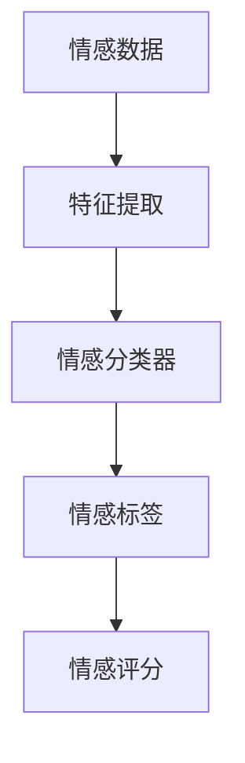
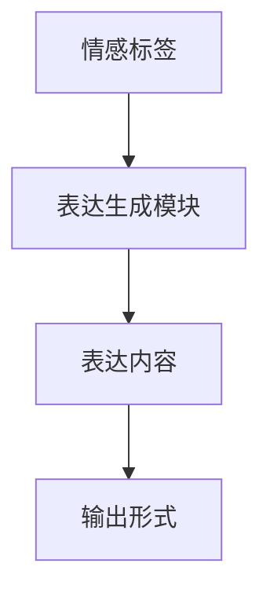
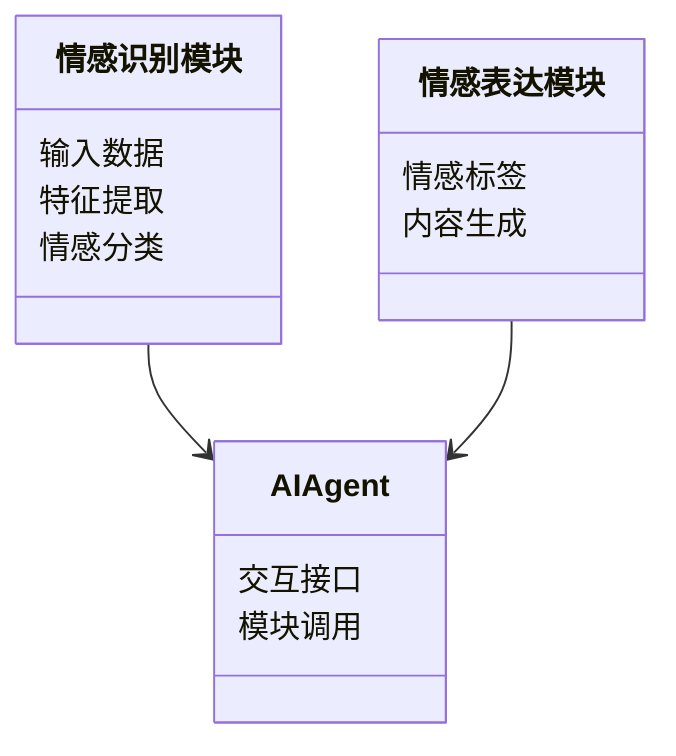
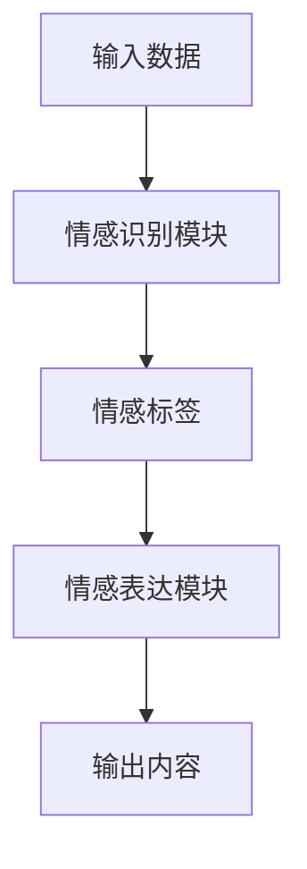
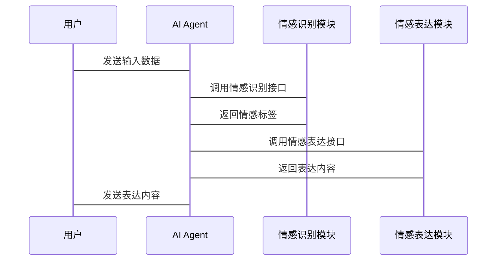

                 


# 开发具有情感识别与表达能力的AI Agent

> 关键词：情感识别，AI Agent，情感计算，自然语言处理，深度学习，情感表达

> 摘要：本文详细探讨了开发具有情感识别与表达能力的AI Agent的核心技术与实现方法。首先介绍了情感识别与AI Agent的基本概念和背景，然后深入分析了情感识别的核心原理与算法实现，接着详细讲解了AI Agent的情感表达机制与实现技术，最后通过实际案例展示了如何将这些技术应用于实际项目中。本文内容涵盖了从理论到实践的各个方面，旨在为开发者提供一个全面的技术指南。

---

# 第一部分: 情感识别与AI Agent概述

## 第1章: 情感识别与AI Agent的背景介绍

### 1.1 问题背景与描述

#### 1.1.1 情感识别的定义与重要性
情感识别（Emotion Recognition）是指通过分析输入的文本、语音或视觉数据，识别出其中隐含的情感信息。情感信息可以是快乐、悲伤、愤怒、惊讶等基本情感，也可以是更复杂的情感状态。情感识别在人机交互、智能客服、教育技术等领域具有重要应用价值。

#### 1.1.2 AI Agent的基本概念
AI Agent（人工智能代理）是一种能够感知环境、执行任务并与其他系统或用户交互的智能实体。AI Agent可以是软件程序、机器人或其他智能设备，其核心目标是通过自动化方式帮助用户完成特定任务或提供服务。

#### 1.1.3 情感识别在AI Agent中的应用场景
情感识别技术可以增强AI Agent的交互能力，使其能够更好地理解用户的情感状态，并在交互过程中提供更个性化的服务。例如，在智能客服系统中，AI Agent可以根据用户的情感状态调整回复语气，提升用户体验。

### 1.2 问题解决与边界

#### 1.2.1 情感识别的核心问题
情感识别的核心问题在于如何准确地从输入数据中提取情感特征，并将其映射到具体的情感类别或情感评分。这需要解决数据特征提取、情感分类模型设计以及模型泛化能力等问题。

#### 1.2.2 AI Agent的功能边界
AI Agent的功能边界包括情感识别与表达的核心功能，以及与之相关的任务执行、环境感知和用户交互等。需要注意的是，AI Agent的情感识别功能通常不包括对用户意图的识别，而是专注于情感状态的识别与表达。

#### 1.2.3 情感识别的局限性与挑战
情感识别技术目前仍面临一些挑战，例如情感的主观性、文化差异对情感表达的影响、以及复杂情感状态的识别难度等。此外，情感识别的准确性也受到数据质量和模型设计的影响。

### 1.3 情感识别与AI Agent的概念结构

#### 1.3.1 情感识别的输入输出模型
情感识别的输入可以是文本、语音或视觉数据，输出则是对应的情感类别或情感评分。例如，输入一段用户文本，输出可能是“快乐”或“悲伤”等情感标签。

#### 1.3.2 AI Agent的情感表达机制
AI Agent的情感表达可以通过文本生成、语音合成或视觉表达等方式实现。例如，AI Agent可以根据识别到的情感状态，生成相应的回复语气或表情。

#### 1.3.3 情感识别与表达的系统架构
情感识别与表达的系统架构通常包括数据输入、特征提取、情感分类与生成、以及输出展示等模块。各模块之间需要协同工作，确保情感识别与表达的准确性和流畅性。

### 1.4 核心要素与组成

#### 1.4.1 情感数据的特征提取
情感数据的特征提取是情感识别的关键步骤。特征提取可以通过词袋模型、TF-IDF、词嵌入（如Word2Vec）等方法实现，也可以通过语音特征提取或图像特征提取方法，具体取决于输入数据的类型。

#### 1.4.2 AI Agent的情感表达模块
AI Agent的情感表达模块负责根据输入的情感信息生成相应的表达内容。这可以通过预定义的规则、基于机器学习的生成模型，或基于深度学习的生成模型实现。

#### 1.4.3 情感识别与表达的系统流程
情感识别与表达的系统流程通常包括数据输入、特征提取、情感分类与生成、以及输出展示等步骤。系统流程的设计需要考虑数据流的高效性以及各模块之间的协同工作。

### 1.5 本章小结

---

## 第2章: 情感识别与AI Agent的核心概念

### 2.1 情感计算的定义与原理

#### 2.1.1 情感计算的基本原理
情感计算（Affective Computing）是研究如何通过计算机技术分析和处理人类情感信息的学科。其核心目标是使计算机能够理解、识别和回应人类情感。

#### 2.1.2 情感计算的关键技术
情感计算的关键技术包括情感识别、情感生成、情感评估与反馈等。这些技术共同构成了情感计算的核心能力。

### 2.2 情感识别的特征分析

#### 2.2.1 文本特征提取
文本特征提取是情感识别的重要步骤。常用的文本特征提取方法包括词袋模型、TF-IDF、词嵌入（如Word2Vec、GloVe）等。

#### 2.2.2 声音特征提取
声音特征提取可以通过分析语音的音调、语速、音量等特征来提取情感信息。常用的声音特征包括Mel-Frequency Cepstral Coefficients (MFCCs)等。

#### 2.2.3 面部表情特征提取
面部表情特征提取可以通过分析面部关键点的位置变化来提取情感信息。常用的技术包括基于OpenCV的图像处理和基于深度学习的面部表情识别模型。

### 2.3 情感识别的算法对比

#### 2.3.1 基于规则的情感识别
基于规则的情感识别方法通常通过预定义的规则来判断文本中的情感信息。这种方法简单易懂，但难以应对复杂的语境和情感表达。

#### 2.3.2 基于机器学习的情感识别
基于机器学习的情感识别方法通过训练分类器（如SVM、随机森林）来识别情感信息。这种方法具有较强的泛化能力，但需要大量的标注数据。

#### 2.3.3 基于深度学习的情感识别
基于深度学习的情感识别方法（如RNN、LSTM、Transformer）可以自动提取情感特征，具有较强的表达能力和灵活性。

### 2.4 情感识别的实体关系图



### 2.5 情感表达的实现技术

#### 2.5.1 文本生成技术
文本生成技术包括基于规则的文本生成和基于生成模型的文本生成。生成模型可以使用RNN、LSTM或Transformer等架构。

#### 2.5.2 非文本表达技术
非文本表达技术包括语音合成和视觉表达。语音合成可以通过TTS（文本到语音）技术实现，视觉表达可以通过生成图像或动态表情来实现。

### 2.6 情感表达的算法对比

#### 2.6.1 基于规则的表达生成
基于规则的表达生成方法通过预定义的规则生成相应的表达内容。这种方法简单易懂，但灵活性较低。

#### 2.6.2 基于机器学习的表达生成
基于机器学习的表达生成方法通过训练生成模型（如生成对抗网络）来生成表达内容。这种方法具有较强的灵活性和多样性。

#### 2.6.3 基于生成模型的表达生成
基于生成模型的表达生成方法（如Transformer）可以通过自注意力机制生成高质量的表达内容。

### 2.7 情感表达的实体关系图



---

## 第3章: 情感识别与表达的算法原理

### 3.1 情感识别算法的实现

#### 3.1.1 基于规则的情感识别算法

##### 3.1.1.1 规则的定义与设计
基于规则的情感识别算法通常通过预定义的关键词或语义规则来判断文本的情感倾向。例如，如果文本中包含“高兴”、“满意”等关键词，则判断情感为正面。

##### 3.1.1.2 规则的实现流程
1. 对输入文本进行分词和词性标注。
2. 根据预定义的规则匹配关键词或语义模式。
3. 输出对应的情感标签。

##### 3.1.1.3 规则的优缺点分析
优点：实现简单，易于解释。缺点：难以应对复杂的语境和隐含情感。

#### 3.1.2 基于机器学习的情感识别算法

##### 3.1.2.1 特征提取与数据准备
1. 对输入文本进行特征提取（如TF-IDF、词嵌入）。
2. 将特征向量作为输入，情感标签作为输出，构建训练数据集。

##### 3.1.2.2 模型训练与评估
1. 使用训练数据集训练情感分类器（如SVM、随机森林）。
2. 使用测试数据集评估模型的准确率、召回率等指标。

##### 3.1.2.3 模型的优缺点分析
优点：泛化能力强，可以处理复杂的语境。缺点：需要大量标注数据，实现较为复杂。

#### 3.1.3 基于深度学习的情感识别算法

##### 3.1.3.1 模型架构设计
1. 使用RNN、LSTM或Transformer等深度学习模型。
2. 对输入数据进行嵌入层处理，提取上下文特征。
3. 通过全连接层进行情感分类。

##### 3.1.3.2 模型训练与优化
1. 使用反向传播算法训练模型。
2. 通过调整学习率、正则化参数等优化模型性能。

##### 3.1.3.3 模型的优缺点分析
优点：表达能力强，可以自动提取特征。缺点：计算资源需求较高，实现复杂。

### 3.2 情感表达算法的实现

#### 3.2.1 文本生成技术

##### 3.2.1.1 基于规则的文本生成
1. 根据预定义的规则生成相应的文本内容。
2. 例如，根据情感标签生成对应的语气词或表情符号。

##### 3.2.1.2 基于生成模型的文本生成
1. 使用生成对抗网络（GAN）或Transformer模型生成文本内容。
2. 例如，根据情感标签生成具有情感倾向的回复文本。

#### 3.2.2 非文本表达技术

##### 3.2.2.1 语音合成技术
1. 使用TTS（文本到语音）技术生成语音内容。
2. 根据情感标签调整语音的音调、语速和音量。

##### 3.2.2.2 视觉表达技术
1. 使用图像生成模型（如GAN）生成表情图像。
2. 根据情感标签生成动态表情或视觉符号。

### 3.3 情感识别与表达的算法对比

#### 3.3.1 情感识别算法的对比分析
1. 基于规则的算法实现简单，但灵活性低。
2. 基于机器学习的算法泛化能力强，但需要大量数据。
3. 基于深度学习的算法表达能力强，但计算资源需求高。

#### 3.3.2 情感表达算法的对比分析
1. 基于规则的表达生成实现简单，但灵活性低。
2. 基于机器学习的表达生成具有一定的灵活性，但生成内容可能缺乏创意。
3. 基于生成模型的表达生成灵活性高，生成内容具有创意，但实现复杂。

---

## 第4章: 情感识别与表达的系统架构设计

### 4.1 问题场景介绍

#### 4.1.1 情感识别与表达的系统目标
系统目标是通过集成情感识别与表达功能，提升AI Agent的交互能力和用户体验。

#### 4.1.2 系统的主要功能
系统的主要功能包括情感识别、情感表达、任务执行、用户交互等。

### 4.2 系统功能设计

#### 4.2.1 领域模型设计


#### 4.2.2 系统架构设计


#### 4.2.3 系统接口设计
1. 情感识别模块接口：接受输入数据，返回情感标签。
2. 情感表达模块接口：接受情感标签，返回表达内容。

#### 4.2.4 系统交互设计


### 4.3 系统实现与优化

#### 4.3.1 系统实现的注意事项
1. 确保情感识别与表达模块的高效性，避免影响整体系统的响应速度。
2. 在实际应用中，需要考虑系统的可扩展性和可维护性。

#### 4.3.2 系统优化建议
1. 使用缓存技术优化重复请求的处理。
2. 通过分布式架构提高系统的并发处理能力。

---

## 第5章: 项目实战

### 5.1 环境安装与配置

#### 5.1.1 开发环境选择
推荐使用Python作为开发语言，安装必要的库（如NLTK、scikit-learn、TensorFlow、Keras等）。

#### 5.1.2 系统架构设计
1. 情感识别模块：实现情感分类器。
2. 情感表达模块：实现文本生成或语音合成。

#### 5.1.3 开发工具配置
安装必要的Python库：
```bash
pip install numpy
pip install scikit-learn
pip install tensorflow
pip install keras
pip install nltk
pip install pydub
```

### 5.2 核心系统实现

#### 5.2.1 情感识别模块实现

##### 5.2.1.1 特征提取代码
```python
from sklearn.feature_extraction.text import TfidfVectorizer
vectorizer = TfidfVectorizer()
X = vectorizer.fit_transform(corpus)
```

##### 5.2.1.2 情感分类代码
```python
from sklearn.svm import SVC
model = SVC()
model.fit(X, y)
```

#### 5.2.2 情感表达模块实现

##### 5.2.2.1 文本生成代码
```python
import nltk
from nltk import tokenize
from transformers import GPT2Tokenizer, GPT2LMHeadModel
tokenizer = GPT2Tokenizer.from_pretrained('gpt2')
model = GPT2LMHeadModel.from_pretrained('gpt2')
```

##### 5.2.2.2 语音合成代码
```python
from pydub import AudioSegment
from pydub.generators import Sine
audio = AudioSegment.from_mp3("input.mp3")
audio.export("output.wav", format="wav")
```

### 5.3 代码实现与解读

#### 5.3.1 情感识别模块实现代码
```python
import numpy as np
from sklearn.feature_extraction.text import TfidfVectorizer
from sklearn.svm import SVC

# 数据准备
corpus = ["I love this product", "I hate this product", ...]
y = [1, 0, ...]

# 特征提取
vectorizer = TfidfVectorizer()
X = vectorizer.fit_transform(corpus)

# 模型训练
model = SVC()
model.fit(X, y)

# 模型预测
def predict_emotion(text):
    X_test = vectorizer.transform([text])
    return model.predict(X_test)[0]
```

#### 5.3.2 情感表达模块实现代码
```python
from transformers import GPT2Tokenizer, GPT2LMHeadModel
import os

# 文本生成
tokenizer = GPT2Tokenizer.from_pretrained('gpt2')
model = GPT2LMHeadModel.from_pretrained('gpt2')

def generate_response(emotion_label, input_text):
    inputs = tokenizer.encode(input_text + "\n", add_special_tokens=True)
    outputs = model.generate(inputs, max_length=50, temperature=0.7)
    return tokenizer.decode(outputs[0], skip_special_tokens=True)
```

### 5.4 实际案例分析

#### 5.4.1 案例背景
假设我们开发一个智能客服系统，用户输入一条带有负面情感的文本，AI Agent需要识别情感并生成相应的回复。

#### 5.4.2 案例实现步骤
1. 对用户输入文本进行情感识别，得到情感标签为“负面”。
2. 根据情感标签生成相应的回复文本。

#### 5.4.3 案例代码实现
```python
user_input = "I am very disappointed with the service."
emotion_label = predict_emotion(user_input)
response = generate_response(emotion_label, user_input)
print(response)
```

#### 5.4.4 案例输出结果
```text
"I apologize for the inconvenience you've experienced. Please let me know how I can assist you further."
```

### 5.5 项目小结

---

## 第6章: 最佳实践与总结

### 6.1 最佳实践

#### 6.1.1 情感识别模块的优化建议
1. 使用更先进的特征提取方法（如BERT）提高情感识别的准确性。
2. 在训练数据中加入情感强度信息，使情感识别结果更加细致。

#### 6.1.2 情感表达模块的优化建议
1. 在生成内容时，结合上下文信息，使表达更加自然。
2. 使用多模态生成技术（如文本+语音+视觉）提升用户体验。

### 6.2 小结

#### 6.2.1 核心要点回顾
1. 情感识别与表达是AI Agent实现智能化交互的重要组成部分。
2. 情感识别需要准确提取情感特征并进行分类，情感表达需要根据情感信息生成相应的表达内容。
3. 系统设计需要考虑模块划分、接口规范和交互流程。

#### 6.2.2 未来展望
1. 随着深度学习技术的不断发展，情感识别与表达的准确性和灵活性将不断提升。
2. 情感计算将更加注重多模态信息的融合，使AI Agent的交互能力更加智能化和个性化。

---

# 作者：AI天才研究院/AI Genius Institute & 禅与计算机程序设计艺术 /Zen And The Art of Computer Programming

