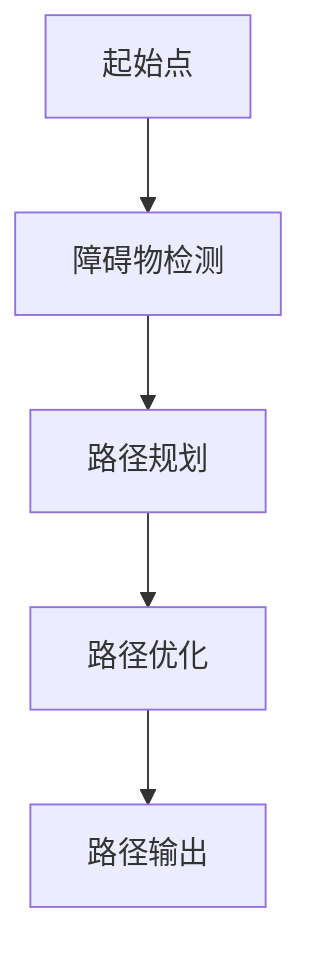
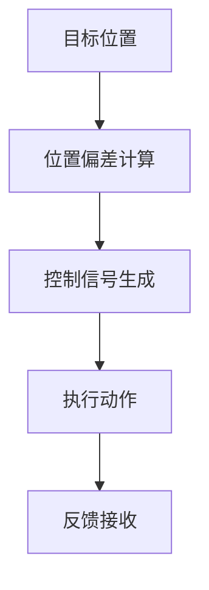
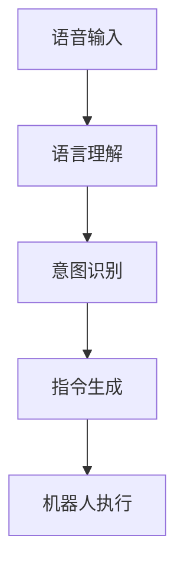
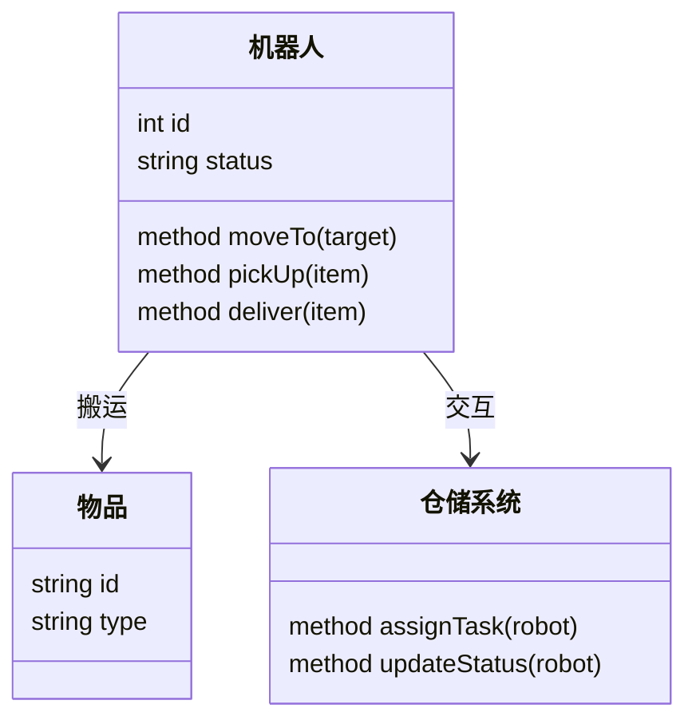

                 


# 《机器人技术在各行业应用带来的投资机会》

---

## 关键词：
机器人技术、行业应用、投资机会、技术原理、智能算法、系统架构

---

## 摘要：
随着人工智能和自动化技术的快速发展，机器人技术正在深刻改变各个行业的生产方式和商业模式。本文从机器人技术的核心概念出发，分析其在制造、医疗、物流等行业的具体应用，并探讨其带来的投资机会。通过详细的技术原理、算法流程和数学模型的讲解，结合实际案例分析，本文为投资者提供了机器人技术在不同行业中的应用前景和投资策略。文章还总结了机器人技术在系统架构设计和项目实现中的关键点，为读者提供了全面的理论和实践指导。

---

# 第1章: 机器人技术的定义与发展

## 1.1 机器人技术的基本定义

### 1.1.1 机器人的定义与分类
- **定义**：机器人是一种能够自动执行任务的智能机械装置，通常具备感知、决策和执行能力。
- **分类**：
  1. 工业机器人
  2. 服务机器人
  3. 医疗机器人
  4. 仓储机器人
  5. 军事机器人

### 1.1.2 机器人技术的历史发展
- **早期阶段**：20世纪50年代至70年代，机器人技术主要用于工业自动化。
- **快速发展阶段**：20世纪80年代至21世纪初，机器人技术逐步智能化，开始应用于更多领域。
- **当前阶段**：2020年后，人工智能和深度学习的结合使机器人技术进入高度智能化和网络化阶段。

### 1.1.3 当前机器人技术的现状与趋势
- **现状**：机器人技术在工业、医疗、物流等领域广泛应用。
- **趋势**：
  1. 智能化：基于AI的决策能力增强。
  2. 网络化：机器人与物联网（IoT）深度融合。
  3. 人机协作：人机交互更加自然。

---

## 1.2 机器人技术的核心组成部分

### 1.2.1 机械结构与运动系统
- **机械结构**：包括关节、连杆、齿轮等，负责机器人的运动和操作。
- **运动系统**：包括步进电机、伺服电机等，实现精确的运动控制。

### 1.2.2 传感器与感知系统
- **传感器**：如激光雷达、摄像头、红外传感器，用于感知环境。
- **感知系统**：将传感器数据转化为有用的信息，如物体识别、距离测量。

### 1.2.3 智能算法与控制系统
- **智能算法**：如路径规划算法、运动控制算法、自然语言处理算法。
- **控制系统**：负责协调各部分的工作，实现任务目标。

### 1.2.4 执行机构与动力系统
- **执行机构**：如舵机、气动执行器，负责执行具体动作。
- **动力系统**：如电池、电机，提供机器人运行所需的能量。

---

## 1.3 机器人技术的行业应用前景

### 1.3.1 机器人技术的潜在应用领域
- 制造业：自动化生产、装配。
- 医疗行业：手术机器人、康复机器人。
- 物流行业：仓储机器人、配送机器人。
- 服务业：客服机器人、酒店服务机器人。
- 军事领域：无人侦察机、智能武器系统。

### 1.3.2 各行业采用机器人技术的优势
- **制造业**：提高生产效率，降低人工成本。
- **医疗行业**：提高手术精准度，减少人为误差。
- **物流行业**：提高配送效率，降低物流成本。
- **服务业**：提升服务质量，减少人力需求。

### 1.3.3 机器人技术应用的挑战与机遇
- **挑战**：
  1. 高昂的初始投资成本。
  2. 技术瓶颈：如AI算法的优化、传感器的精度。
  3. 法律法规：如隐私问题、安全标准。
- **机遇**：
  1. 技术进步带来的效率提升。
  2. 新兴行业的崛起，如智能仓储、智能医疗。
  3. 政府政策支持。

---

## 1.4 本章小结
本章从机器人技术的基本定义出发，分析了其核心组成部分，并探讨了其在各行业的应用前景。通过对比不同行业的优劣势，为后续章节的深入分析奠定了基础。

---

# 第2章: 机器人技术的核心概念与联系

## 2.1 核心概念原理

### 2.1.1 机器人技术的机械结构原理
- **机械结构**：机器人通过机械结构实现运动和操作。
- **运动原理**：基于连杆机构、齿轮机构等实现运动传递。

### 2.1.2 机器人技术的智能算法原理
- **算法核心**：路径规划、运动控制、物体识别。
- **算法流程**：从数据采集到目标实现的完整流程。

### 2.1.3 机器人技术的感知与控制原理
- **感知原理**：通过传感器获取环境信息。
- **控制原理**：通过智能算法实现对机器人的精确控制。

---

## 2.2 核心概念属性特征对比表格

| **核心概念** | **机器人技术** | **自动化技术** | **人工智能技术** | **物联网技术** |
|--------------|----------------|----------------|------------------|----------------|
| 核心功能     | 自动执行任务   | 自动化流程     | 智能决策         | 连接与数据传输 |
| 技术特点     | 高度智能化      | 机械化        | 数据驱动         | 网络化         |
| 应用场景     | 制造、医疗      | 工厂生产线     | 所有行业         | 智能家居、工业 |

---

## 2.3 ER实体关系图架构

```mermaid
er
    entity 机器人技术 {
        key 机器人ID
        attribute 类型
        attribute 应用场景
        attribute 技术特点
    }
    entity 自动化技术 {
        key 自动化ID
        attribute 核心功能
        attribute 技术特点
        attribute 应用场景
    }
    entity 人工智能技术 {
        key AI_ID
        attribute 核心功能
        attribute 技术特点
        attribute 应用场景
    }
    entity 物联网技术 {
        key IoT_ID
        attribute 核心功能
        attribute 技术特点
        attribute 应用场景
    }
    relation 关联关系 {
        role 机器人技术 -> 自动化技术：依赖
        role 机器人技术 -> 人工智能技术：集成
        role 机器人技术 -> 物联网技术：协同
    }
```

---

## 2.4 本章小结
本章通过核心概念的对比和ER实体关系图，展示了机器人技术与其他技术之间的联系和区别，为后续章节的技术分析奠定了基础。

---

# 第3章: 机器人技术的算法原理

## 3.1 算法原理概述

### 3.1.1 机器人技术的核心算法
- **路径规划算法**：如A*算法、RRT算法。
- **运动控制算法**：如PID控制算法、模糊控制算法。
- **物体识别算法**：如基于CNN的目标检测算法。

### 3.1.2 机器人技术算法的特点
- **实时性**：需要快速响应。
- **准确性**：算法结果需要精确。
- **适应性**：能够适应不同的环境和任务。

---

## 3.2 算法流程图

### 3.2.1 路径规划算法流程图



### 3.2.2 运动控制算法流程图



### 3.2.3 自然语言处理算法流程图



---

## 3.3 算法实现代码

### 3.3.1 路径规划算法实现代码
```python
import math

def distance(p1, p2):
    return math.sqrt((p1[0]-p2[0])**2 + (p1[1]-p2[1])**2)

def a_star(start, end, obstacles):
    open_set = set([start])
    closed_set = set()
    came_from = {}
    g_score = {start:0}
    f_score = {start: distance(start, end)}
    
    while open_set:
        current = min(open_set, key=lambda x: f_score[x])
        if current == end:
            return reconstruct_path(came_from, end)
        open_set.remove(current)
        closed_set.add(current)
        
        for neighbor in get_neighbors(current):
            if neighbor in closed_set:
                continue
            tentative_g_score = g_score[current] + distance(current, neighbor)
            if neighbor not in g_score or tentative_g_score < g_score[neighbor]:
                came_from[neighbor] = current
                g_score[neighbor] = tentative_g_score
                f_score[neighbor] = g_score[neighbor] + distance(neighbor, end)
                open_set.add(neighbor)
    return None

def reconstruct_path(came_from, current):
    path = [current]
    while current in came_from:
        current = came_from[current]
        path.append(current)
    return path
```

---

## 3.4 本章小结
本章详细讲解了机器人技术的核心算法及其流程图，并通过Python代码展示了算法的实现过程，为后续章节的系统分析奠定了基础。

---

# 第4章: 机器人技术的数学模型与公式

## 4.1 数学模型概述

### 4.1.1 机器人运动学方程
- **旋转矩阵**：
  $$ R = \begin{bmatrix} \cos\theta & -\sin\theta \\ \sin\theta & \cos\theta \end{bmatrix} $$
- **齐次变换矩阵**：
  $$ T = \begin{bmatrix} R & t \\ 0 & 1 \end{bmatrix} $$

### 4.1.2 机器人动力学方程
- **牛顿-欧拉公式**：
  $$ F = ma $$
- **雅可比矩阵**：
  $$ J = \frac{\partial \mathbf{q}}{\partial \mathbf{x}} $$

### 4.1.3 机器人路径规划的优化公式
- **最短路径优化**：
  $$ \min_{x} \int_{0}^{1} \|x'(t)\|^2 dt $$

---

## 4.2 本章小结
本章通过数学模型和公式，详细分析了机器人技术在运动学、动力学和路径规划中的应用，为后续章节的系统设计提供了理论支持。

---

# 第5章: 机器人技术的系统分析与架构设计

## 5.1 系统分析

### 5.1.1 问题场景介绍
- **目标**：设计一个智能仓储机器人系统。
- **需求**：实现物品的自动搬运、存储和拣选。
- **约束条件**：
  1. 系统需要与仓储管理系统对接。
  2. 系统需要具备路径规划和避障功能。
  3. 系统需要支持多机器人协同工作。

### 5.1.2 项目介绍
- **项目名称**：智能仓储机器人系统。
- **项目目标**：实现仓储自动化，提高拣选效率。
- **项目范围**：包括机器人设计、系统集成和测试。

---

## 5.2 系统功能设计

### 5.2.1 领域模型（Mermaid 类图）



### 5.2.2 系统架构设计（Mermaid 架构图）


### 5.2.3 系统接口设计
- **机器人接口**：提供与仓储系统交互的API。
- **传感器接口**：提供环境感知的数据接口。
- **控制中心接口**：提供任务分配和状态监控的接口。

---

## 5.3 本章小结
本章通过系统分析和架构设计，展示了机器人技术在智能仓储中的实际应用，为后续章节的项目实现提供了参考。

---

# 第6章: 机器人技术的项目实战

## 6.1 项目环境安装

### 6.1.1 系统要求
- **操作系统**：Linux或Windows。
- **开发工具**：Python、ROS（Robot Operating System）、Git。
- **依赖库**：OpenCV、NumPy、Matplotlib。

### 6.1.2 环境配置
- **安装Python**：`python --version`
- **安装ROS**：`sudo apt-get install ros-<distribution>-desktop`
- **安装依赖库**：`pip install opencv-python numpy matplotlib`

---

## 6.2 系统核心实现源代码

### 6.2.1 路径规划实现代码
```python
import rospy
from nav_msgs.msg import OccupancyGrid
from geometry_msgs.msg import PoseStamped

def main():
    rospy.init_node('path_planner')
    obstacles_map = rospy.wait_for_message('/map', OccupancyGrid)
    start_pose = rospy.wait_for_message('/start_pose', PoseStamped)
    end_pose = rospy.wait_for_message('/end_pose', PoseStamped)
    
    # 调用A*算法实现路径规划
    path = a_star(start_pose, end_pose, obstacles_map)
    
    # 发布路径
    path_publisher = rospy.Publisher('/path', PoseStamped, queue_size=10)
    for pose in path:
        path_publisher.publish(pose)
    
if __name__ == '__main__':
    main()
```

### 6.2.2 机器人控制实现代码
```python
import rospy
from geometry_msgs.msg import Twist

def move_forward():
    rospy.init_node('robot_control')
    cmd_vel_publisher = rospy.Publisher('/cmd_vel', Twist, queue_size=10)
    
    while True:
        twist = Twist()
        twist.linear.x = 0.5
        cmd_vel_publisher.publish(twist)

if __name__ == '__main__':
    move_forward()
```

---

## 6.3 代码应用解读与分析

### 6.3.1 路径规划代码解读
- **功能**：实现基于A*算法的路径规划。
- **输入**：起点、终点、障碍物地图。
- **输出**：规划路径。

### 6.3.2 机器人控制代码解读
- **功能**：控制机器人向前移动。
- **输入**：无。
- **输出**：速度命令。

---

## 6.4 实际案例分析

### 6.4.1 案例背景
- **行业**：物流仓储。
- **场景**：智能仓储机器人自动拣选物品。

### 6.4.2 案例分析
- **问题**：如何实现机器人自动拣选？
- **解决方案**：
  1. 通过RFID技术识别物品。
  2. 使用路径规划算法导航至目标物品。
  3. 使用机械臂完成拣选动作。

---

## 6.5 项目小结
本章通过项目实战，详细讲解了机器人技术在智能仓储中的实现过程，为读者提供了从理论到实践的完整指导。

---

# 第7章: 机器人技术的投资机会分析

## 7.1 投资机会分析

### 7.1.1 制造业投资机会
- **现状**：制造业自动化需求旺盛。
- **投资方向**：
  1. 工业机器人研发。
  2. 智能工厂建设。
  3. 数字化转型服务。

### 7.1.2 医疗行业投资机会
- **现状**：医疗机器人市场快速增长。
- **投资方向**：
  1. 手术机器人研发。
  2. 智能康复设备生产。
  3. 医疗服务机器人应用。

### 7.1.3 物流行业投资机会
- **现状**：物流自动化需求激增。
- **投资方向**：
  1. 仓储机器人研发。
  2. 智能配送系统建设。
  3. 物流管理软件开发。

---

## 7.2 投资策略与建议

### 7.2.1 短期投资策略
- **关注点**：技术成熟、市场需求大的行业。
- **建议**：投资工业机器人、仓储机器人等领域。

### 7.2.2 长期投资策略
- **关注点**：技术创新、行业整合的趋势。
- **建议**：投资AI驱动的医疗机器人、人机协作系统等领域。

---

## 7.3 本章小结
本章通过分析机器人技术在不同行业的投资机会，为投资者提供了科学的投资策略和建议。

---

# 第8章: 总结与展望

## 8.1 全文总结
- **核心内容**：机器人技术在各行业的应用及其投资机会。
- **主要结论**：
  1. 机器人技术正在改变多个行业的生产方式。
  2. 投资者应关注技术成熟、市场需求大的领域。

## 8.2 未来展望
- **技术趋势**：
  1. 机器人技术将更加智能化、网络化。
  2. 人机协作将成为主流模式。
- **投资机会**：
  1. 新兴行业如智能医疗、智能物流的投资潜力巨大。
  2. 机器人技术与AI、IoT的融合将带来更多创新机会。

## 8.3 注意事项
- **风险提示**：
  1. 技术瓶颈可能导致投资失败。
  2. 市场竞争加剧可能影响投资回报。
- **建议**：投资者应结合自身能力，选择合适的投资方向。

---

# 作者：AI天才研究院/AI Genius Institute & 禅与计算机程序设计艺术 /Zen And The Art of Computer Programming

---

**注**：以上目录和内容仅为示例，实际撰写时需要根据具体情况进行调整和补充。

