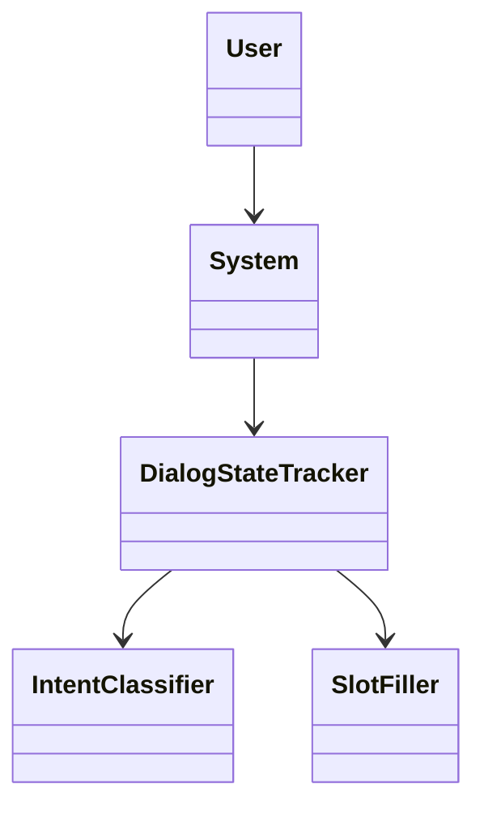
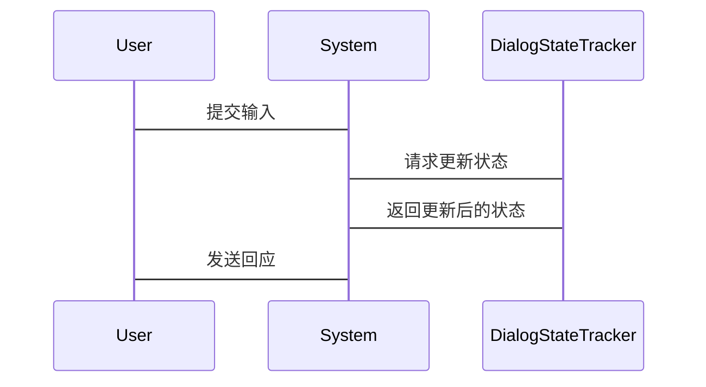

                 


# 构建AI Agent的多轮对话状态跟踪系统

> 关键词：AI Agent, 多轮对话, 状态跟踪, 对话系统, 对话管理, 状态表示, 系统设计

> 摘要：本文系统地探讨了构建AI Agent多轮对话状态跟踪系统的核心概念、算法原理、系统设计与实现方法。从背景概述到核心概念，从算法实现到系统架构，再到项目实战，详细阐述了如何设计并实现一个高效的多轮对话状态跟踪系统。本文结合理论与实践，深入分析了系统的关键技术，并通过具体案例展示了如何将理论应用于实际项目中。

---

# 第一部分: AI Agent与多轮对话状态跟踪系统概述

## 第1章: AI Agent概述

### 1.1 AI Agent的基本概念

#### 1.1.1 什么是AI Agent
AI Agent（人工智能代理）是指能够感知环境并采取行动以实现目标的智能实体。它可以是一个软件程序、机器人或其他智能系统，通过与用户或环境的交互完成特定任务。

#### 1.1.2 AI Agent的分类
AI Agent可以根据功能、智能水平和应用场景进行分类：
1. **简单反射型Agent**：基于当前输入做出反应，不依赖历史信息。
2. **基于模型的反射型Agent**：维护环境模型，并根据模型做出决策。
3. **目标驱动型Agent**：具有明确的目标，通过规划和推理完成任务。
4. **效用驱动型Agent**：通过最大化效用函数来优化决策。

#### 1.1.3 AI Agent的核心特征
- **自主性**：能够在没有外部干预的情况下运行。
- **反应性**：能够感知环境并实时做出反应。
- **目标导向性**：通过目标驱动行为。
- **学习能力**：能够通过经验改进性能。

### 1.2 多轮对话的基本概念

#### 1.2.1 对话的基本类型
- **单轮对话**：用户提出问题，系统做出单一回应。
- **多轮对话**：用户和系统之间进行多轮交互，逐步明确需求。

#### 1.2.2 多轮对话的特点
- **连续性**：对话过程是连续的，每一轮对话都与前一轮相关。
- **上下文依赖性**：后续回答依赖于之前的对话内容。
- **目标导向性**：通过多轮对话逐步实现某个目标。

#### 1.2.3 多轮对话的应用场景
- **智能客服**：通过多轮对话帮助用户解决问题。
- **智能助手**：如Siri、Alexa等，通过对话完成任务。
- **聊天机器人**：提供更自然的交互体验。

## 第2章: 多轮对话状态跟踪系统概述

### 2.1 状态跟踪的定义

#### 2.1.1 状态与状态跟踪的定义
- **状态**：对话过程中的信息和上下文的集合。
- **状态跟踪**：记录和更新对话过程中状态的过程。

#### 2.1.2 状态跟踪的重要性
- 保证对话的连贯性。
- 提供后续对话的上下文信息。
- 支持AI Agent理解对话的整体目标。

#### 2.1.3 状态跟踪的边界与外延
- **边界**：仅关注与对话直接相关的状态信息。
- **外延**：扩展到与对话相关联的外部系统或数据。

### 2.2 多轮对话状态跟踪的核心要素

#### 2.2.1 对话历史
- 包括用户和系统的所有交互记录。
- 示例：
  ```
  用户：我要买机票。
  系统：请问您是单程还是往返？
  用户：单程。
  ```

#### 2.2.2 对话意图
- 用户在当前对话中的意图。
- 示例：用户意图可能是“预订机票”。

#### 2.2.3 对话上下文
- 包括当前对话的背景信息。
- 示例：用户可能正在预订从北京到上海的机票。

### 2.3 状态跟踪系统的结构

#### 2.3.1 系统输入
- 用户输入：用户的自然语言输入。
- 历史对话记录：之前的对话内容。

#### 2.3.2 系统处理流程
1. 解析用户输入，提取意图和槽位。
2. 更新对话状态。
3. 生成系统回应。

#### 2.3.3 系统输出
- 系统回应：基于当前对话状态生成的回复。
- 对话状态更新：供后续对话使用。

---

## 第二部分: 对话状态跟踪的核心概念与技术

## 第3章: 对话状态表示与管理

### 3.1 状态表示方法

#### 3.1.1 基于向量的表示
- 使用向量表示对话状态，便于机器学习模型处理。
- 示例：使用词嵌入（Word Embedding）表示对话中的关键词。

#### 3.1.2 基于符号的表示
- 使用符号或标签表示状态。
- 示例：使用槽位填充（Slot Filling）技术，将对话内容转换为结构化数据。

#### 3.1.3 基于图结构的表示
- 使用图结构表示对话状态之间的关系。
- 示例：使用知识图谱表示对话中的实体关系。

### 3.2 状态管理技术

#### 3.2.1 状态更新机制
- 根据用户输入实时更新对话状态。
- 示例：
  ```
  当用户说“我要买机票”，系统更新状态为“intent: booking, slot: flight”。
  ```

#### 3.2.2 状态存储方法
- 使用数据库或内存存储对话状态。
- 示例：使用Redis存储对话状态，支持快速查询和更新。

#### 3.2.3 状态冲突处理
- 处理不同状态之间的冲突。
- 示例：当用户修改之前的信息时，更新状态并清除旧状态。

---

## 第4章: 对话意图识别与槽位填充

### 4.1 意图识别的基本原理

#### 4.1.1 意图识别的定义
- 识别用户在当前对话中的意图。
- 示例：用户说“我想订一张去上海的机票”，系统识别意图是“预订机票”。

#### 4.1.2 常见的意图识别方法
1. **基于规则的方法**：使用预定义的规则匹配意图。
2. **基于机器学习的方法**：使用分类模型（如SVM、随机森林）识别意图。
3. **基于深度学习的方法**：使用神经网络（如LSTM、Transformer）识别意图。

#### 4.1.3 意图识别的挑战
- 对话上下文复杂。
- 用户表达多样化。
- 领域知识的依赖性。

### 4.2 槽位填充的技术

#### 4.2.1 槽位填充的定义
- 从对话中提取具体信息（如时间、地点、人物等）。
- 示例：从“我想订一张明天去北京的机票”中提取槽位“时间：明天，地点：北京”。

#### 4.2.2 基于规则的槽位填充
- 使用正则表达式或预定义模板提取槽位。
- 示例：使用正则表达式匹配日期格式。

#### 4.2.3 基于模型的槽位填充
- 使用序列标注模型（如CRF、LSTM）填充槽位。
- 示例：使用CRF模型识别对话中的槽位。

---

## 第5章: 对话上下文管理

### 5.1 上下文的定义与作用

#### 5.1.1 上下文的定义
- 对话过程中的背景信息，影响当前对话的理解。
- 示例：在预订机票的对话中，上下文包括用户的历史查询和当前状态。

#### 5.1.2 上下文在对话中的作用
- 提供对话的背景信息。
- 支持对话的理解和生成。

#### 5.1.3 上下文的生命周期
- 从对话开始到对话结束，上下文贯穿始终。

### 5.2 上下文的表示与管理

#### 5.2.1 上下文的表示方法
- 使用结构化数据（如JSON）表示上下文。
- 示例：
  ```json
  {
    "intent": "booking",
    "slots": {
      "date": "明天",
      "destination": "北京"
    }
  }
  ```

#### 5.2.2 上下文的存储与检索
- 使用数据库存储上下文，支持快速检索。
- 示例：使用MongoDB存储对话上下文，支持按用户ID查询。

#### 5.2.3 上下文的更新与合并
- 根据新输入更新上下文。
- 示例：当用户修改日期时，更新上下文中的日期槽位。

---

## 第三部分: 对话状态跟踪系统算法原理

## 第6章: 基于规则的对话状态跟踪算法

### 6.1 算法原理
- 使用预定义的规则匹配对话内容，更新对话状态。
- 示例：
  1. 当用户提到“预订机票”，系统设置意图状态为“booking”。
  2. 当用户提到“明天”，系统设置槽位“date”为“明天”。

### 6.2 算法实现
```python
def update_state(user_input, current_state):
    # 提取意图
    intent = extract_intent(user_input)
    # 提取槽位
    slots = extract_slots(user_input)
    # 更新状态
    current_state['intent'] = intent
    current_state['slots'] = slots
    return current_state
```

---

## 第7章: 基于模型的对话状态跟踪算法

### 7.1 算法原理
- 使用深度学习模型（如Transformer）跟踪对话状态。
- 输入：对话历史和当前输入。
- 输出：更新后的对话状态。

### 7.2 算法实现
```python
import torch
class StateTracker(torch.nn.Module):
    def __init__(self, input_dim, hidden_dim):
        super(StateTracker, self).__init__()
        self.lstm = torch.nn.LSTM(input_dim, hidden_dim)
        self.fc = torch.nn.Linear(hidden_dim, output_dim)
    
    def forward(self, input_seq):
        output, (h, c) = self.lstm(input_seq)
        output = self.fc(output)
        return output
```

---

## 第四部分: 系统分析与架构设计

## 第8章: 对话状态跟踪系统分析

### 8.1 项目背景
- 开发一个AI Agent需要实现多轮对话功能。
- 对话状态跟踪是实现多轮对话的核心技术。

### 8.2 系统功能设计

#### 8.2.1 领域模型
- 使用Mermaid类图描述系统模块之间的关系。


#### 8.2.2 系统架构
- 使用分层架构设计系统。
- 示例：
  ```
  界面层 → 业务逻辑层 → 数据访问层
  ```

### 8.3 系统接口设计
- 定义系统接口，描述输入输出。
- 示例：
  ```
  接口：update_state(user_input, current_state)
  输入：用户输入，当前状态
  输出：更新后的状态
  ```

### 8.4 系统交互设计
- 使用Mermaid序列图描述系统交互流程。


---

## 第五部分: 项目实战

## 第9章: 对话状态跟踪系统实现

### 9.1 环境配置
- 安装必要的库：Python、TensorFlow、PyTorch、NLTK等。

### 9.2 系统核心实现

#### 9.2.1 对话状态更新
```python
def update_dialog_state(user_input, dialog_state):
    # 提取意图
    intent = extract_intent(user_input)
    # 提取槽位
    slots = extract_slots(user_input)
    # 更新状态
    dialog_state['intent'] = intent
    dialog_state['slots'].update(slots)
    return dialog_state
```

#### 9.2.2 状态存储与检索
```python
def save_dialog_state(dialog_state, user_id):
    # 使用Redis存储状态
    redis_client = Redis(host='localhost', port=6379)
    redis_client.hset(user_id, 'dialog_state', json.dumps(dialog_state))

def retrieve_dialog_state(user_id):
    # 从Redis获取状态
    redis_client = Redis(host='localhost', port=6379)
    dialog_state = redis_client.hget(user_id, 'dialog_state')
    return json.loads(dialog_state) if dialog_state else {}
```

### 9.3 代码应用解读与分析
- 对话状态更新函数：`update_dialog_state`。
- 状态存储与检索函数：`save_dialog_state` 和 `retrieve_dialog_state`。

---

## 第10章: 案例分析与详细讲解

### 10.1 案例分析
- 实现一个简单的机票预订对话系统。
- 对话流程：
  1. 用户：我要订机票。
  2. 系统：请问您是单程还是往返？
  3. 用户：单程。
  4. 系统：请问出发地和目的地？
  5. 用户：北京到上海。
  6. 系统：请问日期？
  7. 用户：明天。
  8. 系统：确认预订。

### 10.2 详细讲解
- 状态跟踪在每一步对话中的应用：
  - 第一步：设置意图状态为“booking”。
  - 第二步：槽位填充“type”为“单程”。
  - 第三步：槽位填充“origin”为“北京”，“destination”为“上海”。
  - 第四步：槽位填充“date”为“明天”。

---

## 第六部分: 总结与展望

## 第11章: 总结与展望

### 11.1 总结
- 对话状态跟踪是实现多轮对话的核心技术。
- 状态表示、意图识别和槽位填充是关键的技术点。
- 系统设计需要考虑模块化和可扩展性。

### 11.2 未来展望
- 研究更高效的对话状态跟踪算法。
- 探索结合知识图谱的对话状态跟踪方法。
- 提高系统的可解释性和用户体验。

---

作者：AI天才研究院/AI Genius Institute & 禅与计算机程序设计艺术 /Zen And The Art of Computer Programming

