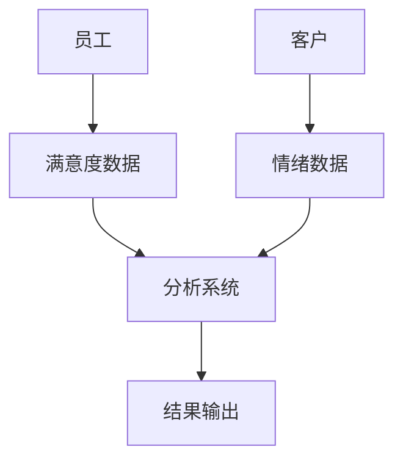
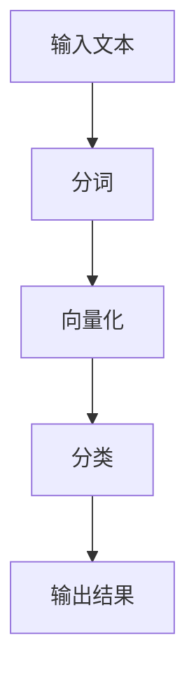
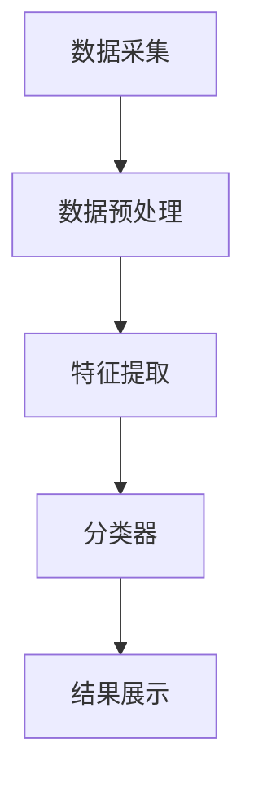

                 


# 构建企业级情感计算平台：员工满意度与客户情绪分析

## 关键词：
员工满意度、客户情绪分析、情感计算、自然语言处理、机器学习、系统架构、项目实战

## 摘要：
情感计算（Emotion Computing）是人工智能领域的重要分支，旨在通过分析和理解人类情感信息，为企业提供数据支持。本文将重点探讨如何构建企业级情感计算平台，用于员工满意度分析和客户情绪分析。通过详细分析情感计算的核心概念、算法原理、系统架构以及实际项目案例，本文旨在为企业提供一套完整的解决方案，助力企业在员工管理和客户关系管理中实现智能化、数据化。

---

# 第一部分: 情感计算与企业应用背景

## 第1章: 情感计算的基本概念与应用背景

### 1.1 情感计算的定义与核心概念
情感计算（Emotion Computing）是指通过计算机技术对人类情感信息进行识别、理解和计算的过程。其核心目标是将人类的情感因素融入到计算机系统中，以便更好地辅助决策。

#### 1.1.1 情感计算的定义
情感计算不仅仅是识别情感，还包括理解情感的强度、情感的上下文以及情感对决策的影响。它结合了自然语言处理（NLP）、机器学习（ML）和数据挖掘等技术，能够从文本、语音或图像中提取情感信息。

#### 1.1.2 情感计算的核心要素
- **情感识别**：从文本、语音或图像中识别出情感类别（如正面、负面、中性）。
- **情感分析**：对情感进行深度分析，理解情感背后的原因和动机。
- **情感建模**：构建情感数据模型，用于预测和模拟情感变化。
- **情感反馈**：根据情感数据提供实时反馈，优化企业决策。

#### 1.1.3 情感计算的应用场景
- **员工满意度分析**：通过分析员工反馈，帮助企业识别员工情绪问题，优化企业管理。
- **客户情绪分析**：通过分析客户反馈，帮助企业提升客户体验，改善产品和服务。
- **舆情监控**：通过分析社交媒体数据，帮助企业了解公众对品牌的态度。

### 1.2 员工满意度与客户情绪分析的重要性
员工满意度和客户情绪分析是情感计算的两大重要应用领域。前者关系到企业的内部管理，后者关系到企业的外部形象。

#### 1.2.1 员工满意度对企业的影响
员工满意度是企业绩效的重要指标之一。高满意度的员工通常更具创造力和生产力，而低满意度的员工可能导致高离职率和低效率。

#### 1.2.2 客户情绪分析的商业价值
客户情绪分析可以帮助企业识别客户痛点，优化产品和服务，提升客户忠诚度。通过实时监控客户情绪，企业可以快速响应客户需求，提高客户满意度。

#### 1.2.3 情感计算在企业管理中的作用
情感计算可以帮助企业在员工管理和客户关系管理中实现数据化和智能化。通过分析情感数据，企业可以做出更精准的决策，优化资源配置，提升整体竞争力。

### 1.3 情感计算技术的发展与挑战
情感计算技术的发展离不开自然语言处理和机器学习的进步。然而，情感计算仍然面临诸多挑战，如情感数据的多样性、情感表达的模糊性以及情感计算的实时性要求。

#### 1.3.1 情感计算技术的历史演变
- **早期研究**：20世纪60年代，情感计算的概念首次提出，但技术手段较为简单。
- **自然语言处理的发展**：20世纪90年代，随着NLP技术的进步，情感计算开始应用于文本分析。
- **深度学习的崛起**：近年来，深度学习技术的引入，使得情感计算的准确性和效率有了显著提升。

#### 1.3.2 当前技术的主要挑战
- **数据多样性**：情感数据具有多样性和复杂性，如何有效处理这些数据是当前的难点。
- **情感表达的模糊性**：情感表达往往具有主观性和模糊性，如何准确识别和分类是技术难点。
- **实时性要求**：在某些应用场景中，情感计算需要实时处理数据，这对计算能力和算法效率提出了更高要求。

#### 1.3.3 未来发展趋势与研究方向
- **多模态情感计算**：结合文本、语音、图像等多种模态信息，提高情感计算的准确性和鲁棒性。
- **个性化情感分析**：根据个体差异，提供个性化的分析和建议。
- **情感计算的实时性优化**：通过优化算法和硬件，提升情感计算的实时性。

---

## 第2章: 情感计算的核心概念与联系

### 2.1 情感计算的原理与方法
情感计算的核心在于从数据中提取情感信息，并通过分析这些信息提供决策支持。以下是情感计算的基本原理和常用方法。

#### 2.1.1 情感分析的基本流程
- **数据预处理**：清洗和标注数据，提取情感特征。
- **特征提取**：从文本中提取关键词、句式、语调等特征。
- **模型训练**：基于特征训练情感分类模型。
- **情感分类**：对新数据进行情感分类。

#### 2.1.2 基于自然语言处理的情感计算
自然语言处理（NLP）是情感计算的核心技术之一。通过分词、句法分析、情感识别等步骤，可以从文本中提取情感信息。

#### 2.1.3 基于机器学习的情感分类
机器学习（ML）是情感分类的常用方法。通过训练分类器，可以将文本分类为正面、负面或中性。

### 2.2 员工满意度与客户情绪分析的对比分析
员工满意度分析和客户情绪分析在目标、数据来源和分析方法上存在差异。

#### 2.2.1 员工满意度分析的特点
- **内部数据**：员工满意度分析主要基于员工反馈，数据来源包括员工调查、离职面谈等。
- **个体差异**：员工满意度可能受到个体差异的影响，分析时需要考虑个体特征。
- **长期性**：员工满意度分析通常需要长期跟踪，以识别趋势和变化。

#### 2.2.2 客户情绪分析的特点
- **外部数据**：客户情绪分析主要基于客户反馈，数据来源包括社交媒体、客户评价、客服对话等。
- **实时性**：客户情绪分析需要实时处理数据，以便企业快速响应客户需求。
- **多样性**：客户情绪分析的数据来源多样，包括文本、语音和图像。

#### 2.2.3 两者的核心区别与联系
- **目标不同**：员工满意度分析关注员工的工作满意度，客户情绪分析关注客户对产品或服务的满意度。
- **数据来源不同**：员工满意度分析主要基于内部数据，客户情绪分析基于外部数据。
- **分析方法不同**：员工满意度分析通常采用问卷调查和统计分析，客户情绪分析采用文本挖掘和情感分类。

### 2.3 情感计算的实体关系图



---

## 第3章: 情感计算的算法原理与实现

### 3.1 情感分析的基本流程
情感分析的基本流程包括数据预处理、特征提取、模型训练和分类。

#### 3.1.1 数据预处理
- **分词**：将文本分割成词语或短语。
- **去停用词**：去除无意义的词语，如“的”、“了”等。
- **词干提取**：将词语还原为词干，便于特征提取。

#### 3.1.2 特征提取
- **关键词提取**：提取与情感相关的关键词。
- **情感特征向量**：构建情感特征向量，用于分类。

#### 3.1.3 模型训练与分类
- **训练分类器**：基于训练数据训练情感分类器。
- **情感分类**：对新数据进行情感分类。

### 3.2 基于词袋模型的分类方法



#### 3.2.1 词袋模型的实现
词袋模型是一种常用的文本表示方法，它将文本表示为一个词袋，不考虑词语的顺序。

```python
from sklearn.feature_extraction.text import CountVectorizer

vectorizer = CountVectorizer()
X = vectorizer.fit_transform(["I love this product!", "I hate it."])
print(X.toarray())
```

#### 3.2.2 分类器的训练与测试
基于词袋模型的分类器可以通过训练数据进行训练，并对新数据进行分类。

```python
from sklearn.naive_bayes import MultinomialNB
from sklearn.metrics import accuracy_score

model = MultinomialNB()
model.fit(X, y)
y_pred = model.predict(X_test)
print(accuracy_score(y, y_pred))
```

### 3.3 情感分类的数学模型

#### 3.3.1 朴素贝叶斯分类器
朴素贝叶斯分类器是一种基于概率论的分类方法，其核心公式为：

$$ P(c|d) = \frac{P(d|c)P(c)}{P(d)} $$

其中，$P(c|d)$ 是在数据$d$下类$c$的概率，$P(d|c)$是类$c$下数据$d$的概率，$P(c)$是类$c$的先验概率，$P(d)$是数据$d$的全概率。

#### 3.3.2 支持向量机分类器
支持向量机（SVM）是一种常用的分类方法，其核心思想是将数据映射到高维空间，并在高维空间中找到一个最优超平面，将不同类别的数据分开。

$$ \text{maximize} \, w \cdot y + b \, \text{subject to} \, y_i(w \cdot x_i + b) \geq 1 \, \forall i $$

其中，$w$ 是权重向量，$b$ 是偏置项，$y_i$ 是标签，$x_i$ 是输入数据。

---

## 第4章: 情感计算的系统架构设计

### 4.1 系统功能设计
情感计算系统的主要功能包括数据采集、预处理、特征提取、模型训练和结果展示。

#### 4.1.1 数据采集模块
数据采集模块负责从多种数据源（如文本文件、数据库、社交媒体）中采集情感数据。

#### 4.1.2 数据预处理模块
数据预处理模块负责对采集到的数据进行清洗和标注，提取情感特征。

#### 4.1.3 模型训练模块
模型训练模块负责基于预处理后的数据训练情感分类模型。

#### 4.1.4 结果展示模块
结果展示模块负责将分类结果以可视化的方式展示出来。

### 4.2 系统架构设计



### 4.3 系统实现
系统实现部分包括环境搭建、核心代码实现和功能测试。

#### 4.3.1 环境搭建
需要安装Python和相关库（如scikit-learn、NLTK）。

#### 4.3.2 核心代码实现
以下是情感计算系统的核心代码实现：

```python
from sklearn.feature_extraction.text import TfidfVectorizer
from sklearn.naive_bayes import MultinomialNB
from sklearn.pipeline import Pipeline

# 数据准备
texts = ["I love this product!", "I hate it.", "The service is excellent!", "This is terrible."]
labels = [1, 0, 1, 0]

# 模型训练
model = Pipeline([
    ('vectorizer', TfidfVectorizer()),
    ('classifier', MultinomialNB())
])
model.fit(texts, labels)

# 模型预测
test_texts = ["This product is great!", "I'm very dissatisfied."]
test_labels = model.predict(test_texts)

# 结果展示
print(test_labels)
```

#### 4.3.3 功能测试
测试模型的准确率、召回率和F1值。

---

## 第5章: 情感计算的项目实战

### 5.1 项目背景
本项目旨在构建一个企业级情感计算平台，用于员工满意度分析和客户情绪分析。

### 5.2 项目实施
项目实施包括需求分析、系统设计、开发实现和测试优化。

#### 5.2.1 需求分析
明确项目目标、功能需求和性能需求。

#### 5.2.2 系统设计
设计系统的功能模块、数据流和架构图。

#### 5.2.3 开发实现
基于需求设计，进行系统开发和测试。

### 5.3 项目总结
项目总结包括项目成果、经验教训和未来改进方向。

---

## 第6章: 情感计算的最佳实践与小结

### 6.1 最佳实践
- **数据质量**：确保数据的完整性和准确性。
- **模型优化**：通过交叉验证和超参数调优提高模型性能。
- **实时性优化**：采用流处理技术提升系统的实时性。

### 6.2 小结
情感计算是一种新兴的技术，其在员工满意度分析和客户情绪分析中的应用前景广阔。通过构建企业级情感计算平台，企业可以更好地理解和满足员工和客户的需求，提升整体竞争力。

### 6.3 注意事项
- **数据隐私**：在处理员工和客户数据时，需遵守相关隐私保护法规。
- **模型解释性**：情感计算模型的解释性较差，需注意模型的可解释性问题。

### 6.4 拓展阅读
- **相关书籍**：《情感计算：人工智能的新方向》
- **相关论文**：《基于深度学习的情感分析研究》

---

## 作者
作者：AI天才研究院/AI Genius Institute  
及  
禅与计算机程序设计艺术/Zen And The Art of Computer Programming

