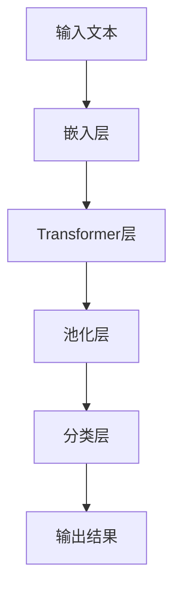
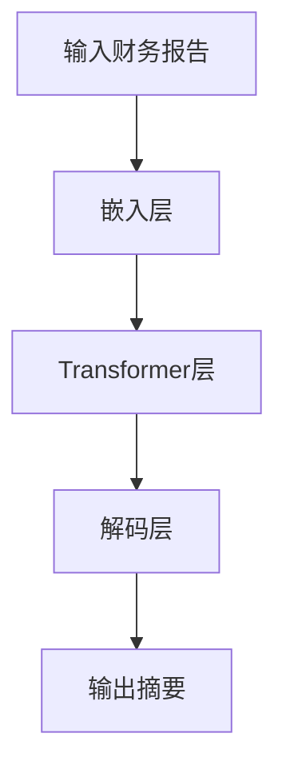
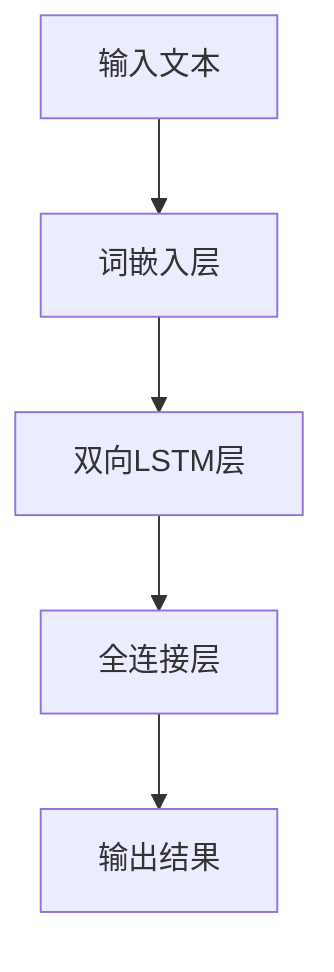
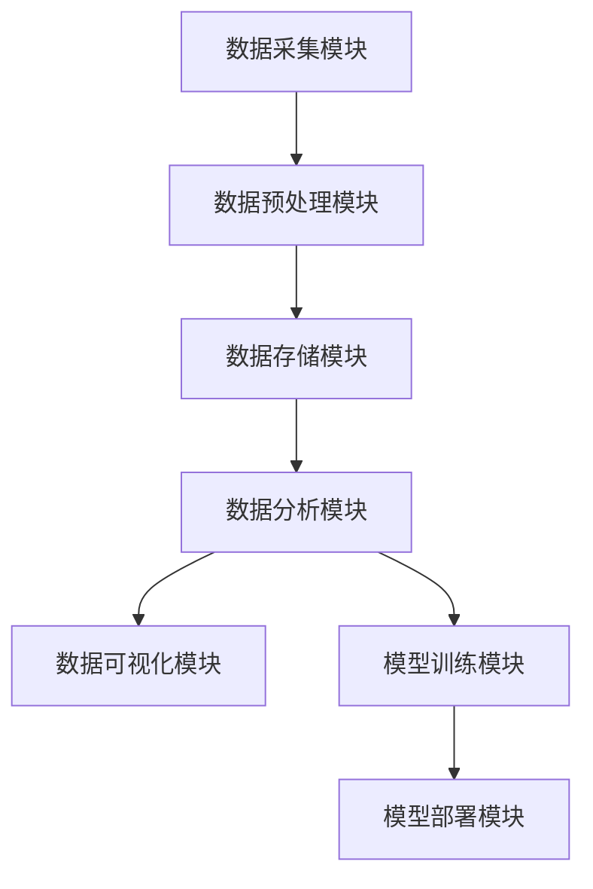
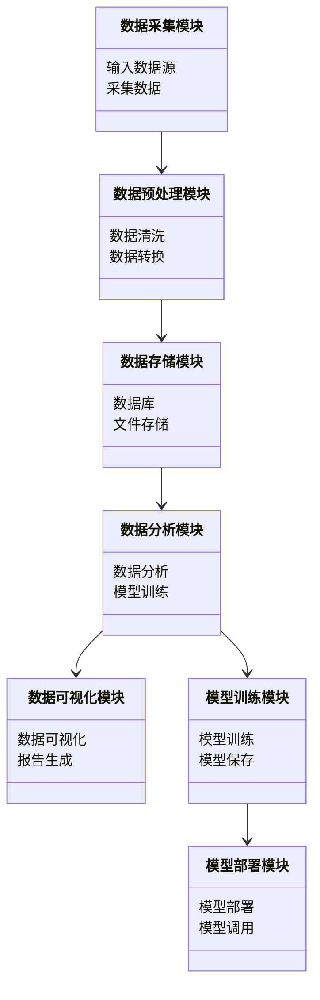
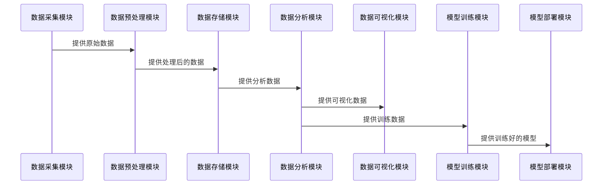

                 


## 第4章: 企业财务分析系统的算法原理与实现

### 4.3 自然语言处理算法在财务报告分析中的应用

#### 4.3.1 BERT模型
##### 4.3.1.1 模型介绍
自然语言处理（NLP）在财务报告分析中起着至关重要的作用，能够帮助分析师快速提取关键信息、识别财务风险和趋势。BERT（Bidirectional Encoder Representations from Transformers）是一种深度预训练的Transformer模型，以其在各种NLP任务中的卓越表现而闻名。

##### 4.3.1.2 模型流程
在财务报告分析中，BERT模型通常用于文本分类任务，例如识别财务报告的情感倾向或分类财务数据。以下是BERT模型在财务报告分析中的流程：



##### 4.3.1.3 代码实现
以下是一个简单的BERT模型用于财务报告分类的代码示例：

```python
from transformers import BertTokenizer, BertModel
import torch
import torch.nn as nn
import torch.optim as optim
from torch.utils.data import DataLoader, Dataset

# 定义BERT分类器
class BERTClassifier(nn.Module):
    def __init__(self, bert_model, num_classes):
        super(BERTClassifier, self).__init__()
        self.bert = bert_model
        self.dropout = nn.Dropout(0.1)
        self.classifier = nn.Linear(bert_model.config.hidden_size, num_classes)

    def forward(self, input_ids, attention_mask):
        outputs = self.bert(input_ids=input_ids, attention_mask=attention_mask)
        pooled_output = outputs.last_hidden_state[:, 0, :]
        pooled_output = self.dropout(pooled_output)
        return self.classifier(pooled_output)

# 加载预训练的BERT模型
tokenizer = BertTokenizer.from_pretrained('bert-base-uncased')
bert_model = BertModel.from_pretrained('bert-base-uncased')

# 定义分类任务（例如，财务报告情感分类）
num_classes = 3  # 假设分为正面、中性、负面三类
model = BERTClassifier(bert_model, num_classes)

# 定义损失函数和优化器
criterion = nn.CrossEntropyLoss()
optimizer = optim.Adam(model.parameters(), lr=1e-5)

# 定义数据集和数据加载器
class FinancialReportDataset(Dataset):
    def __init__(self, texts, labels, tokenizer, max_length):
        self.texts = texts
        self.labels = labels
        self.tokenizer = tokenizer
        self.max_length = max_length

    def __len__(self):
        return len(self.texts)

    def __getitem__(self, idx):
        text = self.texts[idx]
        label = self.labels[idx]
        encoding = self.tokenizer.encode_plus(
            text,
            add_special_tokens=True,
            max_length=self.max_length,
            return_token_type_ids=False,
            padding='max_length',
            truncation=True,
            return_attention_mask=True,
            return_tensors='pt',
        )
        return {
            'input_ids': encoding['input_ids'].flatten(),
            'attention_mask': encoding['attention_mask'].flatten(),
            'label': label
        }

# 创建数据集和数据加载器
texts = [...]  # 财务报告文本列表
labels = [...]  # 对应的分类标签列表
dataset = FinancialReportDataset(texts, labels, tokenizer, max_length=128)
dataloader = DataLoader(dataset, batch_size=16, shuffle=True, num_workers=4)

# 训练模型
model.train()
for epoch in range(num_epochs):
    for batch in dataloader:
        input_ids = batch['input_ids'].to(device)
        attention_mask = batch['attention_mask'].to(device)
        labels = batch['label'].to(device)
        
        outputs = model(input_ids, attention_mask)
        loss = criterion(outputs, labels)
        loss.backward()
        optimizer.step()
        optimizer.zero_grad()

# 模型评估
model.eval()
with torch.no_grad():
    for batch in dataloader:
        input_ids = batch['input_ids'].to(device)
        attention_mask = batch['attention_mask'].to(device)
        labels = batch['label'].to(device)
        
        outputs = model(input_ids, attention_mask)
        _, predicted = torch.max(outputs.data, 1)
        accuracy += (predicted == labels).sum().item() / labels.size(0)
```

#### 4.3.2 GPT模型
##### 4.3.2.1 模型介绍
GPT（Generative Pre-trained Transformer）模型是一种基于自注意力机制的生成模型，常用于生成文本或进行文本摘要。在财务报告分析中，GPT可以用于生成财务报告摘要或预测财务趋势。

##### 4.3.2.2 模型流程
以下是GPT模型用于财务报告摘要的流程图：



##### 4.3.2.3 代码实现
以下是一个简单的GPT模型用于财务报告摘要的代码示例：

```python
from transformers import GPT2Tokenizer, GPT2ModelWithLMHead
import torch
import torch.nn as nn
import torch.optim as optim
from torch.utils.data import DataLoader, Dataset

# 定义GPT摘要器
class GPTSummarizer(nn.Module):
    def __init__(self, gpt_model):
        super(GPTSummarizer, self).__init__()
        self.gpt = gpt_model
        self.dropout = nn.Dropout(0.1)
        self.classifier = nn.Linear(gpt_model.config.hidden_size, gpt_model.config.vocab_size)

    def forward(self, input_ids, attention_mask):
        outputs = self.gpt(input_ids=input_ids, attention_mask=attention_mask)
        pooled_output = outputs.last_hidden_state[:, 0, :]
        pooled_output = self.dropout(pooled_output)
        return self.classifier(pooled_output)

# 加载预训练的GPT模型
tokenizer = GPT2Tokenizer.from_pretrained('gpt2')
model = GPT2ModelWithLMHead.from_pretrained('gpt2')

# 定义摘要生成函数
def generate_summary(model, tokenizer, text, max_length=100):
    inputs = tokenizer.encode_plus(text, max_length=max_length, pad_to_max_length=True, truncation=True, return_tensors='pt')
    input_ids = inputs['input_ids'].to(device)
    attention_mask = inputs['attention_mask'].to(device)
    outputs = model.generate(input_ids=input_ids, attention_mask=attention_mask, max_length=max_length)
    summary = tokenizer.decode(outputs[0], skip_special_tokens=True)
    return summary

# 示例生成摘要
text = "公司2023年第三季度收入增长15%，净利润率为18%。"
print(generate_summary(model, tokenizer, text))
```

#### 4.3.3 Text-RN
##### 4.3.3.1 模型介绍
Text-RN（Text Representation with Neural Networks）是一种基于深度学习的文本表示模型，能够将财务报告中的文本转化为高维向量，便于后续的分析和分类。

##### 4.3.3.2 模型流程
以下是Text-RN模型用于财务报告分类的流程图：



##### 4.3.3.3 代码实现
以下是一个简单的Text-RN模型用于财务报告分类的代码示例：

```python
import torch
import torch.nn as nn
import torch.optim as optim
from torch.utils.data import DataLoader, Dataset

# 定义Text-RN模型
class TextRN(nn.Module):
    def __init__(self, vocab_size, embedding_dim, hidden_dim, output_dim):
        super(TextRN, self).__init__()
        self.embedding = nn.Embedding(vocab_size, embedding_dim)
        self.lstm = nn.LSTM(embedding_dim, hidden_dim, bidirectional=True, batch_first=True)
        self.dropout = nn.Dropout(0.1)
        self.fc = nn.Linear(hidden_dim * 2, output_dim)
    
    def forward(self, input_ids):
        embedded = self.embedding(input_ids)
        output, (h_n, c_n) = self.lstm(embedded)
        output = self.dropout(output)
        output = output[:, -1, :]
        output = self.fc(output)
        return output

# 定义数据集和数据加载器
class FinancialReportDataset(Dataset):
    def __init__(self, texts, labels, tokenizer, vocab_size):
        self.texts = texts
        self.labels = labels
        self.tokenizer = tokenizer
        self.vocab_size = vocab_size

    def __len__(self):
        return len(self.texts)

    def __getitem__(self, idx):
        text = self.texts[idx]
        label = self.labels[idx]
        tokenized = self.tokenizer(text)
        input_ids = torch.tensor(tokenized, dtype=torch.long)
        return {
            'input_ids': input_ids,
            'label': label
        }

# 创建数据集和数据加载器
texts = [...]  # 财务报告文本列表
labels = [...]  # 对应的分类标签列表
tokenizer = ...  # 自定义tokenizer或使用预训练的tokenizer
vocab_size = len(tokenizer.vocab)
dataset = FinancialReportDataset(texts, labels, tokenizer, vocab_size)
dataloader = DataLoader(dataset, batch_size=16, shuffle=True, num_workers=4)

# 初始化模型
vocab_size = len(tokenizer.vocab)
embedding_dim = 100
hidden_dim = 128
output_dim = 3  # 假设分为正面、中性、负面三类
model = TextRN(vocab_size, embedding_dim, hidden_dim, output_dim)

# 定义损失函数和优化器
criterion = nn.CrossEntropyLoss()
optimizer = optim.Adam(model.parameters(), lr=1e-3)

# 训练模型
model.train()
for epoch in range(num_epochs):
    for batch in dataloader:
        input_ids = batch['input_ids'].to(device)
        labels = batch['label'].to(device)
        
        outputs = model(input_ids)
        loss = criterion(outputs, labels)
        loss.backward()
        optimizer.step()
        optimizer.zero_grad()

# 模型评估
model.eval()
with torch.no_grad():
    for batch in dataloader:
        input_ids = batch['input_ids'].to(device)
        labels = batch['label'].to(device)
        
        outputs = model(input_ids)
        _, predicted = torch.max(outputs.data, 1)
        accuracy += (predicted == labels).sum().item() / labels.size(0)
```

### 4.4 数学模型与公式推导

#### 4.4.1 线性回归模型
线性回归是一种简单的回归模型，常用于预测连续型变量。其数学模型如下：

$$ y = \beta_0 + \beta_1x_1 + \beta_2x_2 + \dots + \beta_nx_n + \epsilon $$

其中，$y$ 是预测目标，$x_i$ 是自变量，$\beta_i$ 是回归系数，$\epsilon$ 是误差项。

在财务分析中，线性回归常用于预测公司收入、利润等连续型变量。

#### 4.4.2 随机森林
随机森林是一种基于决策树的集成学习算法，常用于分类和回归任务。其数学模型如下：

$$ y = \sum_{i=1}^{n} \theta_i \cdot x_i + b $$

其中，$\theta_i$ 是决策树的权重，$x_i$ 是输入特征，$b$ 是偏置项。

在财务分析中，随机森林常用于分类财务风险、预测财务指标等。

#### 4.4.3 BERT模型
BERT模型是一种基于Transformer的深度预训练模型，其数学模型如下：

$$ \text{Encoder}(x) = \text{LayerNorm}(x + \text{MHA}(x) + \text{FFN}(x)) $$

其中，MHA表示多头注意力机制，FFN表示前馈神经网络。

在财务分析中，BERT模型常用于文本分类、实体识别等任务。

### 4.5 企业财务分析系统架构设计

#### 4.5.1 系统模块划分
以下是企业财务分析系统的模块划分：



#### 4.5.2 数据流图
以下是数据流图：


#### 4.5.3 功能设计
以下是功能设计：



#### 4.5.4 系统接口设计
以下是系统接口设计：



### 4.6 项目实战与代码实现

#### 4.6.1 环境搭建
以下是项目实战的环境搭建步骤：

1. 安装Python和相关库：
   ```bash
   pip install numpy pandas scikit-learn transformers
   ```

2. 安装Jupyter Notebook：
   ```bash
   pip install jupyter
   ```

3. 安装TensorFlow和Keras：
   ```bash
   pip install tensorflow tensorflow.keras
   ```

#### 4.6.2 核心代码实现

##### 数据预处理
```python
import pandas as pd
import numpy as np

# 加载数据
data = pd.read_csv('financial_data.csv')

# 数据清洗
data.dropna(inplace=True)
data = data.drop_duplicates()

# 数据转换
data['date'] = pd.to_datetime(data['date'])
data.set_index('date', inplace=True)
```

##### 数据分析与建模
```python
from sklearn.model_selection import train_test_split
from sklearn.ensemble import RandomForestClassifier
from sklearn.metrics import accuracy_score

# 划分数据集
X_train, X_test, y_train, y_test = train_test_split(data.drop('label', axis=1), data['label'], test_size=0.2, random_state=42)

# 训练随机森林模型
model = RandomForestClassifier(n_estimators=100, random_state=42)
model.fit(X_train, y_train)

# 模型评估
y_pred = model.predict(X_test)
print('Accuracy:', accuracy_score(y_test, y_pred))
```

##### 数据可视化
```python
import matplotlib.pyplot as plt
import seaborn as sns

# 绘制柱状图
plt.figure(figsize=(10,6))
sns.countplot(x='label', data=data)
plt.title('Distribution of Labels')
plt.show()
```

##### 模型训练与部署
```python
import joblib

# 保存模型
joblib.dump(model, 'financial_model.pkl')

# 加载模型
loaded_model = joblib.load('financial_model.pkl')

# 预测新数据
new_data = pd.read_csv('new_financial_data.csv')
new_data.dropna(inplace=True)
new_data['date'] = pd.to_datetime(new_data['date'])
new_data.set_index('date', inplace=True)
predictions = loaded_model.predict(new_data.drop('label', axis=1))
print('Predictions:', predictions)
```

### 4.7 系统优化与扩展

#### 4.7.1 系统优化
1. **模型调优**：使用交叉验证、网格搜索等方法优化模型参数。
2. **数据优化**：增加数据量、处理数据不平衡问题、特征工程等。
3. **算法优化**：尝试不同的算法、调整模型结构、使用集成学习等。

#### 4.7.2 多模态分析
1. **文本与数值结合**：将财务报告文本与数值数据结合，提高分析精度。
2. **图像与数值结合**：结合财务报表图像和数值数据进行分析。

#### 4.7.3 模型部署与管理
1. **模型部署**：将训练好的模型部署到生产环境，提供API接口供其他系统调用。
2. **模型监控**：监控模型性能，及时发现和处理模型退化问题。
3. **模型更新**：定期重新训练模型，保持模型的准确性和适应性。

#### 4.7.4 注意事项
1. **数据隐私**：确保数据处理和存储符合相关法律法规，保护企业数据隐私。
2. **模型解释性**：在实际应用中，确保模型的可解释性，便于财务分析师理解和使用。
3. **系统稳定性**：保证系统的稳定性和高可用性，避免因系统故障导致数据分析中断。

### 4.8 未来研究方向
1. **更复杂的NLP模型**：研究更复杂的NLP模型，如BERT、GPT等，提高文本分析的准确性。
2. **多模态数据分析**：结合文本、图像、数值等多种数据源，进行更全面的财务分析。
3. **实时分析与预测**：实现财务数据的实时分析与预测，提高企业的应对能力。
4. **自动化报告生成**：研究自动化财务报告生成技术，提高工作效率。
5. **模型可解释性研究**：深入研究模型的可解释性，提高财务分析师对模型结果的信任度。

### 4.9 拓展阅读
1. **《深度学习》——Ian Goodfellow**
2. **《自然语言处理实战》——哈士挺等**
3. **《Python机器学习》——Andreas Müller、Corey contributors**
4. **《Keras深度学习实战》——李春晓**
5. **《TensorFlow实战》——唐宇迪**

### 4.10 最佳实践 Tips
1. **数据预处理**：在数据预处理阶段，尽量清洗和转换数据，确保数据质量。
2. **特征工程**：进行有效的特征工程，提取更有意义的特征，提高模型性能。
3. **模型选择**：根据具体任务选择合适的模型，不要盲目追求复杂模型。
4. **交叉验证**：使用交叉验证评估模型性能，避免过拟合。
5. **实时监控**：对模型进行实时监控，及时发现和处理模型性能下降问题。

### 4.11 小结
本章详细讲解了企业财务分析系统中常用的算法原理与实现，包括机器学习算法、自然语言处理算法、数学模型与公式推导、系统架构设计以及项目实战与代码实现。通过本章的学习，读者可以掌握如何利用这些算法和技术构建一个智能化的企业财务分析系统。

