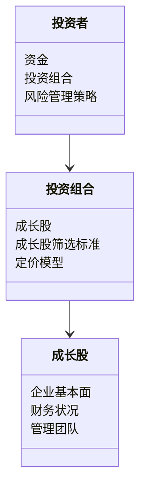
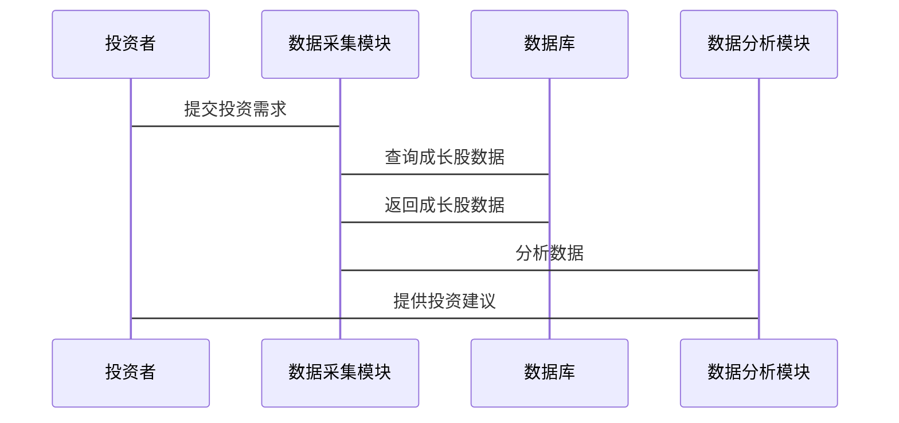

                 


# 费雪到现代：成长型投资的发展

> 关键词：成长型投资，价值投资，成长股，内在价值评估，风险管理

> 摘要：成长型投资是一种注重长期价值增长的投资策略，起源于费雪的投资理念。本文将从费雪的成长型投资理论出发，分析其核心概念、策略和实践，探讨其在现代投资环境中的演变与发展。通过经典案例分析、系统设计和项目实战，深入阐述成长型投资的内在逻辑和应用方法。

---

# 第一部分: 费雪与成长型投资的起源

## 第1章: 费雪与成长型投资的背景

### 1.1 费雪的生平与投资理念

#### 1.1.1 费雪的生平简介
- 费雪（Philip Fisher）是20世纪著名的投资家，被誉为“成长股之父”。
- 1909年进入投资领域，1934年出版《共同基金的性质》，奠定了成长型投资理论的基础。
- 费雪的投资理念强调长期价值增长和企业质量，而非短期价格波动。

#### 1.1.2 费雪的投资理念与方法
- 投资理念：寻找那些具有持续增长潜力的优秀企业。
- 投资方法：通过深入研究企业基本面，评估其长期盈利能力。
- 核心观点：企业质量是投资成功的关键，而非市场的短期波动。

#### 1.1.3 费雪对成长型投资的贡献
- 提出了“成长股”的概念，强调投资那些具有高成长潜力的企业。
- 开创了“三步分析法”，即先评估公司的质量，再分析其估值，最后确定买入时机。

### 1.2 成长型投资的定义与特点

#### 1.2.1 成长型投资的定义
- 成长型投资：一种投资策略，专注于投资那些具有高增长潜力的企业，以期获得长期资本增值。

#### 1.2.2 成长型投资的核心特点
- 长期导向：关注企业的长期增长潜力，而非短期收益。
- 高成长性：选择那些收入和利润持续增长的企业。
- 风险较高：成长型企业通常处于高增长阶段，但波动性较大。

#### 1.2.3 成长型投资与价值投资的区别
| **方面** | **成长型投资** | **价值投资** |
|----------|----------------|--------------|
| 核心目标 | 寻找高增长潜力的企业 | 寻找被市场低估的企业 |
| 关注点   | 未来的增长潜力 | 当前的内在价值 |
| 风险     | 较高            | 较低          |

### 1.3 费雪的成长股筛选标准

#### 1.3.1 费雪的成长股筛选标准
- 企业具有持续的增长潜力。
- 企业具备良好的管理团队和企业文化。
- 企业的财务状况健康，盈利能力稳定。

#### 1.3.2 费雪的“三步分析法”
1. **第一步**：评估企业的质量，包括管理团队、行业地位等。
2. **第二步**：分析企业的估值，确定其是否具有投资吸引力。
3. **第三步**：确定买入时机，等待合适的市场机会。

#### 1.3.3 费雪的成长股投资策略
- 长期持有：避免频繁交易，耐心等待企业的成长。
- 分批买入：分散投资，降低风险。
- 逆向投资：在市场低迷时买入优质成长股。

### 1.4 费雪投资理念的现代意义

#### 1.4.1 费雪理念在现代投资中的应用
- 现代投资环境更加复杂，但费雪的理念依然适用。
- 成长型投资在科技、互联网等领域表现突出。

#### 1.4.2 费雪理念对个人投资者的启示
- 强调长期投资，避免短期波动的干扰。
- 注重企业基本面研究，选择优质企业。

#### 1.4.3 费雪理念与机构投资的结合
- 机构投资者可以利用费雪的理念，构建高成长性的投资组合。
- 结合量化分析，提升投资决策的科学性。

### 1.5 本章小结
- 费雪的成长型投资理论为现代投资提供了重要基础。
- 成长型投资的核心是选择优质企业，长期持有，追求高增长。

---

## 第2章: 成长型投资的核心理论

### 2.1 价值投资与成长型投资的联系与区别

#### 2.1.1 价值投资的核心理念
- 价值投资：寻找市场价格低于内在价值的企业。
- 强调安全边际，避免过度风险。

#### 2.1.2 成长型投资的核心理念
- 成长型投资：寻找具有高增长潜力的企业。
- 强调企业的未来增长潜力，而非当前估值。

#### 2.1.3 价值投资与成长型投资的区别
- 投资目标：价值投资注重安全边际，成长型投资注重增长潜力。
- 投资策略：价值投资寻找低估企业，成长型投资寻找高成长企业。
- 风险与收益：价值投资风险较低，收益稳定；成长型投资风险较高，收益潜力大。

### 2.2 成长型投资的内在价值评估

#### 2.2.1 内在价值的定义
- 内在价值：企业未来现金流的现值，反映企业的真正价值。
- 计算公式：$$ \text{内在价值} = \sum_{t=1}^{n} \frac{\text{现金流}_t}{(1 + r)^t} $$
  - 其中，\( r \) 为折现率，\( n \) 为预测期数。

#### 2.2.2 内在价值的计算方法
- 现金流预测：估算企业未来各期的现金流。
- 折现率确定：选择合适的折现率，通常使用无风险利率加风险溢价。
- 现金流折现：将未来现金流折现，计算现值之和。

#### 2.2.3 成长型投资中的内在价值评估
- 成长型企业现金流增长快，内在价值高。
- 需要动态调整现金流预测，反映企业的增长潜力。

### 2.3 成长型投资的DCF模型

#### 2.3.1 DCF模型的定义
- DCF（Discounted Cash Flow）模型：通过折现未来现金流，评估企业内在价值的方法。

#### 2.3.2 DCF模型的计算步骤
1. **预测现金流**：估算企业未来各期的现金流。
2. **确定折现率**：选择合适的折现率，通常使用WACC（加权平均资本成本）。
3. **折现现金流**：将各期现金流折现，计算现值。
4. **计算总价值**：将各期现值相加，得到企业内在价值。

#### 2.3.3 DCF模型在成长型投资中的应用
- 适用于高增长企业，如科技公司。
- 通过DCF模型评估企业价值，判断是否具有投资吸引力。

### 2.4 成长型投资的PEG指标

#### 2.4.1 PEG指标的定义
- PEG（Price/Earnings to Growth）：市盈率与收入增长率之比。
- 计算公式：$$ \text{PEG} = \frac{\text{市盈率}}{\text{收入增长率}} $$

#### 2.4.2 PEG指标的计算方法
- 计算企业的市盈率和收入增长率。
- 将市盈率除以收入增长率，得到PEG值。

#### 2.4.3 PEG指标在成长型投资中的应用
- PEG < 1：企业价值被低估，具有投资潜力。
- PEG = 1：企业价值合理，PEG > 1：企业价值高估，需谨慎投资。

### 2.5 本章小结
- 成长型投资的核心是内在价值评估，DCF模型和PEG指标是常用的工具。
- 投资者需要结合企业基本面和市场环境，综合评估企业的价值。

---

## 第3章: 成长型投资的策略与实践

### 3.1 成长型投资的选股策略

#### 3.1.1 选股标准的制定
- 企业具有持续增长潜力。
- 企业具备良好的管理团队和财务状况。
- 企业处于高增长行业，如科技、互联网等。

#### 3.1.2 选股过程中的注意事项
- 避免被市场情绪干扰，坚持基本面分析。
- 分散投资，降低风险。

#### 3.1.3 选股策略的优化
- 定期回顾和调整选股标准，适应市场变化。
- 结合技术分析，辅助决策。

### 3.2 成长型投资的风险管理

#### 3.2.1 风险管理的重要性
- 成长型投资风险较高，需要有效的风险管理策略。
- 风险管理是实现长期投资目标的关键。

#### 3.2.2 风险管理的具体方法
1. **分散投资**：通过投资不同行业和企业，降低风险。
2. **设定止损**：在股价下跌到一定幅度时，及时止损。
3. **定期评估**：定期检查投资组合，及时调整。

#### 3.2.3 风险管理在成长型投资中的应用
- 分散投资可以降低单一股票的风险。
- 设定止损可以避免重大损失。
- 定期评估有助于及时发现潜在风险。

### 3.3 成长型投资的长期持有策略

#### 3.3.1 长期持有的意义
- 长期持有可以避免频繁交易的费用和税收。
- 长期持有能够享受企业的成长带来的价值增长。

#### 3.3.2 长期持有的实施方法
- 选择优质企业，长期持有。
- 避免短期波动的干扰，耐心等待企业的成长。

#### 3.3.3 长期持有中的常见问题及解决
- 市场波动：长期持有需要耐心，避免情绪化操作。
- 企业变化：定期评估企业基本面，及时调整投资组合。

### 3.4 成长型投资的组合管理

#### 3.4.1 投资组合的定义
- 投资组合：投资者持有的多种资产的组合，以分散风险、提高收益。

#### 3.4.2 投资组合的构成
- 成长型投资组合应包含不同类型的成长股，以分散风险。

#### 3.4.3 投资组合的优化
- 定期调整投资组合，保持其与市场环境的一致性。
- 结合市场变化，优化投资组合的构成。

### 3.5 本章小结
- 成长型投资需要制定科学的选股策略和风险管理方法。
- 长期持有和组合管理是实现投资目标的关键。

---

## 第4章: 成长型投资的系统分析与架构设计

### 4.1 系统分析

#### 4.1.1 投资策略建模
- 使用系统思维，将投资策略转化为数学模型。
- 通过模型模拟市场变化，优化投资策略。

#### 4.1.2 领域模型（Mermaid类图）


#### 4.1.3 系统架构（Mermaid架构图）


### 4.2 系统架构设计

#### 4.2.1 投资系统功能设计
- 数据采集：收集成长股的基本面数据。
- 数据分析：使用数学模型评估企业价值。
- 投资决策：根据分析结果，制定投资策略。

#### 4.2.2 系统接口设计
- 输入接口：接收投资者的投资需求。
- 输出接口：提供投资建议和风险提示。

#### 4.2.3 系统交互设计（Mermaid序列图）


### 4.3 本章小结
- 系统分析与架构设计是实现成长型投资的重要工具。
- 通过系统思维，投资者可以更好地制定和优化投资策略。

---

## 第5章: 成长型投资的项目实战

### 5.1 环境安装

#### 5.1.1 安装Python
- 下载并安装Python 3.x版本。
- 安装Jupyter Notebook或其他数据分析工具。

#### 5.1.2 安装必要的库
- 使用pip安装numpy、pandas、matplotlib等库。
  ```bash
  pip install numpy pandas matplotlib
  ```

### 5.2 核心实现源代码

#### 5.2.1 数据采集与处理
```python
import pandas as pd
import numpy as np

# 数据采集
data = pd.read_csv('growth_stocks.csv')

# 数据清洗
data.dropna(inplace=True)
data = data[~data['PE'].isin([np.inf, -np.inf])]
```

#### 5.2.2 投资组合优化
```python
import numpy as np
from scipy.optimize import minimize

# 定义优化目标函数
def portfolio_variance(weights, covariance_matrix):
    return np.dot(weights.T, np.dot(covariance_matrix, weights))

# 定义约束条件
def weight_constraints(weights):
    return weights.sum() - 1

# 初始化权重
initial_weights = np.array([0.2, 0.2, 0.2, 0.2, 0.2])

# 使用minimize函数优化投资组合
result = minimize(portfolio_variance, initial_weights, 
                 args=covariance_matrix, 
                 constraints={'type': 'eq', 'fun': weight_constraints})

# 输出优化结果
print(result.x)
```

### 5.3 代码应用解读与分析

#### 5.3.1 数据采集与处理
- 数据采集：从CSV文件中读取成长股数据。
- 数据清洗：删除缺失值和异常值，确保数据质量。

#### 5.3.2 投资组合优化
- 使用优化算法，找到风险最小的投资组合。
- 通过约束条件，确保权重之和为1。

### 5.4 实际案例分析

#### 5.4.1 案例分析：费雪的经典投资案例
- 投资标的：可口可乐公司。
- 投资决策：长期持有，获得股息和股价上涨的双重收益。
- 投资结果：可口可乐股价长期上涨，投资者获得丰厚回报。

#### 5.4.2 现实案例：微软投资
- 投资标的：微软公司。
- 投资决策：基于其在科技领域的领先地位，长期持有。
- 投资结果：微软股价稳步上涨，投资者收益显著。

### 5.5 项目小结
- 成长型投资需要结合实际案例，验证理论的可行性。
- 通过代码实现，投资者可以更好地理解和应用成长型投资策略。

---

## 第6章: 成长型投资的现代发展

### 6.1 现代成长型投资的特点

#### 6.1.1 互联网时代的影响
- 互联网技术的发展，催生了大量高成长企业。
- 科技股在成长型投资中的比重增加。

#### 6.1.2 量化投资方法
- 利用大数据和算法，提升投资决策的科学性。
- 量化分析与基本面分析相结合。

### 6.2 现代成长型投资的策略

#### 6.2.1 量化分析的应用
- 使用大数据分析，筛选高成长企业。
- 利用机器学习模型，预测企业未来表现。

#### 6.2.2 ESG投资理念
- ESG（环境、社会、治理）投资理念的兴起。
- 选择符合ESG标准的企业，兼顾社会责任和投资收益。

### 6.3 现代成长型投资的挑战

#### 6.3.1 市场波动的加剧
- 科技股波动性大，投资风险增加。
- 需要更加谨慎地选择投资标的。

#### 6.3.2 技术进步的挑战
- 技术进步推动企业变革，投资决策需要更加动态。
- 需要持续学习和更新投资理念。

### 6.4 本章小结
- 现代成长型投资在互联网和科技驱动下，呈现出新的特点和挑战。
- 投资者需要结合量化分析和ESG理念，优化投资策略。

---

## 第7章: 成长型投资的最佳实践

### 7.1 投资策略的制定

#### 7.1.1 制定长期投资目标
- 明确投资目标，如资产增值、财富传承等。
- 根据目标制定具体的投资计划。

#### 7.1.2 风险管理的实施
- 设定止损点，避免重大损失。
- 分散投资，降低风险。

### 7.2 投资组合的优化

#### 7.2.1 定期评估投资组合
- 至少每季度评估一次投资组合。
- 根据市场变化，调整投资比例。

#### 7.2.2 优化投资组合的构成
- 增加高成长企业的比重。
- 保持适当的流动性，应对市场变化。

### 7.3 长期投资的纪律性

#### 7.3.1 避免情绪化投资
- 不被市场情绪左右，坚持长期投资。
- 避免追涨杀跌，保持理性。

#### 7.3.2 坚持定投策略
- 定期定额投资，分散风险。
- 通过定投，平滑市场波动带来的影响。

### 7.4 本章小结
- 成长型投资需要制定科学的投资策略，保持纪律性。
- 定期评估和优化投资组合，是实现长期投资目标的关键。

---

## 第8章: 总结与展望

### 8.1 全文总结
- 成长型投资是一种注重长期价值增长的投资策略，起源于费雪的投资理念。
- 现代成长型投资在互联网和科技驱动下，呈现出新的特点和挑战。

### 8.2 投资展望
- 未来，成长型投资将继续在科技和创新领域发挥重要作用。
- 投资者需要结合量化分析和ESG理念，优化投资策略。

### 8.3 本章小结
- 成长型投资的发展离不开理论与实践的结合。
- 未来，投资者需要更加注重科技创新和可持续发展。

---

## 作者

作者：AI天才研究院/AI Genius Institute & 禅与计算机程序设计艺术/Zen And The Art of Computer Programming

