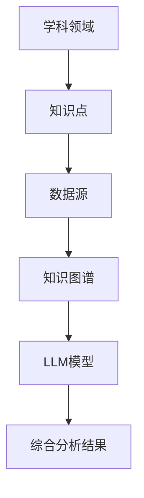
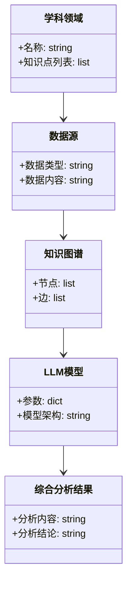
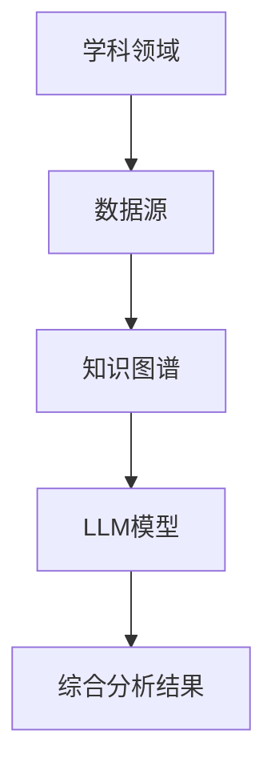
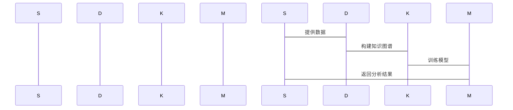

                 


# 跨学科知識整合AI Agent：LLM的綜合分析能力

> **关键词**：跨学科知識整合，AI Agent，LLM，综合分析能力，知识图谱，自然语言处理，机器学习

> **摘要**：  
> 本文探讨了跨学科知識整合AI Agent的核心概念、LLM的综合分析能力，以及它们如何协同工作以实现复杂的跨学科任务。文章首先介绍跨学科知識整合的背景和重要性，然后详细分析LLM的原理和特点，接着结合跨学科知識整合的核心概念，讲解LLM在其中的应用。最后，通过实际案例展示跨学科知識整合AI Agent的系统架构与实现，以及项目实战和最佳实践。

---

# 第1章: 跨学科知識整合的背景

## 1.1 跨学科知識整合的背景

### 1.1.1 什么是跨学科知識整合  
跨学科知識整合是指将不同学科的知识、数据、方法和技术进行融合，以解决复杂问题的过程。例如，在医学领域，结合生物学、计算机科学和数据科学的知识，可以开发出更高效的疾病诊断系统。

### 1.1.2 跨学科知識整合的重要性  
随着社会和科技的发展，单一学科的知识往往无法解决复杂问题。跨学科知識整合能够突破学科界限，利用多学科的优势，提升问题解决的效率和效果。

### 1.1.3 跨学科知識整合的现状与挑战  
当前，跨学科知識整合在多个领域得到广泛应用，但也面临数据孤岛、知识表示困难和模型复杂性等挑战。

---

## 1.2 LLM的基本概念与特点

### 1.2.1 什么是LLM  
LLM（Large Language Model）是指经过大规模数据训练的深度学习模型，具有强大的自然语言处理能力，能够理解和生成人类语言。

### 1.2.2 LLM的核心特点  
- **大规模预训练**：通过海量数据训练，模型能够学习语言的语法、语义和上下文。
- **通用性**：适用于多种任务，如文本生成、问答系统、翻译等。
- **上下文理解**：能够根据上下文推理和生成合理的内容。

### 1.2.3 LLM与传统NLP模型的区别  
传统NLP模型通常针对特定任务训练，而LLM是通用模型，能够适应多种任务。

---

## 1.3 跨学科知識整合与LLM的结合

### 1.3.1 跨学科知識整合的定义  
跨学科知識整合是通过结合不同学科的知识和方法，解决单一学科无法解决的复杂问题。

### 1.3.2 LLM在跨学科知識整合中的作用  
LLM能够理解和生成多学科的知识，帮助整合不同领域的信息，提升跨学科问题解决的能力。

### 1.3.3 跨学科知識整合的实现方式  
- **知识图谱构建**：将不同学科的知识组织成图结构，便于模型理解和推理。
- **多模态数据融合**：结合文本、图像、语音等多种数据形式，提升模型的综合分析能力。

---

# 第2章: 跨学科知識整合的核心概念

## 2.1 跨学科知識整合的原理

### 2.1.1 跨学科知識整合的基本原理  
跨学科知識整合通过构建统一的知识表示，将不同领域的信息进行融合，从而实现对复杂问题的综合分析。

### 2.1.2 跨学科知識整合的关键技术  
- **知识表示**：使用图结构或向量表示知识。
- **知识融合**：将不同来源的知识进行整合和去重。
- **知识推理**：基于知识图谱进行逻辑推理。

### 2.1.3 跨学科知識整合的实现步骤  
1. 收集多学科数据。
2. 构建知识图谱。
3. 使用LLM进行推理和生成。

---

## 2.2 LLM的综合分析能力

### 2.2.1 LLM的文本生成能力  
LLM能够生成连贯且合理的文本，适用于创意写作、代码生成等多种任务。

### 2.2.2 LLM的文本理解能力  
LLM能够理解上下文，回答复杂问题，并提供推理过程。

### 2.2.3 LLM的多任务处理能力  
LLM通过微调或提示工程技术，能够处理多种任务，如问答、翻译、摘要等。

---

## 2.3 跨学科知識整合与LLM的结合方式

### 2.3.1 跨学科知識整合的基本模式  
- **数据驱动模式**：基于多学科数据进行建模和分析。
- **知识图谱模式**：利用知识图谱进行推理和关联。

### 2.3.2 LLM在跨学科知識整合中的应用  
- **医疗领域**：整合医学、生物学和药学知识，辅助疾病诊断。
- **教育领域**：根据学生的学习情况，提供个性化的学习建议。

### 2.3.3 跨学科知識整合的未来发展趋势  
随着LLM的不断进步，跨学科知識整合将更加智能化和自动化，能够处理更复杂的问题。

---

# 第3章: 跨学科知識整合的核心概念与联系

## 3.1 跨学科知識整合的核心概念

### 3.1.1 跨学科知識整合的基本概念  
跨学科知識整合是通过多学科的知识融合，解决复杂问题的过程。

### 3.1.2 跨学科知識整合的关键要素  
- **知识表示**：将知识转化为可计算的形式。
- **知识融合**：将不同来源的知识进行整合。
- **知识推理**：基于知识进行逻辑推理。

### 3.1.3 跨学科知識整合的系统结构  
跨学科知識整合系统通常包括数据采集、知识构建、模型训练和应用推理四个部分。

---

## 3.2 LLM的核心概念

### 3.2.1 LLM的基本概念  
LLM是经过大规模预训练的深度学习模型，能够理解和生成人类语言。

### 3.2.2 LLM的核心技术  
- **注意力机制**：用于捕捉文本中的关键信息。
- **Transformer架构**：支持长距离依赖关系的建模。

### 3.2.3 LLM的应用场景  
LLM适用于多种场景，如文本生成、问答系统、机器翻译等。

---

## 3.3 跨学科知識整合与LLM的联系

### 3.3.1 跨学科知識整合的核心概念  
跨学科知識整合需要将不同领域的知识进行融合，形成统一的知识表示。

### 3.3.2 LLM在跨学科知識整合中的作用  
LLM能够理解和生成多学科的知识，帮助整合不同领域的信息。

### 3.3.3 跨学科知識整合的实现方式  
- **知识图谱构建**：将不同学科的知识组织成图结构。
- **多模态数据融合**：结合文本、图像、语音等多种数据形式。

---

## 3.4 跨学科知識整合的核心概念与联系的对比

### 3.4.1 跨学科知識整合与LLM的对比  
| 特性               | 跨学科知識整合               | LLM                        |
|--------------------|-------------------------------|-----------------------------|
| 核心目标           | 整合多学科知识               | 处理自然语言               |
| 主要技术           | 知识图谱、知识融合            | 注意力机制、Transformer架构 |
| 应用场景           | 医疗、教育、科研             | 文本生成、问答、翻译        |

### 3.4.2 跨学科知識整合的ER实体关系图  


---

# 第4章: LLM的算法原理

## 4.1 LLM的训练过程

### 4.1.1 基于Transformer的架构  
LLM通常基于Transformer架构，包括编码器和解码器两个部分。

### 4.1.2 生成式模型的数学模型  
LLM的生成过程可以表示为：
$$ P(y|x) = \argmax_{y} P(y|x, \theta) $$
其中，$x$是输入文本，$y$是输出文本，$\theta$是模型参数。

---

## 4.2 LLM的数学模型与公式

### 4.2.1 注意力机制  
注意力机制的计算公式为：
$$ \alpha_i = \frac{\exp(s_i)}{\sum_{j} \exp(s_j)} $$
其中，$s_i$是第$i$个位置的得分。

### 4.2.2 损失函数  
LLM的训练目标是最小化损失函数：
$$ \mathcal{L} = -\sum_{i=1}^{n} \log P(y_i|x_i) $$

---

## 4.3 LLM的算法实现

### 4.3.1 环境安装  
需要安装Python、TensorFlow或PyTorch等库。

### 4.3.2 核心代码实现  
```python
import tensorflow as tf
from tensorflow.keras.layers import Dense, Dropout, MultiHeadAttention

class LLMModel(tf.keras.Model):
    def __init__(self, vocab_size, embedding_dim, num_heads):
        super().__init__()
        self.embedding = tf.keras.layers.Embedding(vocab_size, embedding_dim)
        self.attention = MultiHeadAttention(num_heads=num_heads, key_dim=embedding_dim//num_heads)
        self.dropout = Dropout(0.1)
        self.dense1 = Dense(256, activation='relu')
        self.dense2 = Dense(vocab_size, activation='softmax')

    def call(self, x, training=False):
        x = self.embedding(x)
        x = self.attention(x, x)
        x = self.dropout(x, training=training)
        x = self.dense1(x)
        x = self.dense2(x)
        return x
```

### 4.3.3 代码解读与分析  
- **嵌入层**：将输入的词索引转换为向量。
- **注意力层**：计算每个词的重要性。
- **前馈网络**：将注意力输出映射到词汇表概率分布。

---

# 第5章: 跨学科知識整合AI Agent的系统架构

## 5.1 问题场景介绍

### 5.1.1 背景  
跨学科知識整合AI Agent需要处理多学科数据，提供综合分析结果。

### 5.1.2 项目介绍  
构建一个AI Agent，能够整合医疗、教育、科研等多个领域的知识，提供智能化服务。

---

## 5.2 系统功能设计

### 5.2.1 领域模型类图  


---

## 5.3 系统架构设计

### 5.3.1 系统架构图  


### 5.3.2 系统接口设计  
- **输入接口**：接收多学科数据。
- **输出接口**：提供综合分析结果。

### 5.3.3 系统交互流程图  


---

## 5.4 项目实战

### 5.4.1 环境安装  
安装Python、TensorFlow、Numpy等库。

### 5.4.2 核心代码实现  
```python
import numpy as np
from tensorflow.keras.models import Model
from tensorflow.keras.layers import Input, Dense, MultiHeadAttention

def build_model(vocab_size, embedding_dim, num_heads):
    input_layer = Input(shape=(None,))
    embedding_layer = Dense(embedding_dim, activation='relu')(input_layer)
    attention_layer = MultiHeadAttention(num_heads=num_heads, key_dim=embedding_dim//num_heads)(embedding_layer, embedding_layer)
    dense_layer = Dense(256, activation='relu')(attention_layer)
    output_layer = Dense(vocab_size, activation='softmax')(dense_layer)
    model = Model(inputs=input_layer, outputs=output_layer)
    return model

model = build_model(vocab_size=10000, embedding_dim=256, num_heads=8)
model.compile(optimizer='adam', loss='sparse_categorical_crossentropy', metrics=['accuracy'])
```

### 5.4.3 代码解读与分析  
- **输入层**：接收输入文本。
- **嵌入层**：将输入转换为向量。
- **注意力层**：计算每个词的重要性。
- **密集层**：将注意力输出映射到词汇表概率分布。

---

## 5.5 最佳实践 tips

### 5.5.1 小结  
跨学科知識整合AI Agent通过结合LLM和知识图谱，能够高效地处理复杂问题。

### 5.5.2 注意事项  
- 确保数据质量和多样性。
- 定期更新知识图谱和模型。

### 5.5.3 拓展阅读  
建议阅读《Large Language Models: A Survey》和《Knowledge Graphs for NLP》。

---

# 结论

跨学科知識整合AI Agent通过结合LLM和知识图谱，能够高效地处理复杂问题。随着技术的不断进步，跨学科知識整合将更加智能化和自动化，为多个领域带来更多的创新和突破。

---

# 作者：AI天才研究院/AI Genius Institute & 禅与计算机程序设计艺术 /Zen And The Art of Computer Programming

