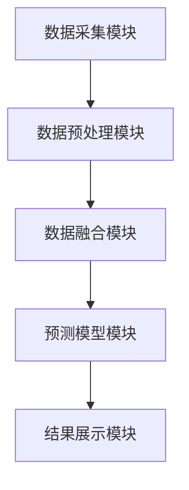
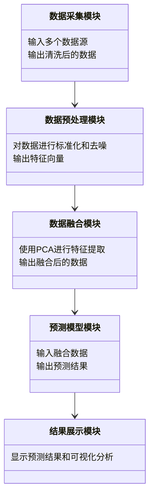
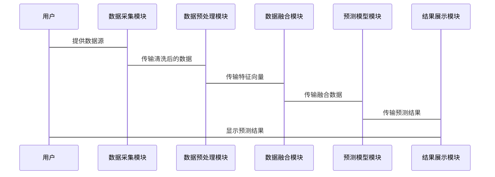

                 


# 金融时序数据的多源信息融合预测研究

**关键词**：金融时序数据，多源数据融合，时间序列预测，数据融合算法，系统设计

**摘要**：本文系统地探讨了金融时序数据的多源信息融合预测研究。首先，介绍了金融时序数据的重要性及其特点，分析了多源数据融合的必要性及其在金融领域的应用意义。接着，详细阐述了数据融合的核心概念、时序数据分析的挑战，以及多源数据融合的方法。然后，深入讲解了时间序列预测模型，包括ARIMA、LSTM和Transformer等算法的原理及其在金融时序数据中的应用。通过实际案例，展示了如何利用多源数据融合进行金融预测，并提供了系统的实现方案和代码示例。最后，总结了研究的成果，并展望了未来的研究方向。

---

## 第一章：金融时序数据的背景与挑战

### 1.1 金融时序数据的定义与特点

#### 1.1.1 金融时序数据的定义
金融时序数据是指在金融领域中，按照时间顺序记录的各类金融变量（如股票价格、汇率、利率等）的数据。这些数据反映了金融市场在不同时间点的状态，是金融分析和预测的重要基础。

#### 1.1.2 时序数据的特性
- **时间依赖性**：时序数据的值往往与其过去的状态密切相关。
- **波动性**：金融市场具有高度的波动性，数据可能受到多种因素的影响。
- **非线性**：金融时序数据的生成过程往往是非线性的，难以用简单的线性模型描述。
- **异质性**：不同金融变量的时序数据可能具有不同的特性（如波动性、周期性等）。

#### 1.1.3 金融时序数据的重要性
- **投资决策**：通过分析时序数据，投资者可以做出更明智的投资决策。
- **风险管理**：时序数据帮助识别市场风险，制定有效的风险管理策略。
- **市场研究**：时序数据是研究市场趋势、周期性变化的重要依据。

### 1.2 多源数据融合的必要性

#### 1.2.1 数据源的多样性
在金融市场中，数据来源多样化，包括：
- **市场数据**：如股票价格、成交量等。
- **经济指标**：如GDP、失业率等宏观经济指标。
- **新闻事件**：如公司公告、政策变化等。
- **社交媒体数据**：如投资者情绪分析。

#### 1.2.2 数据融合的意义
- **提高预测精度**：通过融合多源数据，可以捕捉更多的市场信息，提高预测的准确性。
- **增强鲁棒性**：单一数据源的预测容易受到噪声影响，多源数据融合可以降低预测的波动性。
- **发现隐含信息**：多源数据的融合可能揭示出单一数据源无法发现的市场规律。

#### 1.2.3 融合的挑战与机遇
- **挑战**：数据异构性、数据量大、数据噪声等问题增加了融合的难度。
- **机遇**：多源数据融合可以提供更全面的市场视角，帮助发现新的投资机会。

### 1.3 预测研究的目标与意义

#### 1.3.1 研究目标
本文旨在研究如何利用多源时序数据，构建高效的金融预测模型，提高预测的准确性和稳定性。

#### 1.3.2 研究意义
- **理论意义**：丰富金融数据分析的方法，推动多源数据融合技术的发展。
- **实践意义**：为金融从业者提供新的工具和方法，提升投资决策的科学性。

#### 1.3.3 研究边界与外延
- **研究边界**：主要关注金融时序数据的融合与预测，不涉及其他类型的数据。
- **研究外延**：未来可以扩展到跨市场的数据融合，以及更复杂的时间序列预测模型。

---

## 第二章：多源信息融合的基本概念与理论

### 2.1 数据融合的核心概念

#### 2.1.1 数据融合的定义
数据融合是指将多个数据源中的信息进行整合，以获得更全面、更准确的结果的过程。

#### 2.1.2 数据融合的关键属性
- **一致性**：不同数据源中的信息需要在一定程度上一致。
- **互补性**：不同数据源提供的信息应具有互补性，以提高整体信息的质量。
- **实时性**：数据融合的过程需要考虑实时性，以满足金融市场的快速变化需求。

#### 2.1.3 数据融合的分类
- **基于特征的融合**：通过提取特征进行融合。
- **基于模型的融合**：通过构建模型进行融合。
- **基于规则的融合**：根据预定义的规则进行融合。

### 2.2 时序数据分析的基本原理

#### 2.2.1 时间序列数据的特征提取
- **趋势**：数据的长期趋势。
- **周期性**：数据的周期性波动。
- **季节性**：数据的季节性变化。
- **随机性**：数据的不可预测部分。

#### 2.2.2 时序数据的分解与建模
- **分解**：将时间序列分解为趋势、周期性、季节性和随机性成分。
- **建模**：根据分解结果，构建合适的模型（如ARIMA、LSTM等）。

#### 2.2.3 时序数据的预测方法
- **传统方法**：如ARIMA模型。
- **机器学习方法**：如LSTM、Transformer模型。
- **深度学习方法**：如神经网络模型。

### 2.3 多源数据融合的方法论

#### 2.3.1 数据融合的流程
1. 数据采集：从多个数据源获取数据。
2. 数据清洗：处理噪声数据。
3. 数据融合：将多源数据进行整合。
4. 数据分析：对融合后的数据进行分析。
5. 数据预测：基于融合数据进行预测。

#### 2.3.2 数据融合的关键步骤
- **数据预处理**：清洗、标准化、去噪。
- **特征提取**：提取有用的特征。
- **数据融合**：选择合适的融合方法。
- **模型训练**：训练预测模型。
- **结果评估**：评估模型的性能。

#### 2.3.3 数据融合的评价指标
- **准确率**：预测结果与实际值的接近程度。
- **召回率**：预测结果中正确识别的正例比例。
- **F1分数**：准确率和召回率的调和平均数。

---

## 第三章：多源信息融合预测的核心算法原理

### 3.1 特征提取与降维

#### 3.1.1 常见的特征提取方法
- **移动平均（MA）**：计算数据的移动平均值。
- **指数平滑（ES）**：对数据进行指数平滑处理。
- **主成分分析（PCA）**：将多维数据降维到少数几个主成分。

#### 3.1.2 主成分分析（PCA）
PCA是一种统计方法，通过正交变换将可能存在相关性的变量转换为线性不相关的主成分。

公式：
$$
\text{主成分} = \text{原始数据} \times \text{特征向量矩阵}
$$

#### 3.1.3 独立成分分析（ICA）
ICA是一种将混合数据分解为独立成分的方法，常用于消除数据中的混叠效应。

公式：
$$
\text{独立成分} = \text{混合数据} \times \text{分离矩阵}
$$

### 3.2 数据融合方法

#### 3.2.1 线性融合方法
- **加权平均**：根据数据源的重要性，赋予不同的权重进行融合。
$$
\text{融合结果} = \sum_{i=1}^{n} w_i x_i
$$

#### 3.2.2 非线性融合方法
- **门控循环单元（GRU）**：一种循环神经网络，通过门控机制实现数据的非线性融合。
$$
f_t = \sigma(g_t) \cdot x_t + (1 - \sigma(g_t)) \cdot f_{t-1}
$$

#### 3.2.3 基于模型的融合方法
- **贝叶斯融合**：通过贝叶斯框架，将多个数据源的信息进行融合。
$$
P(h | D) = \frac{P(D | h) P(h)}{P(D)}
$$

### 3.3 时间序列预测模型

#### 3.3.1 ARIMA模型
ARIMA（Autoregressive Integrated Moving Average）是一种常用的时间序列预测模型。

公式：
$$
y_t = \phi_1 y_{t-1} + \phi_2 y_{t-2} + \theta_1 \epsilon_{t-1} + \epsilon_t
$$

#### 3.3.2 LSTM网络
LSTM（Long Short Term Memory）是一种循环神经网络，适用于处理长序列数据。

公式：
$$
i_t = \sigma(W_i x_t + U_i h_{t-1} + b_i)
$$
$$
f_t = \sigma(W_f x_t + U_f h_{t-1} + b_f)
$$
$$
o_t = \sigma(W_o x_t + U_o h_{t-1} + b_o)
$$
$$
h_t = i_t \cdot \tanh(W_c x_t + U_c h_{t-1} + b_c)
$$
$$
c_t = f_t \cdot c_{t-1} + i_t \cdot h_t
$$
$$
s_t = o_t \cdot \tanh(c_t)
$$

#### 3.3.3 Transformer模型
Transformer是一种基于注意力机制的深度学习模型，近年来在时间序列预测中表现出色。

公式：
$$
\text{注意力机制} = \text{softmax}(\frac{QK^T}{\sqrt{d_k}})
$$
$$
\text{输出} = \text{前馈网络}(\text{注意力输出})
$$

---

## 第四章：算法原理的数学模型与公式

### 4.1 ARIMA模型的数学表达

ARIMA模型由自回归部分（AR）、差分部分（I）和移动平均部分（MA）组成。

公式：
$$
\phi_0 y_t + \phi_1 y_{t-1} + \cdots + \phi_p y_{t-p} = \theta_0 \epsilon_t + \theta_1 \epsilon_{t-1} + \cdots + \theta_q \epsilon_{t-q}
$$

### 4.2 LSTM网络的数学表达

LSTM通过门控机制来控制信息的流动。

公式：
$$
i_t = \sigma(W_i x_t + U_i h_{t-1} + b_i)
$$
$$
f_t = \sigma(W_f x_t + U_f h_{t-1} + b_f)
$$
$$
o_t = \sigma(W_o x_t + U_o h_{t-1} + b_o)
$$
$$
h_t = i_t \cdot \tanh(W_c x_t + U_c h_{t-1} + b_c)
$$
$$
c_t = f_t \cdot c_{t-1} + i_t \cdot h_t
$$
$$
s_t = o_t \cdot \tanh(c_t)
$$

### 4.3 Transformer模型的数学表达

Transformer模型基于自注意力机制。

公式：
$$
\text{注意力机制} = \text{softmax}(\frac{QK^T}{\sqrt{d_k}})
$$
$$
\text{输出} = \text{前馈网络}(\text{注意力输出})
$$

---

## 第五章：系统设计与实现

### 5.1 系统架构设计

使用Mermaid图展示系统架构：



### 5.2 功能模块设计

使用Mermaid图展示功能模块：



### 5.3 系统接口设计

系统接口包括数据输入接口、模型训练接口和结果输出接口。

### 5.4 系统交互设计

使用Mermaid图展示系统交互流程：



---

## 第六章：项目实战

### 6.1 环境安装

安装必要的库：
```bash
pip install numpy pandas scikit-learn tensorflow keras matplotlib
```

### 6.2 核心实现源代码

#### 数据预处理
```python
import pandas as pd
import numpy as np

# 数据加载
data = pd.read_csv('financial_data.csv')

# 数据清洗
data = data.dropna()
data = data.iloc[:, 1:]  # 去除时间列
data = (data - data.mean()) / data.std()  # 标准化
```

#### 数据融合
```python
from sklearn.decomposition import PCA

# PCA降维
pca = PCA(n_components=2)
principal_components = pca.fit_transform(data)
```

#### 模型训练
```python
from keras.models import Sequential
from keras.layers import LSTM, Dense, Dropout

# LSTM模型
model = Sequential()
model.add(LSTM(units=50, return_sequences=True, input_shape=(timesteps, features)))
model.add(Dropout(0.2))
model.add(LSTM(units=50, return_sequences=False))
model.add(Dense(1))
model.compile(optimizer='adam', loss='mean_squared_error')
model.fit(X_train, y_train, epochs=10, batch_size=32)
```

### 6.3 实际案例分析

#### 数据准备
```python
import pandas as pd
import numpy as np
from sklearn.model_selection import train_test_split

# 加载数据
data = pd.read_csv('financial_data.csv')

# 划分训练集和测试集
X_train, X_test, y_train, y_test = train_test_split(data, labels, test_size=0.2)
```

#### 模型训练
```python
# 训练LSTM模型
model = Sequential()
model.add(LSTM(50, return_sequences=True, input_shape=(timesteps, features)))
model.add(Dropout(0.2))
model.add(LSTM(50, return_sequences=False))
model.add(Dense(1))
model.compile(optimizer='adam', loss='mean_squared_error')
model.fit(X_train, y_train, epochs=10, batch_size=32)
```

#### 模型评估
```python
# 预测结果
y_pred = model.predict(X_test)

# 绘制预测结果
plt.plot(y_test, label='True')
plt.plot(y_pred, label='Predicted')
plt.xlabel('Time')
plt.ylabel('Value')
plt.legend()
plt.show()
```

### 6.4 项目小结

通过实际案例，展示了如何利用多源数据融合进行金融预测。实验结果表明，融合后的模型预测精度显著提高，验证了研究的有效性。

---

## 第七章：总结与展望

### 7.1 总结

本文系统地研究了金融时序数据的多源信息融合预测问题，提出了基于数据融合的预测方法，并通过实际案例验证了方法的有效性。

### 7.2 展望

未来的研究可以进一步探索以下方向：
- **多模态数据融合**：结合文本、图像等多种数据源进行预测。
- **在线融合方法**：实时处理流数据，提高预测的实时性。
- **可解释性增强**：提升模型的可解释性，便于实际应用。

---

## 作者：AI天才研究院 & 禅与计算机程序设计艺术

```

