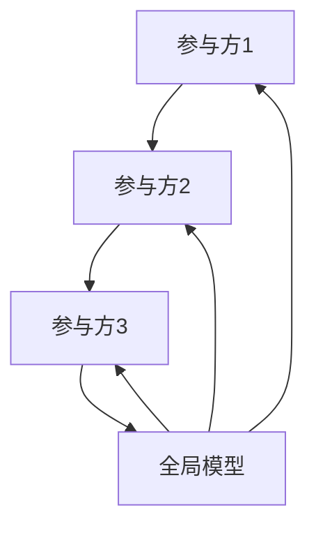

                 


# 《金融领域联邦学习的探索与实践》

## 关键词：联邦学习, 金融应用, 数据隐私, 模型训练, 分布式系统, 安多方计算

## 摘要：  
随着金融行业对数据隐私和安全性的要求越来越高，联邦学习作为一种新兴的人工智能技术，正在成为解决金融领域数据共享难题的重要技术手段。本文将深入探讨联邦学习的核心概念、算法原理、系统架构，并结合实际案例，分析其在金融领域的应用场景和价值。通过本文的阅读，读者可以全面了解联邦学习的技术细节，掌握其在金融领域的实践方法。

---

# 第一部分: 金融领域联邦学习的背景与价值

## 第1章: 联邦学习的起源与概念

### 1.1 联邦学习的起源

#### 1.1.1 联邦学习的定义  
联邦学习（Federated Learning）是一种分布式机器学习技术，旨在在不共享原始数据的前提下，通过多个参与方协作训练模型。其核心思想是“数据不动，模型动”，即模型在各个参与方之间进行训练和同步，而原始数据始终保留在本地。

#### 1.1.2 联邦学习的核心思想  
联邦学习的核心思想是通过局部模型的训练和参数同步，构建一个全局模型，同时保护每个参与方的原始数据隐私。这种去中心化的学习方式能够有效解决数据孤岛问题，同时满足数据隐私保护的需求。

#### 1.1.3 联邦学习与传统数据共享的对比  
与传统的数据共享方式相比，联邦学习具有以下优势：  
1. **数据隐私保护**：数据无需离开本地，隐私泄露风险大幅降低。  
2. **数据可用性**：通过联邦学习，多个数据源可以协作训练模型，充分利用数据价值。  
3. **灵活性**：联邦学习可以根据不同场景的需求，灵活调整模型结构和训练策略。

### 1.2 联邦学习在金融领域的应用价值

#### 1.2.1 金融数据隐私保护的需求  
金融行业涉及大量敏感数据，如客户信息、交易记录等。这些数据的泄露可能导致严重的经济损失和声誉损害。因此，金融行业对数据隐私保护的需求尤为迫切。

#### 1.2.2 联邦学习如何解决金融数据共享的痛点  
联邦学习通过局部模型训练和参数同步的方式，能够在不共享原始数据的前提下，完成模型的联合训练。这种技术可以有效解决金融行业数据孤岛问题，同时满足数据隐私保护的要求。

#### 1.2.3 联邦学习在金融领域的潜在应用场景  
1. **风险评估**：通过联邦学习，金融机构可以联合训练客户信用评估模型，提高风险预测的准确性。  
2. **欺诈 detection**：多个金融机构可以通过联邦学习协作训练反欺诈模型，提高欺诈检测的效率。  
3. **客户画像构建**：通过联邦学习，金融机构可以联合构建客户画像，提供更精准的金融服务。

---

## 第2章: 金融领域的数据共享与隐私保护

### 2.1 金融数据的特点与挑战

#### 2.1.1 金融数据的敏感性  
金融数据通常包含客户的身份信息、交易记录、财务状况等敏感信息，这些数据的泄露可能导致严重的法律和经济问题。

#### 2.1.2 数据孤岛现象的现状  
由于数据隐私和安全性的要求，金融行业的数据往往分散在不同的机构中，形成了数据孤岛。这种现象限制了数据的共享和利用，影响了模型的训练和优化。

#### 2.1.3 数据隐私保护的法律与合规要求  
金融行业受到严格的法律法规约束，如《数据安全法》、《个人信息保护法》等，要求金融机构必须保护客户数据的隐私和安全。

### 2.2 联邦学习如何解决金融数据共享问题

#### 2.2.1 联邦学习的技术优势  
联邦学习通过局部模型训练和参数同步的方式，可以在不共享原始数据的前提下，完成模型的联合训练。这种技术能够有效解决金融行业数据共享的痛点。

#### 2.2.2 联邦学习在金融数据共享中的具体应用  
1. **联合风控模型**：多个金融机构可以通过联邦学习协作训练风险评估模型，提高风控能力。  
2. **客户画像构建**：通过联邦学习，金融机构可以联合构建客户画像，提供更精准的金融服务。  
3. **反欺诈模型优化**：多个金融机构可以通过联邦学习协作训练反欺诈模型，提高欺诈检测的效率。

#### 2.2.3 联邦学习与现有隐私保护技术的对比  
与传统的数据加密、匿名化等隐私保护技术相比，联邦学习具有以下优势：  
1. **数据可用性高**：联邦学习能够在不共享原始数据的前提下，充分利用数据价值。  
2. **模型性能优**：通过联合训练，联邦学习可以构建更准确的模型。  
3. **灵活性强**：联邦学习可以根据具体需求，灵活调整模型结构和训练策略。

---

# 第二部分: 联邦学习的核心概念与技术原理

## 第3章: 联邦学习的核心概念与原理

### 3.1 联邦学习的理论基础

#### 3.1.1 联邦学习的数学模型  
联邦学习的数学模型通常基于分布式优化和同步机制。以下是一个经典的联邦学习模型训练过程：

1. **局部模型初始化**：每个参与方初始化一个本地模型参数 $\theta_i$。  
2. **局部训练**：每个参与方在本地数据上训练模型，更新参数 $\theta_i$。  
3. **参数同步**：通过通信协议，将各个参与方的模型参数同步到一个全局模型中。  
4. **全局模型更新**：基于所有参与方的局部模型参数，更新全局模型参数 $\theta$。  
5. **反馈更新**：将全局模型参数分发给各个参与方，进行下一轮的局部训练。

#### 3.1.2 联邦学习的通信机制  
联邦学习的通信机制通常包括以下步骤：  
1. **初始化**：所有参与方初始化模型参数。  
2. **局部训练**：每个参与方在本地数据上训练模型，更新参数。  
3. **参数聚合**：通过某种聚合策略（如加权平均），将各个参与方的模型参数聚合到全局模型中。  
4. **参数分发**：将全局模型参数分发给各个参与方，进行下一轮的局部训练。

#### 3.1.3 联邦学习的同步与异步模式  
1. **同步模式**：所有参与方在每一轮训练后同步参数，确保模型更新的一致性。  
2. **异步模式**：参与方可以在不同的时间点进行局部训练和参数更新，模型更新可能有一定的延迟。

### 3.2 联邦学习的算法分类

#### 3.2.1 基于模型聚合的联邦学习算法  
1. **FedAvg（联邦平均）**：通过加权平均的方式聚合各个参与方的模型参数。  
2. **FedProx（联邦直推）**：在FedAvg的基础上，引入正则化项，防止模型更新的偏差。

#### 3.2.2 基于安全多方计算的联邦学习算法  
1. **SMC-based联邦学习**：通过安全多方计算技术，在不共享原始数据的前提下，完成模型训练和参数聚合。  
2. **秘密分享机制**：将模型参数分解为多个秘密份额，通过秘密分享技术完成模型更新。

#### 3.2.3 基于区块链的联邦学习算法  
1. **区块链联邦学习**：利用区块链技术确保模型训练的透明性和不可篡改性。  
2. **激励机制**：通过区块链的激励机制，鼓励参与方积极参与模型训练。

---

## 第4章: 联邦学习的安全性与隐私保护

### 4.1 联邦学习中的数据隐私保护

#### 4.1.1 数据加密与匿名化处理  
1. **数据加密**：通过对数据进行加密处理，确保数据在传输和存储过程中的安全性。  
2. **数据匿名化**：通过去标识化等技术，去除数据中的敏感信息，降低隐私泄露风险。

#### 4.1.2 安全多方计算在联邦学习中的应用  
1. **秘密共享**：将数据分解为多个秘密份额，通过秘密共享技术完成数据计算。  
2. **零知识证明**：通过零知识证明技术，验证数据的正确性，而不泄露数据本身。

#### 4.1.3 差分隐私技术在联邦学习中的应用  
1. **差分隐私**：通过在模型参数中添加噪声，保护参与方的原始数据隐私。  
2. **隐私预算**：通过设定隐私预算，控制隐私泄露的风险。

### 4.2 联邦学习中的模型安全

#### 4.2.1 模型隐私泄露的风险  
1. **模型反向工程**：通过攻击模型，提取训练数据的特征，可能导致数据泄露。  
2. **模型窃听攻击**：攻击者通过窃听模型参数，获取参与方的局部模型信息。

#### 4.2.2 模型鲁棒性与对抗攻击  
1. **模型鲁棒性**：通过增强模型的鲁棒性，防止对抗攻击对模型性能的影响。  
2. **对抗训练**：通过引入对抗训练，提高模型的抗攻击能力。

#### 4.2.3 模型安全的防护措施  
1. **模型加密**：通过对模型参数进行加密，保护模型的隐私性。  
2. **模型水印**：通过在模型中嵌入水印，防止模型被恶意使用。

---

# 第三部分: 联邦学习的算法原理与实现

## 第5章: 联邦学习的经典算法解析

### 5.1 联邦平均（FedAvg）算法

#### 5.1.1 算法原理与数学模型  
FedAvg算法的核心思想是通过加权平均的方式，将各个参与方的模型参数聚合到全局模型中。算法流程如下：  

1. **初始化**：所有参与方初始化模型参数 $\theta_i$。  
2. **局部训练**：每个参与方在本地数据上训练模型，更新参数 $\theta_i$。  
3. **参数同步**：通过通信协议，将各个参与方的模型参数同步到一个全局模型中。  
4. **全局模型更新**：基于所有参与方的局部模型参数，更新全局模型参数 $\theta$。  
5. **反馈更新**：将全局模型参数分发给各个参与方，进行下一轮的局部训练。

#### 5.1.2 算法的收敛性分析  
FedAvg算法的收敛性分析通常基于优化理论和分布式计算的特性。以下是一个典型的收敛性证明：  
假设目标函数 $f(\theta) = \frac{1}{n}\sum_{i=1}^n f_i(\theta)$，其中 $f_i(\theta)$ 是第 $i$ 个参与方的局部目标函数。  
通过FedAvg算法，全局模型参数 $\theta$ 的更新方式为：  
$$ \theta_{t+1} = \theta_t + \eta \sum_{i=1}^n w_i (\nabla f_i(\theta_t) - \nabla f_i(\theta_{t-1})) $$  
其中 $\eta$ 是学习率，$w_i$ 是参与方的权重。

#### 5.1.3 算法的优缺点及适用场景  
1. **优点**：  
   - 算法简单，易于实现。  
   - 支持异构数据分布，适用于大规模分布式场景。  
2. **缺点**：  
   - 对数据分布的假设较强，可能影响模型的泛化能力。  
   - 通信开销较大，对网络延迟敏感。  
3. **适用场景**：  
   - 数据分布相对均匀的场景。  
   - 对模型训练速度要求较高的场景。

### 5.2 联邦直推（FedProx）算法

#### 5.2.1 算法原理与数学模型  
FedProx算法在FedAvg的基础上，引入了正则化项，防止模型更新的偏差。算法流程如下：  

1. **初始化**：所有参与方初始化模型参数 $\theta_i$。  
2. **局部训练**：每个参与方在本地数据上训练模型，更新参数 $\theta_i$。  
3. **参数同步**：通过通信协议，将各个参与方的模型参数同步到一个全局模型中。  
4. **全局模型更新**：基于所有参与方的局部模型参数，更新全局模型参数 $\theta$。  
5. **反馈更新**：将全局模型参数分发给各个参与方，进行下一轮的局部训练。

#### 5.2.2 算法与FedAvg的区别与联系  
1. **区别**：  
   - FedProx引入了正则化项，防止模型更新的偏差。  
   - FedProx的优化目标是：  
     $$ \min_{\theta} \sum_{i=1}^n \frac{1}{n} (f_i(\theta) + \lambda \|\theta - \theta_{prev}\|^2) $$  
     其中 $\lambda$ 是正则化系数，$\theta_{prev}$ 是上一轮的全局模型参数。  
2. **联系**：  
   - FedProx与FedAvg的核心思想一致，都是通过局部模型训练和参数同步，完成全局模型的优化。

#### 5.2.3 算法在非独立同分布数据下的表现  
FedProx算法在非独立同分布数据下的表现优于FedAvg，能够更好地适应数据分布的异构性。其主要原因在于FedProx通过正则化项，能够有效缓解数据分布差异对模型训练的影响。

---

## 第6章: 联邦学习的数学模型与公式

### 6.1 联邦学习的通用数学模型

#### 6.1.1 联邦学习的数学模型  
联邦学习的数学模型通常基于分布式优化和同步机制。以下是一个经典的联邦学习模型训练过程：  

1. **局部模型初始化**：每个参与方初始化一个本地模型参数 $\theta_i$。  
2. **局部训练**：每个参与方在本地数据上训练模型，更新参数 $\theta_i$。  
3. **参数同步**：通过通信协议，将各个参与方的模型参数同步到一个全局模型中。  
4. **全局模型更新**：基于所有参与方的局部模型参数，更新全局模型参数 $\theta$。  
5. **反馈更新**：将全局模型参数分发给各个参与方，进行下一轮的局部训练。

#### 6.1.2 联邦学习的数学公式  
1. **局部训练**：  
   $$ \theta_i^{(t+1)} = \theta_i^{(t)} - \eta \nabla f_i(\theta_i^{(t)}) $$  
   其中 $\eta$ 是学习率，$f_i(\theta_i)$ 是第 $i$ 个参与方的局部目标函数。  
2. **参数同步**：  
   $$ \theta^{(t+1)} = \frac{1}{n}\sum_{i=1}^n \theta_i^{(t+1)} $$  
   其中 $n$ 是参与方的数量。  
3. **全局模型更新**：  
   $$ \theta^{(t+1)} = \theta^{(t)} + \alpha (\theta^{(t+1)} - \theta^{(t)}) $$  
   其中 $\alpha$ 是更新系数。

---

# 第四部分: 联邦学习的系统架构与实现

## 第7章: 联邦学习的系统架构与设计

### 7.1 联邦学习的系统架构

#### 7.1.1 系统功能设计  
1. **数据预处理**：对参与方的数据进行清洗、归一化等预处理操作。  
2. **模型训练**：通过联邦学习算法，完成模型的联合训练。  
3. **参数同步**：通过通信协议，同步参与方的模型参数。  
4. **模型评估**：对训练好的模型进行评估，验证模型的性能。

#### 7.1.2 系统架构设计  
以下是一个典型的联邦学习系统架构图：



图中，A、B、C表示参与方，D表示全局模型。参与方通过通信协议与全局模型进行交互，完成模型的训练和评估。

#### 7.1.3 系统接口设计  
1. **参与方接口**：  
   - `train_model()`：在本地数据上训练模型，返回局部模型参数。  
   - `get_parameters()`：获取全局模型参数，进行下一轮的局部训练。  
2. **全局模型接口**：  
   - `aggregate_parameters()`：聚合各个参与方的模型参数，更新全局模型。  
   - `evaluate_model()`：评估全局模型的性能。

### 7.2 联邦学习的通信机制

#### 7.2.1 联邦学习的通信协议  
1. **参数同步协议**：通过HTTPS、gRPC等协议，完成模型参数的传输。  
2. **数据加密协议**：通过SSL/TLS等协议，确保数据传输的安全性。

#### 7.2.2 联邦学习的通信流程  
1. **初始化**：所有参与方初始化模型参数。  
2. **局部训练**：每个参与方在本地数据上训练模型，更新参数。  
3. **参数同步**：通过通信协议，将各个参与方的模型参数同步到全局模型中。  
4. **全局模型更新**：基于所有参与方的局部模型参数，更新全局模型参数。  
5. **反馈更新**：将全局模型参数分发给各个参与方，进行下一轮的局部训练。

---

## 第8章: 联邦学习的项目实战

### 8.1 项目背景与目标

#### 8.1.1 项目背景  
本项目旨在通过联邦学习技术，解决金融行业数据共享的痛点，实现多个金融机构的联合风控模型训练。

#### 8.1.2 项目目标  
1. **模型训练**：通过联邦学习算法，训练一个联合风控模型。  
2. **模型评估**：对训练好的模型进行评估，验证模型的性能。  
3. **系统实现**：实现联邦学习的系统架构，完成模型的训练和评估。

### 8.2 项目实现

#### 8.2.1 环境安装  
1. **安装Python**：建议使用Python 3.6及以上版本。  
2. **安装依赖库**：安装`numpy`、`pandas`、`tensorflow`等依赖库。

#### 8.2.2 系统核心实现

##### 8.2.2.1 参与方类的实现  
```python
class Participant:
    def __init__(self, id, data, model):
        self.id = id
        self.data = data
        self.model = model
        self.parameters = model.get_parameters()
    
    def train(self, global_parameters):
        # 在本地数据上训练模型，更新参数
        self.model.train(self.data, global_parameters)
        self.parameters = self.model.get_parameters()
    
    def get_parameters(self):
        return self.parameters
```

##### 8.2.2.2 全局模型类的实现  
```python
class GlobalModel:
    def __init__(self, participants):
        self.participants = participants
        self.parameters = self._initialize_parameters()
    
    def aggregate_parameters(self):
        # 通过加权平均的方式聚合参数
        total = 0
        for participant in self.participants:
            total += participant.get_parameters()
        average = total / len(self.participants)
        self.parameters = average
    
    def evaluate(self, test_data):
        # 对全局模型进行评估
        accuracy = self.model.evaluate(test_data)
        return accuracy
```

##### 8.2.2.3 联邦学习主程序的实现  
```python
def main():
    # 初始化参与方
    participants = [
        Participant(1, data1, model1),
        Participant(2, data2, model2),
        Participant(3, data3, model3)
    ]
    
    # 初始化全局模型
    global_model = GlobalModel(participants)
    
    # 联邦学习训练过程
    for _ in range(num_epochs):
        global_model.aggregate_parameters()
        for participant in participants:
            participant.train(global_model.parameters)
    
    # 模型评估
    accuracy = global_model.evaluate(test_data)
    print(f"模型准确率：{accuracy}%")
```

#### 8.2.3 项目实战总结  
1. **环境安装**：安装必要的依赖库，确保系统运行环境配置正确。  
2. **系统实现**：通过定义参与方类和全局模型类，完成联邦学习系统的实现。  
3. **模型训练**：通过多轮迭代，完成联合风控模型的训练。  
4. **模型评估**：对训练好的模型进行评估，验证模型的性能。

---

## 第9章: 联邦学习的未来展望与最佳实践

### 9.1 未来展望

#### 9.1.1 联邦学习技术的演进方向  
1. **算法优化**：进一步优化联邦学习算法，提高模型的训练效率和准确性。  
2. **安全性提升**：通过引入更先进的加密技术和差分隐私，进一步增强模型的安全性。  
3. **应用场景扩展**：将联邦学习技术应用到更多的金融场景中，如智能投顾、信用评估等。

#### 9.1.2 联邦学习的挑战与机遇  
1. **挑战**：  
   - 数据隐私保护的复杂性。  
   - 模型训练的通信开销较大。  
   - 联邦学习技术的标准化和规范化。  
2. **机遇**：  
   - 联邦学习技术的广泛应用，推动金融行业的数字化转型。  
   - 联邦学习技术的创新，为金融行业带来新的发展机遇。

### 9.2 最佳实践与小结

#### 9.2.1 最佳实践  
1. **数据预处理**：在模型训练前，对数据进行清洗、归一化等预处理操作，确保数据质量。  
2. **模型选择**：根据具体场景需求，选择合适的联邦学习算法，优化模型的训练效果。  
3. **安全性保障**：通过数据加密、差分隐私等技术，确保模型训练过程中的数据隐私和安全。

#### 9.2.2 小结  
通过本文的探讨，我们可以看到，联邦学习作为一种新兴的人工智能技术，正在为金融行业带来重要的变革。通过联邦学习，金融机构可以在不共享原始数据的前提下，完成模型的联合训练，有效解决数据隐私和安全性的痛点。未来，随着联邦学习技术的不断发展，其在金融领域的应用前景将更加广阔。

---

# 作者：AI天才研究院/AI Genius Institute & 禅与计算机程序设计艺术 /Zen And The Art of Computer Programming

