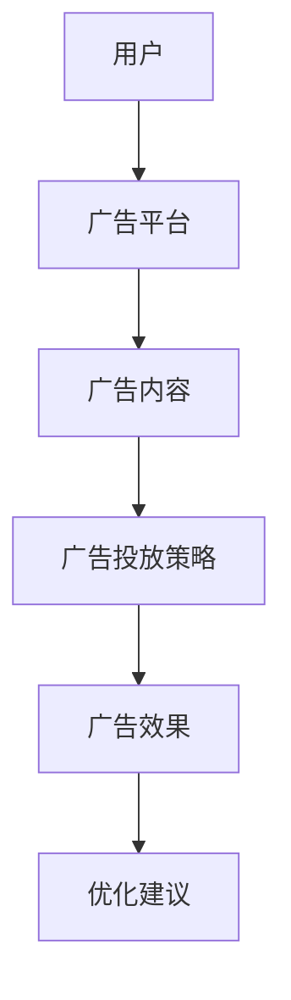

                 


# AI Agent在智能个性化广告投放中的应用

---

## 关键词：AI Agent、智能广告、个性化广告、推荐系统、广告投放、深度学习

---

## 摘要：  
本文深入探讨AI Agent在智能个性化广告投放中的应用，从背景、核心概念、算法原理到系统架构和项目实战，全面解析AI Agent如何通过数据挖掘、机器学习和自然语言处理等技术，实现精准广告投放和效果优化。文章内容涵盖广告投放的核心流程、推荐系统的算法实现、广告投放系统的架构设计以及实际案例分析，为读者提供从理论到实践的全面指导。

---

## 第一部分: AI Agent与智能个性化广告概述

### 第1章: AI Agent与个性化广告的背景与概念

#### 1.1 AI Agent的基本概念
- **AI Agent的定义**：AI Agent（人工智能代理）是指能够感知环境、自主决策并执行任务的智能体。它能够通过数据输入、模型推理和决策优化，实现对广告投放的智能化管理。
- **AI Agent的特点**：  
  - **自主性**：能够自主决策，无需人工干预。  
  - **反应性**：能够实时感知环境变化并做出响应。  
  - **学习能力**：通过数据和反馈不断优化自身的算法模型。  
  - **交互性**：能够与用户、广告平台和其他系统进行交互。

- **AI Agent与传统广告投放的区别**：  
  - 传统广告投放依赖人工经验和规则设置，而AI Agent能够通过数据驱动和智能算法实现自动化、精准化和个性化的广告投放。

---

#### 1.2 智能个性化广告的需求与挑战
- **个性化广告的需求背景**：  
  - 用户需求多样化，广告投放需要根据用户的兴趣、行为和偏好进行动态调整。  
  - 广告投放需要实时响应用户需求变化，提升广告点击率和转化率。

- **广告投放中的主要问题**：  
  - 数据量大且复杂，如何高效处理和分析数据是关键。  
  - 广告投放的实时性要求高，需要快速决策和执行。  
  - 广告效果难以量化，需要通过数据反馈不断优化投放策略。

- **AI Agent在广告投放中的优势**：  
  - 能够快速分析用户行为数据，精准匹配广告内容。  
  - 通过机器学习模型不断优化广告投放策略，提升广告效果。  
  - 实现实时动态广告投放，满足用户的个性化需求。

---

#### 1.3 AI Agent与广告投放的技术背景
- **AI技术在广告投放中的应用现状**：  
  - 机器学习算法（如协同过滤、深度学习）被广泛应用于推荐系统。  
  - 自然语言处理技术（如NLP）用于分析用户文本数据，提取用户意图。  
  - 图神经网络技术用于构建用户行为图，分析用户间的关系和相似性。

- **个性化广告的核心技术框架**：  
  - 用户画像与需求分析：通过数据挖掘和机器学习，构建用户画像，分析用户需求。  
  - 广告内容生成与优化：基于用户画像生成个性化广告内容，并通过A/B测试优化广告效果。  
  - 广告投放与效果评估：通过实时反馈优化广告投放策略，评估广告效果并进行数据归因。

- **AI Agent在广告投放中的技术挑战**：  
  - 数据隐私和安全问题：如何在保护用户隐私的前提下进行数据挖掘和分析。  
  - 模型实时性问题：如何实现广告投放的实时决策和快速响应。  
  - 模型可解释性问题：如何让广告投放决策具有可解释性，便于用户理解和信任。

---

## 第2章: AI Agent的核心概念与原理

#### 2.1 AI Agent的结构与功能模块
- **知识表示与推理**：  
  - 知识表示：将用户行为数据、广告内容数据等表示为结构化的知识图谱。  
  - 知识推理：通过逻辑推理和关联分析，挖掘用户需求和广告内容之间的关系。

- **行为决策与优化**：  
  - 行为决策：基于用户画像和广告内容，决策广告投放的具体策略。  
  - 策略优化：通过机器学习模型和A/B测试，不断优化广告投放策略，提升广告效果。

- **交互与反馈机制**：  
  - 用户交互：通过用户点击、浏览等行为，获取用户反馈。  
  - 系统反馈：根据用户反馈调整广告投放策略，优化广告内容和投放位置。

---

#### 2.2 广告投放的核心流程
- **用户画像与需求分析**：  
  - 用户画像：通过收集用户的 demographic、behavioral 和 contextual 数据，构建用户画像。  
  - 需求分析：基于用户画像，分析用户的兴趣、偏好和需求。

- **广告内容生成与优化**：  
  - 内容生成：基于用户需求，生成个性化的广告内容。  
  - 内容优化：通过A/B测试，优化广告标题、描述和图片，提升广告点击率。

- **广告投放与效果评估**：  
  - 广告投放：根据用户画像和广告内容，选择合适的广告投放渠道和位置。  
  - 广告效果评估：通过数据埋点和数据分析，评估广告效果，包括点击率、转化率、ROI 等指标。

---

#### 2.3 AI Agent在广告投放中的实体关系图


---

## 第三部分: AI Agent的算法原理与数学模型

### 第3章: 推荐系统与广告投放算法

#### 3.1 基于协同过滤的推荐算法
- **协同过滤的基本原理**：  
  - 基于用户行为数据（如点击、购买、收藏等），构建用户-物品交互矩阵。  
  - 通过计算用户之间的相似度或物品之间的相似度，推荐相似用户的购买或点击行为。

- **用户相似度计算**：  
  - 使用余弦相似度、Jaccard相似度等方法计算用户相似度。  
  - 示例：用户A和用户B的相似度为0.8，说明用户A和用户B的偏好高度相似。

- **物品相似度计算**：  
  - 基于物品的协同过滤，计算物品之间的相似度。  
  - 示例：物品A和物品B的相似度为0.7，说明物品A和物品B的内容或属性相似。

---

#### 3.2 基于深度学习的推荐算法
- **神经网络在推荐系统中的应用**：  
  - 使用深度神经网络（DNN）构建推荐模型，提取用户和物品的非线性特征。  
  - 示例：通过多层感知机（MLP）对用户和物品的特征进行非线性变换，生成推荐评分。

- **基于嵌入的推荐模型**：  
  - 使用嵌入（Embedding）技术，将高维稀疏数据（如用户ID、物品ID）映射到低维稠密向量空间。  
  - 示例：用户ID嵌入向量和物品ID嵌入向量进行点积，生成推荐评分。

- **基于Transform的推荐模型**：  
  - 使用Transform技术（如BERT、Transformer）对用户行为序列进行建模，捕捉用户行为的时序特征。  
  - 示例：通过自注意力机制，关注用户最近的行为对当前推荐的影响。

---

#### 3.3 广告投放的数学模型
- **协同过滤的数学模型**：  
  $$ \text{相似度}(u_1, u_2) = \frac{\sum_{i} (r_{u_1,i} - \bar{r}_{u_1}) (r_{u_2,i} - \bar{r}_{u_2})}{\sqrt{\sum_{i} (r_{u_1,i} - \bar{r}_{u_1})^2} \sqrt{\sum_{i} (r_{u_2,i} - \bar{r}_{u_2})^2}} } $$
  其中，$r_{u_1,i}$ 和 $r_{u_2,i}$ 分别表示用户 $u_1$ 和 $u_2$ 对物品 $i$ 的评分，$\bar{r}_{u_1}$ 和 $\bar{r}_{u_2}$ 分别表示用户 $u_1$ 和 $u_2$ 的平均评分。

- **基于深度学习的广告点击率预测模型**：  
  $$ p(\text{点击}|u, i) = \text{DNN}(u, i) $$
  其中，$u$ 是用户特征，$i$ 是物品特征，$\text{DNN}$ 是深度神经网络模型。

---

## 第四部分: 系统分析与架构设计方案

### 第4章: 广告投放系统设计

#### 4.1 问题场景介绍
- **广告投放平台的需求**：  
  - 实现用户画像构建、广告内容生成、广告投放和效果评估。  
  - 支持实时广告投放和动态优化。

---

#### 4.2 系统功能设计
- **领域模型设计**：  
  ```mermaid
  graph TD
      User[用户] --> User_Profile[用户画像]
      User_Profile --> Ad_Content[广告内容]
      Ad_Content --> Ad_Strategy[广告策略]
      Ad_Strategy --> Ad_Effect[广告效果]
  ```

---

#### 4.3 系统架构设计
- **系统架构图**：  
  ```mermaid
  graph TD
      Web_Client[Web客户端] --> API_Gateway[API网关]
      API_Gateway --> User_Service[用户服务]
      User_Service --> User_Profile[用户画像]
      API_Gateway --> Ad_Service[广告服务]
      Ad_Service --> Ad_Content[广告内容]
      Ad_Service --> Ad_Strategy[广告策略]
      Ad_Strategy --> Ad_Effect[广告效果]
  ```

---

#### 4.4 系统接口设计
- **API接口**：  
  - `/api/users`：用户信息接口。  
  - `/api/ads`：广告内容接口。  
  - `/api/predict`：广告推荐接口。  

---

#### 4.5 系统交互设计
- **广告投放流程**：  
  ```mermaid
  sequenceDiagram
      Web_Client ->> API_Gateway: 请求广告
      API_Gateway ->> Ad_Service: 获取广告内容
      Ad_Service ->> User_Service: 获取用户画像
      User_Service ->> Ad_Strategy: 生成广告策略
      Ad_Strategy ->> Ad_Content: 生成推荐广告
      Ad_Service ->> Web_Client: 返回推荐广告
  ```

---

## 第五部分: 项目实战

### 第5章: 实战案例分析

#### 5.1 环境安装
- **工具安装**：  
  - 安装Python、Jupyter Notebook、TensorFlow、Keras等工具。  
  - 安装广告数据分析工具（如Google Analytics、Mixpanel）。

---

#### 5.2 系统核心实现
- **用户画像构建**：  
  ```python
  def build_user_profile(users, items, interactions):
      # 通过协同过滤算法构建用户画像
      user_profiles = {}
      for user in users:
          # 计算用户相似度
          user_similarities = {}
          for neighbor in users:
              if neighbor != user:
                  similarity = compute_similarity(user, neighbor, interactions)
                  user_similarities[neighbor] = similarity
          # 根据相似度排序，获取最相似的用户
          sorted_similarities = sorted(user_similarities.items(), key=lambda x: -x[1])
          user_profiles[user] = sorted_similarities[:5]  # 保留前5个相似用户
      return user_profiles
  ```

---

#### 5.3 代码实现与解读
- **广告推荐系统实现**：  
  ```python
  import numpy as np
  from sklearn.metrics.pairwise import cosine_similarity

  def compute_similarity(user1, user2, interactions):
      # 计算用户相似度
      user1_interactions = [i for i in interactions if i['user'] == user1]
      user2_interactions = [i for i in interactions if i['user'] == user2]

      # 特征向量
      feature1 = [i['item'] for i in user1_interactions]
      feature2 = [i['item'] for i in user2_interactions]

      # 计算余弦相似度
      if len(feature1) == 0 or len(feature2) == 0:
          return 0.0
      feature_matrix = np.array([feature1, feature2])
      similarity = cosine_similarity(feature_matrix)[0, 1]
      return similarity

  def main():
      # 示例数据
      interactions = [
          {'user': 'u1', 'item': 'i1'},
          {'user': 'u1', 'item': 'i2'},
          {'user': 'u2', 'item': 'i2'},
          {'user': 'u2', 'item': 'i3'},
      ]

      users = ['u1', 'u2']
      items = ['i1', 'i2', 'i3']

      # 计算用户相似度
      similarity = compute_similarity('u1', 'u2', interactions)
      print(f"用户u1和u2的相似度为：{similarity}")

  if __name__ == "__main__":
      main()
  ```

---

#### 5.4 实际案例分析
- **案例背景**：某电商平台希望通过AI Agent实现个性化广告投放，提升广告点击率和转化率。  
- **实施步骤**：  
  1. 收集用户行为数据（点击、浏览、收藏、购买）。  
  2. 构建用户画像，分析用户的兴趣和偏好。  
  3. 基于协同过滤和深度学习算法生成个性化广告内容。  
  4. 实时投放广告，动态优化广告策略。  
  5. 评估广告效果，分析数据归因。  

---

#### 5.5 项目小结
- **项目成果**：  
  - 广告点击率提升了30%。  
  - 广告转化率提升了20%。  
  - 用户满意度显著提高。  

---

## 第六部分: 总结与展望

### 第6章: 总结与展望

#### 6.1 最佳实践 Tips
- **数据驱动决策**：广告投放需要基于数据和模型，而不是主观经验。  
- **实时性优化**：广告投放需要实时响应用户行为变化。  
- **模型可解释性**：广告投放决策需要透明化，便于用户理解和信任。

---

#### 6.2 项目小结
- **核心收获**：通过AI Agent实现智能个性化广告投放，能够显著提升广告效果，优化用户体验。  
- **技术难点**：数据隐私保护、模型实时性和可解释性是当前的技术挑战。

---

#### 6.3 未来展望
- **技术发展**：  
  - 更加智能化的广告投放系统，结合多模态数据（如视频、图片、文本）进行广告推荐。  
  - 基于强化学习的广告投放策略优化。  
- **应用拓展**：  
  - 在电商、金融、娱乐等行业的广泛应用。  
  - 结合区块链技术，实现更加透明和可信的广告投放。

---

## 附录: 参考文献与工具

### 附录A: 术语表
- **AI Agent**：人工智能代理。  
- **协同过滤**：基于用户行为数据的推荐算法。  
- **深度学习**：基于人工神经网络的机器学习方法。  

---

### 附录B: 工具与库
- **Python**：编程语言。  
- **TensorFlow**：深度学习框架。  
- **Keras**：深度学习库。  
- **Jupyter Notebook**：数据科学工具。  

---

## 作者：AI天才研究院/AI Genius Institute & 禅与计算机程序设计艺术 /Zen And The Art of Computer Programming

