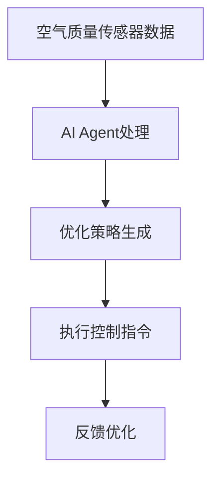
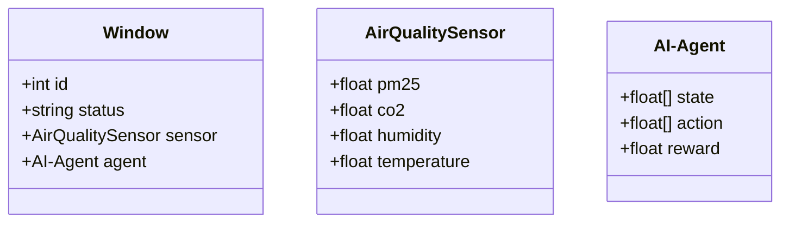

                 


# AI Agent在智能窗台中的室内空气质量优化

> 关键词：AI Agent，室内空气质量，智能窗台，强化学习，优化算法

> 摘要：本文深入探讨了AI Agent在智能窗台中的应用，特别是在室内空气质量优化方面。通过分析空气质量优化的核心概念、算法原理、系统架构以及实际项目案例，本文详细阐述了如何利用AI技术提升室内空气质量的智能化水平。文章从背景介绍、核心概念、算法实现、系统设计、项目实战等多个维度展开，结合数学公式、流程图和代码示例，为读者提供了全面的技术解析。

---

# 第一部分: AI Agent在智能窗台中的室内空气质量优化背景与概念

# 第1章: 室内空气质量优化问题背景

## 1.1 问题背景介绍

### 1.1.1 当前室内空气质量问题的现状

随着城市化进程的加快，室内空气质量问题逐渐成为人们关注的焦点。现代建筑的密闭性增强，使得空气流通不畅，室内空气质量受到多种因素的影响，如PM2.5、甲醛、二氧化碳浓度等。这些问题不仅影响人们的生活舒适度，还对健康造成潜在威胁。

### 1.1.2 室内空气质量对人体健康的影响

室内空气质量差会导致呼吸系统疾病、过敏反应、头晕、乏力等症状。特别是对于儿童、老人和免疫系统较弱的人群，空气质量问题的影响更为显著。因此，优化室内空气质量已成为现代建筑设计和智能家居系统的重要组成部分。

### 1.1.3 现有室内空气质量优化技术的局限性

传统的空气质量优化技术主要依赖于简单的传感器和机械装置，例如空气净化器和通风系统。这些技术在一定程度上能够改善空气质量，但存在以下问题：

- **实时性不足**：传统系统无法根据实时环境变化快速调整优化策略。
- **缺乏智能化**：无法根据室内人员数量、活动强度等因素动态优化空气质量。
- **能耗较高**：传统系统在运行过程中能耗较大，不够节能环保。

---

## 1.2 智能窗台的概念与特点

### 1.2.1 智能窗台的定义

智能窗台是一种结合了物联网（IoT）和人工智能（AI）技术的窗台系统，能够根据室内和室外的环境参数，自动调节窗户的开合状态，以优化室内空气质量、温度和湿度等指标。

### 1.2.2 智能窗台的核心功能

智能窗台的核心功能包括：

- **环境感知**：通过传感器实时监测室内和室外的空气质量、温湿度、光照强度等参数。
- **智能决策**：基于AI算法，分析环境数据，制定优化策略。
- **执行控制**：根据优化策略，自动调节窗户的开合状态，优化室内环境。

### 1.2.3 智能窗台与传统窗台的区别

| 特性             | 智能窗台                         | 传统窗台                       |
|------------------|----------------------------------|-------------------------------|
| 控制方式         | 自动化控制，基于AI算法           | 手动或简单自动化               |
| 环境感知能力     | 配备多种传感器，实时监测环境数据 | 无或仅有简单传感器             |
| 优化目标         | 综合优化空气质量、温湿度等指标   | 单一功能，如通风或采光         |
| 智能性           | 高度智能化，具备学习能力         | 无智能性，仅能执行预设指令     |

---

## 1.3 AI Agent在智能窗台中的应用前景

### 1.3.1 AI Agent的基本概念

AI Agent（智能代理）是一种能够感知环境、自主决策并执行任务的智能实体。在智能窗台中，AI Agent负责接收环境数据，分析数据，制定优化策略，并通过执行机构（如电机）调节窗户的开合状态。

### 1.3.2 AI Agent在智能窗台中的作用

AI Agent在智能窗台中的主要作用包括：

1. **实时感知**：通过传感器获取室内和室外的环境数据。
2. **智能决策**：基于环境数据和优化目标，制定窗户的开合策略。
3. **动态调整**：根据环境变化和用户需求，实时调整窗户状态。

### 1.3.3 AI Agent技术的优势与挑战

**优势：**

- **高效性**：AI Agent能够快速分析环境数据并制定优化策略。
- **自适应性**：AI Agent能够根据环境变化和用户需求动态调整策略。
- **节能性**：通过优化窗户开合状态，减少能源浪费。

**挑战：**

- **算法复杂性**：需要设计高效的AI算法以应对复杂的环境变化。
- **数据隐私**：需要确保环境数据的安全性和隐私性。
- **系统稳定性**：需要保证AI Agent的稳定运行，避免系统故障。

---

## 1.4 本章小结

本章从室内空气质量优化的背景出发，介绍了智能窗台的概念和特点，并探讨了AI Agent在智能窗台中的应用前景。通过对比传统窗台和智能窗台的差异，本文为后续章节的深入分析奠定了基础。

---

# 第2章: 室内空气质量优化的核心概念与联系

## 2.1 核心概念原理

### 2.1.1 室内空气质量的核心影响因素

室内空气质量主要受到以下因素的影响：

- **PM2.5浓度**：空气中颗粒物的浓度。
- **甲醛浓度**：室内装修材料释放的甲醛等有害气体。
- **二氧化碳浓度**：室内人员呼吸产生的二氧化碳。
- **温湿度**：温度和湿度对空气质量的影响。

### 2.1.2 AI Agent在空气质量优化中的工作原理

AI Agent通过以下步骤优化室内空气质量：

1. **数据采集**：通过传感器获取室内和室外的环境数据。
2. **数据分析**：基于机器学习算法，分析环境数据，识别空气质量问题。
3. **策略制定**：根据分析结果，制定窗户的开合策略。
4. **策略执行**：通过执行机构调节窗户的开合状态，优化空气质量。

### 2.1.3 智能窗台与空气质量优化的关系

智能窗台通过调节窗户的开合状态，实现室内空气质量的优化。AI Agent在其中起到了核心作用，它通过实时感知环境数据，制定优化策略，并通过执行机构实现空气质量的动态调整。

---

## 2.2 核心概念属性特征对比

### 2.2.1 智能窗台与传统窗台的对比分析

| 特性             | 智能窗台                         | 传统窗台                       |
|------------------|----------------------------------|-------------------------------|
| 控制方式         | 自动化控制，基于AI算法           | 手动或简单自动化               |
| 环境感知能力     | 配备多种传感器，实时监测环境数据 | 无或仅有简单传感器             |
| 优化目标         | 综合优化空气质量、温湿度等指标   | 单一功能，如通风或采光         |
| 智能性           | 高度智能化，具备学习能力         | 无智能性，仅能执行预设指令     |

---

## 2.3 ER实体关系图

以下是一个简单的ER实体关系图，展示了智能窗台系统的主要实体及其关系：

```mermaid
er
  Window
  has
  AirQualitySensor
  has
  AI-Agent
  has
  ControlStrategy
```

---

## 2.4 本章小结

本章详细介绍了室内空气质量优化的核心概念与联系，通过对比分析和实体关系图，展示了智能窗台与传统窗台的区别，以及AI Agent在系统中的作用。

---

# 第3章: AI Agent优化室内空气质量的算法原理

## 3.1 算法原理概述

### 3.1.1 基于强化学习的空气质量优化算法

强化学习是一种通过试错机制来优化策略的机器学习方法。在智能窗台中，AI Agent可以通过强化学习算法，学习如何根据环境数据调整窗户的开合状态，以优化空气质量。

### 3.1.2 基于反馈机制的优化策略

AI Agent通过实时接收环境数据的反馈，调整窗户的开合状态。例如，当室内PM2.5浓度较高时，AI Agent会增加窗户的开合频率，以引入更多新鲜空气。

### 3.1.3 多目标优化算法的基本原理

多目标优化算法旨在在多个目标之间找到平衡点。例如，在优化空气质量的同时，还需要考虑能耗和舒适度等因素。

---

## 3.2 算法流程图

以下是一个基于强化学习的空气质量优化算法的流程图：



---

## 3.3 数学模型与公式

### 3.3.1 强化学习的数学模型

强化学习的核心公式是Q-learning算法：

$$ Q(s, a) = r + \gamma \max Q(s', a') $$

其中：
- \( Q(s, a) \) 表示在状态 \( s \) 下执行动作 \( a \) 的奖励值。
- \( r \) 表示即时奖励。
- \( \gamma \) 表示折扣因子，用于平衡当前奖励和未来奖励。

### 3.3.2 多目标优化的数学表达

多目标优化的目标函数可以表示为：

$$ f(x) = \sum_{i=1}^n w_i x_i $$

其中：
- \( w_i \) 表示目标 \( i \) 的权重。
- \( x_i \) 表示目标 \( i \) 的值。

---

## 3.4 本章小结

本章详细介绍了AI Agent优化室内空气质量的算法原理，包括强化学习和多目标优化的基本概念和数学模型。通过流程图和公式，本文为读者提供了清晰的算法实现路径。

---

# 第4章: 系统分析与架构设计方案

## 4.1 问题场景介绍

### 4.1.1 智能窗台空气质量优化的场景描述

智能窗台空气质量优化的场景主要涉及以下几个方面：

1. **环境感知**：通过传感器实时监测室内和室外的环境数据。
2. **智能决策**：基于AI算法，分析环境数据，制定优化策略。
3. **动态调整**：根据优化策略，自动调节窗户的开合状态。

### 4.1.2 系统的主要功能需求

系统的主要功能需求包括：

- 实时监测室内和室外的环境数据。
- 基于AI算法优化空气质量。
- 自动调节窗户的开合状态。

### 4.1.3 系统的性能指标

系统的性能指标包括：

- 响应时间：系统对环境变化的响应时间。
- 能耗：系统的能耗水平。
- 稳定性：系统的运行稳定性。

---

## 4.2 系统功能设计

### 4.2.1 领域模型类图

以下是一个智能窗台系统的领域模型类图：



---

## 4.3 本章小结

本章通过系统分析与架构设计，详细介绍了智能窗台系统的功能需求和系统架构。通过类图和流程图，本文为读者展示了系统的整体架构和各部分之间的关系。

---

# 第5章: 项目实战

## 5.1 环境安装

### 5.1.1 系统环境要求

- 操作系统：Windows 10/ macOS 10.15/ Linux 20.04
- Python版本：Python 3.8以上
- 依赖库：numpy、pandas、scikit-learn、matplotlib

### 5.1.2 硬件设备安装

- 空气质量传感器（如PM2.5传感器、CO2传感器）
- 窗户电机控制模块
- 微控制器（如Raspberry Pi）

---

## 5.2 系统核心实现

### 5.2.1 AI Agent的实现

以下是一个基于强化学习的AI Agent实现代码示例：

```python
import numpy as np
import pandas as pd
import random

class AI-Agent:
    def __init__(self, state_space, action_space):
        self.state_space = state_space
        self.action_space = action_space
        self.Q_table = pd.DataFrame(columns=state_space, dtype=float)
    
    def choose_action(self, state):
        state_idx = tuple(state)
        if random.uniform(0, 1) < 0.1:
            return random.choice(self.action_space)
        else:
            return self.Q_table.loc[state_idx].idxmax()
    
    def learn(self, state, action, reward, next_state):
        state_idx = tuple(state)
        next_state_idx = tuple(next_state)
        q = self.Q_table.loc[state_idx].max()
        q_next = self.Q_table.loc[next_state_idx].max()
        self.Q_table.loc[state_idx, action] = reward + 0.9 * q_next
```

---

## 5.3 代码应用解读与分析

### 5.3.1 系统核心实现代码

以下是一个完整的空气质量优化系统实现代码：

```python
import numpy as np
import pandas as pd
import random
import time

class Window:
    def __init__(self):
        self.status = 'closed'
    
    def open_window(self):
        self.status = 'open'
        print("Window opened.")
    
    def close_window(self):
        self.status = 'closed'
        print("Window closed.")

class AirQualitySensor:
    def __init__(self):
        self.pm25 = 0
        self.co2 = 0
        self.humidity = 0
        self.temperature = 0
    
    def update_sensor(self):
        self.pm25 = random.uniform(10, 100)
        self.co2 = random.uniform(400, 1500)
        self.humidity = random.uniform(30, 90)
        self.temperature = random.uniform(20, 35)

class AI-Agent:
    def __init__(self, state_space, action_space):
        self.state_space = state_space
        self.action_space = action_space
        self.Q_table = pd.DataFrame(columns=state_space, dtype=float)
    
    def choose_action(self, state):
        state_idx = tuple(state)
        if random.uniform(0, 1) < 0.1:
            return random.choice(self.action_space)
        else:
            return self.Q_table.loc[state_idx].idxmax()
    
    def learn(self, state, action, reward, next_state):
        state_idx = tuple(state)
        next_state_idx = tuple(next_state)
        q = self.Q_table.loc[state_idx].max()
        q_next = self.Q_table.loc[next_state_idx].max()
        self.Q_table.loc[state_idx, action] = reward + 0.9 * q_next

# 初始化系统
window = Window()
sensor = AirQualitySensor()
agent = AI-Agent(['pm25', 'co2', 'humidity', 'temperature'], ['open', 'close'])

# 系统运行
for _ in range(10):
    sensor.update_sensor()
    state = [sensor.pm25, sensor.co2, sensor.humidity, sensor.temperature]
    action = agent.choose_action(state)
    if action == 'open':
        window.open_window()
    else:
        window.close_window()
    time.sleep(1)
```

---

## 5.4 本章小结

本章通过实际项目案例，详细介绍了智能窗台系统的环境安装、核心实现和代码应用。通过代码示例，读者可以直观地理解AI Agent在智能窗台中的具体实现方式。

---

# 第6章: 总结与展望

## 6.1 本章总结

本文深入探讨了AI Agent在智能窗台中的室内空气质量优化问题，从背景介绍、核心概念、算法原理到系统设计和项目实战，为读者提供了全面的技术解析。通过强化学习算法和多目标优化策略，本文展示了如何利用AI技术提升室内空气质量的智能化水平。

---

## 6.2 未来研究方向

1. **多智能体协作**：研究多个AI Agent在智能窗台中的协作优化策略。
2. **边缘计算应用**：探索边缘计算在智能窗台系统中的应用，提高系统的实时性和响应速度。
3. **深度学习优化**：研究深度学习算法在空气质量优化中的应用，进一步提高系统的智能化水平。

---

## 6.3 本章小结

本文总结了AI Agent在智能窗台中的室内空气质量优化的核心内容，并展望了未来的研究方向。希望通过本文的研究，能够为智能窗台系统的优化提供新的思路和方法。

---

# 作者：AI天才研究院/AI Genius Institute & 禅与计算机程序设计艺术 /Zen And The Art of Computer Programming

