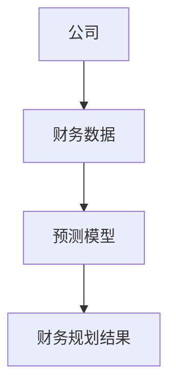
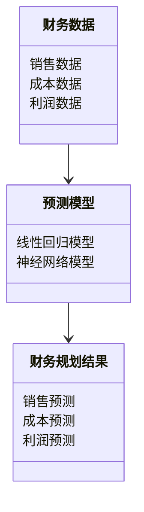
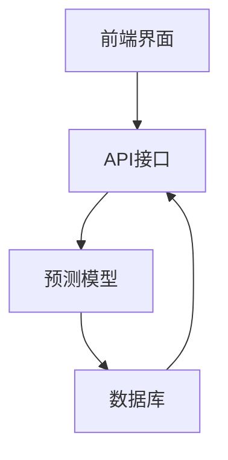

                 


# AI驱动的公司财务规划工具

> 关键词：人工智能，财务规划，机器学习，数据驱动，财务预测，自动化工具

> 摘要：本文详细探讨了AI驱动的公司财务规划工具的设计与实现，从背景介绍、核心概念到系统架构、项目实战，最后结合案例分析与最佳实践，为读者提供了全面的指导。文章结合理论与实践，帮助读者理解如何利用AI技术优化财务规划过程，提升企业的决策效率和准确性。

---

## 第一部分：背景介绍

### 第1章：AI驱动财务规划的背景与重要性

#### 1.1 问题背景

随着企业规模的不断扩大和市场环境的日益复杂，传统的财务规划方法逐渐显现出诸多局限性。以下将详细分析这些问题及其带来的挑战。

##### 1.1.1 传统财务规划的局限性

- **数据处理能力有限**：传统方法通常依赖于少量的历史数据和简单的人工分析，难以处理海量数据。
- **预测精度不足**：由于缺乏深度的数据分析和预测模型，传统财务规划的准确性较低，难以应对复杂的市场变化。
- **效率低下**：手工操作和繁琐的计算过程导致效率低下，难以满足现代企业对快速决策的需求。

##### 1.1.2 数据爆炸与复杂性增加

- **数据量激增**：企业每天产生的财务数据呈指数级增长，包括销售数据、成本记录、市场分析等。
- **数据来源多样化**：数据不仅来自内部系统，还包括外部市场数据、行业趋势等，数据来源多样化增加了处理的复杂性。
- **数据关联性增强**：财务数据之间的关联性增强，需要更复杂的分析方法来挖掘潜在的关系。

##### 1.1.3 企业对精准预测的需求

- **精准预测的重要性**：企业需要更精准的财务预测来优化资源配置、制定战略计划。
- **实时性要求**：现代企业要求财务规划能够实时更新，以应对市场变化。
- **个性化需求**：不同企业有不同的业务模式和财务需求，需要个性化的财务规划解决方案。

#### 1.2 问题描述

##### 1.2.1 财务预测的复杂性

- **多变量影响**：财务预测涉及多个变量，如市场变化、政策调整、内部成本等。
- **非线性关系**：许多财务指标之间的关系是非线性的，传统线性模型难以准确捕捉。

##### 1.2.2 数据依赖性与实时性

- **数据依赖性**：财务预测高度依赖于数据的质量和完整性，数据缺失或错误会导致预测结果不可靠。
- **实时性要求**：企业需要实时更新的财务预测，以快速应对市场变化。

##### 1.2.3 传统方法的低效性

- **人工计算的低效性**：传统财务规划依赖于大量的人工计算和数据录入，效率低下且容易出错。
- **缺乏深度分析**：传统方法通常只进行浅层分析，难以挖掘数据的潜在价值。

#### 1.3 问题解决

##### 1.3.1 AI技术的优势

- **强大的数据处理能力**：AI技术能够处理海量数据，并从中提取有价值的信息。
- **高精度预测**：通过机器学习算法，AI可以实现高精度的财务预测。
- **自动化与智能化**：AI技术能够自动化处理数据和预测，提高效率和准确性。

##### 1.3.2 数据驱动的精准预测

- **数据驱动的决策**：基于大量数据的分析，AI驱动的财务规划能够提供更精准的预测。
- **实时更新**：AI系统可以实时更新数据，提供最新的财务预测。

##### 1.3.3 提高效率与准确性

- **自动化处理**：AI技术可以自动化处理数据，减少人工干预，提高效率。
- **高准确性**：通过复杂的算法，AI可以提供更准确的预测结果。

#### 1.4 边界与外延

##### 1.4.1 AI驱动工具的应用范围

- **范围界定**：AI驱动的财务规划工具主要用于预测和优化财务计划，不涉及企业的日常财务交易处理。
- **相关概念的区分**：需要区分财务规划、财务预测和财务分析等概念。

##### 1.4.2 相关概念的区分

- **财务规划**：制定财务目标和计划的过程。
- **财务预测**：基于历史数据预测未来的财务状况。
- **财务分析**：对财务数据进行分析，以支持决策。

##### 1.4.3 应用场景的边界

- **适用场景**：适用于需要精准预测和优化财务计划的企业。
- **不适用场景**：不适用于数据不足或数据质量低的企业。

#### 1.5 核心要素组成

##### 1.5.1 数据源

- **内部数据**：包括销售数据、成本记录、利润表等。
- **外部数据**：包括市场数据、行业趋势、经济指标等。

##### 1.5.2 AI算法

- **算法选择**：根据具体需求选择合适的算法，如线性回归、神经网络等。
- **模型训练**：通过大量数据训练模型，提高预测准确性。

##### 1.5.3 用户界面

- **直观界面**：用户友好的界面设计，方便用户操作。
- **可视化结果**：通过图表等方式展示预测结果，便于用户理解和分析。

---

## 第二部分：核心概念与技术原理

### 第2章：AI驱动财务规划的核心概念

#### 2.1 核心概念原理

##### 2.1.1 数据处理与特征提取

- **数据清洗**：处理缺失值、异常值等，确保数据质量。
- **特征提取**：从原始数据中提取有用的特征，如销售额增长率、成本变化率等。

##### 2.1.2 模型训练与优化

- **算法选择**：根据数据类型和预测目标选择合适的算法。
- **模型训练**：使用训练数据训练模型，调整参数以提高预测准确性。
- **模型优化**：通过交叉验证等方法优化模型，防止过拟合。

##### 2.1.3 结果解释与反馈

- **结果解释**：将模型预测结果转化为易于理解的形式，如财务报表。
- **反馈机制**：根据实际结果调整模型参数，持续优化预测准确性。

#### 2.2 核心概念对比表格

| **传统财务规划** | **AI驱动财务规划** |
|------------------|--------------------|
| 数据处理能力有限 | 强大的数据处理能力 |
| 预测精度低        | 高精度预测          |
| 效率低下          | 高效率自动化处理    |

#### 2.3 ER实体关系图



### 第3章：AI算法原理与实现

#### 3.1 算法原理

##### 3.1.1 线性回归算法

线性回归是一种简单的预测模型，适用于线性关系的场景。其数学模型如下：

$$ y = \beta_0 + \beta_1x + \epsilon $$

其中，$y$ 是预测目标，$x$ 是自变量，$\beta_0$ 和 $\beta_1$ 是回归系数，$\epsilon$ 是误差项。

##### 3.1.2 神经网络算法

神经网络是一种复杂的预测模型，适用于非线性关系的场景。其结构通常包括输入层、隐藏层和输出层。神经网络的训练过程涉及反向传播算法，用于调整权重以最小化预测误差。

#### 3.2 算法实现

##### 3.2.1 线性回归实现

以下是一个简单的线性回归Python代码示例：

```python
import numpy as np
from sklearn.linear_model import LinearRegression

# 示例数据
X = np.array([[1], [2], [3], [4], [5]])
y = np.array([2, 4, 5, 4, 6])

# 训练模型
model = LinearRegression()
model.fit(X, y)

# 预测
预测值 = model.predict(X)
print(预测值)
```

##### 3.2.2 神经网络实现

以下是一个简单的神经网络Python代码示例：

```python
import numpy as np
import keras

# 示例数据
X = np.random.randn(100, 1)
y = np.random.randn(100, 1)

# 定义模型
model = keras.Sequential()
model.add(keras.layers.Dense(1, input_dim=1))
model.compile(loss='mean_squared_error', optimizer='adam')

# 训练模型
model.fit(X, y, epochs=100, batch_size=10)

# 预测
预测值 = model.predict(X)
print(预测值)
```

#### 3.3 数学模型与公式

##### 3.3.1 线性回归的损失函数

线性回归的损失函数通常使用均方误差（MSE）：

$$ L = \frac{1}{2n}\sum_{i=1}^{n}(y_i - \hat{y_i})^2 $$

其中，$n$ 是样本数量，$y_i$ 是真实值，$\hat{y_i}$ 是预测值。

##### 3.3.2 神经网络的损失函数

神经网络通常使用交叉熵损失函数：

$$ L = -\frac{1}{n}\sum_{i=1}^{n} [y_i \log(\hat{y_i}) + (1 - y_i)\log(1 - \hat{y_i})] $$

其中，$y_i$ 是真实标签，$\hat{y_i}$ 是预测概率。

---

## 第三部分：系统分析与架构设计方案

### 第4章：系统分析与架构设计

#### 4.1 项目介绍

本项目旨在开发一个基于AI的财务规划工具，帮助公司优化财务预测和计划。系统将利用机器学习算法处理财务数据，提供高精度的财务预测，并生成优化的财务计划。

#### 4.2 系统功能设计

##### 4.2.1 领域模型



##### 4.2.2 系统架构设计



##### 4.2.3 系统接口设计

- **输入接口**：接收财务数据和用户请求。
- **输出接口**：返回财务预测结果和优化建议。

##### 4.2.4 系统交互设计

```mermaid
sequenceDiagram
    用户 -->+ 输入财务数据
    API接口 -->+ 调用预测模型
    预测模型 -->+ 返回预测结果
    用户 <-- 返回优化建议
```

#### 4.3 系统实现

##### 4.3.1 环境安装

- **Python 3.8以上**
- **安装必要的库**：如numpy、pandas、scikit-learn、keras等。

##### 4.3.2 核心实现代码

```python
import numpy as np
from sklearn.linear_model import LinearRegression
from keras.models import Sequential
from keras.layers import Dense

# 数据准备
X = np.array([[1], [2], [3], [4], [5]])
y = np.array([2, 4, 5, 4, 6])

# 线性回归模型
model_lr = LinearRegression()
model_lr.fit(X, y)

# 神经网络模型
model_nn = Sequential()
model_nn.add(Dense(1, input_dim=1, activation='sigmoid'))
model_nn.compile(loss='mean_squared_error', optimizer='adam')
model_nn.fit(X, y, epochs=100, batch_size=1)

# 预测
预测值_lr = model_lr.predict(X)
预测值_nn = model_nn.predict(X)
```

##### 4.3.3 代码应用解读

- **线性回归模型**：用于处理线性关系的数据，如销售额与广告投入的关系。
- **神经网络模型**：用于处理非线性关系的数据，如市场波动对利润的影响。

#### 4.4 案例分析

##### 4.4.1 案例背景

某公司希望预测下一季度的销售额，基于过去几年的销售数据和市场趋势。

##### 4.4.2 数据准备

- **销售数据**：过去五年的季度销售额。
- **市场数据**：同期的市场指数。

##### 4.4.3 模型训练

- **数据清洗**：处理缺失值和异常值。
- **特征提取**：提取销售增长率、市场指数增长率等特征。
- **模型选择**：选择神经网络模型进行预测。

##### 4.4.4 模型评估

- **评估指标**：均方误差（MSE）、R平方值等。
- **结果分析**：预测值与实际值的对比，评估模型的准确性。

#### 4.5 项目小结

通过本项目的实施，企业可以显著提高财务预测的准确性和效率，优化资源配置，提升决策能力。

---

## 第四部分：案例分析与最佳实践

### 第5章：案例分析与最佳实践

#### 5.1 案例分析

##### 5.1.1 案例背景

某制造企业希望优化其年度财务计划，基于过去十年的财务数据和市场趋势。

##### 5.1.2 数据准备

- **内部数据**：过去十年的销售收入、成本、利润数据。
- **外部数据**：行业趋势、经济指标、政策变化。

##### 5.1.3 模型选择与实现

- **模型选择**：选择随机森林模型进行预测。
- **模型实现**：使用scikit-learn库实现随机森林模型。

##### 5.1.4 结果分析

- **预测结果**：年度销售收入预测、成本预测、净利润预测。
- **结果对比**：预测结果与实际结果对比，评估模型的准确性。

#### 5.2 最佳实践

##### 5.2.1 数据质量管理

- **数据清洗**：确保数据的完整性和准确性。
- **数据预处理**：进行归一化或标准化处理。

##### 5.2.2 模型选择与优化

- **算法选择**：根据数据类型和预测目标选择合适的算法。
- **模型优化**：通过参数调优和交叉验证提高模型性能。

##### 5.2.3 结果解释与反馈

- **结果可视化**：通过图表展示预测结果，便于理解和分析。
- **反馈机制**：根据实际结果调整模型参数，持续优化预测准确性。

#### 5.3 注意事项

- **数据隐私**：确保数据的安全性和隐私性。
- **模型解释性**：选择具有高解释性的模型，便于理解和分析。
- **持续更新**：定期更新模型和数据，确保预测的准确性。

#### 5.4 拓展阅读

- **推荐书籍**：《机器学习实战》、《深度学习》。
- **在线资源**：Kaggle上的相关数据集和教程。

---

## 第五部分：总结与展望

### 第6章：总结与展望

#### 6.1 总结

本文详细探讨了AI驱动的公司财务规划工具的设计与实现，从背景介绍到系统架构，再到项目实战和案例分析，为读者提供了全面的指导。通过AI技术的应用，企业可以显著提高财务预测的准确性和效率，优化资源配置，提升决策能力。

#### 6.2 展望

随着AI技术的不断发展，未来财务规划工具将更加智能化和自动化。以下是未来的发展方向：

##### 6.2.1 多模态数据处理

- **整合文本、图像等多种数据源**，提高预测的全面性和准确性。
- **多模态模型**：如结合自然语言处理（NLP）和计算机视觉的多模态模型，进一步提升预测能力。

##### 6.2.2 自适应学习

- **自适应模型**：模型能够根据实时数据自动调整参数，持续优化预测结果。
- **在线学习**：模型可以在运行过程中不断更新，适应数据的变化。

##### 6.2.3 可解释性增强

- **模型解释性**：开发更具解释性的模型，帮助财务人员理解预测结果。
- **可视化工具**：提供更直观的可视化工具，便于用户理解和分析。

##### 6.2.4 伦理与安全

- **数据隐私**：加强数据隐私保护，确保数据的安全性。
- **算法伦理**：关注算法的公平性与透明性，避免偏见和歧视。

---

## 作者

作者：AI天才研究院（AI Genius Institute） & 禅与计算机程序设计艺术（Zen And The Art of Computer Programming）

---

感谢您的阅读！如需进一步探讨或获取更多资源，请随时联系。

