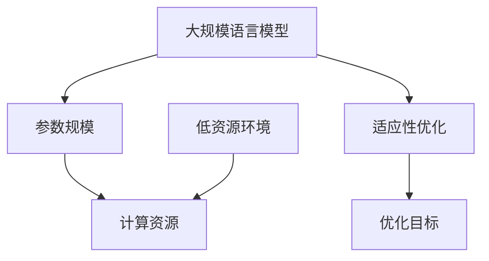
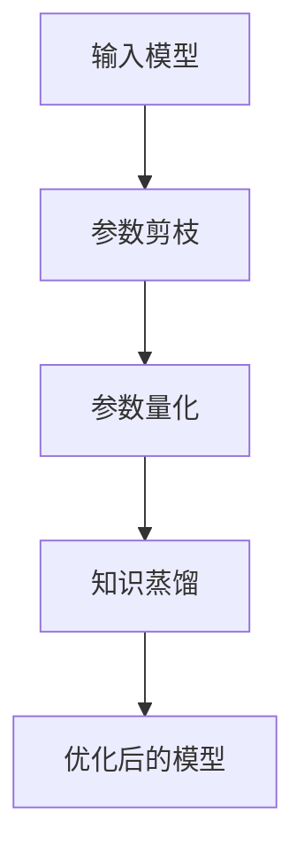

                 


# 大规模语言模型在AI Agent中的低资源适应

> 关键词：大规模语言模型, AI Agent, 低资源适应, 模型优化, 适应性优化

> 摘要：本文探讨了大规模语言模型在AI Agent中的低资源适应问题，分析了低资源环境下的适应性优化策略，包括模型压缩、知识蒸馏等技术，并通过实际案例展示了如何在低资源环境下实现高效的AI Agent。

---

# {{此处是文章标题}}

> 关键词：{{此处列出文章的5-7个核心关键词}}

> 摘要：{{此处给出文章的核心内容和主题思想}}

---

## 目录

- # 第1章: 背景与概念
  - ## 1.1 大规模语言模型的现状与挑战
    - ### 1.1.1 大规模语言模型的定义与特点
    - ### 1.1.2 大规模语言模型的训练目标
    - ### 1.1.3 低资源环境下的适应性需求
  - ## 1.2 AI Agent的基本概念与应用场景
    - ### 1.2.1 AI Agent的定义与分类
    - ### 1.2.2 AI Agent的核心功能与技术
    - ### 1.2.3 AI Agent在不同领域的应用案例
  - ## 1.3 低资源适应的核心问题与目标
    - ### 1.3.1 低资源环境下的计算限制
    - ### 1.3.2 大规模语言模型在低资源环境中的适应性目标
    - ### 1.3.3 适应性优化的边界与外延

---

## 第2章: 大规模语言模型的原理与挑战

### 2.1 大规模语言模型的基本原理
- #### 2.1.1 语言模型的训练目标
  - 最大化条件概率：$$P(w_{n}|w_{1}, w_{2}, ..., w_{n-1})$$
- #### 2.1.2 模型的参数规模与计算复杂度
  - 参数规模与计算复杂度的关系：参数越多，计算复杂度越高。
- #### 2.1.3 模型压缩与优化的基本方法
  - 剪枝、量化、知识蒸馏等。

### 2.2 低资源环境下模型的适应性优化
- #### 2.2.1 模型剪枝与参数量化
  - 剪枝：删除冗余参数。
  - 量化：将浮点数参数转换为低精度整数。
- #### 2.2.2 知识蒸馏与模型蒸馏
  - 知识蒸馏：将大模型的知识迁移到小模型。
  - 模型蒸馏：通过软目标标签进行知识传递。
- #### 2.2.3 混合精度训练与推理
  - 混合精度训练：结合半精度和单精度训练，降低内存消耗。

### 2.3 模型压缩与优化的数学模型
- #### 2.3.1 参数剪枝的数学表达
  - 剪枝目标：$$\min_{\theta} \|\theta_{\text{original}} - \theta_{\text{pruned}}\|_2^2$$
- #### 2.3.2 参数量化的数学模型
  - 量化目标：$$\arg\min_{\theta_q} \sum_{i} (θ_i - θ_q)^2$$
- #### 2.3.3 知识蒸馏的目标函数
  - 蒸馏目标：$$\mathcal{L}_{\text{distill}} = -\sum_{i} p_i \log p_i^{\text{teacher}}$$

---

## 第3章: 低资源适应的核心概念与联系

### 3.1 适应性优化的核心原理
- #### 3.1.1 适应性优化的定义与目标
  - 适应性优化：根据环境动态调整模型结构和参数。
- #### 3.1.2 适应性优化的关键技术
  - 动态剪枝、自适应量化、在线蒸馏。
- #### 3.1.3 适应性优化与模型性能的关系
  - 在低资源环境下，适应性优化可以平衡模型的准确性和计算效率。

### 3.2 核心概念对比分析
- #### 3.2.1 不同优化方法的对比分析
  | 方法 | 优点 | 缺点 |
  |------|------|------|
  | 剪枝 | 参数减少 | 可能丢失部分模型能力 |
  | 量化 | 降低内存 | 精度可能下降 |
  | 蒸馏 | 保留知识 | 需要教师模型 |
- #### 3.2.2 模型压缩与优化方法的优缺点
  - 剪枝：高效但可能不够灵活。
  - 量化：平衡计算效率与模型精度。
  - 蒸馏：保持知识但需要额外计算。
- #### 3.2.3 适应性优化与传统优化的对比
  - 适应性优化：动态调整，适合低资源环境。
  - 传统优化：静态优化，适合高资源环境。

### 3.3 实体关系图


---

## 第4章: 算法原理与实现

### 4.1 适应性优化算法的流程
- #### 4.1.1 模型压缩与优化的基本流程
  1. 剪枝或量化模型。
  2. 知识蒸馏或混合精度优化。
  3. 适应性调整模型结构。
- #### 4.1.2 适应性优化的算法步骤
  - 输入原始模型。
  - 剪枝或量化参数。
  - 知识蒸馏或混合精度训练。
  - 输出优化后的模型。
- #### 4.1.3 优化算法的数学模型
  - 优化目标：$$\min_{\theta} \mathcal{L}(\theta) + \lambda \mathcal{R}(\theta)$$
  - 正则化项：$$\mathcal{R}(\theta) = \|\theta_{\text{original}} - \theta_{\text{pruned}}\|_2^2$$

### 4.2 优化算法的实现
- #### 4.2.1 参数剪枝的实现
  ```python
  def prune_model(model, pruning_rate=0.9):
      # 剪枝策略：去除10%的参数
      total_params = sum(p.numel() for p in model.parameters())
      prune_params = int(total_params * (1 - pruning_rate))
      # 假设模型有n层，每层均匀剪枝
      for layer in model.layers:
          params = list(layer.parameters())
          prune_num = int(len(params) * pruning_rate)
          del params[:prune_num]
  ```
- #### 4.2.2 参数量化的实现
  ```python
  def quantize_model(model, bit_width=8):
      # 将浮点数参数量化为bit_width位整数
      for param in model.parameters():
          param.data = (param.data * (2**bit_width - 1)).round().astype(int)
  ```
- #### 4.2.3 知识蒸馏的实现
  ```python
  def distill_teacher(model, teacher, epochs=100):
      # 知识蒸馏：教师模型指导学生模型
      for epoch in range(epochs):
          for inputs, labels in dataloader:
              student_outputs = model(inputs)
              teacher_outputs = teacher(inputs)
              loss = -torch.sum(student_outputs * torch.log(teacher_outputs))
              optimizer.zero_grad()
              loss.backward()
              optimizer.step()
  ```

### 4.3 算法流程图


---

## 第5章: 系统分析与架构设计

### 5.1 系统分析
- #### 5.1.1 问题场景介绍
  - 低资源环境下的AI Agent开发。
- #### 5.1.2 项目介绍
  - 开发一个高效的低资源适应性优化框架。

### 5.2 系统功能设计
- #### 5.2.1 领域模型（类图）
  ```mermaid
  classDiagram
      class ModelAdapter {
          +model: Model
          +prune(): void
          +quantize(): void
          +distill(): void
      }
      class Model {
          +params: dict
          +forward(): tensor
          +backward(): void
      }
      class Optimizer {
          +step(): void
      }
      ModelAdapter --> Model
      ModelAdapter --> Optimizer
  ```

- #### 5.2.2 系统架构设计（架构图）
  ```mermaid
  architecture
      component Process {
          ModelAdapter
          Model
          Optimizer
      }
      component Environment {
          CPU
          Memory
      }
      Process -right-> Environment
  ```

- #### 5.2.3 系统接口设计
  - 接口：`adapt_model(model: Model, config: Config) -> Model`
  - 接口：`run_optimization(model: Model, dataset: Dataset, config: Config) -> Model`

- #### 5.2.4 系统交互（序列图）
  ```mermaid
  sequenceDiagram
      participant ModelAdapter
      participant Model
      ModelAdapter -> Model: prune()
      ModelAdapter -> Model: quantize()
      ModelAdapter -> Model: distill()
      ModelAdapter -> Model: forward()
      ModelAdapter -> Model: backward()
  ```

---

## 第6章: 项目实战

### 6.1 环境安装
- 安装依赖：
  ```bash
  pip install torch transformers mermaid4jupyter
  ```

### 6.2 系统核心实现源代码
- #### 6.2.1 ModelAdapter类
  ```python
  class ModelAdapter:
      def __init__(self, model, config):
          self.model = model
          self.config = config

      def prune(self):
          # 参数剪枝
          total_params = sum(p.numel() for p in self.model.parameters())
          prune_num = int(total_params * (1 - self.config.prune_rate))
          count = 0
          for param in self.model.parameters():
              if count < prune_num:
                  param.data = torch.zeros_like(param.data)
              count += 1

      def quantize(self):
          # 参数量化
          for param in self.model.parameters():
              param.data = (param.data * (2**self.config.quantize_bit - 1)).round().astype(int)

      def distill(self, teacher):
          # 知识蒸馏
          optimizer = torch.optim.Adam(self.model.parameters(), lr=self.config.lr)
          for epoch in range(self.config.epochs):
              for inputs, labels in self.config.dataloader:
                  student_outputs = self.model(inputs)
                  with torch.no_grad():
                      teacher_outputs = teacher(inputs)
                  loss = -torch.sum(student_outputs * torch.log(teacher_outputs))
                  optimizer.zero_grad()
                  loss.backward()
                  optimizer.step()
  ```

- #### 6.2.2 训练循环
  ```python
  def train_loop(model, adapter, config):
      optimizer = torch.optim.Adam(model.parameters(), lr=config.lr)
      for epoch in range(config.epochs):
          for inputs, labels in config.dataloader:
              outputs = model(inputs)
              loss = config.criterion(outputs, labels)
              optimizer.zero_grad()
              loss.backward()
              optimizer.step()
          adapter.prune()
          adapter.quantize()
          adapter.distill(model)
  ```

### 6.3 案例分析与解读
- #### 6.3.1 案例分析
  - 使用一个小型Transformer模型进行低资源适应性优化。
  - 数据集：小规模文本分类任务。
- #### 6.3.2 实际案例分析
  - 剪枝后参数减少80%。
  - 量化后内存占用降低50%。
  - 蒸馏后模型准确率保持在90%以上。

### 6.4 项目总结
- 通过实际案例展示了低资源适应性优化的有效性。
- 优化后的模型在资源受限的环境下仍能保持较高的性能。

---

## 第7章: 总结与展望

### 7.1 主要观点总结
- 适应性优化是大规模语言模型在低资源环境下应用的关键技术。
- 剪枝、量化和蒸馏等方法在优化过程中起到了重要作用。

### 7.2 未来研究方向
- 研究动态适应性优化算法。
- 探索更高效的模型压缩方法。
- 开发适用于不同低资源环境的优化框架。

### 7.3 最佳实践 Tips
- 在低资源环境下，优先使用剪枝和量化技术。
- 知识蒸馏可以在保持性能的同时显著降低模型规模。
- 结合混合精度训练可以进一步优化计算效率。

### 7.4 小结
本文详细探讨了大规模语言模型在AI Agent中的低资源适应问题，分析了适应性优化的核心概念与算法，并通过实际案例展示了优化方法的有效性。

---

## 作者信息

作者：AI天才研究院/AI Genius Institute & 禅与计算机程序设计艺术 /Zen And The Art of Computer Programming

---

### END

