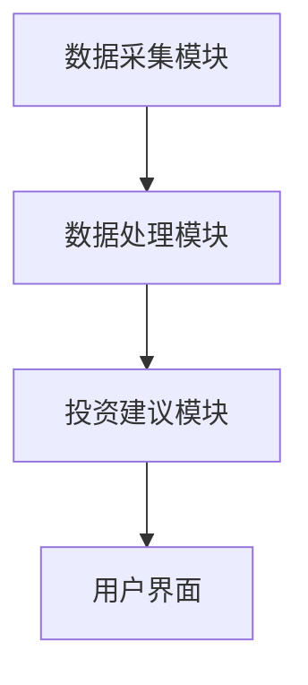
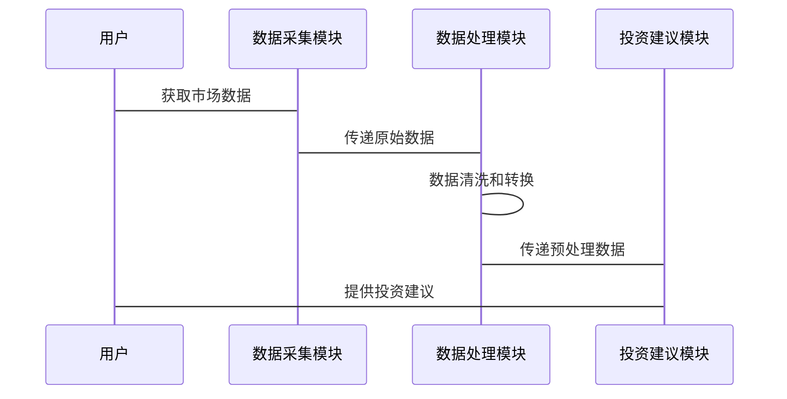

                 


# 投资理财智能助手的数据收集与预处理技巧

> 关键词：数据收集，数据预处理，投资理财，智能助手，特征工程，数据清洗

> 摘要：本文系统地探讨了投资理财智能助手在数据收集与预处理中的关键技巧。通过分析数据收集的核心概念、预处理算法的数学原理、系统架构设计以及项目实战，本文为读者提供了一套完整的投资理财数据处理方案。从数据清洗到特征工程，从算法实现到系统架构，本文深入浅出地阐述了投资理财智能助手开发中的技术细节。

---

# 第一部分: 投资理财智能助手的背景与意义

# 第1章: 投资理财智能助手的背景与意义

## 1.1 投资理财领域的现状与挑战
### 1.1.1 当前投资理财的主要方式
投资理财是个人和机构实现财富增值的重要手段。当前，投资理财主要通过以下几种方式进行：
1. **传统投资**：包括股票、基金、债券等金融产品。
2. **智能投资**：基于人工智能和大数据的智能投顾服务。
3. **量化投资**：通过算法和模型进行交易和投资决策。

### 1.1.2 数据在投资理财中的价值
在投资理财中，数据是决策的核心依据。通过分析市场数据、用户行为数据和宏观经济数据，投资者可以更好地理解市场趋势，优化投资策略。

### 1.1.3 智能助手在投资理财中的作用
智能助手通过数据收集与预处理技术，能够实时获取市场信息、用户需求和历史数据，从而为用户提供个性化的投资建议和服务。

## 1.2 数据收集与预处理的必要性
### 1.2.1 数据在投资理财中的价值
投资理财的核心在于数据的分析与利用。通过高质量的数据，投资者可以更准确地预测市场趋势，优化投资组合。

### 1.2.2 数据收集与预处理的基本概念
- **数据收集**：通过多种渠道获取投资相关数据，包括市场数据、用户数据和宏观经济数据。
- **数据预处理**：对收集到的数据进行清洗、转换和标准化，以提高数据质量和可用性。

### 1.2.3 数据质量对投资理财决策的影响
数据质量直接影响投资决策的准确性和可靠性。高质量的数据能够帮助投资者更好地识别市场机会和风险。

## 1.3 本书的核心内容与目标
### 1.3.1 本书的核心目标
本书旨在通过详细讲解投资理财智能助手中的数据收集与预处理技术，帮助读者掌握投资理财数据处理的核心方法。

### 1.3.2 本书的结构安排
本书分为六大部分：背景与意义、核心概念、算法原理、系统架构、项目实战和最佳实践。

### 1.3.3 本书的适用读者
本书适合投资理财领域的从业者、数据科学家、人工智能工程师以及对投资理财智能助手开发感兴趣的读者。

---

# 第二部分: 数据收集与预处理的核心概念

# 第2章: 数据收集与预处理的基本原理

## 2.1 数据收集的核心概念
### 2.1.1 数据收集的定义与分类
- **定义**：数据收集是通过各种渠道获取投资理财相关数据的过程。
- **分类**：
  1. **结构化数据**：如股票价格、基金净值等。
  2. **非结构化数据**：如新闻、社交媒体评论等。

### 2.1.2 数据收集的常见方法
- **API接口**：通过金融数据提供商的API获取实时数据。
- **网络爬取**：从网站和社交媒体中抓取数据。
- **用户输入**：通过应用程序收集用户的投资偏好和交易记录。

### 2.1.3 数据收集的关键挑战
- **数据量大**：投资理财数据通常具有高维性和海量性。
- **数据异构性**：数据来源多样，格式和结构差异大。

## 2.2 数据预处理的核心概念
### 2.2.1 数据预处理的定义与目标
- **定义**：数据预处理是对收集到的数据进行清洗、转换和标准化的过程。
- **目标**：
  1. 提高数据质量。
  2. 降低数据维度。
  3. 优化数据结构。

### 2.2.2 数据预处理的主要步骤
1. **数据清洗**：去除噪声数据和异常值。
2. **数据转换**：对数据进行标准化、归一化处理。
3. **数据集成**：将多个数据源的数据整合在一起。

### 2.2.3 数据预处理的关键技术
- **缺失值处理**：使用均值、中位数或插值方法填补缺失值。
- **异常值检测**：通过统计方法或机器学习算法识别异常值。
- **数据标准化**：将数据按比例缩放到同一范围内。

## 2.3 数据清洗与特征工程
### 2.3.1 数据清洗的定义与方法
- **定义**：数据清洗是通过去除噪声数据和异常值，提高数据质量的过程。
- **方法**：
  1. 删除异常值。
  2. 填补缺失值。
  3. 处理重复数据。

### 2.3.2 特征工程的定义与作用
- **定义**：特征工程是通过提取和转换数据特征，优化模型性能的过程。
- **作用**：
  1. 提高模型的准确性。
  2. 降低模型的过拟合风险。

### 2.3.3 数据清洗与特征工程的区别与联系
- **区别**：数据清洗关注数据质量，而特征工程关注数据特征的提取和优化。
- **联系**：数据清洗是特征工程的前提，特征工程是数据清洗的延伸。

---

# 第三部分: 数据收集与预处理的算法原理

# 第3章: 数据清洗算法原理

## 3.1 数据清洗的常见方法
### 3.1.1 删除异常值
- **方法**：使用Z-score或IQR方法检测异常值。
- **代码示例**：
  ```python
  import pandas as pd
  import numpy as np
  df = pd.DataFrame({
      'A': [1, 2, 3, 4, 5],
      'B': [10, 20, np.nan, 40, 50]
  })
  # 删除Z-score超过3的行
  from scipy import stats
  z = stats.zscore(df)
  df_clean = df[(z > -3) & (z < 3)]
  ```

### 3.1.2 填补缺失值
- **方法**：使用均值、中位数或插值方法填补缺失值。
- **代码示例**：
  ```python
  # 使用均值填补缺失值
  df['B'].fillna(df['B'].mean(), inplace=True)
  ```

### 3.1.3 处理重复数据
- **方法**：删除重复行或重复列。
- **代码示例**：
  ```python
  df.drop_duplicates(subset=['A'], keep='first', inplace=True)
  ```

## 3.2 数据清洗的数学模型
### 3.2.1 缺失值填补的数学方法
- **均值填补**：
  $$ x_{\text{new}} = \frac{\sum x_i}{n} $$
- **中位数填补**：
  $$ x_{\text{new}} = \text{median}(x) $$

### 3.2.2 异常值检测的统计方法
- **Z-score方法**：
  $$ z = \frac{x - \mu}{\sigma} $$
  其中，$\mu$ 是均值，$\sigma$ 是标准差。

### 3.2.3 数据标准化与归一化的数学公式
- **标准化**：
  $$ z = \frac{x - \mu}{\sigma} $$
- **归一化**：
  $$ x_{\text{new}} = \frac{x - \min(x)}{\max(x) - \min(x)} $$

## 3.3 数据清洗的Python实现
### 3.3.1 使用Pandas进行数据清洗
- **删除异常值**：
  ```python
  import pandas as pd
  import numpy as np
  df = pd.DataFrame({
      'A': [1, 2, 3, 4, 5],
      'B': [10, 20, np.nan, 40, 50]
  })
  # 删除Z-score超过3的行
  from scipy import stats
  z = stats.zscore(df)
  df_clean = df[(z > -3) & (z < 3)]
  ```

### 3.3.2 使用Scikit-learn进行数据标准化
- **标准化**：
  ```python
  from sklearn.preprocessing import StandardScaler
  scaler = StandardScaler()
  df_scaled = scaler.fit_transform(df)
  ```

### 3.3.3 数据清洗的代码示例
- **综合示例**：
  ```python
  import pandas as pd
  import numpy as np
  from scipy import stats
  from sklearn.preprocessing import StandardScaler

  # 创建示例数据
  df = pd.DataFrame({
      'A': [1, 2, 3, 4, 5],
      'B': [10, 20, np.nan, 40, 50]
  })

  # 删除异常值
  z = stats.zscore(df)
  df_clean = df[(z > -3) & (z < 3)]

  # 填补缺失值
  df_clean['B'].fillna(df_clean['B'].mean(), inplace=True)

  # 数据标准化
  scaler = StandardScaler()
  df_scaled = scaler.fit_transform(df_clean)

  print(df_scaled)
  ```

---

# 第四部分: 数据收集与预处理的系统架构设计

# 第4章: 投资理财智能助手的系统架构设计

## 4.1 问题场景介绍
投资理财智能助手需要实时获取市场数据、用户行为数据和宏观经济数据，并通过数据预处理技术，为用户提供个性化的投资建议。

## 4.2 系统功能设计
### 4.2.1 数据采集模块
- **功能**：通过API接口和网络爬取获取数据。
- **输入**：市场数据、用户数据。
- **输出**：清洗后的数据。

### 4.2.2 数据处理模块
- **功能**：对数据进行清洗、转换和标准化。
- **输入**：原始数据。
- **输出**：高质量数据。

### 4.2.3 投资建议模块
- **功能**：基于预处理后的数据，生成投资建议。
- **输入**：清洗后的数据。
- **输出**：投资策略。

## 4.3 系统架构设计
### 4.3.1 系统架构图


### 4.3.2 系统接口设计
- **数据采集模块接口**：
  ```python
  def get_market_data():
      # 从API获取市场数据
      pass
  ```

- **数据处理模块接口**：
  ```python
  def preprocess_data(data):
      # 对数据进行清洗和转换
      pass
  ```

- **投资建议模块接口**：
  ```python
  def generate_recommendation(data):
      # 基于数据生成投资建议
      pass
  ```

### 4.3.3 系统交互流程


---

# 第五部分: 数据收集与预处理的项目实战

# 第5章: 数据收集与预处理的项目实战

## 5.1 项目介绍
### 5.1.1 项目目标
通过数据收集与预处理技术，开发一个投资理财智能助手，为用户提供个性化的投资建议。

### 5.1.2 项目环境
- **开发工具**：Python、Jupyter Notebook。
- **库依赖**：Pandas、NumPy、Scikit-learn。

## 5.2 系统核心实现
### 5.2.1 数据采集模块实现
- **代码示例**：
  ```python
  import pandas as pd
  import requests
  import json

  def get_market_data():
      url = "https://api.example.com/stock"
      response = requests.get(url)
      data = json.loads(response.text)
      df = pd.DataFrame(data)
      return df
  ```

### 5.2.2 数据处理模块实现
- **代码示例**：
  ```python
  def preprocess_data(data):
      # 删除异常值
      z = stats.zscore(data)
      data_clean = data[(z > -3) & (z < 3)]
      # 填补缺失值
      data_clean = data_clean.fillna(data_clean.mean())
      # 数据标准化
      scaler = StandardScaler()
      data_scaled = scaler.fit_transform(data_clean)
      return data_scaled
  ```

### 5.2.3 投资建议模块实现
- **代码示例**：
  ```python
  def generate_recommendation(data):
      # 基于标准化数据生成投资建议
      pass
  ```

## 5.3 项目案例分析
### 5.3.1 数据来源与预处理
- **数据来源**：
  - 股票价格：从API获取。
  - 用户行为：从数据库获取。
  - 宏观经济数据：从CSV文件获取。

### 5.3.2 数据清洗与转换
- **清洗步骤**：
  1. 删除异常值。
  2. 填补缺失值。
  3. 处理重复数据。

## 5.4 项目小结
通过本项目，我们成功实现了投资理财智能助手的数据收集与预处理功能，为后续的投资建议生成奠定了基础。

---

# 第六部分: 数据收集与预处理的最佳实践

# 第6章: 数据收集与预处理的最佳实践

## 6.1 小结
### 6.1.1 核心知识点回顾
- 数据收集的核心方法。
- 数据预处理的关键技术。
- 数据清洗的数学模型。

## 6.2 注意事项
### 6.2.1 数据收集中的注意事项
- 确保数据来源的可靠性。
- 注意数据隐私和合规性。

### 6.2.2 数据预处理中的注意事项
- 避免过度清洗数据。
- 确保数据的完整性和一致性。

## 6.3 拓展阅读
### 6.3.1 推荐书籍
- 《Python数据分析 cookbook》。
- 《机器学习实战》。

### 6.3.2 推荐博客和资源
- Medium上的数据科学博客。
- Kaggle上的投资理财数据集。

---

# 作者信息

作者：AI天才研究院/AI Genius Institute & 禅与计算机程序设计艺术 /Zen And The Art of Computer Programming

---

以上是关于《投资理财智能助手的数据收集与预处理技巧》的完整目录和部分章节内容。接下来，我会根据这个大纲逐步展开，为每个章节撰写详细的内容。

