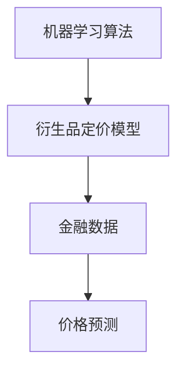

                 


# 《机器学习在衍生品定价中的应用研究》

## 关键词：机器学习，衍生品定价，人工智能，金融时间序列，数学模型，神经网络，随机森林

## 摘要：
机器学习作为一种强大的数据分析工具，正在逐步改变金融行业的传统模式。在衍生品定价领域，机器学习展现出了独特的优势，能够捕捉传统模型难以识别的复杂价格波动模式。本文将深入探讨机器学习在衍生品定价中的应用，涵盖背景、核心概念、算法原理、系统设计和项目实战等部分，帮助读者全面理解这一领域的最新进展和实际应用。

---

## 第一部分：机器学习与衍生品定价的背景与基础

### 第1章：机器学习与衍生品定价概述

#### 1.1 机器学习的基本概念
- **1.1.1 机器学习的定义与核心概念**
  - 机器学习是一种通过数据驱动模型自动学习规律的技术，主要分为监督学习、无监督学习和强化学习。
  - 监督学习：通过标记数据训练模型，预测新数据的标签（如房价预测）。
  - 无监督学习：通过数据本身发现隐藏的结构（如聚类分析）。
  - 强化学习：通过与环境交互，学习最优策略（如游戏AI）。

- **1.1.2 机器学习的主要算法类型**
  - 线性回归：用于预测连续值。
  - 支持向量机（SVM）：用于分类和回归。
  - 随机森林：一种基于决策树的集成学习方法。
  - 神经网络：用于复杂模式识别。

- **1.1.3 机器学习在金融领域的应用潜力**
  - 金融时间序列预测：利用历史价格数据预测未来走势。
  - 风险评估：通过机器学习模型评估投资组合的风险。
  - 量化交易：基于算法生成交易信号。

#### 1.2 衍生品定价的基本原理
- **1.2.1 衍生品的定义与分类**
  - 衍生品是一种依赖于其他资产价格的金融工具，主要包括期权、期货和掉期等。
  - 期权：买方有权在特定时间以特定价格买入或卖出标的资产。
  - 期货：买方和卖方约定在未来某一时间以预定价格买卖标的资产。

- **1.2.2 衍生品定价的传统方法**
  - Black-Scholes模型：用于定价欧式期权，公式为：
    $$ C = S_0 \Phi(d_1) - K e^{-rT} \Phi(d_2) $$
    其中，\( S_0 \) 为标的资产价格，\( K \) 为执行价格，\( r \) 为无风险利率，\( T \) 为到期时间，\( \Phi \) 为标准正态分布的累积分布函数。
  - 二叉树模型：通过构建树状结构模拟标的资产的价格波动，计算期权的期望值。
  - 蒙特卡洛模拟：通过随机采样模拟大量可能的价格路径，计算期权的期望值。

- **1.2.3 衍生品定价中的主要挑战**
  - 市场波动性：价格波动难以预测，尤其是极端事件的影响。
  - 数据质量：历史数据可能存在缺失或异常值。
  - 模型风险：定价模型的假设可能与实际市场不符。

#### 1.3 机器学习在衍生品定价中的结合背景
- **1.3.1 传统衍生品定价方法的局限性**
  - 传统模型假设标的资产价格服从几何布朗运动，但实际市场中存在跳跃和 fat-tail 现象。
  - 参数估计的敏感性：模型结果对输入参数的假设高度敏感。

- **1.3.2 机器学习在金融时间序列分析中的优势**
  - 无需假设数据分布，能够捕捉非线性关系。
  - 可以处理高维数据，提取更多特征。
  - 能够实时更新模型，适应市场变化。

- **1.3.3 衍生品定价与机器学习结合的前景**
  - 提高定价准确性，尤其是在市场剧烈波动时。
  - 优化风险管理和投资决策。
  - 开发个性化的定价模型，满足不同投资者需求。

#### 1.4 本章小结
本章介绍了机器学习的基本概念和衍生品定价的传统方法，分析了两者的结合背景和潜力。机器学习的优势在于其非线性建模能力和数据驱动的特征，能够弥补传统方法的不足。

---

## 第二部分：机器学习与衍生品定价的核心概念

### 第2章：机器学习与衍生品定价的核心概念

#### 2.1 机器学习的核心算法原理
- **2.1.1 神经网络的基本原理**
  - 神经网络由输入层、隐藏层和输出层组成，通过多层感知机（MLP）学习复杂非线性关系。
  - 反向传播（Backpropagation）算法用于计算损失函数的梯度，更新权重参数。
  - 激活函数（如ReLU、sigmoid）用于引入非线性，增加模型的表达能力。

- **2.1.2 支持向量机的原理**
  - SVM通过寻找最优超平面，将数据分为正类和负类。
  - 核函数（如RBF、多项式核）用于将低维数据映射到高维空间，处理非线性分类问题。
  - 软间隔（Soft Margin）允许部分数据点在超平面附近，提高模型的泛化能力。

- **2.1.3 随机森林与梯度提升树的原理**
  - 随机森林通过生成多棵决策树，取平均值或中位数减少过拟合。
  - 梯度提升树通过迭代优化，每棵树纠正前一棵树的错误，提升整体性能。

#### 2.2 衍生品定价的数学模型
- **2.2.1 Black-Scholes模型的数学公式**
  $$ C = S_0 \Phi(d_1) - K e^{-rT} \Phi(d_2) $$
  其中：
  $$ d_1 = \frac{\ln(S_0/K) + (r + \sigma^2/2)T}{\sigma \sqrt{T}} $$
  $$ d_2 = d_1 - \sigma \sqrt{T} $$
  \( \sigma \) 为标的资产的波动率。

- **2.2.2 二叉树模型的基本原理**
  - 通过构建树状结构模拟标的资产价格的向上和向下波动。
  - 计算每一步的期权价值，倒推到当前时间点。

- **2.2.3 蒙特卡洛模拟在衍生品定价中的应用**
  - 通过模拟大量价格路径，计算期权的期望值。
  - 使用马尔可夫链蒙特卡洛（MCMC）方法处理复杂分布。

#### 2.3 机器学习与衍生品定价的结合原理
- **2.3.1 机器学习在衍生品定价中的主要应用场景**
  - 利用历史数据训练模型，预测期权的理论价格。
  - 识别影响期权价格的关键因素，如波动率、时间 decay 等。
  - 实时监控市场变化，动态调整定价模型。

- **2.3.2 机器学习模型如何捕捉衍生品价格的波动特征**
  - 使用时间序列模型（如LSTM）捕捉价格的时序依赖性。
  - 通过因子分析提取市场中的主要风险因素。
  - 利用卷积神经网络（CNN）处理图像数据，分析K线图中的模式。

- **2.3.3 机器学习与传统定价模型的协同作用**
  - 机器学习模型可以作为传统模型的补充，捕捉非线性关系。
  - 将传统模型的输出作为机器学习模型的输入特征，提高整体预测精度。

#### 2.4 核心概念对比分析
- **2.4.1 不同机器学习算法的优缺点对比**
  | 算法类型 | 优点 | 缺点 |
  |---------|------|------|
  | 线性回归 | 简单，易于解释 | 无法捕捉非线性关系 |
  | SVM     | 准确性高，适合小数据集 | 参数敏感，难以处理高维数据 |
  | 随机森林 | 抗过拟合，适合大数据 | 计算复杂度高 |
  | 神经网络 | 表达能力强，适合复杂模式 | 需要大量数据，易过拟合 |

- **2.4.2 衍生品定价模型的属性特征对比表格**
  | 模型类型 | 输入特征 | 输出结果 | 适用场景 |
  |---------|----------|----------|----------|
  | Black-Scholes | 标的价格、波动率、时间等 | 期权价格 | 欧式期权定价 |
  | 二叉树模型 | 标的价格、波动率、时间等 | 期权价格 | 美式期权定价 |
  | 蒙特卡洛模拟 | 标的价格、波动率、时间等 | 期权价格 | 复杂衍生品定价 |

- **2.4.3 ER实体关系图架构的 Mermaid 流程图**



---

## 第三部分：机器学习在衍生品定价中的算法原理

### 第3章：机器学习在衍生品定价中的算法原理

#### 3.1 神经网络在衍生品定价中的应用
- **3.1.1 神经网络的基本结构**
  - 输入层：接收标的资产价格、波动率等特征。
  - 隐藏层：通过非线性变换提取高级特征。
  - 输出层：预测期权的理论价格。

- **3.1.2 神经网络在时间序列预测中的应用**
  - 使用LSTM（长短期记忆网络）捕捉时间依赖性。
  - LSTM结构包含输入门、遗忘门和输出门，能够记住长期信息。
  - 通过多层LSTM堆叠，提高模型的表达能力。

- **3.1.3 神经网络的训练过程与优化方法**
  - 损失函数：均方误差（MSE）或均方对数误差。
  - 优化器：随机梯度下降（SGD）或Adam优化器。
  - 正则化：L2正则化防止过拟合。

#### 3.2 支持向量机在衍生品定价中的应用
- **3.2.1 支持向量机的基本原理**
  - 通过构建支持向量，寻找最优超平面。
  - 使用核函数处理非线性问题。

- **3.2.2 支持向量机在分类与回归中的应用**
  - 分类：判断期权是否被低估或高估。
  - 回归：预测期权的理论价格。

- **3.2.3 支持向量机的核函数选择与优化**
  - RBF核：适用于复杂数据，但需要调整参数。
  - 多项式核：适用于高维数据，但计算复杂。

#### 3.3 随机森林在衍生品定价中的应用
- **3.3.1 随机森林的基本原理**
  - 生成多棵决策树，取平均值或中位数。
  - 特征选择：随机选择部分特征，减少过拟合。

- **3.3.2 随机森林在特征选择中的优势**
  - 通过特征重要性排序，识别影响期权价格的关键因素。
  - 能够处理高维数据，无需特征工程。

- **3.3.3 随机森林的超参数优化方法**
  - 树的棵数：增加棵数可以提高精度，但会增加计算时间。
  - 树的深度：控制树的深度，防止过拟合。
  - 学习率：调整每棵树的更新幅度。

#### 3.4 算法原理的数学模型与公式
- **3.4.1 神经网络的损失函数**
  $$ L = \frac{1}{n}\sum_{i=1}^{n}(y_i - \hat{y}_i)^2 $$
  其中，\( y_i \) 为真实值，\( \hat{y}_i \) 为预测值。

- **3.4.2 LSTM的结构公式**
  - 遗忘门：
  $$ f_t = \sigma(W_f \cdot [h_{t-1}, x_t] + b_f) $$
  - 输入门：
  $$ i_t = \sigma(W_i \cdot [h_{t-1}, x_t] + b_i) $$
  - 输出门：
  $$ o_t = \sigma(W_o \cdot [h_{t-1}, x_t] + b_o) $$
  - 细胞状态：
  $$ c_t = f_t \cdot c_{t-1} + i_t \cdot tanh(W_c \cdot [h_{t-1}, x_t] + b_c) $$

---

## 第四部分：系统分析与架构设计方案

### 第4章：系统分析与架构设计方案

#### 4.1 问题场景介绍
- **问题背景**：传统衍生品定价模型难以捕捉市场中的复杂模式，尤其是在市场波动剧烈时。
- **目标**：构建一个基于机器学习的衍生品定价系统，提高定价准确性和效率。

#### 4.2 系统功能设计
- **领域模型**：通过Mermaid类图展示系统的主要模块和交互关系。


#### 4.3 系统架构设计
- **架构图**：展示系统的各个模块及其交互关系。


#### 4.4 系统接口设计
- **输入接口**：接收标的资产价格、波动率等数据。
- **输出接口**：输出期权的理论价格和风险指标。

#### 4.5 系统交互流程图
- **交互流程**：
  1. 用户输入金融数据。
  2. 系统进行数据预处理。
  3. 训练机器学习模型。
  4. 生成定价预测结果。
  5. 输出结果并提供可视化界面。

---

## 第五部分：项目实战

### 第5章：项目实战

#### 5.1 环境安装
- **安装Python**：建议使用Anaconda环境，安装Python 3.8以上版本。
- **安装依赖库**：
  ```bash
  pip install numpy pandas scikit-learn tensorflow matplotlib
  ```

#### 5.2 系统核心实现源代码
- **神经网络实现**：
  ```python
  import numpy as np
  import tensorflow as tf

  def build_model(input_dim):
      model = tf.keras.Sequential()
      model.add(tf.keras.layers.Dense(64, activation='relu', input_dim=input_dim))
      model.add(tf.keras.layers.Dense(32, activation='relu'))
      model.add(tf.keras.layers.Dense(1, activation='linear'))
      model.compile(optimizer='adam', loss='mean_squared_error')
      return model

  # 使用示例数据训练模型
  input_dim = 5  # 特征数量
  model = build_model(input_dim)
  model.fit(X_train, y_train, epochs=100, batch_size=32)
  ```

- **LSTM实现**：
  ```python
  from tensorflow.keras.layers import LSTM, Dense, Dropout

  def build_lstm_model(input_shape):
      model = tf.keras.Sequential()
      model.add(LSTM(64, return_sequences=True, input_shape=input_shape))
      model.add(Dropout(0.2))
      model.add(LSTM(32, return_sequences=False))
      model.add(Dense(1))
      model.compile(optimizer='adam', loss='mean_squared_error')
      return model

  # 使用示例数据训练模型
  input_shape = (timesteps, features)
  model = build_lstm_model(input_shape)
  model.fit(X_train, y_train, epochs=100, batch_size=32)
  ```

#### 5.3 代码应用解读与分析
- **神经网络代码解读**：
  - 输入层：接收5个特征（如标的资产价格、波动率、时间等）。
  - 隐藏层：使用ReLU激活函数，提取非线性特征。
  - 输出层：预测期权价格。

- **LSTM代码解读**：
  - LSTM层：捕捉时间序列的依赖性。
  - Dropout层：防止过拟合。
  - 输出层：预测期权价格。

#### 5.4 实际案例分析
- **案例背景**：假设我们有某标的资产的历史价格数据和波动率数据，目标是训练一个LSTM模型预测期权的理论价格。
- **数据准备**：
  ```python
  # 示例数据准备
  import pandas as pd
  import numpy as np

  # 生成随机数据
  np.random.seed(42)
  S = np.random.normal(100, 0.2, 1000)  # 标的价格
  K = 100  # 执行价格
  r = 0.05  # 无风险利率
  T = 1  # 到期时间
  sigma = 0.3  # 波动率

  # 计算Black-Scholes模型的理论价格
  d1 = (np.log(S/K) + (r + sigma**2/2)*T) / (sigma*np.sqrt(T))
  d2 = d1 - sigma*np.sqrt(T)
  C_bs = S * norm.cdf(d1) - K * np.exp(-r*T) * norm.cdf(d2)

  # 使用LSTM预测价格
  model.predict(...)
  ```

#### 5.5 项目小结
通过实际案例，我们展示了如何利用神经网络和LSTM模型进行衍生品定价。模型的训练和预测过程需要结合实际数据进行调整和优化，以达到最佳效果。

---

## 第六部分：最佳实践

### 第6章：最佳实践

#### 6.1 小结
机器学习在衍生品定价中的应用前景广阔，但需要结合实际市场情况和数据特征进行模型选择和优化。

#### 6.2 注意事项
- **数据质量**：确保数据的完整性和准确性，处理缺失值和异常值。
- **模型调优**：选择合适的超参数，进行交叉验证和网格搜索。
- **模型解释性**：关注模型的可解释性，避免黑箱模型带来的风险。

#### 6.3 拓展阅读
- 推荐书籍：《机器学习实战》、《Python机器学习》。
- 推荐博客：深入浅出机器学习系列文章。

---

## 作者：AI天才研究院/AI Genius Institute  
[禅与计算机程序设计艺术](https://github.com/AI-Genius-Institute)

