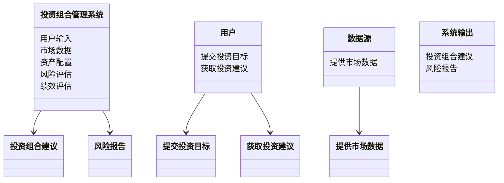
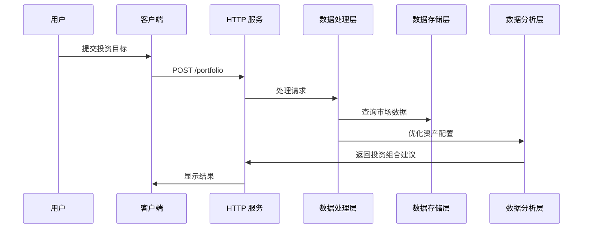

                 


# 综合四大师智慧：构建现代投资组合

> **关键词**：投资组合、现代投资组合理论、价值投资、成长投资、投资策略  
> **摘要**：本文将综合四位投资大师的智慧——本杰明·格雷厄姆、菲利普·费雪、约翰·梅纳德·凯恩斯和沃伦·巴菲特——构建现代投资组合。通过分析他们的投资策略，结合现代投资组合理论，探讨如何在实际投资中应用这些智慧，以实现长期稳定的收益。

---

## 第1章：投资组合概述

### 1.1 投资组合的基本概念

#### 1.1.1 投资组合的定义与特征
投资组合是指将资金分配到不同资产（如股票、债券、房地产等）上的策略。其核心特征包括：
- **分散性**：通过投资多种资产降低风险。
- **流动性**：资产易于买卖，避免流动性不足导致的损失。
- **收益性**：通过优化资产配置实现收益最大化。
- **风险性**：任何投资都伴随着风险，需在收益与风险之间找到平衡。

#### 1.1.2 投资组合的重要性
在现代金融市场上，单一资产的投资风险较高，通过构建投资组合可以有效分散风险，同时提高收益的稳定性。投资组合的重要性体现在：
- 降低投资风险。
- 提高资金的利用效率。
- 适应市场变化，灵活调整投资策略。

#### 1.1.3 投资组合的目标与策略
投资组合的目标通常包括：
- 实现资产保值或增值。
- 追求超越市场平均水平的收益。
- 避免重大损失，确保资金安全。

投资策略则包括：
- **主动管理**：根据市场变化频繁调整投资组合。
- **被动管理**：定期调整，保持资产配置不变。

### 1.2 投资组合的历史演变

#### 1.2.1 传统投资组合的形成
早期的投资组合主要依赖于简单的资产分配，如将资金分配到股票、债券和现金中。这种方法虽然简单，但缺乏系统性和科学性。

#### 1.2.2 现代投资组合理论的出现
20世纪50年代，哈里·马科维茨提出现代投资组合理论（MPT），强调通过优化资产配置来实现风险与收益的最优平衡。这一理论奠定了现代投资组合的基础。

#### 1.2.3 投资组合管理的发展趋势
随着金融市场的复杂化，投资组合管理逐渐从单一的资产分配转向多策略、多资产配置，结合量化分析和行为学研究，形成更加科学和系统的管理方法。

---

## 第2章：本杰明·格雷厄姆的价值投资

### 2.1 格雷厄姆的防御性投资策略

#### 2.1.1 价值投资的核心理念
价值投资的核心在于寻找市场定价低于其内在价值的资产。格雷厄姆强调安全边际的重要性，即买入价格远低于内在价值的资产。

#### 2.1.2 安全边际的概念
安全边际是价值投资的核心原则，通过购买低于内在价值的资产，降低市场波动带来的风险。

#### 2.1.3 避免永久性资本损失的原则
格雷厄姆强调避免永久性资本损失，通过严格筛选资产，确保投资的安全性。

### 2.2 格雷厄姆策略对现代投资组合的影响

#### 2.2.1 价值投资与分散化
现代投资组合将格雷厄姆的价值投资理念与分散化策略相结合，通过投资多个低估资产降低风险。

#### 2.2.2 股票估值方法的演变
格雷厄姆的估值方法为现代投资组合提供了基础，衍生出市盈率、市净率等多种估值指标。

#### 2.2.3 长期投资与风险管理
格雷厄姆的价值投资强调长期持有，但现代投资组合结合风险管理，通过动态调整投资比例降低风险。

---

## 第3章：菲利普·费雪的成长投资

### 3.1 费雪的成长投资理论

#### 3.1.1 成长投资的定义与特点
成长投资关注具有持续增长潜力的公司，投资于这些公司的股票，以期获得长期的资本增值。

#### 3.1.2 投资优质成长股的原则
费雪提出，成长投资需要选择具有强大竞争优势和持续增长能力的公司，而非仅仅关注短期收益。

#### 3.1.3 长期投资与企业成长的关系
成长投资强调长期持有，关注企业的成长周期，而非短期市场波动。

### 3.2 费雪策略在现代投资组合中的应用

#### 3.2.1 成长型股票的筛选标准
现代投资组合结合费雪的成长投资理念，通过分析公司的成长潜力、竞争优势等因素，筛选出优质成长股。

#### 3.2.2 成长与价值投资的平衡
在现代投资组合中，成长投资与价值投资并非对立，而是可以通过合理配置实现平衡，降低风险并提高收益。

#### 3.2.3 投资组合中的成长股配置
现代投资组合通过动态调整成长股的比例，结合市场环境变化，优化投资组合的收益与风险。

---

## 第4章：约翰·梅纳德·凯恩斯的行为投资

### 4.1 凯恩斯的行为投资理论

#### 4.1.1 行为投资的核心观点
凯恩斯认为，市场参与者的行为往往受到心理因素的影响，市场可能存在非理性波动。

#### 4.1.2 市场情绪与投资决策
行为投资关注市场情绪对投资决策的影响，强调在市场恐慌或狂热时调整投资策略。

#### 4.1.3 非理性行为对投资组合的影响
非理性行为可能导致投资组合的过度波动，现代投资组合需要通过行为分析来优化资产配置。

### 4.2 行为投资策略在现代投资组合中的应用

#### 4.2.1 心理因素对投资决策的影响
现代投资组合通过分析投资者的心理因素，制定相应的投资策略，避免非理性决策。

#### 4.2.2 如何避免行为偏差
通过严格的投资纪律和系统化的方法，现代投资组合可以有效避免行为偏差的影响。

#### 4.2.3 行为投资与传统投资策略的结合
行为投资与传统投资策略的结合，使现代投资组合更加灵活和适应性强，能够应对复杂的市场环境。

---

## 第5章：沃伦·巴菲特的综合投资

### 5.1 巴菲特的价值投资与成长投资结合策略

#### 5.1.1 价值投资与成长投资的融合
巴菲特将价值投资和成长投资相结合，寻找具有低估价值且具备持续增长潜力的公司。

#### 5.1.2 投资企业的长期价值
巴菲特强调长期投资，关注企业的内在价值和竞争优势，而非短期市场波动。

#### 5.1.3 股东权益最大化的原则
巴菲特的投资策略以股东权益最大化为目标，通过长期持有优质资产实现价值增长。

### 5.2 巴菲特策略对现代投资组合的启示

#### 5.2.1 集中投资与分散投资的平衡
现代投资组合通过集中投资优质资产，同时分散投资降低风险，实现收益与风险的平衡。

#### 5.2.2 长期投资与短期波动
巴菲特的长期投资理念与现代投资组合的短期波动管理相结合，使投资组合更具灵活性和适应性。

---

## 第6章：现代投资组合理论与算法实现

### 6.1 现代投资组合理论的核心原理

#### 6.1.1 均值-方差模型
均值-方差模型是现代投资组合理论的基础，通过优化资产的期望收益和方差，实现风险与收益的最优平衡。

#### 6.1.2 有效前沿的概念
有效前沿是所有可能投资组合中风险最小化或收益最大化的集合，代表最优的投资组合。

#### 6.1.3 马科维茨的投资组合理论
马科维茨提出的投资组合理论为现代投资组合提供了科学的理论基础，强调通过优化资产配置实现风险与收益的最优平衡。

### 6.2 投资组合优化的算法实现

#### 6.2.1 现代投资组合理论的数学模型
现代投资组合理论的数学模型如下：
$$
\text{Minimize } \sigma^2 \text{ s.t. } \mu \geq R, w^T \mathbf{1} = 1, w \geq 0
$$
其中，$\sigma^2$ 是投资组合的方差，$\mu$ 是期望收益，$R$ 是目标收益，$w$ 是资产权重。

#### 6.2.2 使用Python实现投资组合优化
以下是使用Python实现投资组合优化的示例代码：
```python
import numpy as np
import pandas as pd
from scipy.optimize import minimize

# 示例资产收益和协方差矩阵
mu = np.array([0.1, 0.08, 0.12])
cov = np.array([[0.05, 0.02, 0.01],
                [0.02, 0.03, 0.015],
                [0.01, 0.015, 0.02]])

# 定义优化目标函数
def portfolio_variance(weights, mu, cov):
    return np.dot(weights.T, np.dot(cov, weights))

# 定义约束条件
cons = ({'type': 'eq', 'fun': lambda w: np.sum(w) - 1},
        {'type': 'ineq', 'fun': lambda w: w})

# 使用scipy.optimize.minimize进行优化
result = minimize(portfolio_variance, np.array([1/3, 1/3, 1/3]), 
                  method='SLSQP', constraints=cons, bounds=[(0, None), (0, None), (0, None)])

# 输出优化结果
print("最优权重：", result.x)
print("最优方差：", result.fun)
```

#### 6.2.3 投资组合优化的数学公式
投资组合优化的数学公式如下：
$$
\text{Minimize } \sum_{i=1}^n w_i^2 \sigma_i^2 + 2 \sum_{i < j} w_i w_j \sigma_i \sigma_j
$$
其中，$w_i$ 是资产$i$的权重，$\sigma_i$ 是资产$i$的收益率标准差。

---

## 第7章：投资组合的系统分析与架构设计

### 7.1 系统功能设计

#### 7.1.1 领域模型（Mermaid 类图）


### 7.2 系统架构设计

#### 7.2.1 系统架构图（Mermaid 架构图）


### 7.3 系统接口设计

#### 7.3.1 HTTP 接口
- `POST /portfolio`: 提交投资目标和参数。
- `GET /recommendation`: 获取投资组合建议。
- `GET /risk_report`: 获取风险报告。

### 7.4 系统交互流程（Mermaid 序列图）


---

## 第8章：项目实战——构建投资组合管理系统

### 8.1 环境安装

#### 8.1.1 安装必要的Python库
- `numpy`
- `pandas`
- `scipy`
- `matplotlib`
- `plotly`

### 8.2 核心实现

#### 8.2.1 数据获取与处理
使用 `pandas` 和 `requests` 获取市场数据，进行清洗和预处理。

#### 8.2.2 资产配置优化
使用 `scipy.optimize` 进行投资组合优化，计算最优资产权重。

#### 8.2.3 风险评估与绩效分析
使用 `numpy` 和 `pandas` 计算投资组合的风险和绩效指标，如夏普比率、最大回撤等。

### 8.3 代码实现

#### 8.3.1 数据获取与处理
```python
import pandas as pd
import requests
import json

# 获取市场数据
url = "https://api.example.com/markets"
response = requests.get(url)
data = json.loads(response.text)
df = pd.DataFrame(data)
```

#### 8.3.2 投资组合优化
```python
from scipy.optimize import minimize

# 定义目标函数
def objective(weights, mu, cov):
    return np.dot(weights.T, np.dot(cov, weights))

# 定义约束条件
cons = ({'type': 'eq', 'fun': lambda w: np.sum(w) - 1},
        {'type': 'ineq', 'fun': lambda w: w})

# 优化投资组合
result = minimize(objective, np.array([1/3, 1/3, 1/3]),
                  method='SLSQP', constraints=cons, bounds=[(0, None), (0, None), (0, None)])
```

#### 8.3.3 风险评估与绩效分析
```python
import numpy as np

# 计算夏普比率
def sharpe_ratio(returns, risk_free_rate):
    excess_returns = returns - risk_free_rate
    return np.mean(excess_returns) / np.std(excess_returns)

# 计算最大回撤
def max_drawdown(returns):
    cumulative = (1 + returns).cumprod()
    peak = cumulative.cummax()
    drawdown = (peak - cumulative) / peak
    return drawdown.max()
```

### 8.4 案例分析

#### 8.4.1 投资目标设定
假设投资目标为追求年化收益8%，最大回撤不超过10%。

#### 8.4.2 优化结果分析
通过优化，得到各资产的最优权重，并计算投资组合的风险和绩效指标。

#### 8.4.3 结果解读
根据优化结果，调整投资组合，确保在目标收益范围内，风险最小化。

---

## 第9章：最佳实践与小结

### 9.1 最佳实践

#### 9.1.1 定期调整投资组合
根据市场变化和个人财务状况，定期调整投资组合。

#### 9.1.2 保持长期视角
投资组合管理需要长期视角，避免短期波动影响决策。

#### 9.1.3 结合定量与定性分析
结合定量分析和定性判断，优化投资组合。

#### 9.1.4 注意风险管理
通过分散投资、设置止损等方式，降低投资风险。

### 9.2 小结

综合四位投资大师的智慧，结合现代投资组合理论和算法优化，构建的投资组合能够在复杂多变的市场中实现长期稳定的收益。通过系统的分析和实战案例，我们可以更好地理解投资组合的构建与优化方法。

---

## 总结

通过综合四大师的智慧，结合现代投资组合理论和算法优化，构建的投资组合能够在复杂多变的市场中实现长期稳定的收益。本文从理论到实践，详细阐述了投资组合的构建过程，为投资者提供了系统的指导和实践参考。

---

## 作者

**作者：AI天才研究院/AI Genius Institute & 禅与计算机程序设计艺术 /Zen And The Art of Computer Programming**

