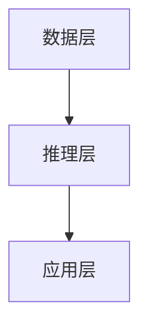
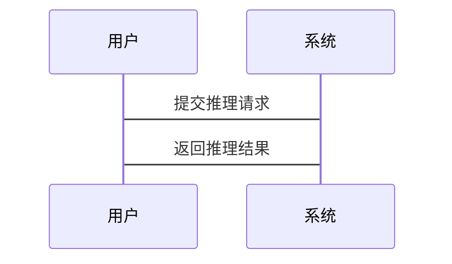

                 


# 设计AI Agent的动态知识图谱推理引擎

> 关键词：AI Agent，知识图谱，动态推理，推理引擎，系统架构

> 摘要：本文详细探讨了设计AI Agent的动态知识图谱推理引擎的关键技术与实现方法。文章首先介绍了AI Agent和知识图谱的基本概念，然后分析了动态知识图谱的构建与管理，接着深入讲解了推理引擎的核心算法，包括基于规则和基于概率的推理方法。通过系统架构设计与项目实战案例，展示了如何实现一个高效、可靠的动态知识图谱推理引擎。最后，总结了最佳实践经验和未来研究方向。

---

# 第一部分: AI Agent与知识图谱基础

## 第1章: AI Agent与知识图谱概述

### 1.1 AI Agent的基本概念

#### 1.1.1 AI Agent的定义与分类

AI Agent（人工智能代理）是指能够感知环境、自主决策并执行任务的智能实体。根据功能和应用场景的不同，AI Agent可以分为以下几类：

1. **简单反射型代理**：基于当前感知直接执行预定义的行为。
2. **基于模型的反射型代理**：利用内部状态模型进行决策。
3. **目标驱动型代理**：根据预设目标进行自主决策。
4. **效用驱动型代理**：通过最大化效用函数来优化决策。

#### 1.1.2 知识图谱的基本概念

知识图谱是一种以结构化形式表示知识的图数据，由实体（节点）和关系（边）组成。知识图谱的核心特性包括：

- **可扩展性**：支持大规模数据的存储与管理。
- **语义丰富性**：通过属性和关系描述复杂的语义信息。
- **动态性**：支持实时更新和维护。

#### 1.1.3 动态知识图谱的特性

动态知识图谱是指能够实时感知和更新知识信息的图数据结构。其主要特性包括：

- **实时更新**：支持数据的动态插入、删除和修改。
- **版本控制**：记录知识图谱的历史状态。
- **高效查询**：支持快速的图数据查询与推理。

### 1.2 AI Agent与知识图谱的结合

#### 1.2.1 知识图谱在AI Agent中的作用

知识图谱为AI Agent提供了丰富的语义信息，使其能够更好地理解上下文并做出更智能的决策。具体作用包括：

1. **语义理解**：通过知识图谱理解输入数据的语义。
2. **推理与决策**：基于知识图谱进行推理，生成最优决策。
3. **知识表示**：利用知识图谱表示复杂的知识体系。

#### 1.2.2 动态知识图谱的特点

动态知识图谱在AI Agent中的应用具有以下特点：

- **实时性**：能够实时更新知识图谱，适应动态变化的环境。
- **高效性**：支持高效的图数据查询与推理。
- **灵活性**：能够根据需求动态调整知识图谱的结构。

#### 1.2.3 推理引擎的核心作用

推理引擎是AI Agent动态知识图谱推理的核心组件，其主要作用包括：

1. **知识表示**：将知识图谱中的实体和关系表示为符号或逻辑表达式。
2. **推理规则**：定义推理规则，支持基于规则或概率的推理。
3. **推理过程**：根据推理规则和知识图谱中的数据，生成推理结果。

---

## 第2章: 动态知识图谱的构建与管理

### 2.1 知识图谱的构建过程

#### 2.1.1 数据采集与预处理

数据采集是知识图谱构建的第一步，主要包括以下步骤：

1. **数据源选择**：从多种数据源（如数据库、文本文件、API接口等）获取数据。
2. **数据清洗**：对采集的数据进行去重、格式转换等预处理操作。
3. **数据存储**：将预处理后的数据存储到知识图谱的存储系统中。

#### 2.1.2 实体识别与关系抽取

实体识别和关系抽取是知识图谱构建的关键步骤，具体包括：

1. **实体识别**：通过自然语言处理技术从文本中提取实体。
2. **关系抽取**：识别实体之间的关系，并建立关系边。

#### 2.1.3 知识图谱的存储与管理

知识图谱的存储与管理需要考虑以下方面：

1. **存储结构**：选择适合的知识图谱存储格式（如RDF、OWL等）。
2. **数据索引**：建立高效的索引结构，支持快速的查询与推理。
3. **版本控制**：记录知识图谱的历史版本，便于回滚和管理。

### 2.2 动态知识图谱的更新机制

#### 2.2.1 动态数据的实时更新

动态知识图谱需要实时更新，主要包括以下步骤：

1. **数据感知**：实时感知环境中的动态数据变化。
2. **数据同步**：将新数据同步到知识图谱中。
3. **版本记录**：记录每次更新的历史版本。

#### 2.2.2 知识图谱版本控制

版本控制是动态知识图谱管理的重要环节，主要包括：

1. **版本标识**：为每个版本分配唯一的标识符。
2. **版本存储**：将不同版本的知识图谱存储起来。
3. **版本回滚**：支持从当前版本回滚到任意历史版本。

#### 2.2.3 更新策略与优化方法

动态知识图谱的更新需要考虑以下策略：

1. **增量更新**：仅更新发生变化的部分，减少计算开销。
2. **批量更新**：将多个更新操作批量处理，提高效率。
3. **冲突处理**：解决数据更新过程中可能出现的冲突问题。

---

## 第3章: 推理引擎的工作原理

### 3.1 推理引擎的定义与分类

#### 3.1.1 推理引擎的基本概念

推理引擎是基于知识图谱进行推理的核心组件，其基本功能包括：

1. **知识表示**：将知识图谱中的实体和关系表示为符号或逻辑表达式。
2. **推理规则**：定义推理规则，支持基于规则或概率的推理。
3. **推理过程**：根据推理规则和知识图谱中的数据，生成推理结果。

#### 3.1.2 基于规则的推理

基于规则的推理是一种常用的推理方法，其核心是通过预定义的推理规则进行推理。具体步骤如下：

1. **规则定义**：定义推理规则，通常以逻辑表达式的形式表示。
2. **规则匹配**：将知识图谱中的数据与推理规则进行匹配。
3. **推理结果生成**：根据匹配结果生成推理结论。

#### 3.1.3 基于概率的推理

基于概率的推理是一种统计推理方法，主要应用于处理不确定性问题。常用的方法包括贝叶斯推理和马尔可夫逻辑网络推理。

### 3.2 动态知识图谱推理的关键技术

#### 3.2.1 实时推理的挑战

动态知识图谱推理需要应对以下挑战：

1. **实时性**：需要在动态变化的环境中实现实时推理。
2. **高效性**：需要高效的推理算法和数据结构。
3. **不确定性处理**：需要处理知识图谱中的不确定性问题。

#### 3.2.2 动态知识的高效处理

动态知识图谱推理需要高效的处理方法，主要包括：

1. **增量推理**：仅对变化的部分进行推理，减少计算开销。
2. **分布式推理**：利用分布式计算技术提高推理效率。
3. **并行推理**：通过并行计算加速推理过程。

#### 3.2.3 推理结果的可信度评估

推理结果的可信度评估是动态知识图谱推理的重要环节，主要包括：

1. **结果验证**：对推理结果进行验证，确保其正确性。
2. **可信度计算**：计算推理结果的可信度，通常基于概率或置信度。
3. **结果优化**：通过优化算法提高推理结果的可信度。

---

## 第4章: 知识图谱推理引擎的核心算法

### 4.1 基于规则的推理算法

#### 4.1.1 基于规则的推理原理

基于规则的推理算法通过预定义的推理规则进行推理，其核心步骤包括：

1. **规则匹配**：将知识图谱中的数据与推理规则进行匹配。
2. **推理结果生成**：根据匹配结果生成推理结论。

#### 4.1.2 基于规则的推理实现

基于规则的推理实现需要考虑以下方面：

1. **规则表示**：将推理规则表示为符号或逻辑表达式。
2. **规则匹配算法**：选择高效的规则匹配算法，如基于模式匹配的算法。
3. **规则推理优化**：通过优化算法提高推理效率。

#### 4.1.3 规则的动态更新机制

基于规则的推理需要支持规则的动态更新，主要包括：

1. **规则更新**：允许用户动态添加、修改或删除推理规则。
2. **规则版本控制**：记录规则的历史版本，便于回滚和管理。

### 4.2 基于概率的推理算法

#### 4.2.1 基于概率的推理原理

基于概率的推理算法通过计算事件发生的概率来进行推理。常用的方法包括贝叶斯推理和马尔可夫逻辑网络推理。

#### 4.2.2 基于概率的推理实现

基于概率的推理实现需要考虑以下方面：

1. **概率计算**：计算事件发生的概率，通常需要使用概率公式或贝叶斯网络。
2. **概率更新**：根据新数据动态更新概率值。
3. **概率推理优化**：通过优化算法提高推理效率。

#### 4.2.3 概率推理的数学模型

基于概率的推理可以使用贝叶斯网络来进行建模，其数学表达式如下：

$$ P(A|B) = \frac{P(B|A) \cdot P(A)}{P(B)} $$

其中，$P(A|B)$ 是在事件B发生的条件下事件A发生的概率，$P(B|A)$ 是在事件A发生的条件下事件B发生的概率，$P(A)$ 是事件A发生的先验概率，$P(B)$ 是事件B发生的先验概率。

---

## 第5章: 系统分析与架构设计

### 5.1 问题场景介绍

动态知识图谱推理引擎的设计需要解决以下问题：

1. **实时性**：需要在动态变化的环境中实现实时推理。
2. **高效性**：需要高效的推理算法和数据结构。
3. **不确定性处理**：需要处理知识图谱中的不确定性问题。

### 5.2 项目介绍

本项目旨在设计一个高效的动态知识图谱推理引擎，支持AI Agent在复杂动态环境中的智能推理与决策。

### 5.3 系统功能设计

系统功能设计包括以下几个模块：

1. **数据管理模块**：负责知识图谱的构建、存储与管理。
2. **推理引擎模块**：负责基于知识图谱进行推理，生成推理结果。
3. **用户接口模块**：提供友好的用户界面，支持用户的交互与配置。

### 5.4 系统架构设计

系统架构设计采用分层架构，主要包括数据层、推理层和应用层。以下是系统的架构图：



其中，数据层负责知识图谱的存储与管理，推理层负责基于知识图谱进行推理，应用层负责与用户的交互和结果展示。

### 5.5 系统接口设计

系统接口设计包括以下几个部分：

1. **数据接口**：提供知识图谱数据的读取和写入接口。
2. **推理接口**：提供推理引擎的调用接口，支持基于规则和基于概率的推理。
3. **用户接口**：提供友好的用户界面，支持用户的交互与配置。

### 5.6 系统交互设计

系统交互设计采用序列图，描述用户与系统之间的交互过程：



---

## 第6章: 项目实战

### 6.1 环境安装

#### 6.1.1 系统需求

1. **操作系统**：支持Linux、Windows、macOS。
2. **开发工具**：安装Python、Jupyter Notebook、Git等工具。
3. **依赖库安装**：安装必要的依赖库，如NetworkX、Matplotlib、Scikit-learn等。

#### 6.1.2 环境配置

1. **Python版本**：建议使用Python 3.8或更高版本。
2. **虚拟环境配置**：使用virtualenv或conda创建虚拟环境，并安装必要的依赖库。

### 6.2 系统核心实现

#### 6.2.1 数据管理模块实现

数据管理模块负责知识图谱的构建、存储与管理。以下是数据管理模块的代码实现：

```python
import networkx as nx

class KnowledgeGraph:
    def __init__(self):
        self.graph = nx.DiGraph()

    def add_entity(self, entity):
        self.graph.add_node(entity)

    def add_relation(self, source, target, relation):
        self.graph.add_edge(source, target, label=relation)

    def save(self, filename):
        nx.write_gml(self.graph, filename)
```

#### 6.2.2 推理引擎模块实现

推理引擎模块负责基于知识图谱进行推理。以下是推理引擎模块的代码实现：

```python
import networkx as nx

class ReasoningEngine:
    def __init__(self, knowledge_graph):
        self.graph = knowledge_graph.graph

    def rule_based_reasoning(self, source, relation):
        for edge in self.graph.edges(source):
            if edge[1] == source and edge[2] == relation:
                return edge[0]
        return None

    def probabilistic_reasoning(self, source, relation):
        # 简单的概率推理实现
        count = 0
        for edge in self.graph.edges(source):
            if edge[1] == source and edge[2] == relation:
                count += 1
        return count > 0
```

#### 6.2.3 系统交互实现

系统交互模块负责与用户的交互和结果展示。以下是系统交互模块的代码实现：

```python
class SystemInterface:
    def __init__(self, knowledge_graph, reasoning_engine):
        self.knowledge_graph = knowledge_graph
        self.reasoning_engine = reasoning_engine

    def add_entity(self, entity):
        self.knowledge_graph.add_entity(entity)

    def add_relation(self, source, target, relation):
        self.knowledge_graph.add_relation(source, target, relation)

    def query(self, source, relation):
        result = self.reasoning_engine.reasoning(source, relation)
        print(f"推理结果：{result}")
```

### 6.3 代码应用解读与分析

通过上述代码实现，我们可以看到动态知识图谱推理引擎的核心功能包括：

1. **知识图谱的构建与管理**：通过数据管理模块实现知识图谱的构建、存储与管理。
2. **基于规则的推理**：通过推理引擎模块实现基于规则的推理，支持简单的推理规则。
3. **基于概率的推理**：通过推理引擎模块实现基于概率的推理，支持简单的概率计算。
4. **系统交互**：通过系统交互模块实现与用户的交互，支持添加实体、关系和查询推理结果。

### 6.4 实际案例分析

以下是动态知识图谱推理引擎的一个实际案例：

```python
# 初始化知识图谱和推理引擎
kg = KnowledgeGraph()
reasoning_engine = ReasoningEngine(kg)
system_interface = SystemInterface(kg, reasoning_engine)

# 添加实体和关系
system_interface.add_entity("A")
system_interface.add_entity("B")
system_interface.add_relation("A", "B", "related")

# 查询推理结果
system_interface.query("A", "related")
```

### 6.5 项目小结

通过本项目的实现，我们可以看到动态知识图谱推理引擎的核心功能包括知识图谱的构建与管理、基于规则和基于概率的推理，以及系统的交互与展示。通过合理的系统设计和代码实现，可以高效地完成动态知识图谱的推理任务。

---

## 第7章: 总结与最佳实践

### 7.1 总结

本文详细探讨了设计AI Agent的动态知识图谱推理引擎的关键技术与实现方法。通过系统的分析与设计，展示了如何实现一个高效、可靠的动态知识图谱推理引擎。本文的主要内容包括：

1. **AI Agent与知识图谱的基础概念**
2. **动态知识图谱的构建与管理**
3. **知识图谱推理引擎的核心算法**
4. **系统分析与架构设计**
5. **项目实战与案例分析**

### 7.2 最佳实践 tips

1. **数据质量管理**：确保数据的准确性、完整性和一致性。
2. **算法优化**：根据具体应用场景选择合适的推理算法，并进行优化。
3. **系统架构设计**：采用分层架构，确保系统的可扩展性和可维护性。
4. **代码实现**：遵循良好的编程习惯，确保代码的可读性和可维护性。

### 7.3 小结

动态知识图谱推理引擎的设计与实现是一个复杂的系统工程，需要综合考虑数据管理、算法优化、系统架构等多个方面。通过本文的探讨，希望能够为AI Agent的设计与实现提供有益的参考与指导。

### 7.4 注意事项

1. **数据隐私与安全**：在处理敏感数据时，需要注意数据的隐私与安全问题。
2. **性能优化**：在实现推理引擎时，需要注意算法的性能优化，确保系统的高效性。
3. **错误处理**：在系统设计中，需要考虑各种可能的错误情况，并进行合理的错误处理。

### 7.5 拓展阅读

1. **《知识图谱：概念、方法与应用》**
2. **《AI Agent与智能系统设计》**
3. **《动态知识图谱的构建与管理》**

---

# 作者

作者：AI天才研究院/AI Genius Institute & 禅与计算机程序设计艺术 /Zen And The Art of Computer Programming

---

本文通过系统的分析与设计，展示了如何实现一个高效、可靠的动态知识图谱推理引擎。通过本文的探讨，希望能够为AI Agent的设计与实现提供有益的参考与指导。

