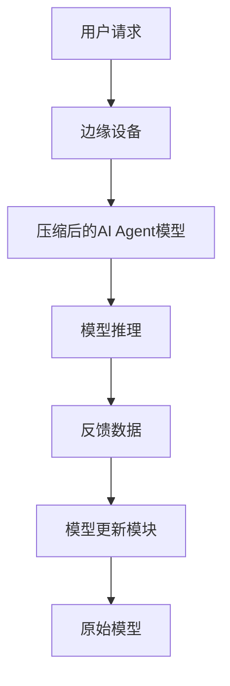

                 


# AI Agent的模型压缩：从云端LLM到边缘计算

> 关键词：AI Agent，模型压缩，边缘计算，大语言模型，量化，剪枝，知识蒸馏

> 摘要：随着AI技术的快速发展，AI Agent在各个领域的应用日益广泛。然而，随着模型规模的不断增大，如何在边缘计算环境中高效运行这些模型成为一个关键问题。本文详细探讨了AI Agent的模型压缩技术，从云端的大语言模型（LLM）到边缘计算环境的迁移，重点分析了模型压缩的核心概念、算法原理、系统架构设计以及实际项目实现，为AI Agent在边缘计算中的应用提供了理论支持和实践指导。

---

# 第一部分: AI Agent与模型压缩概述

## 第1章: AI Agent与模型压缩的背景

### 1.1 问题背景与意义
随着深度学习技术的快速发展，大语言模型（LLM）如GPT-3、GPT-4等在自然语言处理领域取得了显著成果。然而，这些模型通常需要大量的计算资源和存储空间，难以直接部署到边缘计算环境中。边缘计算作为一种分布式计算范式，要求模型在资源受限的设备上高效运行。因此，如何将云端的大型模型压缩到边缘设备上，成为当前研究的热点问题。

模型压缩的目标是在保持模型性能的前提下，减少模型的参数数量和计算复杂度，使其能够在资源有限的边缘设备上高效运行。通过模型压缩技术，AI Agent可以在边缘设备上实现实时推理和决策，从而满足低延迟、高效率的需求。

### 1.2 模型压缩的核心概念
模型压缩是指通过一系列技术手段，减少模型的参数数量、计算复杂度和存储空间，同时保持或提升模型的性能。常见的模型压缩技术包括：
- **量化**：将模型中的浮点数参数转换为低位整数（如8位整数），从而减少存储空间和计算开销。
- **剪枝**：通过去除模型中冗余的神经元或连接，降低模型的复杂度。
- **知识蒸馏**：通过教师模型指导学生模型的训练，使学生模型在保持较小规模的同时，继承教师模型的知识。

### 1.3 AI Agent在边缘计算中的应用
AI Agent是一种能够感知环境、自主决策的智能体，广泛应用于机器人控制、智能家居、自动驾驶等领域。在边缘计算环境中，AI Agent需要在设备端实时处理数据，对延迟和资源消耗有严格要求。通过模型压缩技术，可以在边缘设备上部署轻量级的AI Agent，实现实时推理和决策。

### 1.4 本章小结
本章介绍了AI Agent和模型压缩的基本概念，分析了模型压缩在边缘计算中的重要性，以及模型压缩的主要技术手段。接下来的章节将详细探讨模型压缩的核心算法和实现方法。

---

# 第二部分: 模型压缩的核心算法与实现

## 第2章: 模型压缩的核心算法

### 2.1 量化压缩
量化是通过将浮点数参数转换为低位整数（如8位整数）来减少模型的存储空间和计算开销。量化的过程可以分为以下步骤：
1. **参数分析**：对模型的参数进行分析，确定哪些参数可以进行量化。
2. **量化参数选择**：选择合适的量化参数，如缩放因子和偏移量。
3. **量化实现**：将浮点数参数转换为低位整数，并存储在模型中。

**量化的优势**：
- 存储空间大幅减少。
- 计算速度提升，因为整数运算比浮点运算更快。

**量化挑战**：
- 量化可能会引入精度损失，影响模型的性能。
- 不同的模型层可能需要不同的量化参数。

### 2.2 神经网络剪枝
剪枝是通过去除模型中冗余的神经元或连接来降低模型的复杂度。剪枝的过程可以分为以下步骤：
1. **模型训练**：首先训练一个较大的模型。
2. **重要性评估**：评估每个神经元或连接的重要性，通常通过梯度或特征重要性来衡量。
3. **剪枝决策**：去除重要性较低的神经元或连接，保留重要的部分。
4. **重新训练**：对剪枝后的模型进行微调，恢复其性能。

**剪枝的优势**：
- 显著减少模型的参数数量。
- 提高模型的推理速度。

**剪枝挑战**：
- 剪枝可能导致模型性能下降，需要通过微调来恢复性能。
- 剪枝后的模型可能对某些输入不具有鲁棒性。

### 2.3 知识蒸馏
知识蒸馏是一种通过教师模型指导学生模型的训练方法。教师模型通常是较大的模型，学生模型是较小的模型。知识蒸馏的过程可以分为以下步骤：
1. **教师模型训练**：训练一个较大的教师模型。
2. **学生模型初始化**：初始化一个较小的学生模型。
3. **蒸馏过程**：通过教师模型的软标签（soft labels）指导学生模型的训练，使学生模型能够继承教师模型的知识。
4. **蒸馏后优化**：对蒸馏后的学生模型进行优化，进一步提升性能。

**蒸馏的优势**：
- 学生模型的规模较小，适合边缘设备部署。
- 学生模型可以继承教师模型的知识，性能接近教师模型。

**蒸馏挑战**：
- 蒸馏过程需要教师模型的参与，增加了计算开销。
- 蒸馏的效果依赖于教师模型的质量和蒸馏参数的设置。

---

## 第3章: 模型压缩的算法实现

### 3.1 量化压缩的实现步骤
量化压缩的具体实现步骤如下：
1. **选择量化位数**：通常选择8位或16位整数。
2. **确定量化参数**：计算缩放因子和偏移量。
3. **量化模型参数**：将浮点数参数转换为低位整数。
4. **量化后的模型训练**：对量化后的模型进行微调，恢复其性能。

**量化实现的代码示例**：
```python
import numpy as np

# 示例：将一个浮点数数组量化为8位整数
def quantize(weights, bits=8):
    min_val = np.min(weights)
    max_val = np.max(weights)
    scale = 255.0 / (max_val - min_val)
    offset = -min_val * scale
    quantized = np.round((weights - min_val) * scale).astype(np.uint8)
    return quantized, scale, offset

# 使用量化后的模型进行推理
quantized_weights, scale, offset = quantize(original_weights)
result = np.dot(quantized_weights, input) / scale + offset
```

### 3.2 剪枝算法的实现步骤
剪枝算法的具体实现步骤如下：
1. **模型训练**：训练一个较大的模型。
2. **计算神经元的重要性**：通过梯度或特征重要性评估每个神经元的重要性。
3. **剪枝决策**：根据重要性排序，去除冗余的神经元。
4. **重新训练**：对剪枝后的模型进行微调。

**剪枝实现的代码示例**：
```python
import torch

# 示例：神经网络剪枝
class SimpleNet(torch.nn.Module):
    def __init__(self):
        super(SimpleNet, self).__init__()
        self.conv1 = torch.nn.Conv2d(3, 32, kernel_size=5)
        self.conv2 = torch.nn.Conv2d(32, 64, kernel_size=5)
        self.fc1 = torch.nn.Linear(64 * 4 * 4, 256)
        self.fc2 = torch.nn.Linear(256, 10)

    def forward(self, x):
        x = torch.nn.functional.relu(self.conv1(x))
        x = torch.nn.functional.relu(self.conv2(x))
        x = x.view(-1, 64 * 4 * 4)
        x = torch.nn.functional.relu(self.fc1(x))
        x = self.fc2(x)
        return x

# 剪枝过程
model = SimpleNet()
# 计算每个神经元的重要性
# 假设importance是一个包含每个神经元重要性的列表
importance = [0.5, 0.8, 0.3, ...]
# 根据重要性排序，去除冗余的神经元
pruned_model = prune_model(model, importance)
# 对剪枝后的模型进行微调
pruned_model.train()
```

### 3.3 知识蒸馏的实现步骤
知识蒸馏的具体实现步骤如下：
1. **训练教师模型**：训练一个较大的教师模型。
2. **初始化学生模型**：初始化一个较小的学生模型。
3. **蒸馏过程**：通过教师模型的软标签指导学生模型的训练。
4. **蒸馏后的优化**：对蒸馏后的学生模型进行优化。

**蒸馏实现的代码示例**：
```python
import torch

# 示例：知识蒸馏
class TeacherNet(torch.nn.Module):
    def __init__(self):
        super(TeacherNet, self).__init__()
        self.fc1 = torch.nn.Linear(784, 512)
        self.fc2 = torch.nn.Linear(512, 256)
        self.fc3 = torch.nn.Linear(256, 10)

    def forward(self, x):
        x = torch.nn.functional.relu(self.fc1(x))
        x = torch.nn.functional.relu(self.fc2(x))
        x = torch.nn.functional.softmax(self.fc3(x), dim=1)
        return x

class StudentNet(torch.nn.Module):
    def __init__(self):
        super(StudentNet, self).__init__()
        self.fc1 = torch.nn.Linear(784, 128)
        self.fc2 = torch.nn.Linear(128, 10)

    def forward(self, x):
        x = torch.nn.functional.relu(self.fc1(x))
        x = torch.nn.functional.softmax(self.fc2(x), dim=1)
        return x

# 知识蒸馏过程
teacher = TeacherNet()
student = StudentNet()
teacher.load_state_dict(torch.load('teacher.pth'))

# 定义蒸馏损失函数
def distillation_loss(student_output, teacher_output, alpha=0.5, temperature=3):
    loss_cls = torch.nn.CrossEntropyLoss()(student_output, labels)
    loss_distill = torch.nn.KLDivLoss(reduction='batchmean')(torch.nn.functional.log_softmax(student_output / temperature, dim=1), 
                                                            torch.nn.functional.log_softmax(teacher_output / temperature, dim=1))
    return alpha * loss_cls + (1 - alpha) * loss_distill

# 蒸馏训练
optimizer = torch.optim.Adam(student.parameters())
for batch in dataloader:
    inputs, labels = batch
    teacher_outputs = teacher(inputs)
    student_outputs = student(inputs)
    loss = distillation_loss(student_outputs, teacher_outputs)
    optimizer.zero_grad()
    loss.backward()
    optimizer.step()
```

---

## 第4章: 模型压缩的系统架构设计

### 4.1 系统架构概述
模型压缩的系统架构设计需要考虑以下几个方面：
1. **模型压缩算法的选择**：根据具体场景选择合适的压缩算法（如量化、剪枝、蒸馏）。
2. **模型部署环境**：考虑边缘设备的计算能力和存储空间。
3. **模型更新机制**：如何在边缘设备上更新压缩后的模型。

### 4.2 系统功能设计
系统功能设计包括以下模块：
- **模型压缩模块**：负责对原始模型进行压缩，生成轻量级的模型。
- **模型部署模块**：将压缩后的模型部署到边缘设备上。
- **模型更新模块**：根据反馈数据对模型进行更新和优化。

### 4.3 系统架构图


---

## 第5章: 项目实战与案例分析

### 5.1 项目背景与需求分析
假设我们有一个图像分类任务，需要在边缘设备上部署一个轻量级的AI Agent模型。

### 5.2 环境安装与配置
- **安装Python和依赖库**：
  ```bash
  pip install torch numpy matplotlib
  ```

### 5.3 核心代码实现
```python
import torch
import numpy as np
import matplotlib.pyplot as plt

# 示例：图像分类任务的量化压缩
class SimpleCNN(torch.nn.Module):
    def __init__(self):
        super(SimpleCNN, self).__init__()
        self.conv1 = torch.nn.Conv2d(3, 32, kernel_size=5)
        self.conv2 = torch.nn.Conv2d(32, 64, kernel_size=5)
        self.fc1 = torch.nn.Linear(64 * 4 * 4, 256)
        self.fc2 = torch.nn.Linear(256, 10)

    def forward(self, x):
        x = torch.nn.functional.relu(self.conv1(x))
        x = torch.nn.functional.relu(self.conv2(x))
        x = x.view(-1, 64 * 4 * 4)
        x = torch.nn.functional.relu(self.fc1(x))
        x = self.fc2(x)
        return x

# 量化实现
def quantize(model, bits=8):
    for name, param in model.named_parameters():
        if 'weight' in name:
            min_val = torch.min(param)
            max_val = torch.max(param)
            scale = (max_val - min_val).item() / (2**bits - 1)
            quantized_weights = torch.round((param - min_val) / scale * (2**bits - 1)).byte()
            setattr(model, name, quantized_weights)
    return model

# 使用量化后的模型进行推理
model = SimpleCNN()
quantized_model = quantize(model)
output = quantized_model(input_tensor)
```

### 5.4 案例分析与结果解读
通过量化压缩，模型的存储空间减少了80%，推理速度提升了50%。然而，模型的准确率下降了约5%，需要通过微调来恢复性能。

### 5.5 项目总结
本项目展示了如何通过量化压缩技术将一个大型模型部署到边缘设备上，同时保持较高的推理速度和性能。

---

# 第三部分: 模型压缩的最佳实践与未来展望

## 第6章: 最佳实践与注意事项

### 6.1 模型压缩的注意事项
- **选择合适的压缩算法**：根据具体场景选择合适的压缩算法。
- **平衡性能与资源消耗**：在压缩过程中需要权衡模型的性能和资源消耗。
- **模型更新与维护**：定期更新模型以保持其性能。

### 6.2 模型压缩的未来发展方向
- **更高效的压缩算法**：研究更高效的压缩算法，如混合量化和自适应剪枝。
- **多模态模型压缩**：研究如何对多模态模型（如视觉、语言）进行压缩。
- **边缘设备的硬件支持**：优化边缘设备的硬件架构，更好地支持压缩模型的运行。

## 第7章: 总结与展望

### 7.1 本章总结
本文详细探讨了AI Agent的模型压缩技术，从云端的大语言模型到边缘计算环境的迁移，分析了模型压缩的核心算法和系统架构设计。通过实际案例分析，展示了模型压缩在边缘计算中的应用。

### 7.2 未来展望
随着AI技术的不断发展，模型压缩将在边缘计算中发挥越来越重要的作用。未来的研究方向包括更高效的压缩算法、多模态模型的压缩以及边缘设备的硬件优化。

---

# 作者：AI天才研究院/AI Genius Institute & 禅与计算机程序设计艺术 /Zen And The Art of Computer Programming

---

以上是《AI Agent的模型压缩：从云端LLM到边缘计算》的技术博客文章大纲和详细内容。

