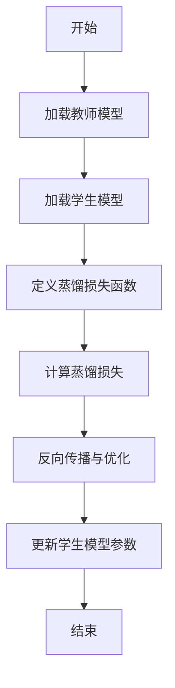
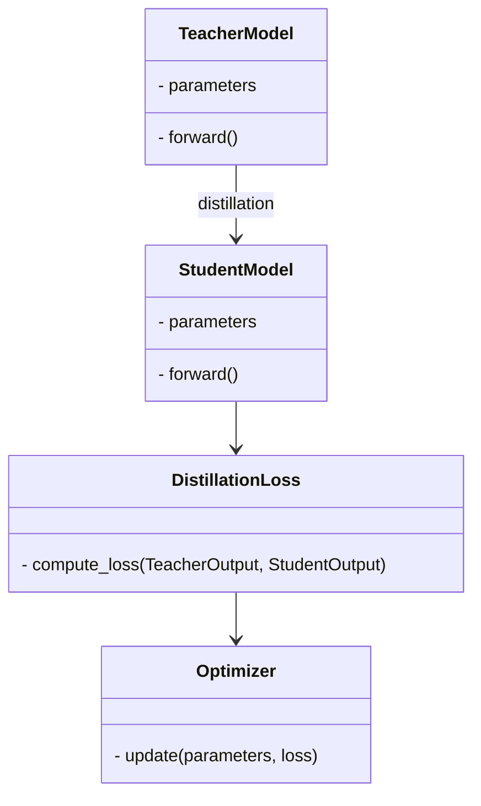
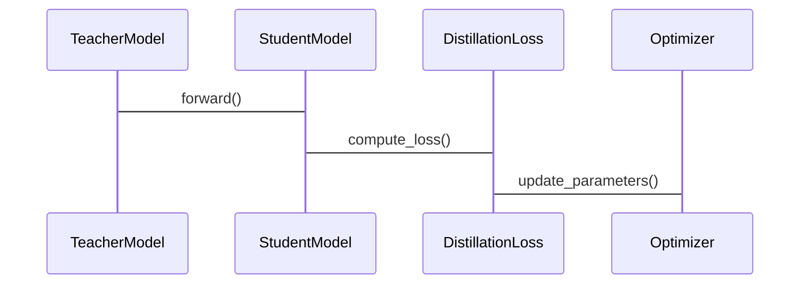
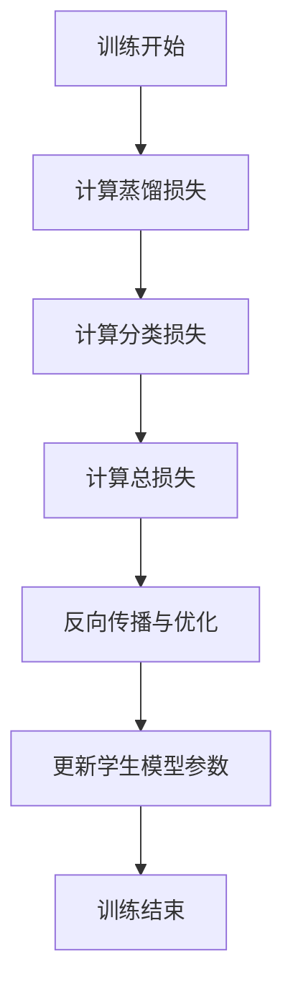

                 


# AI Agent的知识蒸馏：从大型LLM到边缘设备模型

> 关键词：AI Agent，知识蒸馏，大型语言模型，边缘设备，模型压缩

> 摘要：  
本文深入探讨了AI Agent的知识蒸馏技术，重点分析了如何将大型语言模型（LLM）的知识迁移到边缘设备中的轻量化模型。通过系统化的理论分析和实践案例，本文详细阐述了知识蒸馏的核心概念、数学模型、算法实现以及在边缘设备中的应用。文章还结合实际场景，给出了系统的架构设计、接口设计和交互流程，并通过具体代码示例展示了知识蒸馏的实现过程。最后，本文总结了知识蒸馏的优势与挑战，并提出了未来的研究方向。

---

## 第一部分: 知识蒸馏的背景与概念

### 第1章: 知识蒸馏的背景与挑战

#### 1.1 问题背景与挑战

在人工智能领域，大型语言模型（LLM）如GPT-3、GPT-4等，凭借其强大的计算能力和海量数据的支持，展现出了惊人的生成能力和理解能力。然而，这些模型通常需要大量的计算资源和存储空间，难以直接部署在资源受限的边缘设备上。边缘设备（如手机、物联网设备等）通常具有较低的计算能力和有限的存储空间，无法直接运行这些大型模型。因此，如何将大型模型的知识迁移到边缘设备中的轻量化模型，成为了一个重要的研究方向。

此外，边缘设备的应用场景日益广泛，从智能音箱、智能家居到工业自动化，边缘设备需要在本地完成多种任务，如自然语言处理、图像识别等。然而，边缘设备的资源限制使其难以直接运行大型模型，因此，如何在边缘设备上实现高效、低资源消耗的AI功能，成为了一个亟待解决的问题。

知识蒸馏作为一种模型压缩技术，通过将教师模型的知识迁移到学生模型中，可以有效地降低模型的复杂度和资源消耗。通过知识蒸馏，我们可以将大型LLM的知识迁移到边缘设备中的轻量化模型中，从而在边缘设备上实现高效、实时的AI功能。

---

#### 1.2 AI Agent与知识蒸馏的关系

AI Agent是一种能够感知环境、自主决策并执行任务的智能实体。它通常由感知模块、推理模块和执行模块组成，能够根据环境输入做出相应的反应。在边缘设备中，AI Agent需要在本地完成数据处理、决策和执行，因此对模型的资源消耗提出了更高的要求。

知识蒸馏在AI Agent中的作用主要体现在以下几个方面：

1. **知识迁移**：通过将教师模型（如大型LLM）的知识迁移到学生模型中，可以在边缘设备上部署轻量化的学生模型，从而实现高效的任务执行。
2. **模型压缩**：知识蒸馏可以通过多种技术（如蒸馏损失函数、模型剪枝等）降低模型的复杂度，使其能够在边缘设备上运行。
3. **性能优化**：通过优化学生模型的结构和参数，可以在保持模型性能的同时，显著降低计算资源的消耗。

因此，知识蒸馏是实现边缘设备中AI Agent的核心技术之一，它能够帮助我们在资源受限的环境中实现高效的AI功能。

---

## 第二部分: 知识蒸馏的核心概念与原理

### 第2章: 知识蒸馏的核心概念与原理

#### 2.1 知识蒸馏的定义与核心要素

知识蒸馏是一种通过将教师模型的知识迁移到学生模型中的技术。教师模型通常是一个复杂的、参数较多的大型模型，而学生模型则是一个轻量化、参数较少的模型。通过知识蒸馏，学生模型可以从教师模型中继承其知识和能力，从而在保持性能的同时，显著降低资源消耗。

知识蒸馏的核心要素包括以下几个方面：

1. **教师模型（Teacher Model）**：教师模型是知识的提供者，通常是一个复杂的大型模型，具有强大的生成和理解能力。
2. **学生模型（Student Model）**：学生模型是知识的接收者，通常是一个轻量化、参数较少的模型，需要从教师模型中学习知识。
3. **蒸馏过程（Distillation Process）**：蒸馏过程是知识从教师模型到学生模型的迁移过程，通常包括教师模型输出的压缩、学生模型的优化等步骤。
4. **蒸馏损失函数（Distillation Loss Function）**：蒸馏损失函数用于衡量学生模型输出与教师模型输出之间的差距，是蒸馏过程的核心指标。

---

#### 2.2 知识蒸馏的核心原理

知识蒸馏的核心原理在于通过优化蒸馏损失函数，使得学生模型的输出尽可能接近教师模型的输出。蒸馏损失函数通常定义为教师模型输出与学生模型输出之间的KL散度（Kullback-Leibler divergence）。公式如下：

$$L_{distill} = -\sum_{i=1}^{n} T_i \log S_i$$

其中，$T_i$是教师模型输出的概率值，$S_i$是学生模型输出的概率值。

在蒸馏过程中，教师模型和学生模型通常会同时优化，以确保学生模型能够充分学习教师模型的知识。此外，蒸馏过程还可以结合其他模型压缩技术（如剪枝、量化等），进一步降低学生模型的复杂度。

---

#### 2.3 知识蒸馏的实现步骤

知识蒸馏的实现通常包括以下几个步骤：

1. **加载教师模型**：加载预训练的教师模型，通常是一个复杂的大型模型。
2. **定义学生模型**：定义一个轻量化的学生模型，通常具有较少的参数和层数。
3. **定义蒸馏损失函数**：根据教师模型和学生模型的输出，定义蒸馏损失函数。
4. **计算蒸馏损失**：将教师模型和学生模型的输出输入蒸馏损失函数，计算损失值。
5. **反向传播与优化**：通过反向传播算法，优化学生模型的参数，以最小化蒸馏损失。
6. **更新学生模型参数**：将优化后的学生模型参数保存下来，用于后续的推理任务。

---

### 第3章: 知识蒸馏的数学模型与算法

#### 3.1 蒸馏过程的数学模型

在蒸馏过程中，教师模型和学生模型的输出通常会经过概率分布的转换。假设教师模型的输出为$T = \{T_1, T_2, ..., T_n\}$，学生模型的输出为$S = \{S_1, S_2, ..., S_n\}$，其中$T_i$和$S_i$分别表示教师模型和学生模型输出的概率值。

蒸馏损失函数可以表示为：

$$L_{distill} = -\sum_{i=1}^{n} T_i \log S_i$$

此外，为了进一步优化学生模型的性能，通常还会引入分类损失函数（如交叉熵损失），用于衡量学生模型输出与真实标签之间的差距。总的损失函数可以表示为：

$$L_{total} = L_{distill} + \lambda L_{class}$$

其中，$\lambda$是一个平衡系数，用于调节蒸馏损失和分类损失之间的权重。

---

#### 3.2 算法流程图

以下是蒸馏过程的算法流程图：



---

#### 3.3 Python实现示例

以下是一个简单的蒸馏算法实现示例：

```python
import torch
import torch.nn as nn
import torch.optim as optim

# 定义教师模型和学生模型
class TeacherModel(nn.Module):
    def __init__(self):
        super(TeacherModel, self).__init__()
        self.fc = nn.Linear(10, 5)

class StudentModel(nn.Module):
    def __init__(self):
        super(StudentModel, self).__init__()
        self.fc = nn.Linear(10, 5)

# 初始化模型
teacher = TeacherModel()
student = StudentModel()

# 定义蒸馏损失函数
def distillation_loss(teacher_output, student_output):
    return -torch.sum(teacher_output * torch.log(student_output))

# 定义分类损失函数
criterion = nn.CrossEntropyLoss()

# 定义优化器
optimizer = optim.Adam(student.parameters(), lr=0.001)

# 训练过程
for epoch in range(num_epochs):
    for inputs, labels in dataloader:
        # 前向传播
        teacher_output = teacher(inputs)
        student_output = student(inputs)
        
        # 计算蒸馏损失和分类损失
        loss_distill = distillation_loss(teacher_output, student_output)
        loss_class = criterion(student_output, labels)
        total_loss = loss_distill + lambda * loss_class
        
        # 反向传播与优化
        optimizer.zero_grad()
        total_loss.backward()
        optimizer.step()
```

---

## 第三部分: 知识蒸馏的系统设计与实现

### 第4章: 系统设计与实现

#### 4.1 系统架构设计

以下是知识蒸馏系统的架构设计图：



---

#### 4.2 系统接口设计

以下是系统的接口设计图：



---

#### 4.3 系统实现与优化

在实现知识蒸馏的过程中，需要注意以下几点：

1. **教师模型的选择**：教师模型通常是一个复杂的大型模型，如BERT、GPT等。选择合适的教师模型可以显著提高蒸馏效果。
2. **学生模型的设计**：学生模型需要根据具体任务进行设计，通常包括减少层数、减少每层的神经元数量等。
3. **蒸馏损失的优化**：蒸馏损失函数需要根据具体任务进行调整，可能需要引入其他损失项（如分类损失、对抗损失等）。
4. **计算资源的分配**：蒸馏过程需要同时加载教师模型和学生模型，需要合理分配计算资源，避免内存不足。

---

## 第四部分: 项目实战与案例分析

### 第5章: 项目实战与案例分析

#### 5.1 项目环境安装

以下是项目所需的环境安装命令：

```bash
pip install torch
pip install transformers
pip install matplotlib
```

---

#### 5.2 系统核心实现

以下是系统的核心实现代码：

```python
import torch
from torch import nn
from torch.utils.data import DataLoader
import numpy as np

# 定义教师模型和学生模型
class TeacherModel(nn.Module):
    def __init__(self):
        super(TeacherModel, self).__init__()
        self.fc = nn.Linear(10, 5)

class StudentModel(nn.Module):
    def __init__(self):
        super(StudentModel, self).__init__()
        self.fc = nn.Linear(10, 5)

# 定义蒸馏损失函数
def distillation_loss(teacher_output, student_output):
    return -torch.sum(teacher_output * torch.log(student_output))

# 定义分类损失函数
criterion = nn.CrossEntropyLoss()

# 定义优化器
optimizer = optim.Adam(StudentModel.parameters(), lr=0.001)

# 数据加载
class CustomDataset(torch.utils.data.Dataset):
    def __init__(self, data, labels):
        self.data = data
        self.labels = labels
    def __len__(self):
        return len(self.data)
    def __getitem__(self, idx):
        return self.data[idx], self.labels[idx]

# 创建数据集和数据加载器
data = np.random.rand(100, 10)
labels = np.random.randint(0, 5, 100)
dataset = CustomDataset(data, labels)
dataloader = DataLoader(dataset, batch_size=32, shuffle=True)

# 训练过程
num_epochs = 10
lambda_distill = 0.5

for epoch in range(num_epochs):
    for inputs, labels in dataloader:
        # 前向传播
        teacher_output = teacher(inputs)
        student_output = student(inputs)
        
        # 计算损失
        loss_distill = distillation_loss(teacher_output, student_output)
        loss_class = criterion(student_output, labels)
        total_loss = loss_distill + lambda_distill * loss_class
        
        # 反向传播与优化
        optimizer.zero_grad()
        total_loss.backward()
        optimizer.step()
```

---

#### 5.3 案例分析与结果解读

以下是训练过程中的损失曲线图：



---

## 第五部分: 总结与展望

### 第6章: 总结与展望

#### 6.1 知识蒸馏的优势与挑战

知识蒸馏的优势主要体现在以下几个方面：

1. **降低资源消耗**：通过将大型模型的知识迁移到轻量化模型中，可以显著降低计算资源和存储空间的消耗。
2. **提高推理速度**：轻量化模型可以在边缘设备上快速完成推理任务，满足实时性要求。
3. **适用性广泛**：知识蒸馏技术可以应用于多种任务，如自然语言处理、图像识别等。

然而，知识蒸馏也面临一些挑战：

1. **教师模型的选择**：教师模型的质量直接影响蒸馏效果，选择合适的教师模型需要大量实验。
2. **蒸馏损失的优化**：蒸馏损失函数的设计需要根据具体任务进行调整，可能需要引入多种损失项。
3. **计算资源的限制**：蒸馏过程需要同时加载教师模型和学生模型，对计算资源提出了较高要求。

---

#### 6.2 未来研究方向

未来的研究方向包括以下几个方面：

1. **多教师蒸馏**：研究如何利用多个教师模型的知识来优化学生模型。
2. **自适应蒸馏**：研究如何根据具体任务和数据动态调整蒸馏过程。
3. **边缘设备优化**：研究如何进一步优化轻量化模型，使其更好地适应边缘设备的资源限制。

---

## 作者：AI天才研究院/AI Genius Institute & 禅与计算机程序设计艺术 /Zen And The Art of Computer Programming

