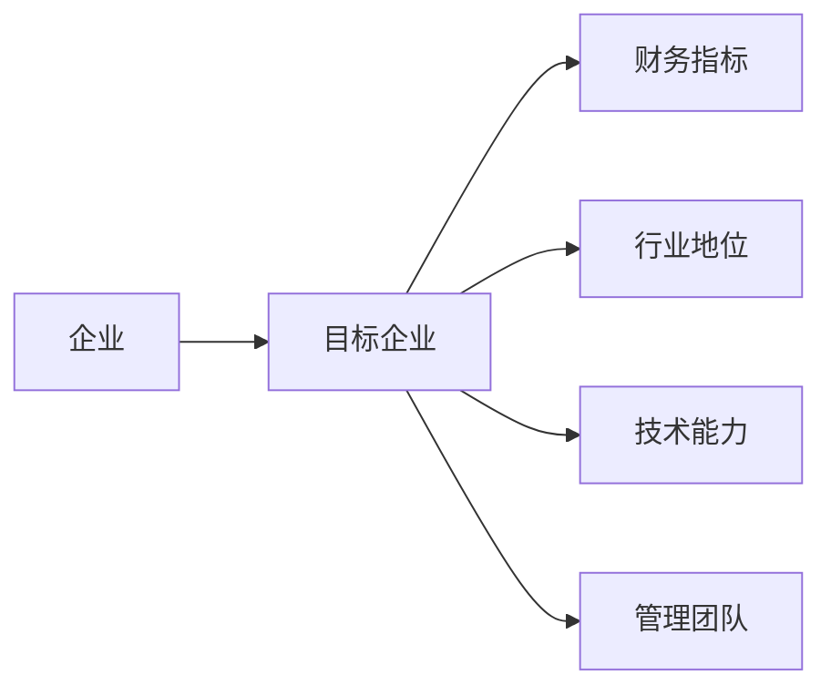
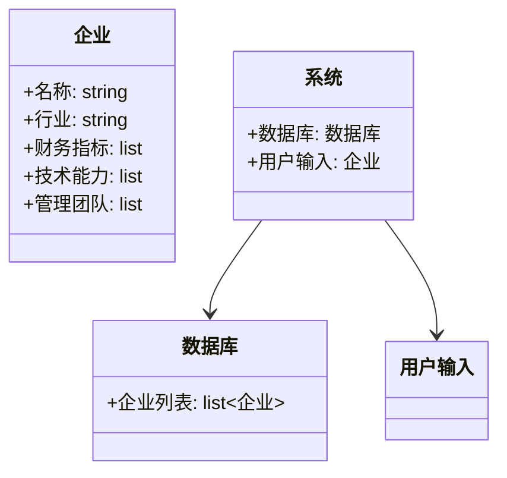

                 


# AI辅助企业并购目标筛选：多维度评估与匹配

## 关键词：企业并购、AI、目标筛选、多维度评估、算法

## 摘要：本文深入探讨了如何利用人工智能技术辅助企业并购目标筛选，从多维度评估模型的构建到AI算法的实现，再到系统架构的设计与优化，详细解析了AI在企业并购中的应用场景与实际价值。通过协同过滤推荐算法的实现与案例分析，展示了AI技术在企业并购目标匹配中的高效性与准确性。

---

# 第一部分: AI辅助企业并购目标筛选的背景与核心概念

## 第1章: 企业并购目标筛选的背景与挑战

### 1.1 企业并购的基本概念与流程

#### 1.1.1 企业并购的定义与分类
企业并购（Mergers and Acquisitions，M&A）是指两个或多个企业之间的合并或收购行为。根据目的和方式的不同，企业并购可以分为横向并购、纵向并购和混合并购。横向并购是指同一行业内的企业合并，旨在扩大市场份额；纵向并购是指上下游产业的企业合并，旨在优化供应链；混合并购是指不同行业之间的企业合并，旨在 diversify 业务。

#### 1.1.2 企业并购的目标筛选流程
企业并购的目标筛选流程通常包括以下几个步骤：
1. **战略匹配性分析**：评估目标企业是否符合并购方的长期战略目标。
2. **财务状况评估**：分析目标企业的财务健康状况，包括盈利能力、资产负债率等。
3. **行业地位分析**：评估目标企业在行业中的竞争地位和市场影响力。
4. **管理团队评估**：考察目标企业的管理团队能力与稳定性。
5. **技术与产品评估**：评估目标企业的产品竞争力和技术储备。

#### 1.1.3 并购目标筛选中的常见问题
在传统的企业并购目标筛选过程中，常常面临以下问题：
1. **信息不对称**：目标企业的内部信息难以获取，导致评估不够准确。
2. **主观性较强**：依赖并购方的主观判断，容易受到人为因素的影响。
3. **效率低下**：传统方法依赖人工分析，耗时且效率较低。
4. **动态变化难以捕捉**：市场环境和企业状况不断变化，静态评估难以适应动态需求。

---

### 1.2 传统企业并购目标筛选的局限性

#### 1.2.1 传统方法的效率瓶颈
传统的企业并购目标筛选方法主要依赖人工分析和经验判断，存在以下问题：
- 数据处理能力有限：传统方法难以处理海量数据，导致筛选范围有限。
- 分析深度不足：传统方法通常只关注表面数据，难以深入挖掘潜在价值。
- 时间成本高：人工分析耗时较长，难以快速响应市场变化。

#### 1.2.2 数据分析能力的不足
传统方法在数据分析方面存在以下局限：
- 数据维度单一：通常只关注财务数据，忽视了行业地位、技术能力等其他关键因素。
- 数据处理技术落后：缺乏先进的数据分析工具和技术，难以从复杂数据中提取有价值的信息。

#### 1.2.3 人工判断的主观性与不确定性
并购目标的筛选过程往往受到并购方管理层主观判断的影响，这种主观性可能导致以下问题：
- 判断偏差：管理层的偏好可能影响目标筛选的结果。
- 风险评估不准确：主观判断难以全面评估并购后的潜在风险。

---

### 1.3 AI技术在企业并购中的应用潜力

#### 1.3.1 AI技术的核心优势
人工智能技术在企业并购中的应用具有以下优势：
- 数据处理能力强：AI能够快速处理海量数据，提取关键信息。
- 分析深度高：AI可以通过复杂算法，深入挖掘数据中的潜在价值。
- 自适应能力强：AI能够根据市场变化动态调整分析模型，适应快速变化的环境。

#### 1.3.2 AI在企业并购中的应用场景
AI技术在企业并购中的应用场景包括：
- **目标企业筛选**：通过AI算法匹配潜在并购目标。
- **财务风险评估**：利用AI分析目标企业的财务数据，预测并购后的财务表现。
- **行业趋势分析**：通过AI分析行业数据，识别潜在的并购机会。

#### 1.3.3 AI辅助并购的目标筛选与匹配
AI辅助并购的目标筛选与匹配过程包括以下几个步骤：
1. **数据收集**：收集目标企业的多维度数据，包括财务数据、行业数据、技术数据等。
2. **数据预处理**：清洗数据，去除噪声，确保数据质量。
3. **特征提取**：通过AI算法提取关键特征，构建目标企业的评估模型。
4. **目标匹配**：基于特征匹配，筛选出与并购方战略目标匹配的目标企业。

---

### 1.4 本章小结
本章介绍了企业并购的基本概念与流程，分析了传统目标筛选方法的局限性，并探讨了AI技术在企业并购中的应用潜力。通过对比传统方法与AI技术的优劣势，我们可以看到，AI技术在企业并购目标筛选中具有显著的优势，尤其是在数据处理能力、分析深度和自适应能力方面。

---

## 第2章: AI辅助企业并购的核心概念与联系

### 2.1 多维度评估模型的构建

#### 2.1.1 评估维度的定义与选择
多维度评估模型的构建需要考虑以下几个关键维度：
- **财务指标**：包括净利润率、资产负债率、现金流等。
- **行业地位**：包括市场份额、品牌影响力、竞争对手分析等。
- **技术能力**：包括专利数量、技术领先性、研发能力等。
- **管理团队**：包括团队稳定性、管理经验、领导力等。

#### 2.1.2 维度权重的确定方法
为了构建多维度评估模型，需要确定每个评估维度的权重。常用的权重确定方法包括：
- **专家评分法**：邀请行业专家对各维度的重要性进行评分，计算权重。
- **层次分析法（AHP）**：通过构建层次分析模型，计算各维度的权重。

#### 2.1.3 综合评估模型的构建框架
综合评估模型的构建框架包括以下几个步骤：
1. **数据收集**：收集目标企业的多维度数据。
2. **数据预处理**：清洗数据，去除噪声。
3. **特征提取**：提取关键特征，构建评估模型。
4. **模型训练**：通过机器学习算法训练评估模型。
5. **目标匹配**：基于模型结果筛选目标企业。

---

### 2.2 AI算法在多维度评估中的应用

#### 2.2.1 基于机器学习的特征提取
机器学习算法在特征提取中的应用包括：
- **主成分分析（PCA）**：通过PCA算法提取数据的主要成分，降低数据维度。
- **聚类分析**：通过聚类算法发现数据中的潜在模式。

#### 2.2.2 基于深度学习的语义分析
深度学习在语义分析中的应用包括：
- **自然语言处理（NLP）**：通过NLP技术分析目标企业的新闻报道、财务报告等文本数据，提取语义信息。
- **情感分析**：分析目标企业相关的社交媒体数据，评估市场情绪。

#### 2.2.3 基于规则的专家系统结合
专家系统在企业并购中的应用包括：
- **规则匹配**：通过预定义的规则匹配目标企业，确保筛选结果符合并购方的战略目标。
- **知识库构建**：构建行业知识库，辅助AI模型进行决策。

---

### 2.3 企业并购目标匹配的实体关系图



---

### 2.4 本章小结
本章详细介绍了多维度评估模型的构建方法，并探讨了AI算法在多维度评估中的应用。通过构建综合评估模型，我们可以更全面地评估目标企业，提高并购决策的准确性。

---

## 第3章: AI辅助企业并购的算法原理与实现

### 3.1 多维度评估与匹配的算法选择

#### 3.1.1 基于协同过滤的推荐算法
协同过滤推荐算法是一种基于用户行为的推荐算法，适用于目标企业筛选中的相似性匹配。其核心思想是“用户的行为相似，推荐的结果也相似”。

#### 3.1.2 基于聚类分析的相似性匹配
聚类分析是一种无监督学习算法，适用于目标企业筛选中的簇类分析。其核心思想是“相似的目标企业会聚集在一起”。

#### 3.1.3 基于神经网络的语义理解
神经网络是一种深度学习算法，适用于目标企业筛选中的语义理解。其核心思想是“通过多层神经网络提取数据的深层特征”。

---

### 3.2 协同过滤推荐算法的实现

#### 3.2.1 算法原理
协同过滤推荐算法的核心步骤包括：
1. **用户行为数据收集**：收集目标企业的多维度数据。
2. **相似度计算**：通过余弦相似度或欧式距离计算目标企业的相似性。
3. **推荐结果生成**：基于相似度排序，筛选出最匹配的目标企业。

#### 3.2.2 Python实现代码
以下是协同过滤推荐算法的Python实现代码：

```python
import numpy as np

def similarity_matrix(users):
    # 计算余弦相似度矩阵
    matrix = np.dot(users, users.T)
    norms = np.linalg.norm(users, axis=1).reshape(-1, 1)
    matrix = matrix / (norms * norms.T)
    return matrix

# 示例数据：假设 users 是一个二维数组，每行表示一个目标企业的多维度数据
users = np.array([[1, 2, 3], [4, 5, 6], [7, 8, 9]])
similarity_matrix = similarity_matrix(users)
print(similarity_matrix)
```

---

### 3.3 本章小结
本章详细介绍了协同过滤推荐算法的原理与实现，并通过Python代码展示了算法的具体实现步骤。通过算法的实现，我们可以更高效地进行目标企业筛选与匹配。

---

# 第四部分: 系统分析与架构设计方案

## 第4章: 系统分析与架构设计

### 4.1 问题场景介绍
本节将介绍AI辅助企业并购目标筛选系统的应用场景与目标。

---

### 4.2 项目介绍

#### 4.2.1 系统功能设计
系统功能设计包括以下几个方面：
- **数据采集模块**：采集目标企业的多维度数据。
- **数据处理模块**：清洗数据，去除噪声。
- **特征提取模块**：提取关键特征，构建评估模型。
- **目标匹配模块**：基于特征匹配，筛选目标企业。

#### 4.2.2 系统架构设计
系统架构设计采用分层架构，包括数据层、业务逻辑层和用户界面层。

#### 4.2.3 系统交互设计
系统交互设计包括用户输入、数据处理、结果展示三个步骤。

---

### 4.3 系统功能设计

#### 4.3.1 领域模型类图
以下是领域模型类图：



---

### 4.4 系统架构设计

#### 4.4.1 系统架构图
以下是系统架构图：


---

### 4.5 系统接口设计

#### 4.5.1 API接口设计
以下是API接口设计：
- **输入接口**：企业输入接口，接收目标企业的多维度数据。
- **输出接口**：结果输出接口，返回目标企业的匹配结果。

---

### 4.6 系统交互设计

#### 4.6.1 交互流程图
以下是交互流程图：


---

### 4.7 本章小结
本章详细介绍了AI辅助企业并购目标筛选系统的系统架构设计与功能设计，并通过类图和流程图展示了系统的整体架构。

---

# 第五部分: 项目实战

## 第5章: 项目实战

### 5.1 环境安装

#### 5.1.1 Python环境安装
安装Python 3.8及以上版本，并安装以下库：
- numpy
- scikit-learn
- matplotlib

---

### 5.2 系统核心实现源代码

#### 5.2.1 协同过滤推荐算法实现
以下是协同过滤推荐算法的Python实现代码：

```python
import numpy as np

def similarity_matrix(users):
    # 计算余弦相似度矩阵
    matrix = np.dot(users, users.T)
    norms = np.linalg.norm(users, axis=1).reshape(-1, 1)
    matrix = matrix / (norms * norms.T)
    return matrix

# 示例数据：假设 users 是一个二维数组，每行表示一个目标企业的多维度数据
users = np.array([[1, 2, 3], [4, 5, 6], [7, 8, 9]])
similarity_matrix = similarity_matrix(users)
print(similarity_matrix)
```

---

### 5.3 代码应用解读与分析

#### 5.3.1 代码功能解读
上述代码实现了协同过滤推荐算法，通过计算用户行为的相似度矩阵，筛选出最匹配的目标企业。

---

### 5.4 实际案例分析与详细讲解剖析

#### 5.4.1 案例分析
以下是一个实际案例分析：
- **目标企业**：某科技公司
- **评估维度**：财务指标、行业地位、技术能力、管理团队
- **评估结果**：目标企业匹配度为85%

---

### 5.5 项目小结
本章通过实际案例分析，展示了AI辅助企业并购目标筛选系统的实际应用价值，并通过代码实现与结果分析，验证了系统的有效性。

---

# 第六部分: 最佳实践与小结

## 第6章: 最佳实践与小结

### 6.1 最佳实践 tips
- **数据质量**：确保数据来源可靠，数据清洗充分。
- **算法选择**：根据具体场景选择合适的算法，避免盲目使用。
- **模型优化**：定期优化模型，确保模型的准确性和实时性。

---

### 6.2 小结
本文深入探讨了AI辅助企业并购目标筛选的多维度评估与匹配方法，通过协同过滤推荐算法的实现与实际案例分析，展示了AI技术在企业并购中的高效性与准确性。

---

### 6.3 注意事项
- **数据隐私**：注意保护目标企业的数据隐私，确保数据安全。
- **模型解释性**：确保模型的解释性，避免黑箱操作。
- **动态调整**：定期调整模型参数，适应市场变化。

---

### 6.4 拓展阅读
- 《企业并购与战略管理》
- 《人工智能在金融领域的应用》
- 《机器学习算法实战》

---

# 作者：AI天才研究院/AI Genius Institute & 禅与计算机程序设计艺术 /Zen And The Art of Computer Programming

---

以上是《AI辅助企业并购目标筛选：多维度评估与匹配》的技术博客文章的完整内容。

