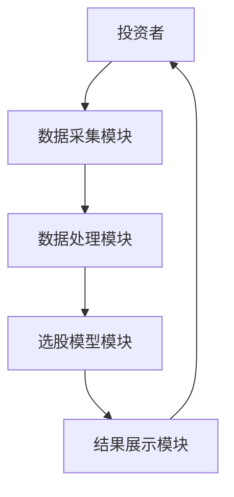
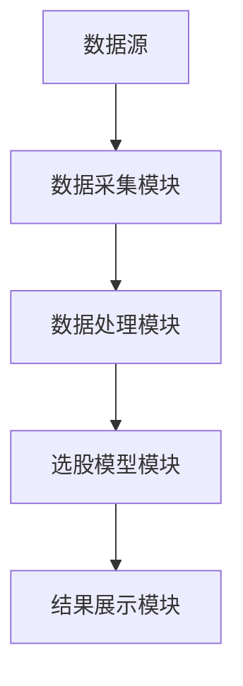

                 


# 《低估值高成长：彼得林奇的选股标准》

> 关键词：彼得·林奇，选股标准，低估值，高成长，投资策略，价值投资

> 摘要：本文深入探讨了彼得·林奇的选股标准，重点分析了“低估值”与“高成长”两个核心概念，并结合数学模型、系统架构设计和实际案例，详细阐述了如何在投资实践中应用这些标准。文章从背景介绍、核心概念解析、数学模型构建、系统设计、项目实战到最佳实践，层层递进，为读者提供了全面的理论与实践指导。

---

## 第一部分：彼得·林奇选股标准的背景与核心理念

### 第1章：彼得·林奇投资理念概述

#### 1.1 彼得·林奇及其投资风格

- **1.1.1 彼得·林奇的生平简介**
  - 彼得·林奇是美国著名的基金经理和投资专家，以其在富达投资管理公司管理麦哲伦基金的卓越业绩闻名。
  - 林奇的投资风格以注重基本面分析、长期投资和价值发现为核心，强调深入研究公司财务数据和行业前景。

- **1.1.2 林奇的投资哲学与理念**
  - **价值投资**：林奇认为，投资的本质是寻找那些被市场低估的优秀公司。
  - **长期视角**：他强调通过长期持有优质资产，而非短期波动，来实现财富增长。
  - **分散投资**：林奇主张通过分散投资降低风险，同时关注个股的质地。

- **1.1.3 林奇选股标准的核心思想**
  - 通过分析公司的财务数据和行业前景，筛选出具有低估值和高成长潜力的公司。
  - 强调对公司基本面的深入研究，包括收入、利润、资产质量和管理团队等方面。

#### 1.2 低估值与高成长的定义

- **1.2.1 低估值的定义与衡量标准**
  - **低估值**：指股票的市场价格低于其内在价值，通常通过市盈率（P/E）、市净率（P/B）等指标衡量。
  - **衡量标准**：市盈率低于行业平均水平或历史平均水平；市净率低于1，表示股价低于每股净资产。

- **1.2.2 高成长的定义与衡量标准**
  - **高成长**：指公司收入、利润和资产规模持续快速增长，具有较高的成长潜力。
  - **衡量标准**：净利润增长率、营业收入增长率、资产增长率等指标高于行业平均水平。

- **1.2.3 低估值与高成长的内在联系**
  - 低估值提供了较高的安全边际，而高成长则为股票提供了长期上涨的动力。
  - 两者结合的公司往往具有较大的增值空间，是投资的理想选择。

#### 1.3 林奇选股标准的核心要素

- **1.3.1 企业基本面分析的重要性**
  - 林奇认为，企业的基本面是选股的核心，包括收入、利润、资产负债表和现金流等指标。
  - 通过分析财务报表，识别出那些盈利能力强、财务健康、成长潜力大的公司。

- **1.3.2 市场情绪与估值的关系**
  - 林奇强调，在市场恐慌或低迷时，低估值股票可能被市场忽视，提供了较好的买入机会。
  - 在市场过热时，高成长股票可能被高估，需要谨慎筛选。

- **1.3.3 长期投资与价值发现的结合**
  - 林奇主张长期持有优质股票，避免频繁交易，以降低交易成本和情绪干扰。
  - 通过持续关注企业的成长，挖掘那些被市场低估的潜力股。

---

## 第二部分：低估值与高成长的比较与分析

### 第2章：低估值与高成长的比较与分析

#### 2.1 低估值与高成长的异同点

- **2.1.1 低估值的特点与优势**
  - **特点**：市场价格低于内在价值，通常表现为市盈率、市净率等估值指标低于行业平均水平。
  - **优势**：低估值股票具有较高的安全边际，风险相对较低，适合稳健型投资者。
  - **劣势**：部分低估值股票可能属于夕阳行业或经营状况不佳的公司，需要结合基本面分析。

- **2.1.2 高成长的特点与优势**
  - **特点**：公司收入、利润和资产规模快速增长，通常处于高增长行业。
  - **优势**：高成长股票具有较高的增值潜力，适合风险承受能力强的投资者。
  - **劣势**：高成长股票可能估值过高，存在泡沫风险，需要警惕。

- **2.1.3 低估值与高成长的对比分析**
  - **对比表格**：
  | 特性       | 低估值             | 高成长             |
  |------------|--------------------|--------------------|
  | 估值指标   | 市盈率、市净率低     | 市盈率、市净率可能高 |
  | 成长潜力   | 成长潜力较小        | 成长潜力较大        |
  | 风险       | 风险相对较低         | 风险相对较高         |
  | 适合场景   | 稳健型投资           | 风险偏好较高         |

#### 2.2 低估值与高成长的优劣势

- **2.2.1 低估值投资的风险与回报**
  - **风险**：部分低估值股票可能来自盈利能力下降或行业衰退的公司，存在较大的下行风险。
  - **回报**：长期来看，低估值股票通过价值回归可能带来稳定的回报，尤其是在市场低迷时。

- **2.2.2 高成长投资的风险与回报**
  - **风险**：高成长股票通常估值较高，容易受到市场波动的影响，存在较大的短期回调风险。
  - **回报**：长期来看，高成长股票可能带来超额收益，尤其是在行业景气度向上的周期。

- **2.2.3 低估值与高成长投资的平衡点**
  - 在实际投资中，可以结合低估值和高成长的特点，寻找那些估值合理、成长性良好的公司。
  - 例如，选择市盈率低于行业平均水平，但净利润增长率高于行业平均水平的公司。

---

## 第三部分：彼得·林奇选股标准的数学模型与公式

### 第3章：估值指标的数学模型

#### 3.1 市盈率（P/E）公式

- 市盈率（P/E）= 股价 / 每股收益（EPS）
- 公式：$$ P/E = \frac{P}{EPS} $$
- 解释：市盈率反映了投资者对股票未来盈利能力的预期，低市盈率通常意味着股票被低估。

#### 3.2 市净率（P/B）公式

- 市净率（P/B）= 股价 / 每股净资产（BPS）
- 公式：$$ P/B = \frac{P}{BPS} $$
- 解释：市净率用于衡量股票相对于其账面价值的高低，通常用于评估银行、地产等资产密集型行业的公司。

#### 3.3 市盈率增长比（PEG）公式

- PEG = 市盈率 / 净利润增长率
- 公式：$$ PEG = \frac{P/E}{\text{净利润增长率}} $$
- 解释：PEG用于衡量股票的估值是否合理，当PEG < 1时，可能表示股票被低估。

### 第4章：成长指标的数学模型

#### 4.1 净利润增长率公式

- 净利润增长率 = （本期净利润 - 上期净利润）/ 上期净利润 × 100%
- 公式：$$ \text{净利润增长率} = \frac{\text{本期净利润} - \text{上期净利润}}{\text{上期净利润}} \times 100\% $$
- 解释：净利润增长率反映了公司盈利能力的提升情况。

#### 4.2 营收增长率公式

- 营收增长率 = （本期营收 - 上期营收）/ 上期营收 × 100%
- 公式：$$ \text{营收增长率} = \frac{\text{本期营收} - \text{上期营收}}{\text{上期营收}} \times 100\% $$
- 解释：营收增长率反映了公司收入的增长能力。

#### 4.3 资产增长率公式

- 资产增长率 = （本期总资产 - 上期总资产）/ 上期总资产 × 100%
- 公式：$$ \text{资产增长率} = \frac{\text{本期总资产} - \text{上期总资产}}{\text{上期总资产}} \times 100\% $$
- 解释：资产增长率反映了公司资产规模的扩张能力。

### 第5章：综合评估模型

#### 5.1 综合估值与成长的评分系统

- 通过将市盈率、市净率、PEG等估值指标与净利润增长率、营收增长率等成长指标进行加权评分，得出综合评分。
- 评分公式：$$ \text{综合评分} = w_1 \times \text{估值指标} + w_2 \times \text{成长指标} $$

#### 5.2 低估值与高成长的权重分配

- 通常情况下，估值指标和成长指标的权重可以各占50%。
- 解释：通过平衡估值和成长的权重，确保筛选出的公司既具有估值优势，又具备成长潜力。

#### 5.3 综合评分的计算公式

- 对于某公司，假设其市盈率为15，行业平均市盈率为20，净利润增长率为20%，行业平均净利润增长率为15%。
- 估值评分：$$ \text{估值评分} = \frac{15}{20} \times 100\% = 75\% $$
- 成长评分：$$ \text{成长评分} = \frac{20}{15} \times 100\% = 133\% $$
- 综合评分：$$ \text{综合评分} = 0.5 \times 75\% + 0.5 \times 133\% = 104\% $$

---

## 第四部分：系统分析与架构设计方案

### 第6章：问题场景介绍

#### 6.1 投资者如何快速筛选出低估值高成长的股票

- 通过建立一个基于彼得·林奇选股标准的系统，投资者可以快速筛选出符合低估值和高成长条件的股票。

#### 6.2 如何利用林奇选股标准进行投资组合优化

- 通过系统化的选股模型，投资者可以优化投资组合，降低风险，提高收益。

#### 6.3 林奇选股模型的实际应用场景

- 在市场低迷时，利用低估值指标筛选出具有安全边际的股票。
- 在行业景气周期时，利用高成长指标筛选出具有增长潜力的股票。

### 第7章：系统功能设计

#### 7.1 数据采集模块

- **功能**：获取股票的基本数据，包括股价、收入、利润等。
- **流程**：通过API接口获取实时数据，存储在数据库中。

#### 7.2 数据处理模块

- **功能**：计算市盈率、市净率、净利润增长率等指标。
- **流程**：对数据进行清洗、计算和存储。

#### 7.3 选股模型模块

- **功能**：根据综合评分公式，筛选出低估值高成长的股票。
- **流程**：对股票进行评分，排序，输出结果。

#### 7.4 结果展示模块

- **功能**：将筛选结果以可视化的方式展示给用户。
- **流程**：生成报告，展示符合标准的股票列表及其评分。

### 第8章：系统架构设计

#### 8.1 数据流图

```mermaid
graph TD
    A[数据源] -> B[数据采集模块]
    B -> C[数据处理模块]
    C -> D[选股模型模块]
    D -> E[结果展示模块]
```

#### 8.2 模块交互图



#### 8.3 系统架构图



---

## 第五部分：项目实战

### 第9章：环境安装与系统核心实现

#### 9.1 环境安装

- **Python版本**：建议使用Python 3.8以上。
- **依赖库**：安装pandas、numpy、matplotlib等库。

#### 9.2 核心代码实现

```python
import pandas as pd
import numpy as np

# 数据加载
df = pd.read_csv('stock_data.csv')

# 估值指标计算
df['PE'] = df['股价'] / df['每股收益']
df['PB'] = df['股价'] / df['每股净资产']
df['PEG'] = df['PE'] / df['净利润增长率']

# 成长指标计算
df['营收增长率'] = (df['本期营收'] - df['上期营收']) / df['上期营收'] * 100
df['资产增长率'] = (df['本期资产'] - df['上期资产']) / df['上期资产'] * 100

# 综合评分计算
df['综合评分'] = 0.5 * df['PE'] + 0.5 * df['营收增长率']
```

#### 9.3 代码应用解读

- **数据加载**：从CSV文件中加载股票数据。
- **估值指标计算**：计算市盈率、市净率和PEG。
- **成长指标计算**：计算营收增长率和资产增长率。
- **综合评分计算**：根据估值和成长指标计算综合评分。

### 第10章：实际案例分析与详细解读

#### 10.1 案例分析：消费行业

- **数据来源**：消费行业股票数据。
- **筛选条件**：PE < 行业平均PE，营收增长率 > 行业平均营收增长率。
- **结果展示**：筛选出符合条件的股票列表。

#### 10.2 详细解读

- **案例分析**：通过实际数据计算，筛选出某消费行业股票。
- **结果展示**：展示该股票的估值和成长指标，以及综合评分。

---

## 第六部分：最佳实践与总结

### 第11章：总结与注意事项

#### 11.1 总结

- 彼得·林奇的选股标准提供了低估值和高成长两个核心指标。
- 通过结合估值和成长指标，可以筛选出具有投资价值的股票。
- 投资者需要结合市场环境和公司基本面，灵活应用这些标准。

#### 11.2 注意事项

- **风险控制**：投资有风险，需谨慎选择股票，分散投资。
- **持续学习**：市场变化莫测，需持续关注行业动态和公司基本面。
- **避免过度依赖模型**：模型只是工具，需结合主观判断。

### 第12章：扩展阅读与学习资源

#### 12.1 扩展阅读

- 《彼得·林奇选股术》
- 《投资学基础》
- 《价值投资入门》

#### 12.2 学习资源

- 网站：https://www Invest.com
- 书籍推荐：
  - 《股票作手回忆录》
  - 《 Warren Buffett 选股术》
  - 《价值投资实战》

---

## 作者信息

作者：AI天才研究院/AI Genius Institute & 禅与计算机程序设计艺术/Zen And The Art of Computer Programming

---

以上是《低估值高成长：彼得林奇的选股标准》的完整目录大纲，涵盖了从理论到实践的各个方面，结合了数学模型、系统设计和实际案例，为读者提供了全面的指导。

