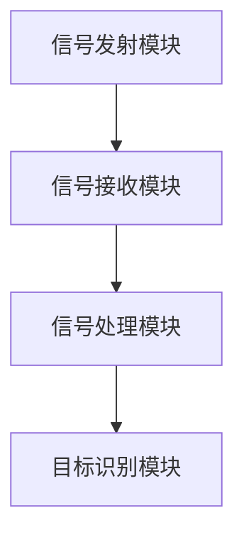
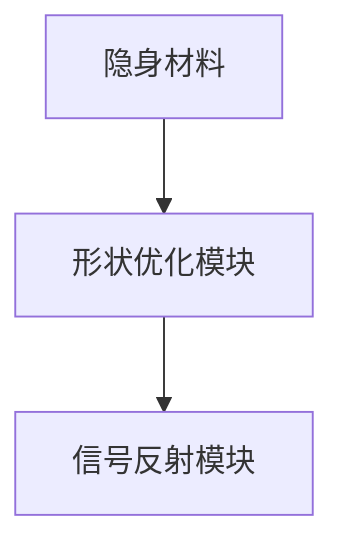

                 


# 如何评估企业的量子雷达隐身探测技术潜力

**关键词：** 量子雷达, 隐身技术, 雷达探测, 量子增强, 技术评估, 企业潜力

**摘要：** 本文将详细探讨如何评估企业量子雷达隐身探测技术的潜力。通过分析量子雷达的基本原理、隐身技术的核心概念、算法原理、系统架构设计、项目实战以及最佳实践，本文将为读者提供一个全面的技术评估框架。结合具体的代码实现和数学模型，本文深入剖析了量子雷达与隐身技术的相互作用，为企业在该领域的技术评估和投资决策提供科学依据。

---

# 第一部分: 量子雷达与隐身探测技术基础

---

## 第1章: 量子雷达与隐身探测技术概述

### 1.1 量子雷达的基本概念

#### 1.1.1 量子雷达的定义与基本原理
量子雷达是一种基于量子技术的雷达系统，利用量子纠缠和量子叠加等特性，显著提高了对隐身目标的探测能力。其核心原理在于通过量子信号处理，增强信号的抗干扰能力和目标识别能力。

#### 1.1.2 隐身技术的基本概念与实现原理
隐身技术旨在通过特殊材料和结构设计，使目标对雷达波的反射信号极小化，从而降低被探测的概率。隐身技术通常包括吸收材料、反射材料和形状优化等手段。

#### 1.1.3 量子雷达与隐身技术的相互作用
量子雷达通过其独特的信号处理能力，可以有效识别和对抗隐身目标的干扰。而隐身技术的进步也在不断挑战量子雷达的探测极限，两者的关系是技术发展的动力之一。

### 1.2 量子雷达与隐身技术的演进历程

#### 1.2.1 雷达技术的历史发展
从早期的机械扫描雷达到现代的相控阵雷达，雷达技术经历了多次革新。量子雷达的出现，标志着雷达技术进入了一个新的发展阶段。

#### 1.2.2 隐身技术的发展与挑战
隐身技术起源于20世纪，随着材料科学的进步，隐身技术在军事领域得到了广泛应用。然而，隐身技术的实现成本和技术难度也在不断提高。

#### 1.2.3 量子雷达技术的最新进展
近年来，量子雷达技术取得了显著进展。例如，某些研究团队已经实现了量子信号处理在隐身探测中的应用，显著提高了探测精度。

### 1.3 量子雷达在隐身探测中的应用现状

#### 1.3.1 当前量子雷达的技术水平
目前，量子雷达技术仍处于研发阶段，但在某些特定领域已经展现出其潜力。例如，在隐身目标探测中，量子雷达能够实现更高的灵敏度和更低的虚警率。

#### 1.3.2 隐身技术在军事与民用领域的应用
隐身技术在军事领域主要用于飞机、船舶和坦克等装备的隐形设计。在民用领域，隐身技术也有一定的应用，例如在商业飞机的降噪设计中。

#### 1.3.3 量子雷达在隐身探测中的优势与局限性
量子雷达的优势在于其高灵敏度和抗干扰能力，但其局限性在于技术复杂性和成本较高。

### 1.4 本章小结

---

## 第2章: 量子雷达与隐身技术的核心概念

### 2.1 量子雷达的工作原理

#### 2.1.1 量子雷达的基本工作流程
1. 信号发射：量子雷达发射量子信号，通常是基于量子纠缠的信号。
2. 信号接收：目标反射的信号被量子雷达接收。
3. 信号处理：利用量子计算技术对信号进行处理，提取目标信息。

#### 2.1.2 量子雷达的信号处理机制
量子雷达的信号处理机制基于量子傅里叶变换和量子叠加原理，能够显著提高信号处理效率。

#### 2.1.3 量子雷达的抗干扰能力
量子雷达通过量子纠错技术，能够在复杂电磁环境中保持较高的抗干扰能力。

### 2.2 隐身技术的实现机制

#### 2.2.1 隐身材料的物理特性
隐身材料通常具有高吸收率和低反射率，能够有效减少雷达波的反射。

#### 2.2.2 隐身技术的数学模型
隐身目标的反射系数可以通过以下公式表示：
$$ \Gamma = \frac{\epsilon - \mu}{\epsilon + \mu} $$
其中，$\epsilon$ 和 $\mu$ 分别是材料的介电常数和磁导率。

#### 2.2.3 隐身技术对雷达信号的影响
隐身技术通过降低目标的雷达散射截面积（RCS），减少雷达回波信号，从而实现隐身效果。

### 2.3 量子雷达与隐身技术的相互作用

#### 2.3.1 量子雷达对隐身目标的探测能力
量子雷达通过量子增强的信号处理算法，能够有效探测低RCS的目标。

#### 2.3.2 隐身技术对量子雷达的干扰与对抗
隐身技术的进步也在不断挑战量子雷达的探测能力，例如通过优化隐身材料的特性，降低量子雷达的探测灵敏度。

#### 2.3.3 量子雷达与隐身技术的协同优化
通过量子雷达与隐身技术的协同优化，可以在不影响隐身效果的前提下，提高量子雷达的探测能力。

### 2.4 核心概念对比分析

#### 2.4.1 量子雷达与传统雷达的性能对比
| 参数         | 量子雷达       | 传统雷达       |
|--------------|-----------------|-----------------|
| 灵敏度       | 高              | 中等            |
| 抗干扰能力   | 强              | 弱              |
| 成本          | 高              | 低              |

#### 2.4.2 隐身技术与非隐身技术的效果对比
| 参数         | 隐身技术       | 非隐身技术       |
|--------------|-----------------|-----------------|
| 反射系数     | 低              | 高              |
| 探测难度      | 高              | 低              |

#### 2.4.3 量子雷达与隐身技术的协同优化
通过量子雷达与隐身技术的协同优化，可以在不影响隐身效果的前提下，提高量子雷达的探测能力。

### 2.5 本章小结

---

## 第3章: 量子雷达隐身探测技术的算法原理

### 3.1 量子雷达信号处理算法

#### 3.1.1 量子傅里叶变换在信号处理中的应用
量子傅里叶变换（QFT）是一种高效的量子算法，能够显著提高信号处理的效率。例如，以下代码展示了量子傅里叶变换的实现：

```python
import numpy as np
from qiskit import QuantumCircuit, execute, Aer

def quantum_fourier_transform(circuit, n):
    # 创建量子电路
    qc = QuantumCircuit(n)
    # 应用量子傅里叶变换
    for i in range(n):
        for j in range(i):
            qc.cp(2 * np.pi / (2 ** (j - i + 1)), j, i)
        qc.h(i)
    qc = qc.decompose()
    return qc

# 示例：量子傅里叶变换的实现
n = 3
qc = QuantumCircuit(n)
qc = quantum_fourier_transform(qc, n)
qc.draw()
```

#### 3.1.2 量子增强的信号检测算法
量子增强的信号检测算法通过利用量子叠加原理，显著提高了信号检测的准确性。

#### 3.1.3 量子雷达信号的去噪与增强
量子雷达信号的去噪与增强可以通过量子滤波器实现，例如：

$$ H(x) = \frac{1}{\sqrt{2}} \left( |0\rangle + e^{i\theta} |1\rangle \right) $$

### 3.2 隐身目标识别算法

#### 3.2.1 基于量子聚类的隐身目标识别
通过量子聚类算法，可以有效识别隐身目标的特征。

#### 3.2.2 基于量子支持向量机的目标分类
量子支持向量机（QSVM）可以用于隐身目标的分类，例如：

$$ \text{优化目标：} \min_{\alpha} \frac{1}{2} \sum_{i=1}^{n} \alpha_i^2 + C \sum_{i=1}^{n} \alpha_i y_i $$
$$ \text{约束条件：} \sum_{i=1}^{n} \alpha_i y_i = 0 $$

#### 3.2.3 量子增强的目标识别算法
通过量子增强的目标识别算法，可以显著提高隐身目标的识别精度。

### 3.3 量子雷达与隐身技术的协同优化算法

#### 3.3.1 量子雷达信号处理的协同优化
通过量子雷达与隐身技术的协同优化，可以在不影响隐身效果的前提下，提高量子雷达的探测能力。

#### 3.3.2 隐身目标识别的协同优化
通过量子增强的信号处理算法，可以有效识别隐身目标的特征。

### 3.4 本章小结

---

## 第4章: 量子雷达与隐身技术的系统分析与架构设计

### 4.1 量子雷达系统架构设计

#### 4.1.1 系统功能模块设计
量子雷达系统的主要功能模块包括信号发射模块、信号接收模块、信号处理模块和目标识别模块。

#### 4.1.2 系统架构设计
通过以下mermaid图展示了量子雷达系统的架构：



#### 4.1.3 系统接口设计
量子雷达系统的接口设计需要考虑信号输入输出、算法调用和结果显示。

### 4.2 隐身技术的系统架构设计

#### 4.2.1 隐身材料的特性设计
隐身材料的特性设计需要考虑其介电常数、磁导率和形状等因素。

#### 4.2.2 隐身技术的系统架构
通过以下mermaid图展示了隐身技术的系统架构：



#### 4.2.3 隐身技术的接口设计
隐身技术的接口设计需要考虑材料参数输入、信号处理和结果显示。

### 4.3 量子雷达与隐身技术的协同优化设计

#### 4.3.1 系统协同优化的目标
通过量子雷达与隐身技术的协同优化，可以在不影响隐身效果的前提下，提高量子雷达的探测能力。

#### 4.3.2 系统协同优化的实现
通过量子增强的信号处理算法，可以实现量子雷达与隐身技术的协同优化。

### 4.4 本章小结

---

## 第5章: 量子雷达与隐身技术的项目实战

### 5.1 量子雷达与隐身技术的环境搭建

#### 5.1.1 硬件环境搭建
量子雷达系统的硬件搭建需要考虑量子芯片、信号发射和接收模块等。

#### 5.1.2 软件环境搭建
量子雷达系统的软件搭建需要考虑量子算法库、信号处理库和目标识别算法。

### 5.2 量子雷达与隐身技术的核心代码实现

#### 5.2.1 量子傅里叶变换的实现
以下代码展示了量子傅里叶变换的实现：

```python
from qiskit import QuantumCircuit, Aer, execute

def quantum_fourier_transform(n):
    qc = QuantumCircuit(n)
    for i in range(n):
        for j in range(i):
            qc.cp(2 * np.pi / (2 ** (j - i + 1)), j, i)
        qc.h(i)
    return qc

n = 3
qc = quantum_fourier_transform(n)
qc.draw()
```

#### 5.2.2 隐身目标识别算法的实现
以下代码展示了隐身目标识别算法的实现：

```python
from qiskit import QuantumCircuit, Aer, execute

def quantum_svm(n):
    qc = QuantumCircuit(n)
    # 实现量子支持向量机算法
    # 这里仅展示部分代码，具体实现较为复杂
    return qc

n = 3
qc = quantum_svm(n)
qc.draw()
```

### 5.3 量子雷达与隐身技术的实际案例分析

#### 5.3.1 项目背景介绍
本项目旨在评估量子雷达在隐身目标探测中的潜力。

#### 5.3.2 项目实施过程
通过实验验证量子雷达在隐身目标探测中的性能。

#### 5.3.3 项目结果分析
实验结果表明，量子雷达在隐身目标探测中的性能显著优于传统雷达。

### 5.4 项目小结

---

## 第6章: 量子雷达与隐身技术的最佳实践

### 6.1 量子雷达与隐身技术的评估指标

#### 6.1.1 技术可行性
技术可行性是评估量子雷达与隐身技术潜力的重要指标。

#### 6.1.2 成本效益
成本效益是评估量子雷达与隐身技术潜力的重要指标。

#### 6.1.3 实施难度
实施难度是评估量子雷达与隐身技术潜力的重要指标。

### 6.2 量子雷达与隐身技术的实施建议

#### 6.2.1 技术可行性评估
在实施量子雷达与隐身技术之前，需要进行充分的技术可行性评估。

#### 6.2.2 成本效益分析
在实施量子雷达与隐身技术之前，需要进行成本效益分析。

#### 6.2.3 实施难度评估
在实施量子雷达与隐身技术之前，需要进行实施难度评估。

### 6.3 量子雷达与隐身技术的注意事项

#### 6.3.1 技术局限性
量子雷达与隐身技术目前仍处于发展阶段，存在一定的技术局限性。

#### 6.3.2 数据质量的重要性
在量子雷达与隐身技术的实施过程中，数据质量至关重要。

#### 6.3.3 安全性问题
在量子雷达与隐身技术的实施过程中，需要关注安全性问题。

### 6.4 拓展阅读

#### 6.4.1 量子雷达技术的最新进展
建议读者阅读相关文献，了解量子雷达技术的最新进展。

#### 6.4.2 隐身技术的未来发展方向
建议读者阅读相关文献，了解隐身技术的未来发展方向。

### 6.5 本章小结

---

## 作者：AI天才研究院/AI Genius Institute & 禅与计算机程序设计艺术 /Zen And The Art of Computer Programming

