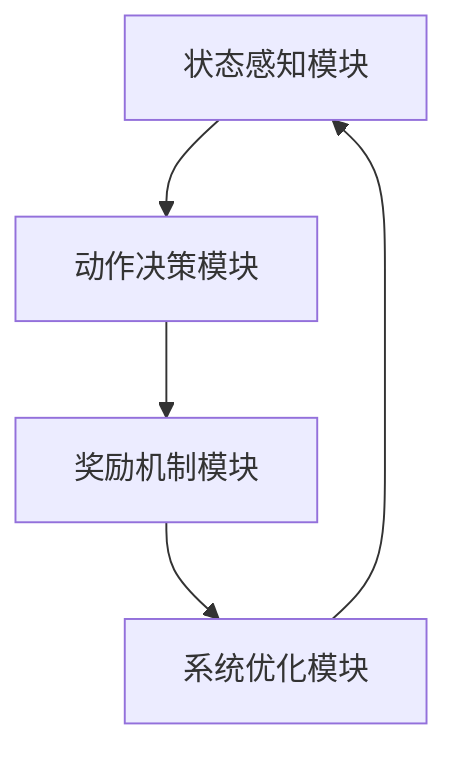

                 


# 如何识别企业的深度强化学习控制系统优势

## 关键词
深度强化学习、企业控制系统、控制系统优势、算法原理、系统架构、项目实战

## 摘要
深度强化学习（Deep Reinforcement Learning）作为一种革命性的技术，正在逐渐改变企业控制系统的传统模式。本文将从深度强化学习的基本概念出发，深入分析其在企业控制系统中的应用优势，详细探讨其算法原理、系统架构设计以及项目实战。通过本文的学习，读者将能够全面理解深度强化学习控制系统的运作机制，并掌握如何识别和利用其在企业中的优势。

---

# 第一部分：深度强化学习控制系统概述

## 第1章：深度强化学习控制系统背景

### 1.1 深度强化学习的基本概念

#### 1.1.1 什么是深度强化学习
深度强化学习（Deep Reinforcement Learning，DRL）是人工智能领域的重要分支，结合了深度学习（Deep Learning）和强化学习（Reinforcement Learning）的核心思想。它通过神经网络来近似最优策略或值函数，从而实现对复杂系统的智能控制。

#### 1.1.2 深度强化学习的核心特点
- **端到端学习**：通过大量交互数据，直接从输入到输出进行端到端的学习，无需显式建模。
- **高维状态空间处理**：深度神经网络的强大表征能力使其能够处理高维复杂状态。
- **在线与离线学习结合**：支持实时决策和离线优化，适应动态变化的环境。

#### 1.1.3 深度强化学习与传统控制方法的区别
| 特性                | 深度强化学习                | 传统控制方法              |
|---------------------|-----------------------------|---------------------------|
| 决策方式            | 基于策略网络的智能决策      | 基于模型的规则或反馈控制  |
| 状态空间处理能力    | 能处理高维复杂状态          | 适用于低维简单状态          |
| 系统适应性          | 强大的自适应能力            | 适应性较弱，需人工调整      |
| 学习效率            | 高效，通过经验快速优化      | 低效，依赖人工经验积累      |

---

### 1.2 企业控制系统中的深度强化学习应用背景

#### 1.2.1 企业控制系统的传统模式
传统的企业控制系统通常依赖于预定义的规则和模型，例如PID控制器或专家系统。这些系统在特定场景下表现良好，但在面对复杂、动态的环境时，往往显得力不从心。

#### 1.2.2 深度强化学习在企业控制中的优势
- **自适应性**：深度强化学习能够根据环境变化动态调整策略，适应复杂的业务场景。
- **数据驱动**：通过大量数据优化模型，无需依赖专家知识。
- **全局优化**：能够全局优化控制目标，而非局部最优。

#### 1.2.3 当前企业控制系统面临的挑战
- **复杂性增加**：企业业务的复杂化使得传统控制系统难以应对。
- **数据爆炸**：海量数据的处理和分析成为新的挑战。
- **实时性要求**：现代企业对实时决策的需求日益增长。

---

## 第2章：深度强化学习控制系统的核心概念

### 2.1 深度强化学习控制系统的基本原理

#### 2.1.1 状态空间与动作空间
- **状态空间（State Space）**：系统当前所处的状态，例如温度、压力、时间等。
- **动作空间（Action Space）**：系统可以执行的动作，例如开关设备、调整参数等。

#### 2.1.2 奖励机制的设计
- **奖励函数（Reward Function）**：定义系统执行动作后的奖励值，引导模型朝着目标方向优化。
- **延迟奖励（Delayed Reward）**：奖励可能在动作之后才产生，需要模型具备长期规划能力。

#### 2.1.3 策略网络与价值网络
- **策略网络（Policy Network）**：直接输出最优动作的分布。
- **价值网络（Value Network）**：估计当前状态的最优值函数。

---

### 2.2 深度强化学习与企业控制系统的结合

#### 2.2.1 企业控制系统的核心要素
- **感知模块**：采集系统状态信息。
- **决策模块**：基于状态信息生成控制动作。
- **执行模块**：将决策转化为实际操作。

#### 2.2.2 深度强化学习在企业控制中的应用场景
- **资源分配优化**：例如生产资源的动态分配。
- **流程优化**：例如供应链流程的优化。
- **实时决策**：例如金融交易中的实时决策。

#### 2.2.3 深度强化学习控制系统的优势与劣势
| 优势               | 劣势               |
|--------------------|-------------------|
| 强大的自适应能力     | 需要大量数据和计算资源 |
| 全局优化能力         | 离线学习时间较长       |
| 实时决策能力         | 需要较高的技术门槛     |

---

## 第3章：深度强化学习控制系统的数学模型

### 3.1 状态空间的表示

#### 3.1.1 离散状态空间与连续状态空间
- **离散状态空间**：状态是有限的，例如“高温”、“低温”。
- **连续状态空间**：状态是连续的，例如温度值在0到100之间。

#### 3.1.2 状态空间的维度与规模
- 状态空间的维度决定了模型的复杂度。
- 状态空间的规模决定了模型的计算量。

### 3.2 动作空间的建模

#### 3.2.1 离散动作空间与连续动作空间
- **离散动作空间**：动作是有限的，例如“启动”、“停止”。
- **连续动作空间**：动作是连续的，例如调整温度到某个具体值。

### 3.3 奖励函数的设计

#### 3.3.1 奖励函数的定义与目标
- 奖励函数定义了每个动作的优劣。
- 目标是通过奖励引导模型实现全局最优。

#### 3.3.2 奖励函数的权重分配
- 不同目标的奖励需要合理分配权重，以避免某一项过于占优。

#### 3.3.3 奖励函数的动态调整
- 根据系统的运行状态动态调整奖励函数，以适应变化的环境。

---

## 第4章：深度强化学习控制系统的算法原理

### 4.1 策略梯度算法

#### 4.1.1 策略梯度的基本原理
- 策略梯度通过优化策略直接更新动作概率分布。
- 使用梯度上升方法最大化期望奖励。

#### 4.1.2 策略梯度的数学推导
$$ J(\theta) = \mathbb{E}_{\tau \sim \pi_\theta} \left[ R(\tau) \right] $$
$$ \nabla J(\theta) = \mathbb{E}_{\tau \sim \pi_\theta} \left[ \nabla \log \pi_\theta(a|s) \cdot Q(s,a) \right] $$

#### 4.1.3 策略梯度的实现与优化
```python
import tensorflow as tf

class PolicyGradient:
    def __init__(self, state_space, action_space):
        self.state_space = state_space
        self.action_space = action_space
        self.model = self.build_model()

    def build_model(self):
        # 定义策略网络
        model = tf.keras.Sequential([
            tf.keras.layers.Dense(64, activation='relu'),
            tf.keras.layers.Dense(self.action_space, activation='softmax')
        ])
        return model

    def call(self, state):
        return self.model(state)
```

### 4.2 Q-learning算法

#### 4.2.1 Q-learning的基本原理
- Q-learning通过学习状态-动作对的值函数来优化决策。

#### 4.2.2 Q-learning的数学推导
$$ Q(s,a) = Q(s,a) + \alpha \left[ r + \gamma \max Q(s',a') - Q(s,a) \right] $$

#### 4.2.3 Q-learning的实现与优化
```python
import numpy as np

class QLearning:
    def __init__(self, state_space, action_space, learning_rate=0.1, gamma=0.9):
        self.state_space = state_space
        self.action_space = action_space
        self.learning_rate = learning_rate
        self.gamma = gamma
        self.Q = np.zeros((state_space, action_space))

    def update(self, state, action, reward, next_state):
        self.Q[state, action] += self.learning_rate * (reward + self.gamma * np.max(self.Q[next_state]) - self.Q[state, action])
```

### 4.3 深度强化学习算法的比较
| 算法类型       | 优势               | 劣势               |
|----------------|--------------------|-------------------|
| 策略梯度       | 直接优化策略         | 需要大量样本数据     |
| Q-learning     | 简单易实现           | 需要离散动作空间     |

---

## 第5章：深度强化学习控制系统的系统架构设计

### 5.1 系统功能模块划分

#### 5.1.1 状态感知模块
- 负责采集系统的实时状态信息。

#### 5.1.2 动作决策模块
- 基于状态信息生成最优动作。

#### 5.1.3 奖励机制模块
- 根据动作结果计算奖励值。

#### 5.1.4 系统优化模块
- 动态调整系统参数以提高性能。

### 5.2 系统架构图


### 5.3 系统接口设计

#### 5.3.1 系统输入接口
- 输入状态信息和环境参数。

#### 5.3.2 系统输出接口
- 输出优化后的动作和奖励值。

#### 5.3.3 系统内部接口
- 模块之间的数据交互接口。

---

## 第6章：深度强化学习控制系统的项目实战

### 6.1 环境安装与配置

#### 6.1.1 系统运行环境要求
- Python 3.6+
- TensorFlow或PyTorch框架

#### 6.1.2 环境配置
```bash
pip install tensorflow numpy
```

### 6.2 系统核心实现源代码

#### 6.2.1 策略网络实现
```python
import tensorflow as tf

class PolicyNetwork(tf.keras.Model):
    def __init__(self, state_dim, action_dim):
        super(PolicyNetwork, self).__init__()
        self.fc1 = tf.keras.layers.Dense(64, activation='relu')
        self.fc2 = tf.keras.layers.Dense(action_dim, activation='softmax')

    def call(self, x):
        x = self.fc1(x)
        x = self.fc2(x)
        return x
```

#### 6.2.2 值函数网络实现
```python
class ValueNetwork(tf.keras.Model):
    def __init__(self, state_dim):
        super(ValueNetwork, self).__init__()
        self.fc1 = tf.keras.layers.Dense(64, activation='relu')
        self.fc2 = tf.keras.layers.Dense(1)

    def call(self, x):
        x = self.fc1(x)
        x = self.fc2(x)
        return x
```

### 6.3 项目小结

---

## 第7章：深度强化学习控制系统的最佳实践

### 7.1 最佳实践 tips
- 确保数据质量，减少噪声干扰。
- 合理设计奖励函数，避免目标冲突。
- 定期更新模型，适应环境变化。

### 7.2 小结
通过本文的学习，读者可以全面理解深度强化学习控制系统的优势，并掌握其在企业中的应用方法。

### 7.3 注意事项
- 深度强化学习需要大量的数据和计算资源，实际应用中需做好资源规划。
- 系统的安全性和稳定性是重中之重，需在设计阶段充分考虑。

### 7.4 拓展阅读
- 《Deep Reinforcement Learning: Theory and Algorithms》
- 《Reinforcement Learning: An Introduction》

---

# 作者：AI天才研究院 & 禅与计算机程序设计艺术

---

通过以上目录和内容的详细规划，我们可以清晰地看到深度强化学习控制系统的优势，并能够在实际应用中灵活运用这些知识，为企业控制系统带来革命性的优化和提升。

