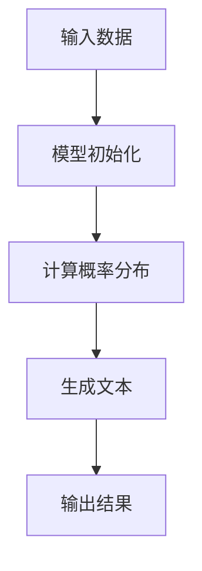
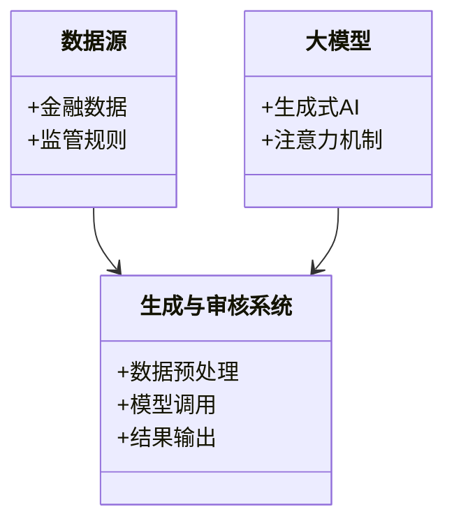
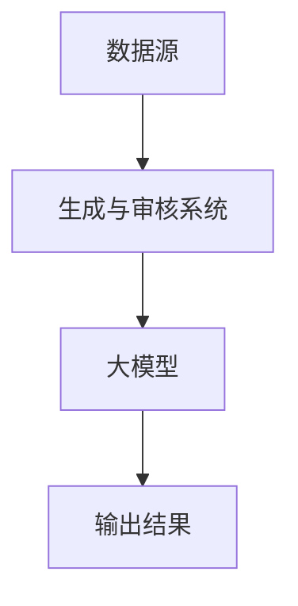
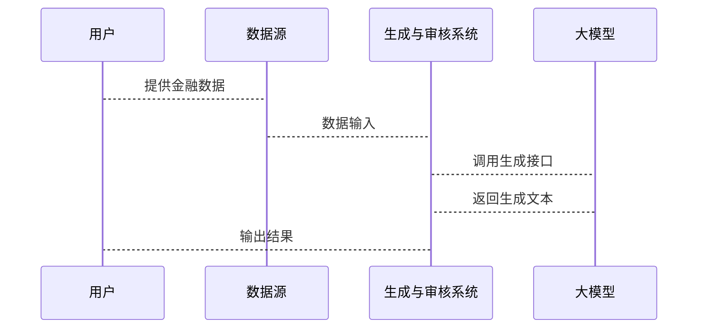

                 


# 开发基于大模型的金融监管报告智能生成与审核助手

## 关键词：大模型、生成式AI、金融监管、自然语言处理、文本生成

## 摘要：本文将详细讲解基于大模型的金融监管报告智能生成与审核助手的开发过程。从问题背景到核心概念，从算法原理到系统架构，从项目实战到最佳实践，我们将一步步深入分析，结合理论与实践，构建一个高效、智能的金融监管报告生成与审核系统。

---

# 第一部分: 开发背景与核心概念

# 第1章: 问题背景与需求分析

## 1.1 问题背景介绍

### 1.1.1 传统金融监管报告的痛点

传统的金融监管报告生成与审核过程存在以下痛点：

1. **效率低下**：人工编写和审核报告耗时长，尤其是在处理大量数据时，效率难以提升。
2. **一致性差**：不同人员编写报告的风格和内容可能存在不一致，导致报告质量参差不齐。
3. **合规性风险**：人工审核容易出现疏漏，可能导致报告不符合监管要求，带来合规风险。
4. **数据孤岛**：各部门之间的数据分散，难以实现数据的高效整合和利用。

### 1.1.2 大模型技术的兴起与潜力

近年来，大模型技术（如GPT系列）在自然语言处理领域取得了突破性进展，具有以下潜力：

1. **强大的生成能力**：大模型可以通过生成式AI快速生成高质量的文本内容。
2. **多任务学习能力**：大模型可以同时处理多种任务，如文本生成、分类、摘要等。
3. **可扩展性**：大模型可以通过微调和迁移学习适应不同领域的任务需求。

### 1.1.3 金融监管智能化的必要性

随着金融行业的快速发展，监管需求日益复杂，智能化监管成为必然趋势：

1. **提高监管效率**：通过智能化工具快速生成和审核报告，减少人工干预。
2. **确保合规性**：利用AI技术确保报告内容符合监管要求，降低合规风险。
3. **数据驱动决策**：通过智能分析和生成报告，帮助监管机构快速做出决策。

---

## 1.2 问题描述与目标设定

### 1.2.1 金融监管报告生成的关键问题

在金融监管报告生成过程中，存在以下关键问题：

1. **数据处理**：如何高效地处理和整合多源异构数据？
2. **内容生成**：如何生成符合监管要求的高质量报告？
3. **实时性**：如何保证报告生成的实时性？

### 1.2.2 智能生成与审核的具体目标

智能生成与审核助手的具体目标包括：

1. **自动化生成**：基于输入的金融数据，自动生成符合要求的监管报告。
2. **智能审核**：对生成的报告进行自动审核，发现潜在问题并提出修改建议。
3. **可解释性**：生成报告的逻辑清晰，便于审核人员理解。

### 1.2.3 边界与外延分析

系统开发的边界包括：

1. **输入数据**：金融相关的结构化数据和非结构化数据。
2. **输出结果**：生成的监管报告和审核结果。
3. **使用场景**：金融机构内部的监管报告生成与审核。

系统外延包括：

1. **数据源扩展**：支持更多数据源的接入。
2. **模型优化**：不断提升生成报告的质量和准确率。
3. **用户界面优化**：提供更友好的人机交互界面。

---

## 1.3 核心概念与系统架构

### 1.3.1 大模型在金融监管中的应用

大模型在金融监管中的应用主要体现在：

1. **文本生成**：生成符合监管要求的报告内容。
2. **信息提取**：从非结构化数据中提取关键信息。
3. **风险预警**：通过分析数据，发现潜在风险。

### 1.3.2 生成式AI的工作原理

生成式AI的核心原理是通过解码器架构，将输入数据映射为输出文本。其主要步骤如下：

1. **输入数据**：将结构化数据和非结构化数据输入模型。
2. **编码表示**：通过编码器生成数据的向量表示。
3. **解码生成**：通过解码器生成目标文本。

### 1.3.3 金融监管报告的生成流程

金融监管报告的生成流程包括：

1. **数据预处理**：清洗和整合数据。
2. **模型调用**：调用大模型生成报告初稿。
3. **审核与优化**：对生成的内容进行自动审核并优化。

---

## 1.4 本章小结

本章主要介绍了金融监管报告生成与审核的背景、痛点以及大模型技术的应用潜力。通过分析问题背景和目标设定，我们明确了系统开发的方向和边界。

---

# 第二部分: 大模型与金融监管的核心原理

# 第2章: 大模型的核心原理

## 2.1 大模型的基本原理

### 2.1.1 深度学习与大模型的关系

深度学习是大模型的核心技术，其主要特点包括：

1. **层次化特征提取**：通过多层网络提取数据的深层特征。
2. **端到端训练**：从输入到输出的全连接网络结构。

### 2.1.2 注意力机制与Transformer架构

注意力机制是大模型的核心组件，其主要作用是：

1. **序列建模**：通过注意力机制捕捉输入序列中的长距离依赖关系。
2. **位置编码**：通过位置编码引入序列的位置信息。

### 2.1.3 模型训练的数学基础

模型训练的主要数学基础包括：

1. **概率分布**：文本生成基于概率分布模型。
2. **损失函数**：交叉熵损失函数用于衡量模型输出与真实值的差距。

---

## 2.2 生成式AI的实现机制

### 2.2.1 解码器架构

解码器架构的主要特点包括：

1. **自回归生成**：逐词生成文本，确保生成过程可控制。
2. **解码器网络**：通过解码器网络生成目标文本。

### 2.2.2 梯度下降与优化算法

优化算法的主要作用是：

1. **损失函数优化**：通过梯度下降算法最小化损失函数。
2. **模型训练加速**：使用Adam优化算法加速训练过程。

### 2.2.3 概率生成模型

概率生成模型的核心思想是：

1. **概率建模**：通过概率模型描述数据生成过程。
2. **生成过程**：通过采样方法生成目标数据。

---

## 2.3 金融监管场景的特殊性

### 2.3.1 金融数据的特征

金融数据的主要特征包括：

1. **高维度**：数据维度高，难以直接处理。
2. **时间依赖性**：数据具有很强的时间依赖性。
3. **复杂性**：金融数据往往具有复杂的结构和关系。

### 2.3.2 监管规则的复杂性

监管规则的复杂性体现在：

1. **多层级规则**：监管规则往往涉及多个层级和领域。
2. **动态变化**：监管规则可能会根据市场变化而调整。

### 2.3.3 报告生成的合规性要求

合规性要求主要包括：

1. **内容规范**：报告内容必须符合监管要求。
2. **格式统一**：报告格式必须统一规范。

---

## 2.4 本章小结

本章详细讲解了大模型的核心原理以及金融监管场景的特殊性。通过对大模型基本原理的分析，我们明确了其在金融监管中的应用潜力。

---

# 第三部分: 算法原理与数学模型

# 第3章: 大模型的训练与生成算法

## 3.1 大模型的训练流程

### 3.1.1 数据预处理

数据预处理的主要步骤包括：

1. **数据清洗**：去除噪声数据，确保数据质量。
2. **数据整合**：将多源数据进行整合，形成统一的数据集。
3. **数据分块**：将数据划分为训练集、验证集和测试集。

### 3.1.2 模型初始化

模型初始化的主要步骤包括：

1. **参数初始化**：随机初始化模型参数。
2. **网络结构定义**：定义模型的网络结构。

### 3.1.3 梯度计算与优化

梯度计算与优化的主要步骤包括：

1. **前向传播**：将输入数据通过模型生成输出。
2. **计算损失**：计算模型输出与真实值之间的损失。
3. **反向传播**：通过反向传播计算梯度。
4. **参数更新**：使用优化算法更新模型参数。

---

## 3.2 生成式AI的数学模型

### 3.2.1 概率分布模型

概率分布模型的主要数学公式包括：

$$ P(y|x) = \frac{P(y, x)}{P(x)} $$

其中，$P(y|x)$ 是条件概率分布，$P(y, x)$ 是联合概率分布，$P(x)$ 是边缘概率分布。

### 3.2.2 解码器的生成过程

解码器的生成过程主要涉及以下公式：

$$ p_\theta(y) = \prod_{i=1}^{n} p_\theta(y_i|y_{<i}, x) $$

其中，$y$ 是生成的文本序列，$y_{<i}$ 表示生成文本的前 $i-1$ 个字符，$x$ 是输入数据。

### 3.2.3 损失函数的计算

交叉熵损失函数的计算公式为：

$$ \text{Loss} = -\frac{1}{N}\sum_{i=1}^{N} \sum_{j=1}^{M} y_{ij}\log p(y_{ij}) $$

其中，$N$ 是训练样本数量，$M$ 是每个样本的长度，$y_{ij}$ 是真实标签，$p(y_{ij})$ 是模型生成的概率。

---

## 3.3 算法实现的流程图



---

## 3.4 代码实现示例

```python
import torch

def generate_text(model, tokenizer, input_str):
    input_ids = tokenizer.encode(input_str, return_tensors='pt')
    input_ids = input_ids.to(torch.device('cuda' if torch.cuda.is_available() else 'cpu'))
    with torch.no_grad():
        outputs = model.generate(input_ids, max_length=50, num_beams=5, temperature=0.7)
        generated_text = tokenizer.decode(outputs[0], skip_special_tokens=True)
    return generated_text
```

---

## 3.5 本章小结

本章详细讲解了大模型的训练与生成算法，包括数据预处理、模型初始化、梯度计算与优化，以及生成式AI的数学模型。通过流程图和代码示例，我们明确了生成过程的具体实现步骤。

---

# 第四部分: 系统分析与架构设计方案

# 第4章: 系统分析与架构设计

## 4.1 问题场景介绍

### 4.1.1 项目背景

本项目旨在开发一个基于大模型的金融监管报告生成与审核助手，通过智能化技术提高监管效率和质量。

### 4.1.2 项目目标

项目目标包括：

1. **自动化生成**：自动生成符合监管要求的报告。
2. **智能审核**：对生成的报告进行自动审核并提出优化建议。
3. **实时反馈**：提供实时的生成和审核结果。

---

## 4.2 系统功能设计

### 4.2.1 领域模型类图



### 4.2.2 系统架构图



### 4.2.3 系统接口设计

系统主要接口包括：

1. **数据接口**：提供数据输入和输出接口。
2. **模型接口**：提供大模型的调用接口。
3. **用户接口**：提供人机交互界面。

### 4.2.4 系统交互流程图



---

## 4.3 本章小结

本章通过系统分析与架构设计，明确了项目的实现方案和技术路线。通过类图和流程图，我们展示了系统的模块划分和交互流程。

---

# 第五部分: 项目实战

# 第5章: 项目实战

## 5.1 环境安装

### 5.1.1 安装Python

```bash
python --version
```

### 5.1.2 安装依赖库

```bash
pip install torch transformers
```

---

## 5.2 系统核心实现

### 5.2.1 核心代码实现

```python
from transformers import AutoTokenizer, AutoModelForCausalLM
import torch

class ReportGenerator:
    def __init__(self, model_name):
        self.tokenizer = AutoTokenizer.from_pretrained(model_name)
        self.model = AutoModelForCausalLM.from_pretrained(model_name)
    
    def generate_report(self, input_data):
        inputs = self.tokenizer.encode(input_data, return_tensors='pt')
        outputs = self.model.generate(inputs, max_length=500, num_beams=5)
        return self.tokenizer.decode(outputs[0], skip_special_tokens=True)
```

### 5.2.2 代码解读

1. **数据预处理**：将输入数据编码为模型可接受的格式。
2. **模型调用**：调用大模型生成报告。
3. **结果输出**：将生成的文本解码并返回。

---

## 5.3 实际案例分析

### 5.3.1 案例背景

假设我们有一个金融数据集，包含股票价格、交易量等信息。

### 5.3.2 代码应用解读

1. **数据输入**：将金融数据输入模型。
2. **生成报告**：生成监管报告初稿。
3. **审核与优化**：对生成的报告进行自动审核并优化。

---

## 5.4 项目小结

本章通过实际案例分析，展示了如何将理论应用于实践。通过代码实现和案例解读，我们明确了系统开发的具体步骤和技术细节。

---

# 第六部分: 最佳实践

# 第6章: 最佳实践

## 6.1 小结

通过本文的详细讲解，我们了解了基于大模型的金融监管报告生成与审核助手的开发过程。从问题背景到系统架构，从算法原理到项目实战，我们逐步深入分析了系统的实现细节。

---

## 6.2 注意事项

1. **数据安全**：确保数据的安全性和隐私性。
2. **模型优化**：不断优化模型性能，提高生成质量。
3. **用户体验**：提供友好的人机交互界面。

---

## 6.3 拓展阅读

1. **大模型相关论文**：深入阅读大模型的经典论文。
2. **金融监管领域的最新研究**：关注金融监管领域的最新研究进展。
3. **自然语言处理技术**：进一步学习自然语言处理的相关技术。

---

# 作者：AI天才研究院/AI Genius Institute & 禅与计算机程序设计艺术 /Zen And The Art of Computer Programming

