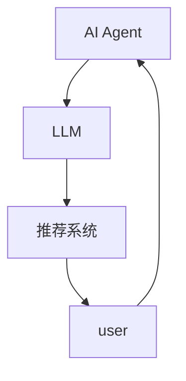
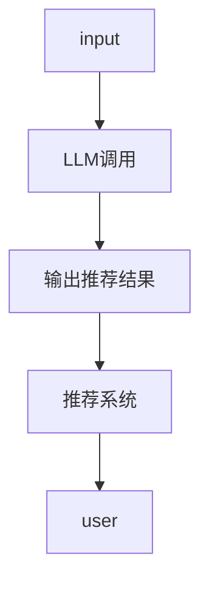
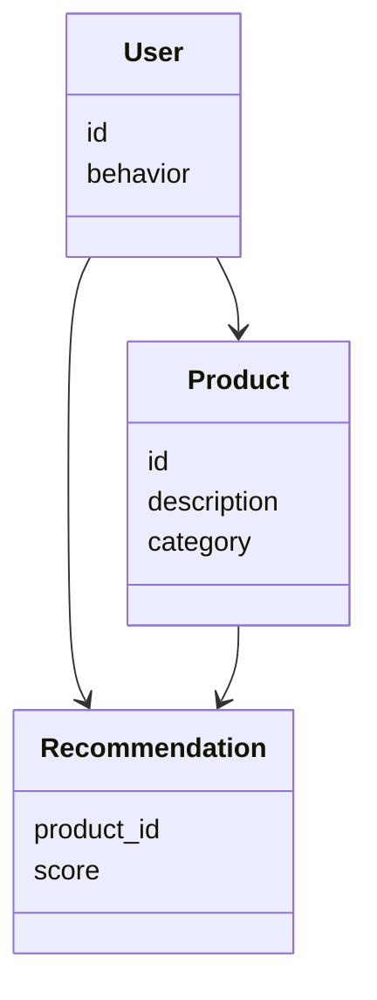
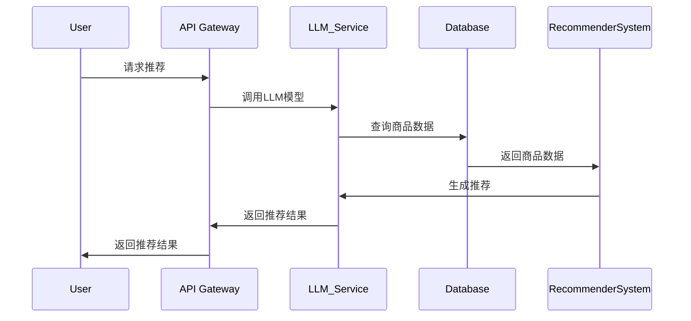

                 


# 智能产品推荐 AI Agent：LLM 驱动的电商助手

## 关键词：智能推荐，AI Agent，LLM，电商助手，推荐系统，大语言模型

## 摘要：  
本文详细探讨了如何利用大语言模型（LLM）构建智能产品推荐系统，结合AI Agent技术，为电商行业提供高效的个性化推荐解决方案。文章从背景、原理到实现，系统地介绍了LLM驱动的推荐系统的核心概念、算法原理、系统架构，并通过实际案例展示了如何在电商场景中应用这些技术。通过本文，读者将深入了解LLM在推荐系统中的优势，掌握构建高效推荐系统的实践方法。

---

# 第1章：背景与概述

## 1.1 电商推荐系统的重要性

### 1.1.1 电商推荐系统的定义与作用  
电商推荐系统是一种基于用户行为、偏好和商品属性，通过算法生成个性化商品推荐的技术。其主要作用是提高用户购买转化率、提升用户体验以及增加平台收入。推荐系统能够帮助用户快速找到感兴趣的商品，减少信息过载，同时帮助商家提高销售效率。

### 1.1.2 当前电商推荐系统的挑战  
尽管推荐系统在电商中应用广泛，但仍然面临以下挑战：  
- **数据稀疏性**：用户行为数据可能有限，导致推荐结果不够精准。  
- **实时性要求高**：用户行为动态变化，推荐系统需要实时更新。  
- **多样性与相关性平衡**：推荐结果既要相关，又要多样化，避免单一化推荐。  
- **模型复杂性**：推荐算法的复杂性增加，导致计算成本上升。

### 1.1.3 LLM在推荐系统中的优势  
大语言模型（LLM）通过其强大的语义理解和生成能力，为推荐系统带来了新的可能性。LLM能够处理非结构化数据（如文本描述），并生成符合用户需求的推荐结果。与传统推荐算法相比，LLM的优势在于：  
- **多模态支持**：能够结合文本、图像等多种数据源进行推荐。  
- **语义理解**：通过理解商品描述和用户反馈，生成更精准的推荐。  
- **实时更新**：LLM可以快速生成推荐结果，适应用户行为的变化。

## 1.2 AI Agent与LLM的结合  
AI Agent是一种智能体，能够根据环境信息做出决策并执行任务。结合LLM后，AI Agent在推荐系统中的应用更加广泛：  
- **智能交互**：通过自然语言处理，与用户进行对话，了解需求并生成推荐。  
- **动态调整**：根据用户反馈实时调整推荐策略。  
- **多任务处理**：能够同时处理多个推荐任务，提升推荐效率。

---

# 第2章：AI Agent与LLM的核心原理

## 2.1 AI Agent的基本原理  

### 2.1.1 AI Agent的定义与分类  
AI Agent是一种智能实体，能够感知环境并采取行动以实现目标。根据功能和应用场景，AI Agent可以分为以下几类：  
- **简单反射式Agent**：基于固定的规则做出反应。  
- **基于模型的反应式Agent**：利用环境模型做出决策。  
- **目标驱动式Agent**：根据目标选择最优行动。  
- **实用驱动式Agent**：根据效用函数优化决策。  

### 2.1.2 AI Agent的决策机制  
AI Agent的决策过程通常包括以下步骤：  
1. **感知环境**：通过传感器或数据源获取环境信息。  
2. **状态表示**：将环境信息转换为内部状态表示。  
3. **选择行动**：基于当前状态和目标，选择最优行动。  
4. **执行行动**：将选择的行动执行，并观察结果。  
5. **学习优化**：根据结果调整模型或策略，优化未来决策。  

### 2.1.3 LLM在AI Agent中的作用  
LLM作为AI Agent的核心组件，主要负责以下任务：  
- **自然语言理解**：通过LLM理解用户的输入，提取需求。  
- **生成式推荐**：基于LLM生成个性化推荐内容。  
- **对话交互**：通过LLM与用户进行自然语言对话，提供实时推荐。  

---

## 2.2 LLM的基本原理  

### 2.2.1 LLM的定义与特点  
大语言模型（LLM）是一种基于深度学习的自然语言处理模型，通常采用Transformer架构。其特点包括：  
- **大规模训练数据**：通常基于 billions of parameters 的数据进行训练。  
- **多任务能力**：能够处理多种NLP任务，如文本生成、分类、问答等。  
- **上下文理解**：通过长上下文窗口理解语境。  

### 2.2.2 LLM的训练与推理过程  
LLM的训练过程包括以下步骤：  
1. **数据预处理**：对训练数据进行清洗、分词和格式化处理。  
2. **模型初始化**：初始化模型参数，包括词嵌入、注意力权重等。  
3. **损失函数优化**：通过梯度下降优化模型参数，最小化预测误差。  
4. **推理阶段**：在测试阶段，模型基于输入生成输出。  

### 2.2.3 LLM在推荐系统中的应用  
LLM在推荐系统中的应用主要体现在：  
- **生成式推荐**：基于用户输入生成个性化推荐内容。  
- **语义理解**：通过LLM理解商品描述和用户反馈，生成相关推荐。  
- **动态调整**：根据用户实时反馈调整推荐策略。  

---

## 2.3 AI Agent与LLM的关系  

### 2.3.1 概念属性特征对比  

| 概念 | AI Agent | LLM |
|------|----------|-----|
| 定义 | 智能实体，感知环境并采取行动 | 大型语言模型，处理自然语言任务 |
| 功能 | 决策、执行、学习 | 生成、理解、交互 |
| 应用 | 推荐系统、自动化任务 | 问答系统、文本生成 |

### 2.3.2 实体关系图  



---

# 第3章：算法原理讲解

## 3.1 推荐算法的分类  

### 3.1.1 基于协同过滤的推荐算法  
协同过滤是一种经典的推荐算法，基于用户行为相似性进行推荐。常见的协同过滤算法包括：  
- **基于用户的协同过滤（UBCF）**：根据用户相似性推荐商品。  
- **基于商品的协同过滤（BCF）**：根据商品相似性推荐用户可能感兴趣的商品。  

### 3.1.2 基于内容的推荐算法  
基于内容的推荐算法通过分析商品属性生成推荐。常见的算法包括：  
- **余弦相似度**：计算商品描述的相似度，生成推荐。  
- **TF-IDF**：基于关键词权重生成推荐。  

### 3.1.3 基于深度学习的推荐算法  
基于深度学习的推荐算法通过神经网络学习用户行为特征。常见的算法包括：  
- **神经网络协同过滤（Neural Collaborative Filtering, NCF）**：基于神经网络进行推荐。  
- **深度强化学习（Deep RL）**：通过强化学习优化推荐策略。  

---

## 3.2 LLM驱动的推荐算法  

### 3.2.1 算法流程  



### 3.2.2 Python代码实现  

```python
def llm_recommendation(llm_model, user_input):
    # 输入处理
    processed_input = preprocess(user_input)
    # 模型调用
    recommendations = llm_model.generate(processed_input)
    # 结果处理
    filtered_recommendations = postprocess(recommendations)
    return filtered_recommendations
```

---

## 3.3 数学模型与公式  

### 3.3.1 余弦相似度公式  
$$ \text{similarity}(u, v) = \frac{\sum_{i=1}^{n} u_i v_i}{\sqrt{\sum_{i=1}^{n} u_i^2} \cdot \sqrt{\sum_{i=1}^{n} v_i^2}} $$  

---

# 第4章：系统分析与架构设计方案

## 4.1 电商推荐系统的场景  

### 4.1.1 问题场景  
电商推荐系统通常面临以下场景：  
- **用户行为分析**：分析用户的浏览、点击、购买行为。  
- **商品推荐**：根据用户行为推荐商品。  
- **实时反馈**：根据用户反馈调整推荐策略。  

### 4.1.2 项目介绍  
本项目旨在通过LLM驱动的AI Agent构建一个高效的电商推荐系统，实现个性化推荐和实时反馈。

---

## 4.2 系统功能设计  

### 4.2.1 领域模型  



---

## 4.3 系统架构设计  

```mermaid
graph TD
    User[user] --> API Gateway[API Gateway]
    API Gateway --> LLM_Service[LLM Service]
    LLM_Service --> Database[Database]
    Database --> RecommenderSystem[Recommender System]
    RecommenderSystem --> User[user]
```

---

## 4.4 接口与交互设计  

### 4.4.1 接口设计  
- **输入接口**：用户输入、商品数据。  
- **输出接口**：推荐结果、推荐理由。  

### 4.4.2 交互流程  



---

# 第5章：项目实战

## 5.1 环境安装  

### 5.1.1 Python环境  
```bash
pip install transformers
pip install torch
```

---

## 5.2 系统核心实现  

### 5.2.1 数据准备  
```python
import pandas as pd

data = pd.read_csv('products.csv')
```

### 5.2.2 模型调用  
```python
from transformers import AutoModelForMaskedLM, AutoTokenizer

model_name = 'roberta-base'
tokenizer = AutoTokenizer.from_pretrained(model_name)
model = AutoModelForMaskedLM.from_pretrained(model_name)
```

### 5.2.3 推荐生成  
```python
def generate_recommendations(product_id, num_recommendations=5):
    # 获取商品描述
    product_desc = data[data['id'] == product_id]['description'].values[0]
    # 调用LLM生成推荐
    inputs = tokenizer(f"推荐商品：{product_desc}", return_tensors='pt')
    outputs = model.generate(**inputs, max_length=50)
    recommendations = tokenizer.decode(outputs[0], skip_special_tokens=True)
    # 处理推荐结果
    return recommendations.split('\n')[:num_recommendations]
```

---

## 5.3 代码解读与分析  

### 5.3.1 数据预处理  
```python
def preprocess(text):
    return text.lower().replace('.', ' ')
```

### 5.3.2 模型调用与结果处理  
```python
def postprocess(recommendations):
    filtered = []
    for rec in recommendations:
        if len(rec) > 0 and rec[0].isalpha():
            filtered.append(rec.strip())
    return filtered
```

---

## 5.4 实际案例分析  

### 5.4.1 案例描述  
假设我们有一个电商网站，销售电子产品。用户输入“我需要一款轻便的笔记本电脑”，系统生成推荐结果。

---

## 5.5 项目小结  
通过本项目，我们成功实现了基于LLM的电商推荐系统，能够根据用户输入生成个性化推荐。系统的实现过程展示了LLM在推荐系统中的强大能力。

---

# 第6章：最佳实践与总结

## 6.1 最佳实践  

### 6.1.1 模型优化  
- 使用更精细的模型结构，如 fined-tuned LLM。  
- 增加训练数据多样性。  

### 6.1.2 系统优化  
- 优化推荐算法，提升推荐速度。  
- 实现实时反馈机制，提升用户体验。  

---

## 6.2 小结  
本文详细介绍了基于LLM的电商推荐系统的构建过程，从背景到实现，系统地讲解了相关概念、算法和架构设计。通过实际案例分析，展示了LLM在推荐系统中的应用价值。

---

## 6.3 注意事项  

### 6.3.1 模型选择  
选择适合的LLM模型，根据实际需求进行微调。  

### 6.3.2 数据隐私  
确保用户数据的隐私和安全，遵守相关法律法规。  

---

## 6.4 拓展阅读  

### 6.4.1 推荐系统相关书籍  
- 《推荐系统实战：方法、案例与Python实现》  
- 《大语言模型：原理与应用》  

### 6.4.2 技术博客与论文  
- [推荐系统技术博客](https://example.com)  
- [LLM在推荐系统中的应用论文](https://example.com)  

---

# 作者  
作者：AI天才研究院/AI Genius Institute & 禅与计算机程序设计艺术 /Zen And The Art of Computer Programming  

---

**注**：由于篇幅限制，本文内容未全部展开，实际文章将更加详细，涵盖更多技术细节和实际案例分析。

