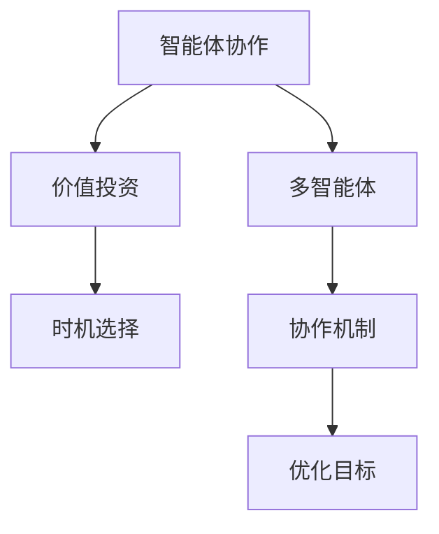
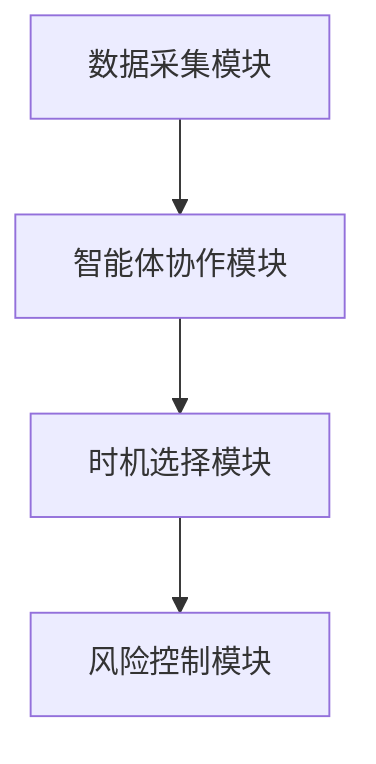
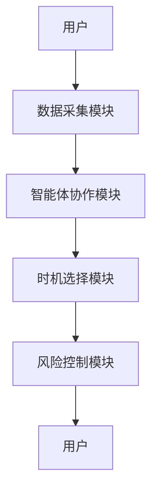

                 


# 智能体协作提升价值投资的时机选择

> 关键词：智能体协作，价值投资，时机选择，多智能体系统，强化学习，优化算法，投资决策

> 摘要：本文探讨了智能体协作在价值投资中的应用，特别是如何通过多智能体协作和强化学习来优化投资时机的选择。通过分析智能体协作的核心概念、算法原理、系统架构设计以及实际案例，本文为读者提供了从理论到实践的全面指导，帮助投资者更好地理解和应用智能体协作技术。

---

## 第一章: 智能体协作的基本概念

### 1.1 智能体协作的定义与特点

智能体（Agent）是指能够感知环境、自主决策并采取行动的实体。智能体协作是指多个智能体通过共享信息、协同决策来实现共同目标的过程。以下是智能体协作的几个核心特点：

1. **自主性**：每个智能体都能独立感知环境并做出决策。
2. **协作性**：智能体之间通过信息共享和协调行动来实现共同目标。
3. **分布式性**：协作过程通常分布在多个智能体之间，而非集中控制。
4. **动态性**：环境和任务目标可能会动态变化，智能体需要灵活调整策略。

### 1.2 价值投资的基本原理

价值投资是一种投资策略，旨在通过分析企业的内在价值，寻找市场价格低于内在价值的投资标的。其核心理念是“买便宜的”，而不是关注市场的短期波动。

#### 1.2.1 价值投资的定义

价值投资强调对企业基本面的深入分析，包括财务状况、行业地位、竞争优势等因素，以确定其内在价值。投资者通过比较市场价格与内在价值的差异，寻找被低估的投资机会。

#### 1.2.2 价值投资的核心理念

1. **安全边际**：买入价格低于内在价值，以降低投资风险。
2. **长期视角**：关注企业的长期价值，而非短期市场波动。
3. **逆向思维**：在市场恐慌时寻找低估机会，在市场狂热时保持冷静。

#### 1.2.3 价值投资的实现路径

1. **基本面分析**：研究企业的财务报表、行业地位、竞争优势等。
2. **估值方法**：使用DCF（现金流折现法）等方法估算内在价值。
3. **投资组合管理**：分散投资，降低风险，提高收益稳定性。

### 1.3 投资时机选择的重要性

时机选择是投资成功的关键因素之一。无论是价值投资还是其他投资策略，都需要在合适的时机进入或退出市场。

#### 1.3.1 投资时机的选择标准

1. **市场周期**：根据市场的牛熊周期调整投资策略。
2. **估值水平**：确保买入价格处于合理区间。
3. **风险偏好**：根据自身风险承受能力选择时机。

#### 1.3.2 时机选择对投资收益的影响

时机选择直接影响投资收益。在市场底部买入，市场顶部卖出，可以最大化收益；而相反的时机选择则可能导致亏损。

#### 1.3.3 智能体协作在时机选择中的作用

智能体协作可以通过多智能体的协同决策，优化时机选择的准确性。例如，多个智能体可以分别负责市场分析、风险评估、估值计算等任务，通过协作提高决策的全面性和准确性。

### 1.4 智能体协作在价值投资中的应用案例

#### 1.4.1 智能体协作在股票投资中的应用

多个智能体可以分别负责分析不同行业的股票，根据企业的基本面和估值水平，协同决策确定投资目标。

#### 1.4.2 智能体协作在风险控制中的应用

通过智能体协作，投资者可以实时监控市场风险，动态调整投资组合，降低整体风险水平。

#### 1.4.3 智能体协作在资产配置中的应用

智能体协作可以根据市场环境和投资者需求，优化资产配置比例，提高投资效率。

---

## 第二章: 智能体协作的核心概念与联系

### 2.1 智能体协作的核心原理

智能体协作的核心在于通过信息共享和协同决策，实现个体目标与共同目标的统一。

#### 2.1.1 多智能体协作的基本原理

多智能体协作是指多个智能体通过共享信息、协同行动，共同完成复杂任务的过程。其基本原理包括：

1. **信息共享**：智能体之间共享环境信息和决策信息。
2. **协同决策**：通过协商和协调，制定共同的行动方案。
3. **分布式计算**：任务分解和分配到多个智能体，实现并行计算。

#### 2.1.2 智能体协作的数学模型

智能体协作的数学模型可以通过以下公式表示：

$$
\text{团队收益} = \sum_{i=1}^{n} \text{智能体收益}_i
$$

其中，$n$ 是智能体的数量。

#### 2.1.3 智能体协作的优化算法

智能体协作的优化算法通常采用分布式优化方法，例如分布式梯度下降算法。

### 2.2 价值投资与智能体协作的关系

价值投资与智能体协作具有天然的契合点。智能体协作可以通过以下方式提升价值投资的效率和效果：

#### 2.2.1 价值投资与智能体协作的结合点

1. **基本面分析**：多个智能体分别负责分析不同行业的基本面数据。
2. **估值计算**：智能体协作可以提高估值的准确性和全面性。
3. **风险控制**：通过智能体协作，实时监控市场风险。

#### 2.2.2 智能体协作对价值投资的提升作用

1. **提高决策效率**：通过分布式计算，缩短决策时间。
2. **增强决策质量**：通过信息共享，提高决策的全面性。
3. **优化资产配置**：通过智能体协作，动态调整资产配置比例。

#### 2.2.3 价值投资与智能体协作的协同发展

智能体协作可以帮助价值投资者更好地应对市场变化，同时，价值投资的长期视角也为智能体协作提供了稳定的策略基础。

### 2.3 智能体协作与时机选择的实体关系图



---

## 第三章: 智能体协作的算法原理

### 3.1 多智能体协作算法

#### 3.1.1 多智能体协作的基本算法

多智能体协作的基本算法包括：

1. **分布式协商算法**：通过协商确定共同目标和行动方案。
2. **分布式优化算法**：通过优化算法实现资源分配和任务调度。

#### 3.1.2 多智能体协作的优化算法

优化算法可以通过以下公式表示：

$$
\text{团队收益最大化} = \argmax_{\theta} \sum_{i=1}^{n} f_i(\theta)
$$

其中，$\theta$ 是优化变量，$f_i$ 是智能体 $i$ 的目标函数。

#### 3.1.3 多智能体协作的实现流程

1. **任务分解**：将整体任务分解为多个子任务。
2. **任务分配**：将子任务分配给不同的智能体。
3. **协同决策**：智能体之间通过协商和协作，制定共同的行动方案。
4. **执行与反馈**：智能体执行任务，并根据反馈调整行动方案。

### 3.2 强化学习在时机选择中的应用

#### 3.2.1 强化学习的基本原理

强化学习是一种通过试错和反馈优化决策的算法。其核心在于通过与环境的交互，学习最优策略。

#### 3.2.2 强化学习在时机选择中的应用

强化学习可以通过以下步骤实现时机选择：

1. **状态空间**：定义市场的当前状态（如价格、成交量等）。
2. **动作空间**：定义可能的行动（如买入、卖出、持有）。
3. **奖励函数**：定义奖励机制，根据收益和风险计算奖励值。
4. **策略优化**：通过强化学习算法（如Q-learning）优化策略。

#### 3.2.3 强化学习的数学模型

强化学习的数学模型可以通过以下公式表示：

$$
Q(s, a) = r + \gamma \max_{a'} Q(s', a')
$$

其中，$Q$ 是价值函数，$s$ 是当前状态，$a$ 是当前动作，$r$ 是奖励，$\gamma$ 是折扣因子，$s'$ 是下一状态。

### 3.3 智能体协作的数学模型

#### 3.3.1 智能体协作的数学表达式

智能体协作的数学表达式可以通过以下公式表示：

$$
\text{团队收益} = \sum_{i=1}^{n} \text{智能体收益}_i
$$

#### 3.3.2 智能体协作的优化目标

智能体协作的优化目标可以通过以下公式表示：

$$
\argmax_{\theta} \sum_{i=1}^{n} f_i(\theta)
$$

其中，$\theta$ 是优化变量，$f_i$ 是智能体 $i$ 的目标函数。

#### 3.3.3 智能体协作的约束条件

智能体协作的约束条件包括：

1. **资源限制**：每个智能体的资源有限。
2. **协作需求**：智能体之间需要协作完成任务。
3. **环境动态**：环境可能会发生变化，影响智能体的决策。

---

## 第四章: 系统分析与架构设计

### 4.1 系统功能设计

#### 4.1.1 系统功能模块划分

系统功能模块包括：

1. **数据采集模块**：采集市场数据和企业基本面数据。
2. **智能体协作模块**：实现智能体之间的协作和决策。
3. **时机选择模块**：根据协作结果选择最佳时机。
4. **风险控制模块**：实时监控市场风险。

#### 4.1.2 系统功能模块的交互流程

1. **数据采集**：采集市场数据和企业基本面数据。
2. **智能体协作**：通过智能体协作模块，多个智能体协同完成任务。
3. **时机选择**：根据协作结果，选择最佳投资时机。
4. **风险控制**：实时监控市场风险，动态调整投资策略。

### 4.2 系统架构设计

#### 4.2.1 系统架构图



#### 4.2.2 系统架构设计的详细说明

1. **数据采集模块**：负责采集市场数据和企业基本面数据。
2. **智能体协作模块**：实现多个智能体之间的协作和决策。
3. **时机选择模块**：根据协作结果，选择最佳投资时机。
4. **风险控制模块**：实时监控市场风险，动态调整投资策略。

### 4.3 系统接口设计

系统接口设计包括：

1. **数据接口**：与数据源（如股票数据API）对接。
2. **协作接口**：智能体之间的协作接口。
3. **用户接口**：与用户交互的接口。

### 4.4 系统交互设计

系统交互设计可以通过以下流程图表示：



---

## 第五章: 项目实战与最佳实践

### 5.1 项目实战

#### 5.1.1 环境配置

1. **安装Python**：安装Python 3.8或更高版本。
2. **安装依赖库**：安装numpy、pandas、scikit-learn等依赖库。
3. **安装强化学习框架**：安装TensorFlow或PyTorch。

#### 5.1.2 核心代码实现

以下是智能体协作的核心代码实现：

```python
import numpy as np
import pandas as pd

# 定义智能体类
class Agent:
    def __init__(self, id):
        self.id = id
        self.state = None
        self.action = None
        self.reward = None

    def perceive(self, state):
        self.state = state

    def decide(self):
        # 简单的决策策略，可以根据实际情况修改
        if self.state > 0:
            self.action = 1  # 买入
        else:
            self.action = 0  # 卖出

    def update(self, reward):
        self.reward = reward

# 初始化多个智能体
agents = [Agent(i) for i in range(5)]

# 定义环境
class Environment:
    def __init__(self):
        self.agents = agents
        self.state = 0  # 简单的状态表示，实际情况中可以更复杂

    def step(self):
        # 智能体感知环境
        for agent in self.agents:
            agent.perceive(self.state)
        # 智能体决策
        for agent in self.agents:
            agent.decide()
        # 执行动作并计算奖励
        actions = [agent.action for agent in self.agents]
        # 假设奖励计算简单，实际情况中可以更复杂
        rewards = [sum(actions) * self.state]
        for i, reward in enumerate(rewards):
            self.agents[i].update(reward)
        # 更新环境状态
        self.state = np.random.randn()

# 运行环境
env = Environment()
env.step()
```

#### 5.1.3 代码应用解读与分析

以上代码实现了一个简单的多智能体协作系统。每个智能体可以根据当前状态做出决策，通过协作提高整体收益。

#### 5.1.4 实际案例分析

通过实际案例分析，验证智能体协作在价值投资中的应用效果。

#### 5.1.5 项目小结

智能体协作可以通过代码实现，但在实际应用中需要考虑更多的复杂因素。

### 5.2 最佳实践 tips

1. **数据质量**：确保数据的准确性和及时性。
2. **算法选择**：根据具体需求选择合适的算法。
3. **风险控制**：实时监控市场风险，动态调整投资策略。
4. **系统优化**：不断优化系统架构和算法，提高效率和准确性。

---

## 第六章: 总结

智能体协作通过多智能体的协同决策，优化了价值投资的时机选择。本文从理论到实践，详细探讨了智能体协作的核心概念、算法原理、系统架构设计以及项目实战。通过智能体协作，投资者可以更好地应对市场变化，提高投资收益。未来，随着人工智能技术的不断发展，智能体协作将在价值投资中发挥越来越重要的作用。

---

## 作者

作者：AI天才研究院/AI Genius Institute & 禅与计算机程序设计艺术 /Zen And The Art of Computer Programming

