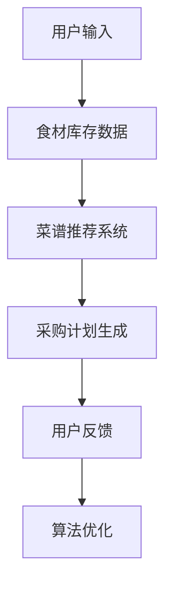
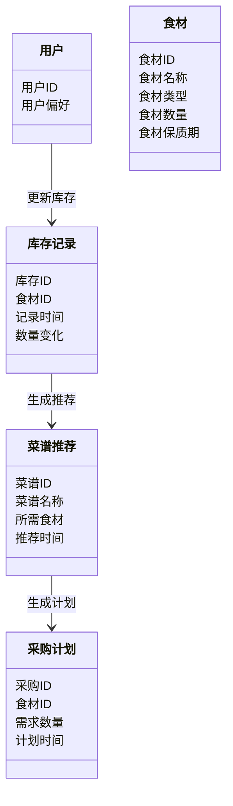
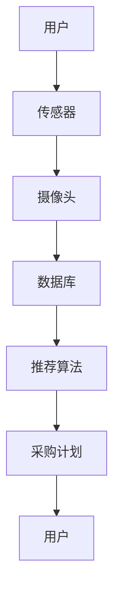

                 


# 智能厨房吊柜：AI Agent的食材库存管理

---

## 关键词：智能厨房吊柜、AI Agent、食材库存管理、推荐算法、系统架构设计

---

## 摘要：本文深入探讨了智能厨房吊柜中AI Agent在食材库存管理中的应用。通过分析食材库存管理的核心问题，介绍了AI Agent的基本原理和算法实现，详细讲解了系统架构设计，并通过实际案例展示了如何利用AI技术提升厨房管理效率。文章内容涵盖背景介绍、算法原理、系统架构、项目实战和最佳实践，为读者提供了一套完整的解决方案。

---

# 第一部分: 智能厨房吊柜与AI Agent的背景介绍

## 第1章: 智能厨房吊柜的背景与问题背景

### 1.1 问题背景

#### 1.1.1 食材库存管理的传统问题

在传统厨房管理中，食材库存管理通常依赖于人工记录和记忆，这种方式存在以下问题：

1. **食材浪费**：由于无法准确掌握食材的剩余量，常常导致食材过期或浪费。
2. **查找效率低**：在需要烹饪时，用户可能花费大量时间查找特定食材，影响烹饪效率。
3. **采购计划不精准**：缺乏实时数据支持，导致采购计划不合理，容易出现食材不足或过多采购的情况。

#### 1.1.2 智能化管理的需求驱动

随着智能家居和物联网技术的快速发展，用户对厨房管理的智能化需求日益增长。智能厨房吊柜通过集成传感器、摄像头和AI技术，能够实时监控食材库存状态，并提供智能化的管理服务。

#### 1.1.3 AI Agent在厨房场景中的应用潜力

AI Agent（智能代理）是一种能够感知环境、执行任务并做出决策的智能系统。在厨房场景中，AI Agent可以通过以下方式提升食材库存管理的效率：

1. **实时监控**：通过传感器和摄像头，实时监测食材的状态（如数量、新鲜度等）。
2. **智能推荐**：基于历史数据和用户偏好，推荐菜谱或采购计划。
3. **自动化操作**：与智能家居设备联动，实现食材的自动补充或提醒。

### 1.2 问题描述与解决思路

#### 1.2.1 食材库存管理的核心问题

食材库存管理的核心问题可以归结为以下几点：

1. **如何高效记录和更新食材库存信息？**
2. **如何准确预测食材的使用情况和剩余时间？**
3. **如何基于库存数据提供个性化的推荐服务？**

#### 1.2.2 AI Agent的解决方案

AI Agent通过以下方式解决食材库存管理的核心问题：

1. **数据采集与存储**：通过传感器和摄像头采集食材信息，并存储在数据库中。
2. **数据分析与处理**：利用机器学习算法分析食材的使用趋势和用户偏好。
3. **智能推荐与决策**：基于分析结果，向用户推荐菜谱或采购计划。

#### 1.2.3 系统边界与外延

智能厨房吊柜的系统边界包括以下内容：

1. **系统输入**：用户操作、传感器数据、摄像头图像。
2. **系统输出**：食材库存信息、菜谱推荐、采购计划提醒。
3. **系统外延**：与智能家居设备（如智能冰箱、智能采购系统）联动。

### 1.3 智能厨房吊柜的核心概念与系统架构

#### 1.3.1 核心概念

1. **AI Agent**：一种能够感知环境、执行任务并做出决策的智能系统。
2. **食材库存管理**：通过AI Agent实时监控和管理食材的库存状态。
3. **智能厨房吊柜**：一种集成AI技术的厨房设备，能够实现食材库存的智能化管理。

#### 1.3.2 核心概念对比分析

以下是AI Agent、食材库存管理、智能厨房吊柜的核心属性特征对比表：

| 特性               | AI Agent                | 食材库存管理            | 智能厨房吊柜          |
|--------------------|-------------------------|-------------------------|-----------------------|
| 核心功能           | 感知环境、执行任务、决策 | 实时监控、记录、推荐     | 集成AI技术、存储食材  |
| 技术实现           | 机器学习、自然语言处理 | 数据库管理、算法推荐    | 物联网、传感器技术   |
| 应用场景           | 智能家居、工业自动化    | 厨房、超市              | 家庭厨房              |
| 优势               | 高效、智能、自适应      | 准确、实时、个性化      | 方便、智能、高效      |

#### 1.3.3 ER实体关系图

以下是食材库存管理系统的ER实体关系图：

```mermaid
er
  actor: 用户
  entity: 食材
  entity: 库存记录
  entity: 菜谱推荐
  entity: 采购计划
  relationship: 用户操作食材
  relationship: 食材关联库存记录
  relationship: 库存记录驱动菜谱推荐
  relationship: 菜谱推荐生成采购计划
```

---

## 第2章: 问题描述与解决思路

### 2.1 食材库存管理的核心问题

食材库存管理的核心问题包括：

1. **如何高效记录和更新食材库存信息？**
2. **如何准确预测食材的使用情况和剩余时间？**
3. **如何基于库存数据提供个性化的推荐服务？**

### 2.2 AI Agent的解决方案

AI Agent通过以下方式解决食材库存管理的核心问题：

1. **数据采集与存储**：通过传感器和摄像头采集食材信息，并存储在数据库中。
2. **数据分析与处理**：利用机器学习算法分析食材的使用趋势和用户偏好。
3. **智能推荐与决策**：基于分析结果，向用户推荐菜谱或采购计划。

### 2.3 系统边界与外延

智能厨房吊柜的系统边界包括：

1. **系统输入**：用户操作、传感器数据、摄像头图像。
2. **系统输出**：食材库存信息、菜谱推荐、采购计划提醒。
3. **系统外延**：与智能家居设备（如智能冰箱、智能采购系统）联动。

---

## 第3章: 智能厨房吊柜的核心概念与系统架构

### 3.1 核心概念

1. **AI Agent**：一种能够感知环境、执行任务并做出决策的智能系统。
2. **食材库存管理**：通过AI Agent实时监控和管理食材的库存状态。
3. **智能厨房吊柜**：一种集成AI技术的厨房设备，能够实现食材库存的智能化管理。

### 3.2 核心概念对比分析

以下是AI Agent、食材库存管理、智能厨房吊柜的核心属性特征对比表：

| 特性               | AI Agent                | 食材库存管理            | 智能厨房吊柜          |
|--------------------|-------------------------|-------------------------|-----------------------|
| 核心功能           | 感知环境、执行任务、决策 | 实时监控、记录、推荐     | 集成AI技术、存储食材  |
| 技术实现           | 机器学习、自然语言处理 | 数据库管理、算法推荐    | 物联网、传感器技术   |
| 应用场景           | 智能家居、工业自动化    | 厨房、超市              | 家庭厨房              |
| 优势               | 高效、智能、自适应      | 准确、实时、个性化      | 方便、智能、高效      |

### 3.3 ER实体关系图

以下是食材库存管理系统的ER实体关系图：

```mermaid
er
  actor: 用户
  entity: 食材
  entity: 库存记录
  entity: 菜谱推荐
  entity: 采购计划
  relationship: 用户操作食材
  relationship: 食材关联库存记录
  relationship: 库存记录驱动菜谱推荐
  relationship: 菜谱推荐生成采购计划
```

---

## 第4章: AI Agent的算法原理与数学模型

### 4.1 推荐算法原理

#### 4.1.1 基于规则的推荐算法

基于规则的推荐算法是一种简单的推荐方法，通过设定一定的规则来推荐食材。例如：

- 如果用户最近购买了鸡胸肉，系统推荐鸡胸肉的食谱。
- 如果用户喜欢意大利菜，系统推荐意大利菜谱所需的食材。

#### 4.1.2 基于协同过滤的推荐算法

基于协同过滤的推荐算法是一种更复杂的推荐方法，通过分析用户的购买历史和偏好，推荐相似用户的食材。

$$ \text{相似度} = \frac{\sum (x_i - \bar{x})(y_i - \bar{y})}{\sqrt{\sum (x_i - \bar{x})^2} \sqrt{\sum (y_i - \bar{y})^2}} $$

其中，\( x_i \) 和 \( y_i \) 分别表示两个用户的购买记录，\( \bar{x} \) 和 \( \bar{y} \) 分别表示平均值。

#### 4.1.3 深度学习模型的应用

深度学习模型（如神经网络）可以通过学习食材的特征和用户的偏好，推荐更精准的食材。例如，使用卷积神经网络（CNN）对食材图像进行分类，使用循环神经网络（RNN）分析用户的购买历史。

### 4.2 算法流程图

以下是基于协同过滤的推荐算法流程图：



### 4.3 推荐算法的数学模型

#### 4.3.1 基于规则的推荐公式

$$ 推荐概率 = \sum (规则权重 \times 规则匹配度) $$

#### 4.3.2 基于协同过滤的相似度计算

$$ \text{相似度} = \frac{\sum (x_i - \bar{x})(y_i - \bar{y})}{\sqrt{\sum (x_i - \bar{x})^2} \sqrt{\sum (y_i - \bar{y})^2}} $$

---

## 第5章: 系统分析与架构设计

### 5.1 项目背景

智能厨房吊柜的开发旨在通过AI技术提升厨房管理效率，解决食材浪费和管理低效的问题。

### 5.2 系统功能设计

#### 5.2.1 领域模型

以下是食材库存管理系统的领域模型：



### 5.3 系统架构设计

以下是智能厨房吊柜的系统架构图：



---

## 第6章: 项目实战

### 6.1 环境安装

1. **安装Python**：推荐使用Python 3.8及以上版本。
2. **安装依赖库**：`pip install numpy pandas scikit-learn`

### 6.2 系统核心实现

以下是基于协同过滤的推荐算法实现代码：

```python
import numpy as np
from sklearn.metrics.pairwise import cosine_similarity

# 示例数据
users = ['user1', 'user2', 'user3']
foods = ['chicken', 'beef', 'salmon', 'pork']

# 购买记录矩阵
purchase_matrix = np.array([
    [1, 0, 1, 1],  # user1
    [1, 1, 0, 0],  # user2
    [0, 1, 1, 1],  # user3
])

# 计算相似度
similarity = cosine_similarity(purchase_matrix)

# 推荐食材
def recommend(user_id, similarity_matrix):
    user_id = int(user_id)
    similar_users = np.argsort(similarity_matrix[user_id])[::-1]
    recommended_foods = []
    for u in similar_users:
        recommended_foods.extend([foods[i] for i in np.where(purchase_matrix[u] == 1)[0]])
    return recommended_foods

# 示例推荐
print(recommend(0, similarity))
```

### 6.3 案例分析

假设用户1最近购买了鸡胸肉，系统会推荐以下菜谱：

1. 鸡胸肉沙拉
2. 鸡胸肉煎饼
3. 鸡胸肉炒饭

---

## 第7章: 最佳实践

### 7.1 小结

智能厨房吊柜通过AI Agent实现了食材库存的智能化管理，显著提升了厨房管理效率，减少了食材浪费，为用户提供了个性化的推荐服务。

### 7.2 注意事项

1. 数据隐私保护：确保用户的购买记录和偏好不会被泄露。
2. 系统稳定性：确保系统能够稳定运行，避免因传感器故障导致数据丢失。
3. 用户体验：设计简洁直观的用户界面，提升用户体验。

### 7.3 拓展阅读

1. 《推荐系统实战》
2. 《机器学习在智能家居中的应用》
3. 《物联网技术入门与实践》

---

## 作者：AI天才研究院/AI Genius Institute & 禅与计算机程序设计艺术 /Zen And The Art of Computer Programming

