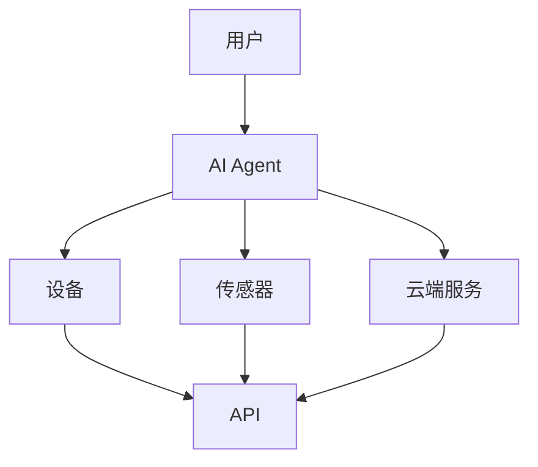
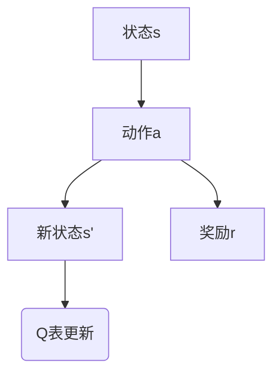
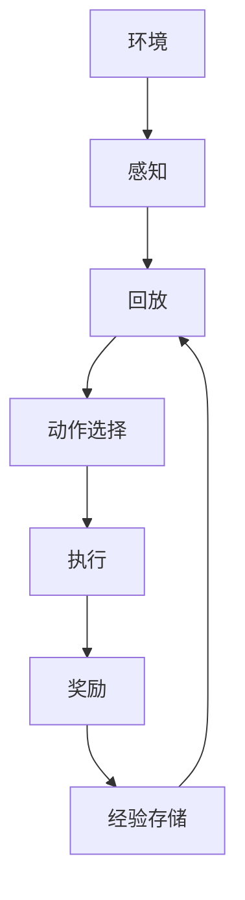
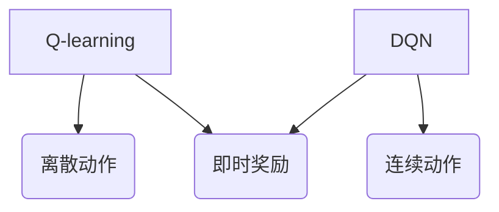
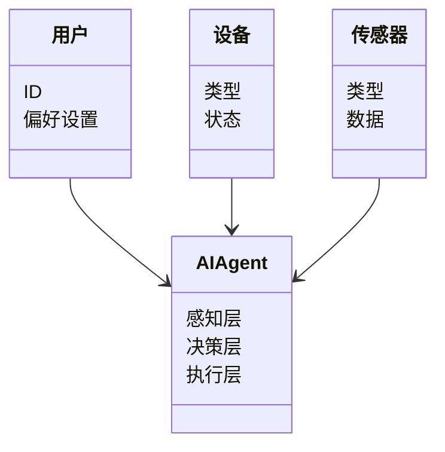
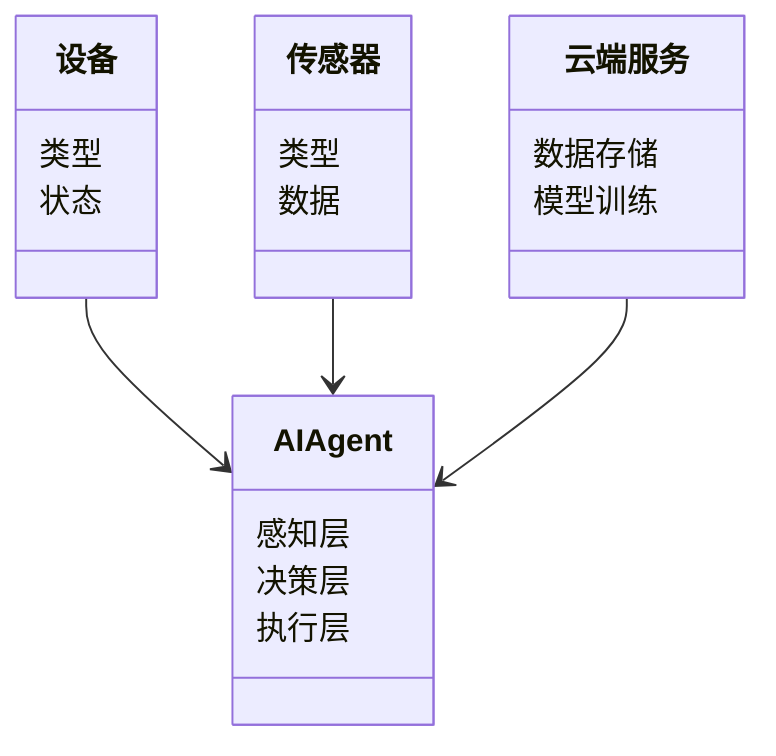
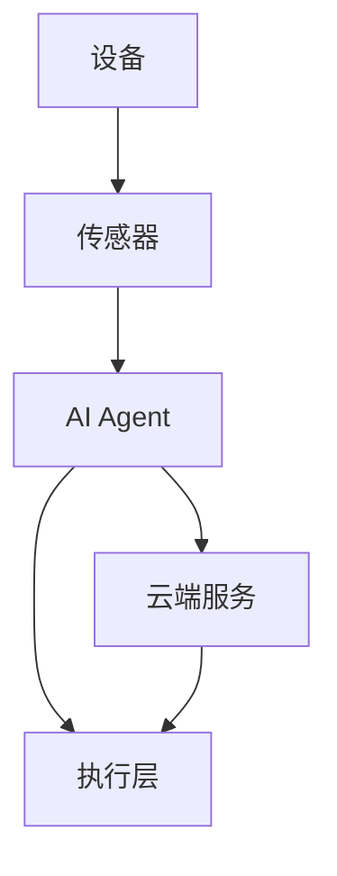

                 


# 物联网AI：构建智能家居和工业互联网的AI Agent

## 关键词：
物联网、AI Agent、智能家居、工业互联网、人工智能、系统架构、算法原理

## 摘要：
本文深入探讨了物联网与人工智能相结合的AI Agent在智能家居和工业互联网中的应用。通过详细讲解AI Agent的核心概念、算法原理、系统架构设计以及项目实战，本文为读者提供了一套完整的构建方法。从背景介绍到系统设计，从算法实现到项目实战，本文全面覆盖了物联网AI Agent的各个方面，帮助读者理解其技术原理和实际应用。

---

## 第一部分：物联网AI与AI Agent概述

### 第1章：物联网与AI Agent的背景介绍

#### 1.1 物联网与AI的结合

物联网（Internet of Things，IoT）是指通过各种信息传感设备，如传感器、射频识别（RFID）、全球定位系统（GPS）、红外感应器等，按照约定的协议，把任何物品与互联网连接起来，进行信息交换和通信，以实现智能化识别、定位、跟踪、监控和管理。而人工智能（Artificial Intelligence，AI）则是模拟人类智能的理论、方法、技术及应用系统，包括学习、推理、规划、自然语言处理等能力。

物联网与AI的结合，使得设备不仅能够采集数据，还能通过AI技术进行分析和决策，从而实现智能化的管理和控制。这种结合为智能家居和工业互联网带来了革命性的变化。

#### 1.2 智能家居与工业互联网的背景

智能家居是指通过物联网技术将家中的各种设备（如灯光、空调、安防系统等）连接起来，实现智能化的管理和控制。随着AI技术的发展，智能家居的智能化水平不断提高，设备之间的协作更加紧密，用户体验更加个性化。

工业互联网则是将物联网技术应用于工业生产领域，通过连接各种工业设备、传感器和控制系统，实现生产过程的智能化和自动化。AI Agent在工业互联网中的应用，可以帮助企业优化生产流程、提高效率、降低成本，并实现预测性维护等高级功能。

---

## 第二部分：AI Agent的核心概念与原理

### 第2章：AI Agent的核心概念与联系

#### 2.1 AI Agent的基本原理

AI Agent是一种能够感知环境、做出决策并采取行动的智能实体。它通常包括以下三个核心部分：

1. **感知层**：通过传感器或其他数据源获取环境中的信息。
2. **决策层**：基于感知到的信息，利用算法进行分析和推理，生成决策。
3. **执行层**：根据决策结果，通过执行机构或API调用等方式，对环境进行干预或反馈。

AI Agent的工作流程如下：

1. 感知层采集数据并传递给决策层。
2. 决策层基于数据进行分析和推理，生成决策。
3. 执行层根据决策结果执行相应的操作。

#### 2.2 实体关系与架构设计

在智能家居和工业互联网中，AI Agent需要与多种实体进行交互，包括用户、设备、传感器、云端服务等。以下是常见的实体关系：

- **用户**：智能家居的最终使用者，通过手机APP或语音助手与AI Agent交互。
- **设备**：智能家居中的各种设备（如智能灯泡、空调、摄像头等）。
- **传感器**：用于采集环境数据（如温度、湿度、光照等）。
- **云端服务**：用于存储数据、训练模型和提供计算资源。
- **API**：用于设备之间的通信和数据共享。

以下是实体关系的Mermaid图：



---

### 第3章：AI Agent的算法原理

#### 3.1 强化学习算法

强化学习是一种通过试错方式来优化决策模型的算法。AI Agent通过与环境的交互，学习如何在不同状态下采取最优行动，以获得最大化的累积奖励。

##### 3.1.1 Q-learning算法

Q-learning是一种经典的强化学习算法，适用于离散状态和动作空间。其核心思想是维护一个Q表，记录每个状态下每个动作的期望奖励。Q-learning的算法流程如下：



数学模型如下：

$$ Q(s, a) = Q(s, a) + \alpha \left[ r + \gamma \max Q(s', a') - Q(s, a) \right] $$

其中：
- $\alpha$ 是学习率，控制更新步长。
- $\gamma$ 是折扣因子，控制未来奖励的重要性。
- $r$ 是即时奖励。

##### 3.1.2 DQN算法

深度强化学习（Deep Q-Network，DQN）将神经网络用于近似Q值函数。DQN的核心思想是通过经验回放和目标网络来稳定训练过程。

DQN的算法流程如下：



##### 3.1.3 算法流程图

以下是Q-learning和DQN算法的对比图：



#### 3.2 监督学习与无监督学习

##### 3.2.1 监督学习的数学模型

监督学习是通过训练数据学习输入与输出之间的映射关系。其数学模型如下：

$$ y = f(x) $$

其中：
- $x$ 是输入数据。
- $y$ 是目标输出。
- $f$ 是模型函数。

##### 3.2.2 无监督学习的数学模型

无监督学习是通过数据本身的学习结构或分布。其数学模型如下：

$$ f(x) \sim P(x) $$

其中：
- $P(x)$ 是数据的分布。

---

## 第三部分：系统架构与设计

### 第4章：系统架构设计

#### 4.1 问题场景分析

智能家居和工业互联网的复杂性要求AI Agent具备高效的数据处理能力和快速的决策能力。以下是常见的问题场景：

1. **智能家居中的多设备协作**：如何协调不同设备之间的动作，以实现最优的用户体验。
2. **工业互联网中的实时监控**：如何快速响应设备的异常情况，进行预测性维护。

#### 4.2 系统功能设计

##### 4.2.1 领域模型设计

领域模型是系统功能设计的核心，以下是智能家居和工业互联网的领域模型：

智能家居领域模型：



工业互联网领域模型：



##### 4.2.2 系统架构设计图

以下是智能家居和工业互联网的系统架构设计图：

智能家居系统架构：


工业互联网系统架构：



---

## 第四部分：项目实战与实现

### 第5章：智能家居AI Agent项目实战

#### 5.1 项目环境配置

##### 5.1.1 开发工具安装

- **Python**：安装Python 3.8及以上版本。
- **TensorFlow**：安装TensorFlow框架。
- **Mermaid**：安装Mermaid CLI工具。

##### 5.1.2 数据集准备

智能家居数据集通常包括设备状态、传感器数据、用户偏好等信息。以下是示例数据集：

```plaintext
用户ID, 设备类型, 设备状态, 传感器数据, 时间戳
1, 灯泡, 关, 温度=25°C, 2023-10-01 10:00:00
1, 空调, 开, 温度=24°C, 2023-10-01 10:05:00
```

#### 5.2 核心代码实现

##### 5.2.1 感知层代码

```python
class Sensor:
    def __init__(self):
        self.data = {}

    def read(self):
        # 示例传感器数据
        return {
            '温度': 25,
            '湿度': 50
        }
```

##### 5.2.2 决策层代码

```python
class DecisionLayer:
    def __init__(self):
        self.model = self.build_model()

    def build_model(self):
        import tensorflow as tf
        model = tf.keras.Sequential([
            tf.keras.layers.Dense(64, activation='relu'),
            tf.keras.layers.Dense(1, activation='sigmoid')
        ])
        model.compile(optimizer='adam', loss='binary_crossentropy', metrics=['accuracy'])
        return model

    def predict(self, data):
        return self.model.predict(data)
```

##### 5.2.3 执行层代码

```python
class Actuator:
    def __init__(self):
        pass

    def execute(self, action):
        # 示例执行操作
        print(f"执行操作：{action}")
```

#### 5.3 测试与优化

##### 5.3.1 功能测试

测试AI Agent在不同场景下的表现，例如：

- 当温度超过25°C时，自动开启空调。
- 当用户发出语音指令时，快速响应并执行操作。

##### 5.3.2 性能优化

通过调整模型参数（如学习率、批量大小）和优化算法（如Adam、SGD）来提高模型的准确率和运行效率。

---

### 第6章：工业互联网AI Agent项目实战

#### 6.1 项目背景与目标

工业互联网中的AI Agent通常用于设备监控、预测性维护和生产优化。以下是项目背景和目标：

##### 6.1.1 项目背景

随着工业生产的智能化需求不断提高，传统的设备监控系统已无法满足实时性和智能化的要求。AI Agent可以通过实时分析设备数据，预测设备的运行状态，从而实现预测性维护。

##### 6.1.2 项目目标

- 实现设备数据的实时采集和分析。
- 提供设备状态的实时监控和预警。
- 实现预测性维护，减少设备停机时间。

#### 6.2 系统设计与实现

##### 6.2.1 系统设计图

以下是工业互联网AI Agent的系统设计图：


##### 6.2.2 核心代码实现

```python
class IndustrialAI:
    def __init__(self):
        self.model = self.build_model()

    def build_model(self):
        import tensorflow as tf
        model = tf.keras.Sequential([
            tf.keras.layers.Dense(64, activation='relu'),
            tf.keras.layers.Dense(1, activation='sigmoid')
        ])
        model.compile(optimizer='adam', loss='binary_crossentropy', metrics=['accuracy'])
        return model

    def predict(self, data):
        return self.model.predict(data)
```

---

## 第五部分：总结与展望

### 第7章：总结与未来展望

#### 7.1 本书内容回顾

通过本书的学习，读者可以掌握物联网AI Agent的核心概念、算法原理、系统架构设计以及项目实战。从智能家居到工业互联网，AI Agent的应用场景越来越广泛，其技术也在不断进步。

#### 7.2 未来发展趋势

1. **AI Agent的智能化**：通过强化学习和无监督学习，AI Agent将具备更强的自主决策能力。
2. **多模态数据融合**：结合视觉、听觉等多种数据源，提升AI Agent的感知能力。
3. **边缘计算与云计算结合**：通过边缘计算实现低延迟和高效率，同时利用云计算进行大规模数据处理和模型训练。

---

## 附录

### 附录A：工具与库安装指南

- **Python**：`python --version`
- **TensorFlow**：`pip install tensorflow`
- **Mermaid**：`npm install -g mermaid-cli`

### 附录B：数学公式汇总

- **Q-learning公式**：
  $$ Q(s, a) = Q(s, a) + \alpha \left[ r + \gamma \max Q(s', a') - Q(s, a) \right] $$
  
- **DQN算法流程图**：
  ```mermaid
  graph TD
      A[状态s] --> B[动作a] --> C[新状态s']
      B --> D[奖励r]
      C --> E(Q表更新)
  ```

---

## 作者

作者：AI天才研究院/AI Genius Institute & 禅与计算机程序设计艺术 /Zen And The Art of Computer Programming

---

通过以上内容，读者可以系统地学习物联网AI Agent的核心技术，并将其应用于智能家居和工业互联网的实际场景中。

