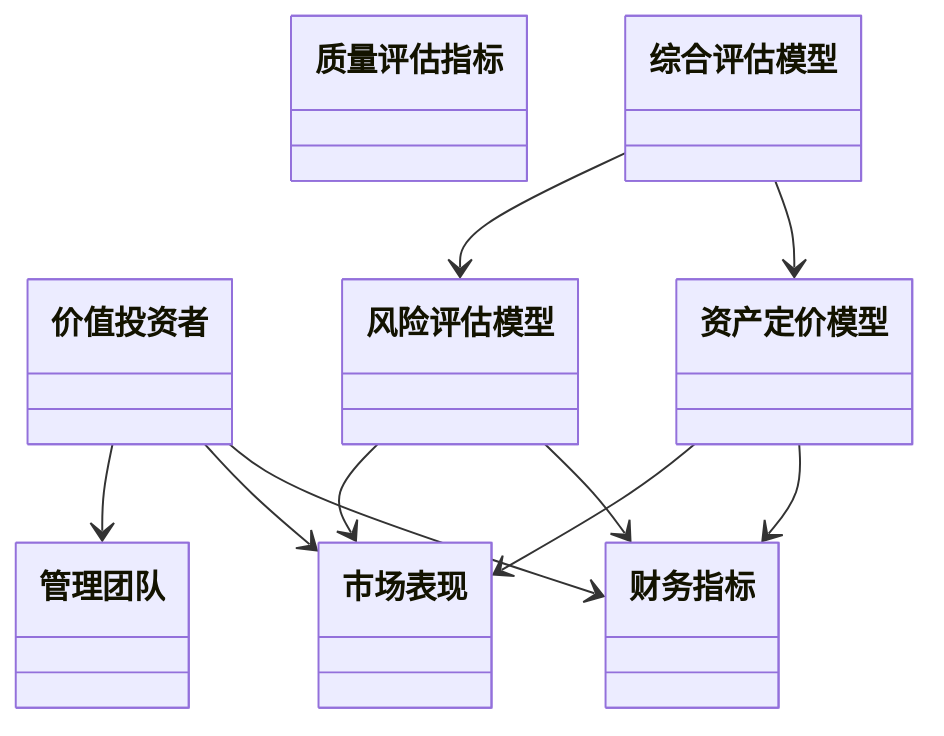
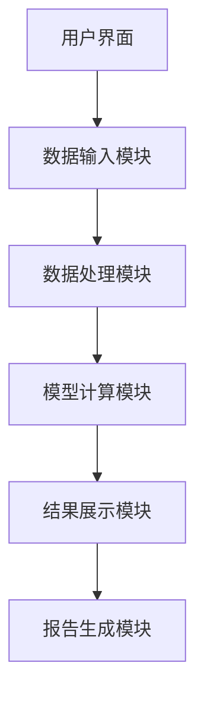
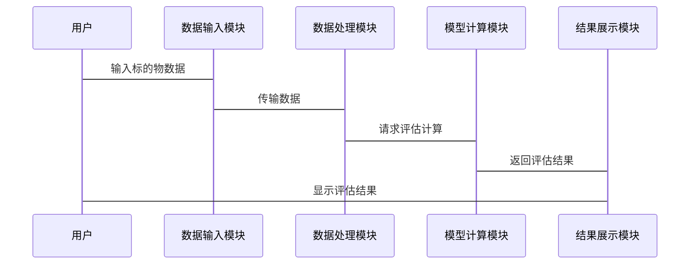

                 


# 约瑟夫·拉科尼克的价值投资者的质量评估

> 关键词：价值投资者，质量评估，投资分析，多因子模型，资产定价，风险管理

> 摘要：本文通过分析价值投资者的核心理念、质量评估的关键指标以及相关的数学模型和算法，详细阐述了如何使用技术手段对价值投资者的质量进行科学评估。文章从背景介绍、核心概念、算法原理、系统架构到项目实战，全面解析了价值投资者的质量评估过程，并结合实际案例进行深入分析，为读者提供了理论与实践相结合的参考。

---

## 第一部分: 价值投资者的质量评估背景与核心概念

### 第1章: 价值投资者的质量评估概述

#### 1.1 价值投资者的定义与特点
##### 1.1.1 价值投资者的定义
价值投资者是指一类以长期投资、注重基本面分析为核心理念的投资者。他们寻找市场价格低于内在价值的标的物进行投资，追求长期稳定的收益。价值投资者通常关注企业的财务状况、行业地位、竞争优势等因素，而非短期市场波动。

##### 1.1.2 价值投资者的核心特点
- **长期投资**：价值投资者注重长期持有优质资产，而非短期交易。
- **基本面分析**：通过分析企业的财务报表、行业地位、竞争优势等，寻找被市场低估的投资标的。
- **逆向思维**：在市场恐慌时买入，在市场疯狂时卖出。
- **风险管理**：注重安全边际，避免过度承担风险。

##### 1.1.3 价值投资者的分类与边界
价值投资者可以分为两类：
- **纯价值投资者**：专注于寻找市场价格低于内在价值的标的物。
- **价值成长投资者**：在注重价值的同时，也关注标的物的成长性。

其边界在于：价值投资者并不追求短期收益，而是通过长期持有优质资产实现财富增长。

#### 1.2 价值投资者的质量评估背景
##### 1.2.1 投资市场的复杂性
现代投资市场日益复杂，信息不对称、市场波动、宏观经济环境等因素都会影响投资标的的价值。如何在复杂的市场环境中准确评估价值投资者的质量，是一个具有挑战性的课题。

##### 1.2.2 价值投资者面临的挑战
- **信息过载**：投资者需要处理大量的信息，但信息的质量难以保证。
- **市场波动**：短期市场波动可能掩盖标的物的真实价值。
- **竞争加剧**：越来越多的投资者涌入市场，优质标的物的竞争日益激烈。

##### 1.2.3 质量评估的重要性
质量评估是价值投资者的核心能力，它决定了投资者能否找到真正具有投资价值的标的物。通过科学的质量评估方法，价值投资者可以提高投资决策的准确性，降低投资风险。

### 第2章: 价值投资者的质量评估核心概念

#### 2.1 价值投资者的核心要素
##### 2.1.1 投资理念
价值投资者的投资理念基于以下几个核心要素：
- **安全边际**：买入价格低于内在价值，确保足够的安全空间。
- **竞争优势**：投资具有强大竞争优势的企业。
- **长期视角**：关注企业的长期发展，而非短期波动。

##### 2.1.2 投资策略
价值投资者通常采用以下策略：
- **买入并持有**：长期持有优质资产，等待市场回归理性。
- **逆向投资**：在市场恐慌时买入，市场疯狂时卖出。
- **分散投资**：通过分散投资降低风险。

##### 2.1.3 风险管理
价值投资者注重风险管理，通常采用以下方法：
- **安全边际**：确保买入价格低于内在价值。
- **分散投资**：避免过度集中投资于单一标的物。
- **动态调整**：根据市场变化和企业状况，动态调整投资组合。

#### 2.2 质量评估的关键指标
##### 2.2.1 财务指标
价值投资者通常关注以下财务指标：
- **市盈率（P/E）**：衡量股价与每股收益的比率。
- **市净率（P/B）**：衡量股价与每股净资产的比率。
- **股息率**：衡量股票的分红能力。
- **ROE（净资产收益率）**：衡量企业的盈利能力。

##### 2.2.2 市场表现
市场表现是评估价值投资者的重要指标，包括：
- **超额收益**：投资组合相对于市场指数的超额收益。
- **风险调整后收益**：考虑风险因素后的收益表现。
- **收益稳定性**：投资组合收益的波动性。

##### 2.2.3 管理团队
管理团队是企业价值的重要组成部分，价值投资者通常关注：
- **管理能力**：管理层的行业经验和决策能力。
- **治理结构**：企业的治理结构是否透明、高效。
- **企业声誉**：企业的市场声誉和品牌价值。

#### 2.3 价值投资者与质量评估的关系
##### 2.3.1 质量评估对投资决策的影响
质量评估是价值投资者投资决策的核心环节。通过科学的质量评估方法，投资者可以识别出具有投资价值的标的物，从而提高投资成功率。

##### 2.3.2 价值投资者如何通过质量评估优化投资组合
通过质量评估，价值投资者可以：
- **筛选优质标的**：找到具有长期竞争优势和良好财务状况的企业。
- **优化资产配置**：根据标的物的质量和风险特征，优化投资组合。
- **动态调整投资策略**：根据市场变化和标的物质量变化，动态调整投资策略。

---

## 第二部分: 价值投资者的质量评估算法与数学模型

### 第3章: 价值投资者的质量评估算法原理

#### 3.1 质量评估算法概述
##### 3.1.1 基于多因子模型的评估算法
多因子模型是一种常用的资产定价模型，它通过多个因子来解释资产的收益来源。在价值投资者的质量评估中，多因子模型可以用来分析标的物的多个财务和市场因子，从而评估其投资价值。

##### 3.1.2 基于机器学习的质量评估算法
机器学习是一种 powerful 的数据分析方法，可以通过训练模型来识别数据中的模式和关系。在价值投资者的质量评估中，机器学习可以用于预测标的物的未来表现，并识别潜在的风险因素。

##### 3.1.3 基于传统金融理论的评估算法
传统金融理论，如资本资产定价模型（CAPM）和套利定价理论（APT），为资产定价提供了理论基础。在价值投资者的质量评估中，这些理论可以用来评估标的物的合理定价，并识别潜在的估值偏差。

#### 3.2 多因子模型的原理与实现
##### 3.2.1 多因子模型的构建
多因子模型的构建过程包括以下几个步骤：
1. **选择因子**：选择影响资产收益的关键因子，如市值、收益波动率、流动性等。
2. **数据收集**：收集相关因子的历史数据。
3. **因子回归**：通过回归分析确定每个因子的权重。
4. **因子组合**：将因子组合起来，构建多因子模型。

##### 3.2.2 多因子模型的权重分配
多因子模型的权重分配可以通过以下几种方法实现：
- **等权分配**：每个因子的权重相同。
- **回归权重**：通过回归分析确定因子的权重。
- **风险调整权重**：根据因子的风险特征调整权重。

##### 3.2.3 多因子模型的优化与调整
多因子模型的优化与调整包括以下几个方面：
- **因子筛选**：去除对收益贡献较小的因子。
- **权重调整**：根据市场变化和标的物特性调整因子权重。
- **模型验证**：通过回测和实证分析验证模型的有效性。

### 第4章: 价值投资者的质量评估数学模型

#### 4.1 质量评估的数学模型概述
##### 4.1.1 资产定价模型
资产定价模型是质量评估的重要工具，它通过数学公式描述资产收益与风险的关系。

##### 4.1.2 风险评估模型
风险评估模型用于衡量投资标的的风险特征，如波动率、VaR（风险价值）等。

##### 4.1.3 综合评估模型
综合评估模型将资产定价和风险评估结合起来，综合评估标的物的投资价值。

#### 4.2 资产定价模型的数学公式
##### 4.2.1 CAPM模型
资本资产定价模型（CAPM）是资产定价的经典模型，其公式为：
$$ E(r_i) = r_f + β_i (E(r_m) - r_f) $$
其中：
- \( E(r_i) \)：资产i的预期收益率
- \( r_f \)：无风险利率
- \( β_i \)：资产i的贝塔系数
- \( E(r_m) \)：市场预期收益率

##### 4.2.2 APT模型
套利定价理论（APT）是另一种资产定价模型，其公式为：
$$ E(r_i) = \sum_{j=1}^n \lambda_j x_{ij} + \epsilon_i $$
其中：
- \( E(r_i) \)：资产i的预期收益率
- \( \lambda_j \)：因子j的回报溢价
- \( x_{ij} \)：资产i对因子j的暴露程度
- \( \epsilon_i \)：特异风险

#### 4.3 风险评估模型的数学公式
##### 4.3.1 方差-协方差矩阵
方差-协方差矩阵用于衡量资产之间的风险相关性，其公式为：
$$ \Sigma = \begin{bmatrix} \sigma_1^2 & \sigma_{1,2} & \dots & \sigma_{1,n} \\ \sigma_{2,1} & \sigma_2^2 & \dots & \sigma_{2,n} \\ \dots & \dots & \dots & \dots \\ \sigma_{n,1} & \sigma_{n,2} & \dots & \sigma_{n}^2 \end{bmatrix} $$

##### 4.3.2 VaR模型
风险价值（VaR）是衡量投资组合风险的重要指标，其公式为：
$$ VaR = \text{损失金额} $$

---

## 第三部分: 价值投资者的质量评估系统架构与实现

### 第5章: 价值投资者的质量评估系统架构

#### 5.1 系统功能设计
##### 5.1.1 领域模型
领域模型是系统的核心，用于描述价值投资者的质量评估过程。以下是领域模型的mermaid类图：



#### 5.2 系统架构设计
##### 5.2.1 系统架构图
以下是系统架构的mermaid图：



#### 5.3 系统接口设计
##### 5.3.1 输入接口
- **数据输入接口**：接收标的物的财务数据、市场数据等。
- **参数设置接口**：允许用户设置模型的参数，如因子权重、风险偏好等。

##### 5.3.2 输出接口
- **结果输出接口**：输出标的物的质量评估结果，如投资价值评分、风险评估等。
- **报告生成接口**：生成详细的评估报告，包括数据来源、模型计算过程、结果分析等。

#### 5.4 系统交互流程
##### 5.4.1 交互流程图
以下是系统交互流程的mermaid序列图：



---

## 第四部分: 价值投资者的质量评估项目实战

### 第6章: 价值投资者的质量评估项目实战

#### 6.1 项目环境安装
##### 6.1.1 环境要求
- Python 3.8及以上版本
- 数据分析库：Pandas、NumPy、Scikit-learn
- 可视化库：Matplotlib、Seaborn
- 数据处理工具：Excel、CSV文件

#### 6.2 系统核心实现
##### 6.2.1 数据处理代码
以下是数据处理的Python代码示例：

```python
import pandas as pd
import numpy as np

# 读取数据
df = pd.read_csv('data.csv')

# 数据清洗
df.dropna(inplace=True)
df = df[~df['price'].isin([np.nan])]

# 数据转换
df['log_price'] = np.log(df['price'])
```

##### 6.2.2 模型实现代码
以下是基于多因子模型的评估代码示例：

```python
from sklearn.linear_model import LinearRegression
from sklearn.metrics import mean_squared_error

# 数据准备
X = df[['factor1', 'factor2', 'factor3']]
y = df['target']

# 模型训练
model = LinearRegression()
model.fit(X, y)

# 模型预测
y_pred = model.predict(X)
print('均方误差:', mean_squared_error(y, y_pred))
```

#### 6.3 代码应用解读与分析
##### 6.3.1 数据处理部分
数据处理部分主要完成数据的清洗和转换，确保数据的完整性和可用性。通过去除缺失值和对数据进行对数变换，可以提高模型的拟合效果。

##### 6.3.2 模型实现部分
基于多因子模型的评估代码使用了线性回归算法，通过多个因子的线性组合来预测目标变量。均方误差（MSE）是模型预测误差的衡量指标，值越小表示模型拟合效果越好。

#### 6.4 实际案例分析
##### 6.4.1 案例背景
以苹果公司为例，我们使用多因子模型对其质量进行评估。数据包括苹果公司的财务数据、市场数据等。

##### 6.4.2 案例分析
通过模型计算，我们发现苹果公司的市盈率和ROE指标表现优异，但其市净率略高于行业平均水平。结合其他因素，模型给出苹果公司具有较高的投资价值。

#### 6.5 项目小结
通过实际案例分析，我们验证了多因子模型在价值投资者质量评估中的有效性。模型能够较好地识别出具有投资价值的标的物，为投资者提供了科学的决策依据。

---

## 第五部分: 价值投资者的质量评估总结与实践

### 第7章: 总结与最佳实践

#### 7.1 小结
本文从背景介绍、核心概念、算法原理、系统架构到项目实战，全面解析了价值投资者的质量评估过程。通过多因子模型和机器学习算法，我们能够更科学地评估价值投资者的质量，从而提高投资决策的准确性。

#### 7.2 最佳实践 tips
- **数据质量**：确保数据的完整性和准确性。
- **模型选择**：根据具体情况选择合适的模型和算法。
- **风险控制**：注重风险管理，避免过度集中投资。
- **持续学习**：关注市场变化，不断优化评估模型。

#### 7.3 注意事项
- **避免过度拟合**：在模型训练中，要注意避免过度拟合，确保模型的泛化能力。
- **关注市场变化**：市场环境不断变化，需要动态调整评估策略。
- **结合定性分析**：质量评估不仅仅是定量分析，还需要结合定性分析，如企业管理层的能力、行业趋势等。

#### 7.4 拓展阅读
- 《投资学》：深入理解资产定价理论和投资组合管理。
- 《Python机器学习》：学习更多机器学习算法及其在金融领域的应用。
- 《价值投资实战》：结合实际案例，学习价值投资者的实战经验。

---

## 作者

作者：AI天才研究院/AI Genius Institute & 禅与计算机程序设计艺术 /Zen And The Art of Computer Programming

---

通过本文的详细分析，我们不仅了解了价值投资者的质量评估的理论基础，还通过实际案例展示了如何将技术手段应用于投资分析。希望本文能为读者提供有价值的参考，帮助他们在投资领域取得更好的成绩。

