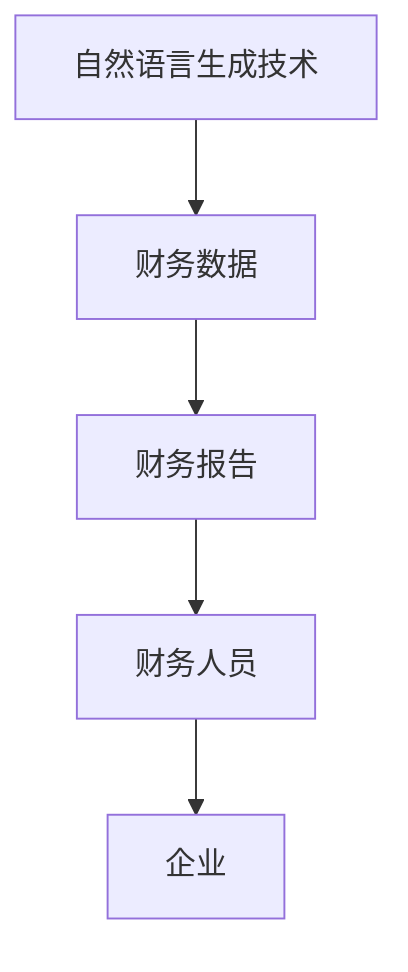
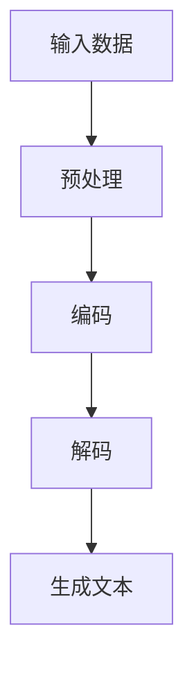
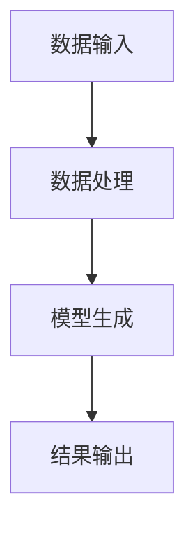
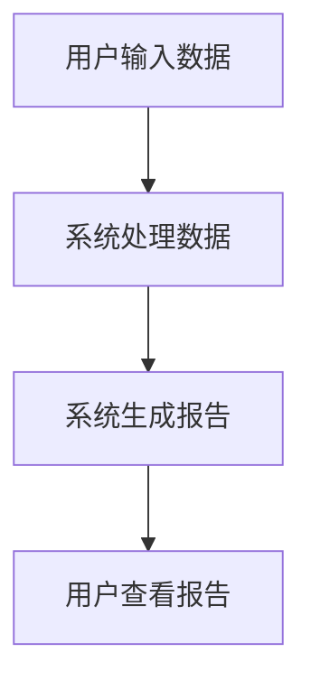

                 


# 自然语言生成技术在财务报告中的应用

> 关键词：自然语言生成，财务报告，NLP，机器学习，深度学习

> 摘要：自然语言生成（NLP）技术近年来在财务报告中的应用越来越广泛。本文详细探讨了自然语言生成技术在财务报告中的应用背景、核心概念、算法原理、系统架构以及实际项目中的应用，并通过具体案例分析了自然语言生成技术的优势和挑战，最后给出了最佳实践建议。

---

# 第一部分: 自然语言生成技术在财务报告中的应用概述

## 第1章: 自然语言生成技术与财务报告的背景介绍

### 1.1 自然语言生成技术的基本概念

自然语言生成（Natural Language Processing, NLP）是人工智能领域的重要分支，主要研究如何让计算机能够理解并生成人类语言。其核心目标是将结构化的数据转化为自然语言文本。NLP技术广泛应用于机器翻译、文本摘要、对话系统、文本生成等领域。

#### 1.1.1 自然语言生成技术的定义

自然语言生成技术是指通过计算机算法生成符合人类语言习惯的文本的技术。它结合了自然语言处理（NLP）和自然语言理解（NLU）的核心原理，能够从数据中提取信息，并将其转化为流畅、准确的自然语言文本。

#### 1.1.2 自然语言生成技术的核心要素

1. **输入数据**：结构化的数据，如财务数据（收入、支出、利润等）。
2. **生成模型**：基于统计或深度学习的生成模型，如RNN、LSTM、Transformer等。
3. **语言规则**：语法、语义规则，确保生成的文本符合语言规范。
4. **上下文信息**：与生成文本相关的背景信息，如公司财务状况、行业术语等。

#### 1.1.3 自然语言生成技术的演进历程

- **传统规则引擎**：基于预定义的规则生成文本，适用于简单的场景。
- **统计模型**：基于概率模型生成文本，如n-gram模型。
- **深度学习模型**：基于神经网络的生成模型，如RNN、LSTM、Transformer等，生成更复杂、更流畅的文本。

### 1.2 财务报告的特点与生成需求

财务报告是企业对外展示财务状况的重要文件，通常包括资产负债表、利润表、现金流量表等内容。传统的财务报告生成方式主要依赖人工撰写，效率低、成本高、容易出错。

#### 1.2.1 财务报告的基本结构与内容

1. **资产负债表**：企业的资产、负债和所有者权益。
2. **利润表**：企业的收入、成本和利润。
3. **现金流量表**：企业的现金流入和流出情况。
4. **财务报表附注**：对财务报表的详细解释和补充。

#### 1.2.2 财务报告生成的痛点与挑战

1. **效率低下**：人工撰写财务报告耗时长，效率低。
2. **准确性不足**：人工撰写容易出错，尤其是复杂财务数据的处理。
3. **一致性问题**：不同部门或不同报告的格式和内容不一致。
4. **成本高昂**：需要大量人力资源和时间成本。

#### 1.2.3 自然语言生成技术在财务报告中的应用价值

1. **提高效率**：通过自动化生成财务报告，节省时间和人力资源。
2. **优化准确性**：基于结构化数据生成报告，减少人为错误。
3. **降低成本**：减少人工撰写成本，降低企业财务部门的运营成本。
4. **提高一致性**：确保不同报告的格式和内容一致，提升企业形象。

### 1.3 自然语言生成技术在财务领域的优势

自然语言生成技术在财务领域的应用具有显著优势，能够帮助企业高效、准确地生成财务报告。

#### 1.3.1 提高财务报告的生成效率

通过自动化生成财务报告，企业可以显著提高报告生成效率，减少人工干预。

#### 1.3.2 优化财务报告的准确性和一致性

基于结构化数据生成报告，确保数据的准确性和一致性，减少人为错误。

#### 1.3.3 降低财务报告的生成成本

自动化生成财务报告可以显著降低企业的人力成本和时间成本。

### 1.4 自然语言生成技术在财务报告中的应用现状

自然语言生成技术在财务报告中的应用还处于初级阶段，但已经取得了一些显著成果。

#### 1.4.1 当前主要应用领域

1. **财务摘要生成**：基于财务数据生成财务摘要。
2. **财务报告初稿生成**：生成财务报告的初稿，供财务人员修改和完善。
3. **财务分析报告生成**：生成财务分析报告，帮助企业进行财务决策。

#### 1.4.2 应用中的典型问题

1. **生成文本的准确性**：如何确保生成的财务报告的准确性。
2. **生成文本的可读性**：如何提高生成文本的可读性和流畅性。
3. **模型的可解释性**：如何解释模型的生成过程，确保生成结果的透明性。

#### 1.4.3 未来发展趋势

随着自然语言生成技术的不断发展，其在财务报告中的应用将更加广泛和深入。未来可能会出现更加智能化、个性化的财务报告生成系统，能够根据企业的具体需求生成定制化的财务报告。

## 1.5 本章小结

本章介绍了自然语言生成技术的基本概念和其在财务报告中的应用背景。通过对财务报告的特点和生成需求的分析，探讨了自然语言生成技术在财务领域的优势和应用现状。最后，总结了自然语言生成技术在财务报告中的未来发展趋势。

---

## 第2章: 自然语言生成技术的核心概念与联系

### 2.1 自然语言生成技术的核心原理

自然语言生成技术的核心原理是基于结构化数据生成自然语言文本。其主要步骤包括数据预处理、模型训练、文本生成和结果优化。

#### 2.1.1 自然语言生成技术的基本模型结构

1. **基于规则的生成模型**：通过预定义的规则生成文本。
2. **基于统计的生成模型**：基于概率模型生成文本。
3. **基于深度学习的生成模型**：基于神经网络生成文本。

#### 2.1.2 自然语言生成技术的训练方法

1. **监督学习**：基于标注数据进行训练。
2. **无监督学习**：基于未标注数据进行训练。
3. **迁移学习**：将其他任务中的知识迁移到当前任务。

#### 2.1.3 自然语言生成技术的评估指标

1. **BLEU**：基于编辑距离的评估指标。
2. **ROUGE**：基于召回率的评估指标。
3. **METEOR**：基于元语言评估的指标。

### 2.2 自然语言生成技术与财务报告的关系

自然语言生成技术与财务报告的关系是密不可分的，两者结合可以实现高效、准确的财务报告生成。

#### 2.2.1 自然语言生成技术在财务报告中的具体应用

1. **财务摘要生成**：基于财务数据生成财务摘要。
2. **财务报告初稿生成**：生成财务报告的初稿，供财务人员修改和完善。
3. **财务分析报告生成**：生成财务分析报告，帮助企业进行财务决策。

#### 2.2.2 自然语言生成技术与财务知识的结合

自然语言生成技术需要结合财务知识，才能生成准确、专业的财务报告。

#### 2.2.3 自然语言生成技术对财务报告质量的影响

自然语言生成技术可以显著提高财务报告的生成效率和准确性，从而提升财务报告的质量。

### 2.3 自然语言生成技术的核心概念对比表

以下是几种常见自然语言生成模型的对比表：

| 模型类型 | 输入数据 | 输出结果 | 优点 | 缺点 |
|----------|----------|----------|------|------|
| 基于规则的生成模型 | 结构化数据 | 文本 | 简单易懂 | 可扩展性差 |
| 基于统计的生成模型 | 结构化数据 | 文本 | 可扩展性好 | 生成结果不够流畅 |
| 基于深度学习的生成模型 | 结构化数据 | 文本 | 生成结果流畅 | 模型复杂，训练成本高 |

### 2.4 自然语言生成技术的ER实体关系图

以下是自然语言生成技术与财务报告的实体关系图：



### 2.5 本章小结

本章详细介绍了自然语言生成技术的核心原理及其与财务报告的关系。通过对比不同模型的特点，分析了自然语言生成技术在财务报告中的具体应用。最后，通过ER实体关系图展示了自然语言生成技术与财务报告之间的关系。

---

## 第3章: 自然语言生成技术的算法原理

### 3.1 自然语言生成技术的主要算法

自然语言生成技术的主要算法包括基于规则的生成算法、基于统计的生成算法和基于深度学习的生成算法。

#### 3.1.1 基于规则的自然语言生成算法

基于规则的生成算法通过预定义的规则生成文本，适用于简单的生成任务。

#### 3.1.2 基于统计的自然语言生成算法

基于统计的生成算法通过概率模型生成文本，适用于复杂的生成任务。

#### 3.1.3 基于深度学习的自然语言生成算法

基于深度学习的生成算法通过神经网络生成文本，是目前最先进、效果最好的生成算法。

### 3.2 自然语言生成算法的流程图

以下是基于深度学习的自然语言生成算法的流程图：



### 3.3 自然语言生成算法的数学模型

#### 3.3.1 解码器-编码器架构

解码器-编码器架构是基于深度学习的自然语言生成算法的核心模型结构。

$$P(y|x) = \text{模型}(x)$$

其中，\( x \) 是输入数据，\( y \) 是生成的文本。

#### 3.3.2 注意力机制

注意力机制是解码器-编码器架构的重要组成部分，用于计算输入数据中每个位置的注意力权重。

$$\text{Attention}(Q, K, V) = \text{softmax}\left(\frac{QK^T}{\sqrt{d_k}}\right)V$$

其中，\( Q \) 是查询向量，\( K \) 是键向量，\( V \) 是值向量，\( d_k \) 是键向量的维度。

### 3.4 自然语言生成算法的Python实现

以下是基于深度学习的自然语言生成算法的Python实现代码示例：

```python
import tensorflow as tf
from tensorflow.keras.layers import LSTM, Dense, Embedding
from tensorflow.keras.models import Model

# 定义编码器
def encoder(input_shape, vocab_size):
    inputs = Input(shape=input_shape)
    embeddings = Embedding(vocab_size, 64)(inputs)
    encoder_lstm = LSTM(64, return_sequences=True)(embeddings)
    return Model(inputs=inputs, outputs=encoder_lstm)

# 定义解码器
def decoder(input_shape, vocab_size):
    inputs = Input(shape=input_shape)
    decoder_lstm = LSTM(64, return_sequences=True)(inputs)
    dense_layer = Dense(vocab_size, activation='softmax')(decoder_lstm)
    return Model(inputs=inputs, outputs=dense_layer)

# 定义解码器-编码器模型
encoder_model = encoder((None, 64), vocab_size)
decoder_model = decoder((None, 64), vocab_size)
encoder_model.output
```

### 3.5 本章小结

本章详细介绍了自然语言生成技术的主要算法及其数学模型。通过流程图和代码示例，展示了基于深度学习的自然语言生成算法的核心结构和实现方法。

---

## 第4章: 自然语言生成技术在财务报告中的系统架构设计

### 4.1 系统分析与设计

自然语言生成技术在财务报告中的应用需要结合企业实际需求进行系统设计。

#### 4.1.1 问题场景介绍

财务报告生成系统需要处理结构化数据，并生成符合财务规范的自然语言文本。

#### 4.1.2 系统功能设计

1. **数据输入模块**：接收结构化数据输入。
2. **数据处理模块**：对输入数据进行预处理和特征提取。
3. **模型生成模块**：基于预训练模型生成自然语言文本。
4. **结果输出模块**：输出生成的财务报告。

#### 4.1.3 系统架构设计

以下是自然语言生成技术在财务报告中的系统架构设计：



### 4.2 系统接口设计

系统接口设计需要考虑数据输入、模型调用和结果输出。

#### 4.2.1 数据输入接口

数据输入接口需要接收结构化数据输入，如财务数据。

#### 4.2.2 模型调用接口

模型调用接口需要调用自然语言生成模型，生成自然语言文本。

#### 4.2.3 结果输出接口

结果输出接口需要输出生成的财务报告，供财务人员查看和修改。

### 4.3 系统交互流程图

以下是系统交互流程图：



### 4.4 本章小结

本章详细介绍了自然语言生成技术在财务报告中的系统架构设计。通过接口设计和流程图，展示了系统各部分之间的交互关系。

---

## 第5章: 自然语言生成技术在财务报告中的项目实战

### 5.1 项目背景与目标

本项目旨在利用自然语言生成技术生成高质量的财务报告，提高财务报告的生成效率和准确性。

#### 5.1.1 项目背景

随着企业规模的不断扩大，财务报告的生成需求日益增长。传统的手工撰写方式效率低下，容易出错，难以满足企业需求。

#### 5.1.2 项目目标

通过自然语言生成技术，实现财务报告的自动化生成，提高生成效率和准确性。

### 5.2 项目核心实现

项目核心实现包括数据输入、数据处理、模型生成和结果输出。

#### 5.2.1 环境安装

1. **安装Python**：安装Python 3.6及以上版本。
2. **安装TensorFlow**：使用pip安装TensorFlow库。
3. **安装其他依赖**：安装自然语言处理相关的库，如Keras、NLTK等。

#### 5.2.2 核心代码实现

以下是项目的核心代码实现：

```python
import tensorflow as tf
from tensorflow.keras.layers import LSTM, Dense, Embedding
from tensorflow.keras.models import Model

# 定义编码器
def encoder(input_shape, vocab_size):
    inputs = Input(shape=input_shape)
    embeddings = Embedding(vocab_size, 64)(inputs)
    encoder_lstm = LSTM(64, return_sequences=True)(embeddings)
    return Model(inputs=inputs, outputs=encoder_lstm)

# 定义解码器
def decoder(input_shape, vocab_size):
    inputs = Input(shape=input_shape)
    decoder_lstm = LSTM(64, return_sequences=True)(inputs)
    dense_layer = Dense(v

