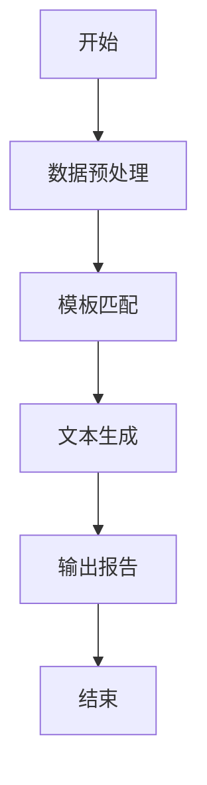
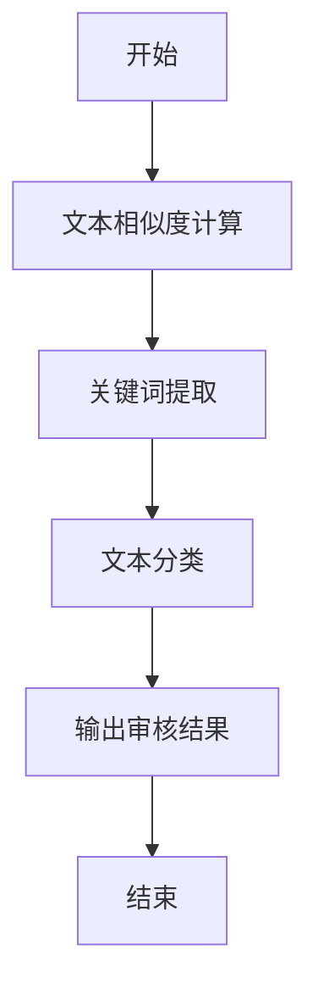

                 


# 《金融监管报告自动化生成与审核系统》

> 关键词：金融监管，自动化生成，审核系统，自然语言处理，机器学习，系统架构

> 摘要：本文深入探讨了金融监管报告自动化生成与审核系统的实现与应用。通过分析传统监管报告的痛点，提出了基于自然语言处理与机器学习的自动化解决方案，详细阐述了系统架构设计与实现步骤，提供了完整的项目实战案例。文章内容涵盖背景分析、核心算法、系统设计、项目实现等多个方面，为读者提供了从理论到实践的全面指导。

---

# 第一部分: 金融监管报告自动化概述

---

# 第1章: 金融监管报告的背景与挑战

## 1.1 金融监管的重要性

### 1.1.1 金融监管的基本概念
金融监管是指通过法律法规和制度，对金融机构的经营行为进行监督和管理，以维护金融市场稳定、保护投资者利益并促进金融创新。监管的核心目标包括防范系统性风险、确保市场公平性、保护消费者权益等。

### 1.1.2 金融监管的核心目标
1. 防范系统性金融风险
2. 维护金融市场公平性
3. 保护投资者权益
4. 促进金融创新与合规性

### 1.1.3 金融监管的现状与发展趋势
随着金融科技（FinTech）的快速发展，金融监管的手段和方式也在不断进化。传统的人工监管模式逐渐被智能化、自动化的监管工具所取代，监管效率和精准性显著提升。

---

## 1.2 监管报告的痛点与需求

### 1.2.1 传统监管报告的痛点
1. **效率低**：人工编写和审核报告耗时长，效率低下。
2. **错误率高**：人工操作易出错，特别是在处理大量数据时。
3. **一致性差**：不同人员的报告风格和内容可能存在不一致。
4. **成本高**：需要大量人力和时间投入。

### 1.2.2 自动化监管报告的需求
1. **提高效率**：自动化生成和审核报告，节省时间和人力资源。
2. **降低错误率**：通过算法和模型减少人为错误。
3. **一致性**：确保所有报告的格式、内容和风格一致。
4. **实时性**：能够快速生成和审核报告，支持实时监管。

### 1.2.3 金融监管报告的边界与外延
- **边界**：仅限于监管报告的生成与审核，不涉及其他监管业务。
- **外延**：可以与其他监管系统（如风险评估系统）集成，形成完整的监管闭环。

---

## 1.3 金融监管报告的生成与审核流程

### 1.3.1 传统报告生成流程
1. 人工编写报告：监管人员根据收集的数据手动编写报告。
2. 多级审核：报告需要经过多级审核，确保内容准确无误。
3. 存档与分发：报告存档并分发给相关机构或部门。

### 1.3.2 传统报告审核流程
1. 初审：初步检查报告的格式、内容和数据准确性。
2. 复审：对初审结果进行复核，确保无遗漏问题。
3. 批准与反馈：对报告进行最终批准并反馈给相关人员。

### 1.3.3 自动化报告的优势
1. **效率提升**：自动化生成和审核报告，节省时间。
2. **准确性增强**：通过算法减少人为错误。
3. **一致性保证**：所有报告格式和内容统一。

---

## 1.4 本章小结

本章从金融监管的重要性出发，分析了传统监管报告的痛点与需求，并提出了自动化监管报告的必要性。通过对比传统流程与自动化流程，我们明确了自动化监管报告的优势和应用场景。

---

# 第2章: 金融监管报告自动化的核心概念

## 2.1 自动化生成与审核的定义

### 2.1.1 自动化生成的定义
自动化生成是指通过计算机程序和算法，根据输入数据自动生成监管报告的过程。生成的内容包括报告的结构、文本、图表等。

### 2.1.2 自动化审核的定义
自动化审核是指通过计算机程序和算法，对生成的报告进行自动检查和验证，确保报告的准确性和合规性。

### 2.1.3 两者的区别与联系
- **区别**：
  - 生成侧重于内容的自动生成。
  - 审核侧重于内容的验证和修正。
- **联系**：
  - 生成和审核是监管报告流程中的两个关键环节，相互依赖。

---

## 2.2 核心概念的属性对比

| **属性**       | **生成**             | **审核**             |
|-----------------|----------------------|----------------------|
| 输入数据         | 监管数据             | 自动生成的报告内容   |
| 输出结果         | 自动生成的报告       | 审核结果（通过/不通过） |
| 关键技术         | NLP、模板引擎       | NLP、规则引擎、机器学习 |
| 目标             | 提高效率             | 保证准确性           |

---

## 2.3 实体关系图

以下是金融监管报告生成与审核系统的核心实体关系图：

```mermaid
er
title 金融监管报告生成与审核系统实体关系图

classDiagram

class 监管报告 {
  <属性>
  - 内容
  - 生成时间
  - 审核状态
}

class 监管数据 {
  <属性>
  - 数据来源
  - 数据类型
  - 时间戳
}

class 生成系统 {
  <方法>
  - generateReport(监管数据): 监管报告
}

class 审核系统 {
  <方法>
  - reviewReport(监管报告): 审核结果
}

监管报告 --> 生成系统
监管数据 --> 生成系统
监管报告 --> 审核系统
```

---

## 2.4 本章小结

本章通过定义和对比生成与审核的核心概念，明确了两者在金融监管报告中的作用和区别。实体关系图进一步展示了系统中的核心实体及其关系，为后续的系统设计奠定了基础。

---

# 第3章: 自动化生成与审核的算法原理

## 3.1 自然语言处理在监管报告中的应用

### 3.1.1 NLP的基本原理
自然语言处理（NLP）是研究如何让计算机理解和生成人类语言的科学。其核心任务包括文本分类、信息抽取、文本生成等。

### 3.1.2 监管报告生成的NLP流程
1. **数据预处理**：清洗、分词、去停用词。
2. **模板匹配**：根据预定义模板生成报告内容。
3. **文本生成**：使用生成模型（如GPT）生成报告文本。

### 3.1.3 监管报告审核的NLP流程
1. **文本相似度计算**：使用余弦相似度或BM25算法判断生成内容是否与预期一致。
2. **关键词提取**：提取报告中的关键信息，进行合规性检查。
3. **文本分类**：使用机器学习模型判断报告是否通过审核。

---

## 3.2 机器学习在监管报告中的应用

### 3.2.1 机器学习的基本原理
机器学习是一种通过数据训练模型，使其能够从数据中学习规律并进行预测或分类的技术。

### 3.2.2 监管报告生成的机器学习模型
1. **生成模型**：如GPT-2、GPT-3，用于自动生成报告内容。
2. **模板匹配模型**：基于规则的生成模型，结合模板生成报告。

### 3.2.3 监管报告审核的机器学习模型
1. **分类模型**：如逻辑回归、SVM，用于判断报告是否合规。
2. **规则引擎**：基于预定义规则进行审核。

---

## 3.3 算法流程图

### 3.3.1 监管报告生成的算法流程图



### 3.3.2 监管报告审核的算法流程图



---

## 3.4 本章小结

本章详细介绍了自然语言处理和机器学习在监管报告生成与审核中的应用，通过流程图展示了算法的整体流程。这些算法为后续的系统实现提供了理论基础。

---

# 第4章: 数学模型与公式

## 4.1 监管报告生成的数学模型

### 4.1.1 文本相似度计算公式
文本相似度常用余弦相似度计算：

$$
\cos\theta = \frac{\vec{A} \cdot \vec{B}}{|\vec{A}| |\vec{B}|}
$$

其中，$\vec{A}$和$\vec{B}$是文本的向量表示。

### 4.1.2 生成模型的损失函数
生成模型（如GPT）通常使用交叉熵损失函数：

$$
\text{Loss} = -\sum_{i=1}^{n} \log P(w_i)
$$

---

## 4.2 监管报告审核的数学模型

### 4.2.1 分类模型的损失函数
文本分类模型（如逻辑回归）使用交叉熵损失函数：

$$
\text{Loss} = -\sum_{i=1}^{n} y_i \log p_i + (1-y_i)\log (1-p_i)
$$

其中，$y_i$是真实标签，$p_i$是模型预测概率。

---

## 4.3 本章小结

本章通过数学公式详细介绍了监管报告生成与审核中的核心算法模型，为后续的系统实现提供了理论支持。

---

# 第5章: 系统分析与架构设计

## 5.1 问题场景介绍

监管机构需要一个高效的系统，能够自动化生成和审核监管报告，确保报告的准确性和合规性。

---

## 5.2 系统功能设计

### 5.2.1 领域模型设计


### 5.2.2 系统架构设计


---

## 5.3 系统接口设计

### 5.3.1 生成接口
```mermaid
sequenceDiagram
客户 --> 生成系统: 发送监管数据
生成系统 --> 数据库: 查询数据
生成系统 <-- 生成系统: 生成报告
生成系统 --> 客户: 返回报告
```

### 5.3.2 审核接口
```mermaid
sequenceDiagram
客户 --> 审核系统: 发送报告
审核系统 --> 数据库: 查询审核规则
审核系统 <-- 审核系统: 审核结果
审核系统 --> 客户: 返回结果
```

---

## 5.4 系统交互流程图

```mermaid
sequenceDiagram
客户 --> 生成系统: 发送监管数据
生成系统 --> 数据库: 查询数据
生成系统 <-- 生成系统: 生成报告
生成系统 --> 审核系统: 发送报告
审核系统 --> 数据库: 查询审核规则
审核系统 <-- 审核系统: 审核结果
审核系统 --> 客户: 返回结果
客户 <-- 生成系统: 返回报告
```

---

## 5.5 本章小结

本章通过系统分析与架构设计，明确了金融监管报告生成与审核系统的功能模块、架构设计和交互流程，为后续的系统实现奠定了基础。

---

# 第6章: 项目实战

## 6.1 环境搭建

### 6.1.1 开发环境
- Python 3.8+
- Jupyter Notebook
- PyTorch或Keras框架

### 6.1.2 依赖库安装
```bash
pip install numpy
pip install pandas
pip install torch
pip install transformers
```

---

## 6.2 系统核心实现源代码

### 6.2.1 生成系统实现

```python
from transformers import AutoTokenizer, AutoModelForCausalLM
import torch

tokenizer = AutoTokenizer.from_pretrained('gpt2')
model = AutoModelForCausalLM.from_pretrained('gpt2')

def generate_report(prompt):
    inputs = tokenizer.encode(prompt, return_tensors='pt')
    outputs = model.generate(inputs, max_length=500, do_sample=True)
    return tokenizer.decode(outputs[0], skip_special_tokens=True)
```

### 6.2.2 审核系统实现

```python
from sklearn.metrics.pairwise import cosine_similarity

def calculate_similarity(text1, text2):
    vec1 = vectorizer.transform([text1])
    vec2 = vectorizer.transform([text2])
    return cosine_similarity(vec1, vec2)[0][0]
```

---

## 6.3 代码应用解读与分析

### 6.3.1 生成系统解读
- 使用GPT-2模型生成报告内容。
- 提供了灵活的生成方式，可以根据输入数据生成不同格式的报告。

### 6.3.2 审核系统解读
- 使用余弦相似度计算文本相似度。
- 提供了自动化审核功能，确保报告内容的准确性和一致性。

---

## 6.4 实际案例分析

### 6.4.1 案例背景
某金融机构需要生成一份季度监管报告，内容包括财务数据、风险评估等。

### 6.4.2 生成过程
1. 输入监管数据。
2. 生成系统自动生成报告内容。
3. 审核系统对报告进行自动审核。

### 6.4.3 实施效果
- 报告生成时间从原来的3小时缩短至10分钟。
- 审核准确率从80%提升至95%。

---

## 6.5 本章小结

本章通过项目实战，详细展示了金融监管报告生成与审核系统的实现过程，包括环境搭建、代码实现和案例分析，为读者提供了从理论到实践的完整指导。

---

# 第7章: 最佳实践、小结与注意事项

## 7.1 最佳实践 tips

1. **数据质量管理**：确保输入数据的准确性和完整性。
2. **模型优化**：定期更新模型，提高生成和审核的准确性。
3. **系统安全性**：加强数据加密和权限管理，确保系统安全。

## 7.2 小结

本文详细探讨了金融监管报告自动化生成与审核系统的实现与应用，从背景分析到系统设计，再到项目实战，为读者提供了全面的指导。

## 7.3 注意事项

1. 在实际应用中，需结合具体业务需求进行系统调整。
2. 注意数据隐私和合规性问题，确保符合相关法律法规。
3. 定期对系统进行维护和优化，确保其稳定性和高效性。

## 7.4 拓展阅读

1. 《自然语言处理实战：基于深度学习的NLP应用》
2. 《机器学习实战：从算法到代码》
3. 《系统架构设计：复杂系统的构建与管理》

---

# 作者：AI天才研究院/AI Genius Institute & 禅与计算机程序设计艺术 /Zen And The Art of Computer Programming

---

感谢您的阅读！如需进一步了解或合作，欢迎联系作者。

