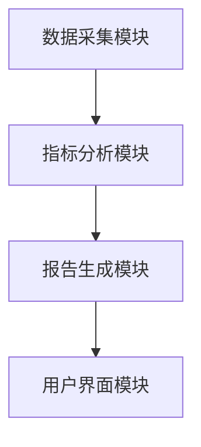
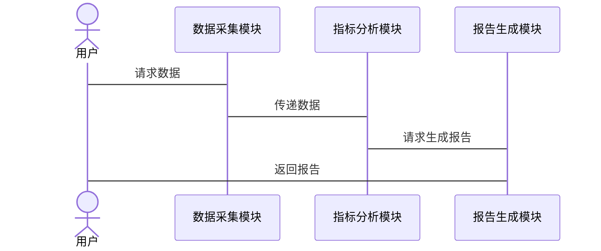

                 


# AI Agent在企业可持续发展指标跟踪与报告中的应用

## 关键词
AI Agent, 可持续发展指标, 企业报告, 人工智能, 算法原理, 系统架构, 项目实战

## 摘要
本文探讨AI Agent在企业可持续发展指标跟踪与报告中的应用，从背景、技术原理、系统架构到项目实战，详细分析AI Agent如何优化指标跟踪效率，提升报告准确性，并通过实际案例展示其在企业中的实际应用价值。

---

# 第1章: AI Agent与可持续发展指标的背景

## 1.1 企业可持续发展指标的定义与重要性
### 1.1.1 可持续发展指标的定义
可持续发展指标是指企业在环境、社会和治理（ESG）方面的表现，包括碳排放、员工福利、董事会多样性等关键指标。

### 1.1.2 企业可持续发展的核心目标
企业通过跟踪可持续发展指标，优化资源利用，降低环境影响，提升社会责任感，增强竞争力。

### 1.1.3 可持续发展指标的分类与特征
- **环境指标**：如碳排放、能源消耗。
- **社会指标**：如员工满意度、社区参与度。
- **治理指标**：如董事会结构、公司透明度。

## 1.2 AI Agent的定义与技术特点
### 1.2.1 AI Agent的基本概念
AI Agent是一种能够感知环境、自主决策并执行任务的智能体，具备学习、推理和自适应能力。

### 1.2.2 AI Agent的核心技术特征
- **自主性**：无需人工干预，自主完成任务。
- **反应性**：实时感知环境变化，动态调整行为。
- **学习能力**：通过数据训练，提升决策准确性。

## 1.3 AI Agent在企业中的应用背景
### 1.3.1 企业可持续发展面临的挑战
- 数据繁杂：企业需要处理海量数据，难以手动跟踪和分析。
- 指标动态变化：可持续发展指标随市场环境变化，需要实时调整。
- 跨领域协调：需要协调环境、社会、治理等多个领域的指标。

### 1.3.2 AI Agent在可持续发展中的潜在价值
- **自动化跟踪**：实时采集和分析数据，提高效率。
- **智能预测**：基于历史数据，预测未来趋势，提前制定策略。
- **精准报告**：生成结构化的报告，满足监管要求。

### 1.3.3 企业采用AI Agent的驱动力与障碍
- **驱动力**：提升效率、降低成本、增强竞争力。
- **障碍**：技术复杂性、数据隐私、员工适应性。

## 1.4 本章小结
本章介绍了可持续发展指标的定义、分类及其对企业的重要性，分析了AI Agent的核心技术特征及其在企业中的应用背景，为后续章节奠定了基础。

---

# 第2章: AI Agent的核心概念与技术原理

## 2.1 AI Agent的核心概念
### 2.1.1 AI Agent的组成要素
- **感知模块**：收集环境数据。
- **决策模块**：分析数据，制定策略。
- **执行模块**：执行决策，输出结果。

### 2.1.2 AI Agent的智能特性
- **学习能力**：通过机器学习模型提升准确性。
- **推理能力**：基于知识图谱进行推理和关联分析。
- **自适应能力**：动态调整策略以适应环境变化。

### 2.1.3 AI Agent的决策机制
- **监督学习**：基于标注数据进行训练，预测未来趋势。
- **强化学习**：通过奖励机制优化决策路径。
- **组合学习**：结合多种学习方法，提升决策效果。

## 2.2 AI Agent与可持续发展指标的关系
### 2.2.1 可持续发展指标的动态性与复杂性
指标受多种因素影响，如政策变化、市场波动，AI Agent需要实时调整跟踪策略。

### 2.2.2 AI Agent在指标跟踪中的角色
- **数据采集**：实时采集企业内外部数据。
- **分析与预测**：通过机器学习模型预测指标变化。
- **反馈优化**：根据反馈结果优化跟踪策略。

### 2.2.3 AI Agent如何优化指标跟踪效率
- **自动化数据处理**：减少人工干预，提高效率。
- **智能关联分析**：发现数据间的隐藏关系，提升分析深度。
- **动态调整策略**：根据实时数据优化跟踪策略。

## 2.3 AI Agent的技术架构
### 2.3.1 数据采集与处理模块
- **数据源**：企业内部系统、公开数据库、第三方API。
- **数据清洗**：去除噪声数据，确保数据质量。
- **数据存储**：使用数据库或数据湖存储结构化和非结构化数据。

### 2.3.2 指标分析与预测模块
- **特征提取**：从数据中提取关键特征，用于模型训练。
- **模型训练**：使用监督学习或无监督学习方法训练模型。
- **预测与解释**：生成预测结果，并提供可解释性分析。

### 2.3.3 报告生成与反馈模块
- **报告生成**：根据分析结果生成结构化报告。
- **反馈优化**：根据用户反馈优化模型参数和跟踪策略。

## 2.4 本章小结
本章详细阐述了AI Agent的核心概念和技术原理，分析了其在可持续发展指标跟踪中的具体应用，为后续章节的技术实现奠定了理论基础。

---

# 第3章: AI Agent的算法原理与数学模型

## 3.1 AI Agent的核心算法原理
### 3.1.1 监督学习算法
- **线性回归**：用于预测连续型指标，如碳排放量。
- **决策树**：用于分类问题，如判断员工满意度等级。
- **随机森林**：通过集成学习提升模型准确性和鲁棒性。

### 3.1.2 强化学习算法
- **Q-Learning**：通过状态-动作-奖励机制优化决策路径。
- **Deep Q-Networks (DQN)**：使用深度神经网络近似Q值函数，提升决策能力。

### 3.1.3 自然语言处理（NLP）技术
- **词嵌入**：如Word2Vec，用于处理文本数据，提取语义信息。
- **序列模型**：如LSTM，用于时间序列数据的预测和分析。

### 3.1.4 知识图谱构建与推理
- **知识抽取**：从文本中提取实体和关系，构建知识图谱。
- **推理与关联分析**：基于知识图谱进行推理，发现数据间的关联关系。

## 3.2 算法实现与数学模型
### 3.2.1 线性回归模型
$$ y = \beta_0 + \beta_1x + \epsilon $$
其中，$y$ 是预测目标，$x$ 是输入特征，$\beta_0$ 和 $\beta_1$ 是模型参数，$\epsilon$ 是误差项。

### 3.2.2 决策树算法
使用信息增益或基尼指数作为分裂标准，构建决策树模型。

### 3.2.3 LSTM模型
$$ \text{LSTM} = \text{门控循环单元} $$
LSTM通过输入门、遗忘门和输出门控制信息流动，适用于处理时间序列数据。

## 3.3 算法实现与优化
### 3.3.1 算法实现步骤
1. 数据预处理：清洗、归一化。
2. 模型训练：选择算法，调整超参数。
3. 模型评估：使用训练集和测试集评估模型性能。
4. 模型优化：调参、交叉验证、集成学习。

### 3.3.2 算法优化策略
- **超参数调优**：使用网格搜索或随机搜索优化模型性能。
- **特征选择**：使用特征重要性分析选择关键特征。
- **模型融合**：将多个模型的结果进行融合，提升整体性能。

## 3.4 本章小结
本章详细讲解了AI Agent中常用的算法原理和数学模型，分析了如何通过算法实现和优化提升可持续发展指标的跟踪和预测能力。

---

# 第4章: AI Agent的系统架构与接口设计

## 4.1 系统架构设计
### 4.1.1 系统功能模块
- **数据采集模块**：实时采集企业内外部数据。
- **指标分析模块**：对数据进行清洗、分析和预测。
- **报告生成模块**：根据分析结果生成结构化报告。
- **用户界面模块**：提供可视化界面供用户查看和操作。

### 4.1.2 系统架构图


### 4.1.3 系统交互流程


## 4.2 接口设计
### 4.2.1 数据采集接口
- **API接口**：提供RESTful API接口，供外部系统调用。
- **数据格式**：支持JSON、CSV等多种数据格式。

### 4.2.2 报告生成接口
- **输入参数**：指标名称、时间范围、报告类型。
- **输出格式**：PDF、Excel、HTML等。

## 4.3 本章小结
本章通过系统架构设计和接口设计，详细说明了AI Agent在企业中的具体实现方式，为后续章节的项目实战奠定了基础。

---

# 第5章: AI Agent在企业可持续发展指标跟踪中的项目实战

## 5.1 项目背景与目标
### 5.1.1 项目背景
某企业希望利用AI Agent实时跟踪碳排放指标，优化能源管理，降低碳排放量。

### 5.1.2 项目目标
- 实时采集碳排放数据。
- 分析数据，预测未来碳排放趋势。
- 生成报告，指导企业优化能源使用。

## 5.2 环境配置与数据采集
### 5.2.1 环境配置
- **编程语言**：Python 3.9+
- **框架与库**：TensorFlow、Keras、Pandas、Scikit-learn
- **数据存储**：MySQL、MongoDB

### 5.2.2 数据采集
- **数据来源**：企业内部能源管理系统、公开碳排放数据库。
- **数据清洗**：去除异常值，填充缺失值。

## 5.3 核心代码实现
### 5.3.1 数据预处理
```python
import pandas as pd
import numpy as np

# 读取数据
data = pd.read_csv('carbon_emission.csv')

# 去除异常值
data = data[(data['emission'] < data['emission'].quantile(0.99))]

# 填充缺失值
data['emission'].fillna(data['emission'].mean(), inplace=True)
```

### 5.3.2 模型训练与预测
```python
from sklearn.model_selection import train_test_split
from sklearn.ensemble import RandomForestRegressor
from sklearn.metrics import mean_absolute_error

# 划分训练集和测试集
X = data[['temperature', 'production', 'employees']]
y = data['emission']

X_train, X_test, y_train, y_test = train_test_split(X, y, test_size=0.2, random_state=42)

# 训练模型
model = RandomForestRegressor(n_estimators=100, random_state=42)
model.fit(X_train, y_train)

# 预测结果
y_pred = model.predict(X_test)

# 模型评估
print('均绝对误差:', mean_absolute_error(y_test, y_pred))
```

### 5.3.3 报告生成
```python
import datetime

def generate_report(data, model):
    # 预测未来一周的碳排放
    future_days = 7
    future_predictions = model.predict([data[['temperature', 'production', 'employees']].iloc[-future_days:]])
    
    # 生成报告
    report = {
        'date': [datetime.datetime.now().date()] * future_days,
        'prediction': future_predictions.tolist()
    }
    
    return report

# 生成并保存报告
report = generate_report(data, model)
report.to_csv('carbon_emission_report.csv', index=False)
```

## 5.4 项目小结
本章通过一个具体的项目实战，详细讲解了AI Agent在企业可持续发展指标跟踪中的实现过程，包括环境配置、数据采集、模型训练和报告生成等步骤。

---

# 第6章: 最佳实践与未来展望

## 6.1 最佳实践
### 6.1.1 数据质量管理
- 确保数据来源的可靠性。
- 定期更新和维护数据。

### 6.1.2 模型优化
- 定期重新训练模型，更新参数。
- 结合领域知识优化模型结构。

## 6.2 小结
AI Agent在企业可持续发展指标跟踪中的应用前景广阔，随着技术的不断进步，其在企业中的应用将更加深入和多样化。

---

# 作者

作者：AI天才研究院/AI Genius Institute & 禅与计算机程序设计艺术 /Zen And The Art of Computer Programming

---

通过以上目录大纲，您可以逐步撰写完整的文章内容，每章内容按照上述结构展开，详细阐述每个部分的核心概念、算法原理、系统架构和项目实战等内容。

