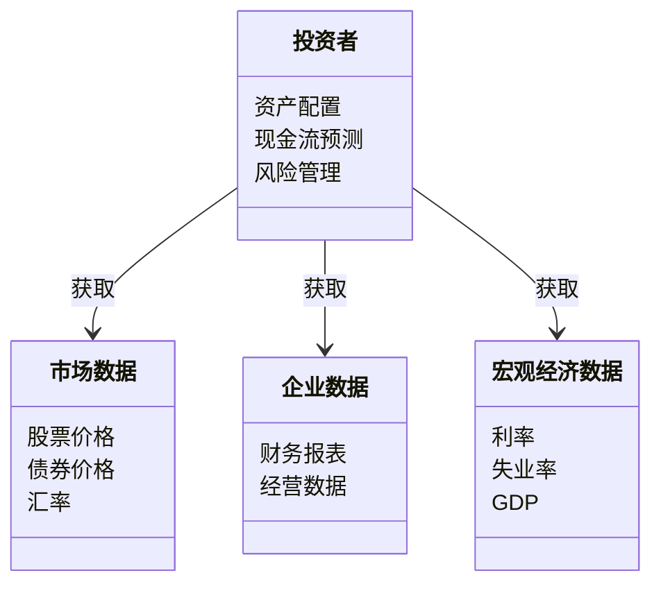
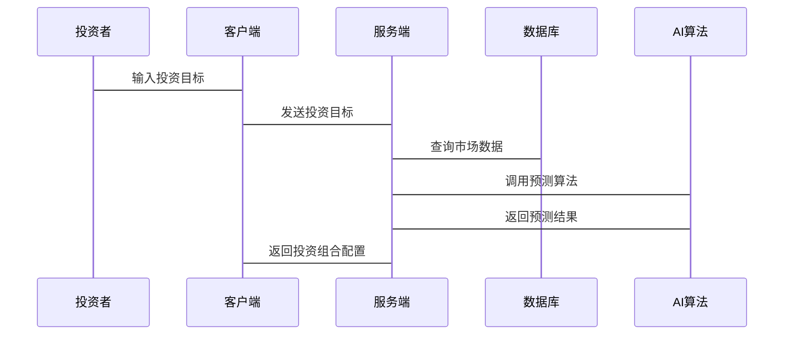
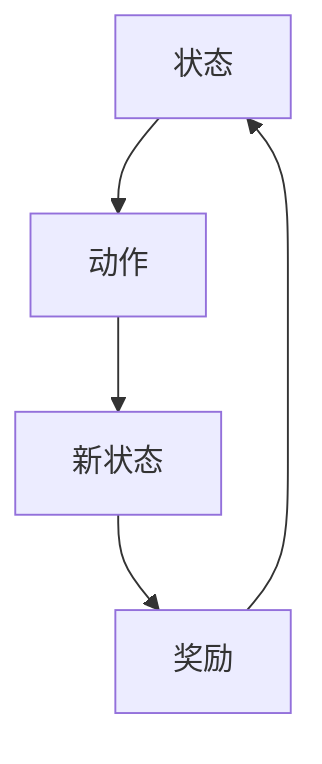

                 


# AI如何优化巴菲特的现金管理策略

> **关键词**：AI，巴菲特，现金管理策略，投资哲学，风险管理，动态资产配置

> **摘要**：本文探讨了如何利用人工智能技术优化巴菲特的现金管理策略。通过分析巴菲特的投资哲学和现金管理策略的特点，结合AI技术的优势，提出了一套基于AI的现金管理优化方案。本文详细讲解了AI在数据驱动决策、风险管理、动态资产配置和现金流预测中的应用，并通过具体案例和技术实现，展示了AI如何帮助巴菲特实现更高效的现金管理。

---

# 第1章: 引言

## 1.1 巴菲特的投资哲学

巴菲特作为全球著名的投资者，其投资哲学的核心在于长期价值投资和安全边际。他强调投资的纪律性、长期性和安全性，认为投资的本质是寻找具有持续竞争优势的企业，并在合理估值时买入并持有。

### 1.1.1 巴菲特的投资哲学特点
- **长期价值投资**：巴菲特倾向于投资那些具有持续竞争优势的企业，关注企业的内在价值而非短期市场波动。
- **安全边际**：在投资决策中，巴菲特注重留有安全边际，即以低于内在价值的价格买入资产，以降低风险。
- **分散投资与集中投资的结合**：巴菲特强调集中投资于少数优质企业，同时通过分散投资降低风险。

## 1.2 AI技术在金融领域的应用

AI技术在金融领域的应用日益广泛，尤其是在数据处理、预测分析和决策优化方面表现出色。AI通过处理海量数据，发现隐藏的模式和趋势，帮助投资者做出更明智的决策。

### 1.2.1 AI技术的核心优势
- **数据处理能力**：AI能够快速处理海量数据，提取有用的信息，帮助投资者做出数据驱动的决策。
- **预测能力**：通过机器学习算法，AI能够预测市场趋势、企业业绩和资产价格，提供前瞻性见解。
- **自动化决策**：AI可以实时监控市场动态，自动调整投资组合，优化资产配置。

## 1.3 本章小结

本章介绍了巴菲特的投资哲学及其现金管理策略的特点，并探讨了AI技术在金融领域的应用优势。通过结合AI技术，巴菲特的投资策略可以更加高效和精准。

---

# 第2章: 数据驱动的现金管理策略

## 2.1 数据驱动的决策过程

数据驱动的决策过程是基于大量数据的分析和预测，以帮助投资者做出更明智的投资决策。

### 2.1.1 数据的收集与处理

数据是AI技术的核心，高质量的数据是实现准确预测的基础。

- **数据收集**：收集包括市场数据、企业财务数据、宏观经济数据等多源数据。
- **数据清洗**：对数据进行清洗，去除噪声和异常值，确保数据的准确性。
- **数据预处理**：对数据进行标准化、归一化等处理，以便于后续分析。

### 2.1.2 数据分析与预测

通过数据分析和预测，投资者可以更好地理解市场趋势和企业基本面。

- **数据分析**：使用统计分析和数据挖掘技术，发现数据中的规律和趋势。
- **数据预测**：利用机器学习算法，预测未来市场走势、企业业绩和资产价格。

### 2.1.3 数据驱动的决策优化

基于数据的分析和预测，投资者可以优化投资决策。

- **决策优化**：通过AI技术，优化投资组合配置，降低风险，提高收益。

## 2.2 AI在数据驱动中的作用

AI技术在数据驱动的决策过程中发挥着关键作用，尤其是在数据处理和预测分析方面。

### 2.2.1 AI算法在数据处理中的应用

- **特征提取**：通过AI算法提取数据中的关键特征，帮助投资者更好地理解数据。
- **数据增强**：通过数据增强技术，增加数据的多样性和丰富性，提高模型的鲁棒性。

### 2.2.2 AI在数据分析中的优势

- **自动化分析**：AI能够自动化处理大量数据，发现隐藏的模式和趋势。
- **实时分析**：AI可以实时监控市场动态，提供实时的市场分析和预测。

### 2.2.3 AI在决策优化中的具体应用

- **投资组合优化**：通过AI算法优化投资组合配置，降低风险，提高收益。
- **风险控制**：通过AI技术实时监控市场风险，制定风险控制策略。

## 2.3 本章小结

本章详细探讨了数据驱动的决策过程，并分析了AI技术在数据处理和预测分析中的作用。通过AI技术，投资者可以实现更高效、更精准的投资决策。

---

# 第3章: 风险管理与AI

## 3.1 风险管理的基本概念

风险管理是投资过程中不可忽视的重要环节，通过识别、评估和控制风险，投资者可以降低投资组合的波动性，提高投资收益。

### 3.1.1 风险的定义与分类

- **风险定义**：风险是指投资回报的不确定性，包括市场风险、流动性风险、信用风险等。
- **风险分类**：市场风险、流动性风险、信用风险、操作风险等。

### 3.1.2 风险管理的重要性

- **降低损失**：通过风险管理，投资者可以降低投资组合的损失。
- **提高收益**：通过有效的风险管理，投资者可以在控制风险的前提下，提高投资收益。
- **增强信心**：通过风险管理，投资者可以增强对投资决策的信心。

### 3.1.3 风险管理的常见方法

- **风险分散**：通过分散投资降低风险。
- **风险对冲**：通过对冲交易降低风险。
- **风险控制**：通过设定止损点和风险敞口限制，控制风险。

## 3.2 AI在风险管理中的应用

AI技术在风险管理中的应用日益广泛，尤其是在风险识别和风险控制方面表现出色。

### 3.2.1 AI在风险识别中的作用

- **市场风险识别**：通过AI算法识别市场波动，预测市场风险。
- **信用风险识别**：通过AI技术评估企业的信用风险，识别潜在的违约风险。
- **操作风险识别**：通过AI技术监控交易行为，识别潜在的操作风险。

### 3.2.2 AI在风险评估中的应用

- **风险评估模型**：通过AI算法构建风险评估模型，量化投资组合的风险。
- **风险情景分析**：通过AI技术模拟不同市场情景下的风险表现，帮助投资者制定应对策略。

### 3.2.3 AI在风险控制中的具体实践

- **风险对冲策略**：通过AI技术制定风险对冲策略，降低投资组合的风险。
- **风险预警系统**：通过AI技术建立风险预警系统，实时监控市场动态，及时发出风险预警。

## 3.3 本章小结

本章探讨了风险管理的基本概念和常见方法，并分析了AI技术在风险管理中的应用。通过AI技术，投资者可以实现更高效、更精准的风险管理。

---

# 第4章: 动态资产配置与AI

## 4.1 动态资产配置的基本概念

动态资产配置是指根据市场环境的变化，实时调整投资组合的资产配置，以实现投资目标。

### 4.1.1 资产配置的定义与分类

- **资产配置定义**：资产配置是指将资金分配到不同资产类别中，以实现投资目标。
- **资产配置分类**：股票、债券、现金、房地产等。

### 4.1.2 动态资产配置的重要性

- **适应市场变化**：通过动态资产配置，投资者可以及时调整投资组合，适应市场环境的变化。
- **提高收益**：通过动态资产配置，投资者可以在不同市场环境下优化资产配置，提高投资收益。
- **降低风险**：通过动态资产配置，投资者可以在市场波动时降低投资组合的风险。

### 4.1.3 动态资产配置的常见方法

- **战术性资产配置**：根据市场短期变化调整资产配置。
- **战略性资产配置**：根据长期投资目标和市场环境调整资产配置。
- **平衡型资产配置**：保持资产配置的平衡，降低投资组合的波动性。

## 4.2 AI在动态资产配置中的应用

AI技术在动态资产配置中的应用主要体现在资产选择和配置优化方面。

### 4.2.1 AI在资产选择中的优势

- **数据驱动的资产选择**：通过AI算法分析海量数据，发现具有投资价值的资产。
- **实时监控市场动态**：通过AI技术实时监控市场动态，及时发现投资机会和风险。

### 4.2.2 AI在配置优化中的具体实践

- **投资组合优化**：通过AI算法优化投资组合配置，提高收益，降低风险。
- **动态再平衡**：通过AI技术实时监控市场动态，动态调整投资组合，保持资产配置的最优状态。

### 4.2.3 AI在动态资产配置中的未来发展趋势

- **智能化投资决策**：通过AI技术实现智能化投资决策，进一步提高资产配置的效率和准确性。
- **个性化资产配置**：通过AI技术实现个性化资产配置，满足不同投资者的投资需求。
- **实时动态调整**：通过AI技术实现投资组合的实时动态调整，进一步提高投资收益。

## 4.3 本章小结

本章探讨了动态资产配置的基本概念和常见方法，并分析了AI技术在动态资产配置中的应用。通过AI技术，投资者可以实现更高效、更精准的资产配置，提高投资收益，降低投资风险。

---

# 第5章: 现金流预测与AI

## 5.1 现金流预测的基本概念

现金流预测是指对未来的现金流入和流出进行预测，帮助投资者制定合理的财务计划和投资策略。

### 5.1.1 现金流预测的定义与分类

- **现金流预测定义**：现金流预测是指对未来的现金流入和流出进行预测。
- **现金流预测分类**：企业现金流预测、项目现金流预测、个人现金流预测等。

### 5.1.2 现金流预测的重要性

- **制定财务计划**：通过现金流预测，投资者可以制定合理的财务计划。
- **优化投资决策**：通过现金流预测，投资者可以优化投资决策，提高投资收益。
- **控制财务风险**：通过现金流预测，投资者可以提前发现潜在的财务风险，制定应对策略。

### 5.1.3 现金流预测的常见方法

- **定性预测方法**：通过专家判断和市场研究进行现金流预测。
- **定量预测方法**：通过历史数据和统计模型进行现金流预测。
- **混合预测方法**：结合定性和定量预测方法，提高预测的准确性。

## 5.2 AI在现金流预测中的应用

AI技术在现金流预测中的应用主要体现在数据处理和预测分析方面。

### 5.2.1 AI在现金流预测中的优势

- **数据驱动的预测**：通过AI算法分析海量数据，发现数据中的规律和趋势，提高预测的准确性。
- **实时预测**：通过AI技术实时监控市场动态，提供实时的现金流预测。

### 5.2.2 AI在现金流预测中的具体实践

- **历史数据分析**：通过AI算法分析历史数据，发现数据中的规律和趋势，预测未来的现金流。
- **市场动态监控**：通过AI技术实时监控市场动态，预测未来的现金流变化。
- **预测模型优化**：通过AI技术不断优化预测模型，提高预测的准确性和可靠性。

### 5.2.3 AI在现金流预测中的未来发展趋势

- **智能化预测**：通过AI技术实现智能化现金流预测，进一步提高预测的准确性和可靠性。
- **个性化预测**：通过AI技术实现个性化现金流预测，满足不同投资者的需求。
- **实时动态预测**：通过AI技术实现现金流的实时动态预测，进一步提高预测的及时性和准确性。

## 5.3 本章小结

本章探讨了现金流预测的基本概念和常见方法，并分析了AI技术在现金流预测中的应用。通过AI技术，投资者可以实现更高效、更精准的现金流预测，优化财务计划和投资决策。

---

# 第6章: 系统设计与实现

## 6.1 系统功能设计

### 6.1.1 领域模型



### 6.1.2 系统架构


### 6.1.3 系统接口设计

- **输入接口**：投资者输入投资目标、风险偏好和资金规模。
- **输出接口**：系统输出投资组合配置、风险评估和现金流预测。

### 6.1.4 系统交互



## 6.2 算法实现

### 6.2.1 强化学习算法



### 6.2.2 时间序列分析

```python
# 示例代码：使用LSTM进行时间序列预测
import numpy as np
import pandas as pd
from tensorflow.keras.models import Sequential
from tensorflow.keras.layers import LSTM, Dense

# 数据准备
data = np.random.random(1000)
window_size = 50

X = []
y = []
for i in range(len(data) - window_size):
    X.append(data[i:i+window_size])
    y.append(data[i+window_size])

X = np.array(X).reshape(len(X), window_size, 1)
y = np.array(y).reshape(len(y), 1)

# 模型构建
model = Sequential()
model.add(LSTM(50, input_shape=(window_size, 1)))
model.add(Dense(1))
model.compile(optimizer='adam', loss='mean_squared_error')

# 训练模型
model.fit(X, y, epochs=10, batch_size=32)
```

## 6.3 数学模型

### 6.3.1 强化学习模型

$$
Q(s, a) = Q(s, a) + \alpha [r + \max_{a'} Q(s', a') - Q(s, a)]
$$

### 6.3.2 时间序列模型

$$
y_t = \beta_1 y_{t-1} + \beta_2 y_{t-2} + \epsilon_t
$$

---

# 第7章: 项目实战

## 7.1 环境安装

- **Python**：安装Python 3.8及以上版本。
- **库的安装**：安装numpy、pandas、tensorflow、scikit-learn等库。

## 7.2 核心代码实现

### 7.2.1 数据预处理

```python
import pandas as pd
import numpy as np

# 数据加载
data = pd.read_csv('market_data.csv')

# 数据清洗
data.dropna(inplace=True)
data = data[~data['price'].isin([np.nan, np.inf])]

# 数据标准化
from sklearn.preprocessing import StandardScaler
scaler = StandardScaler()
data_scaled = scaler.fit_transform(data[['price', 'volume']])
```

### 7.2.2 AI算法实现

```python
from tensorflow.keras.models import Sequential
from tensorflow.keras.layers import LSTM, Dense

# 模型构建
model = Sequential()
model.add(LSTM(50, input_shape=(window_size, 1)))
model.add(Dense(1))
model.compile(optimizer='adam', loss='mean_squared_error')

# 模型训练
model.fit(X, y, epochs=10, batch_size=32)
```

### 7.2.3 系统实现

```python
# 投资组合优化
import numpy as np
import pandas as pd
from sklearn.decomposition import PCA

data = pd.read_csv('portfolio_data.csv')
returns = data.pct_change().dropna()

# PCA降维
pca = PCA(n_components=5)
principal_components = pca.fit_transform(returns)

# 投资组合优化
from scipy.optimize import minimize

def portfolio_optimization(weights, returns, risk_free_rate=0.01):
    n = len(weights)
    # 目标函数：最小化风险
    def objective(weights):
        return np.dot(weights.T, np.dot(returns.cov(), weights))
    # 约束条件：权重和为1，且权重非负
    constraints = [{'type': 'eq', 'fun': lambda w: np.sum(w) - 1},
                   {'type': 'ineq', 'fun': lambda w: w >= 0}]
    result = minimize(objective, np.ones(n)/n, method='SLSQP', constraints=constraints)
    return result.x

optimal_weights = portfolio_optimization(principal_components, returns)
```

## 7.3 案例分析

### 7.3.1 现金流预测案例

通过AI技术对某企业的现金流进行预测，帮助投资者制定合理的财务计划。

## 7.4 项目小结

本章通过具体案例和技术实现，展示了AI技术在巴菲特现金管理策略中的实际应用。通过项目实战，投资者可以更好地理解和掌握AI技术的应用方法。

---

# 第8章: 总结与展望

## 8.1 本章总结

本文详细探讨了AI技术在巴菲特现金管理策略中的应用，从数据驱动的决策、风险管理、动态资产配置和现金流预测等方面，分析了AI技术的优势和应用方法。通过具体案例和技术实现，展示了AI技术如何优化巴菲特的现金管理策略。

## 8.2 未来展望

随着AI技术的不断发展，其在金融领域的应用将更加广泛和深入。未来，AI技术将在以下方面进一步优化巴菲特的现金管理策略：

- **智能化投资决策**：通过AI技术实现更智能化的投资决策，进一步提高投资收益。
- **个性化投资策略**：通过AI技术实现个性化投资策略，满足不同投资者的需求。
- **实时动态调整**：通过AI技术实现投资组合的实时动态调整，进一步提高投资效率。

---

# 作者

作者：AI天才研究院/AI Genius Institute & 禅与计算机程序设计艺术 /Zen And The Art of Computer Programming

---

本文通过详细分析和具体案例，展示了AI技术在巴菲特现金管理策略中的应用。通过结合AI技术，投资者可以实现更高效、更精准的投资决策，提高投资收益，降低投资风险。

