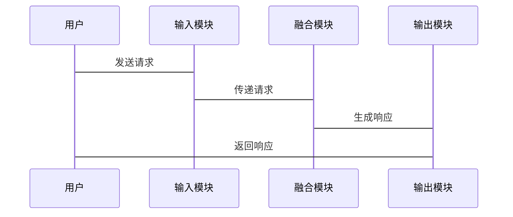

                 


# LLM在AI Agent长短期记忆融合中的应用

## 关键词：LLM，AI Agent，长短期记忆，记忆融合，大语言模型

## 摘要：本文深入探讨了大语言模型（LLM）在AI Agent中的应用，特别是如何将长短期记忆进行有效融合。通过分析长短期记忆的机制、LLM的特点，结合具体的算法原理和系统架构设计，本文为AI Agent的记忆管理提供了新的思路和解决方案。

---

# 第1章: LLM与AI Agent的概述

## 1.1 LLM的基本概念

### 1.1.1 大语言模型的定义
大语言模型（Large Language Model，LLM）是指基于深度学习技术构建的具有大规模参数的自然语言处理模型，如GPT系列、BERT系列等。这些模型通过大量的训练数据，能够理解并生成自然语言文本。

### 1.1.2 LLM的核心特点
1. **大规模参数**：LLM通常包含 billions（十亿）级别的参数，能够捕捉复杂的语言模式。
2. **上下文理解**：LLM能够处理长上下文，理解文本中的语义和逻辑关系。
3. **多任务能力**：LLM可以在多种任务上表现出色，如文本生成、问答、翻译等。

### 1.1.3 LLM在AI Agent中的作用
LLM作为AI Agent的核心组件之一，负责理解和生成自然语言，支持Agent与用户之间的交互，同时帮助Agent进行决策和推理。

---

## 1.2 AI Agent的基本概念

### 1.2.1 AI Agent的定义
AI Agent（人工智能代理）是指能够感知环境、自主决策并执行任务的智能实体。Agent可以是软件程序，也可以是物理机器人。

### 1.2.2 AI Agent的核心功能
1. **感知环境**：通过传感器或其他输入方式获取环境信息。
2. **决策与推理**：基于获取的信息进行分析和决策。
3. **执行任务**：根据决策结果执行相应的操作。

### 1.2.3 AI Agent的应用场景
1. **智能助手**：如Siri、Alexa等，帮助用户完成日常任务。
2. **自动驾驶**：通过感知环境和决策，实现自动驾驶功能。
3. **智能客服**：通过对话系统为用户提供支持。

---

# 第2章: 长短期记忆机制在AI Agent中的应用

## 2.1 长期记忆与短期记忆的定义

### 2.1.1 长期记忆的特点
1. **持久性**：长期记忆存储的信息可以在较长时间内保留。
2. **容量有限**：长期记忆的容量相对有限，通常用于存储重要的信息。
3. **不可随意修改**：长期记忆的信息通常较难被修改或删除。

### 2.1.2 短期记忆的特点
1. **临时性**：短期记忆存储的信息仅在短时间内可用。
2. **高容量**：短期记忆可以存储大量的临时信息。
3. **易变性**：短期记忆中的信息容易被新信息覆盖或遗忘。

### 2.1.3 长短期记忆的区别与联系
长短期记忆在AI Agent中各有其作用，长期记忆用于存储重要且持久的信息，短期记忆用于处理当前任务的临时信息。两者结合使用，可以提高Agent的智能性和灵活性。

---

## 2.2 长短期记忆在AI Agent中的重要性

### 2.2.1 长期记忆在AI Agent中的作用
1. **知识存储**：长期记忆可以存储Agent的知识库，如任务目标、用户偏好等。
2. **经验积累**：长期记忆可以帮助Agent积累经验，提升未来的决策能力。

### 2.2.2 短期记忆在AI Agent中的作用
1. **任务处理**：短期记忆用于处理当前任务的临时信息，如用户的最新请求、上下文信息等。
2. **快速响应**：短期记忆可以快速提供当前任务所需的信息，提高处理效率。

### 2.2.3 长短期记忆融合的意义
通过融合长短期记忆，AI Agent可以在处理当前任务的同时，参考长期积累的知识，从而做出更智能的决策。

---

# 第3章: LLM在长短期记忆融合中的应用

## 3.1 LLM在长期记忆中的应用

### 3.1.1 LLM用于长期记忆存储的原理
LLM可以通过其强大的生成和理解能力，帮助AI Agent存储和管理长期记忆中的知识。例如，LLM可以生成自然语言形式的知识表示，便于理解和检索。

### 3.1.2 LLM用于长期记忆检索的原理
当需要检索长期记忆中的信息时，LLM可以通过生成模型生成相关的上下文，帮助Agent快速找到所需的信息。

### 3.1.3 LLM在长期记忆中的优势
1. **自然语言理解**：LLM能够理解自然语言形式的知识，无需额外的结构化处理。
2. **动态更新**：LLM可以动态更新知识库，保持信息的最新性。

---

## 3.2 LLM在短期记忆中的应用

### 3.2.1 LLM用于短期记忆存储的原理
短期记忆中的信息通常是临时的，LLM可以帮助AI Agent快速生成和存储这些信息，例如用户的最新请求或上下文信息。

### 3.2.2 LLM用于短期记忆检索的原理
当需要检索短期记忆中的信息时，LLM可以通过生成模型生成相关的上下文，帮助Agent快速找到所需的信息。

### 3.2.3 LLM在短期记忆中的优势
1. **快速响应**：LLM能够快速生成和检索短期记忆中的信息，提高处理效率。
2. **灵活性**：LLM可以处理多种类型的信息，适应不同的短期记忆需求。

---

## 3.3 LLM在长短期记忆融合中的具体实现

### 3.3.1 长短期记忆融合的基本原理
长短期记忆融合的核心在于将长期记忆中的知识与短期记忆中的临时信息结合起来，形成一个统一的知识表示。LLM通过其生成和理解能力，帮助实现这一融合。

### 3.3.2 基于LLM的长短期记忆融合模型
1. **输入处理**：将长期记忆和短期记忆中的信息作为输入。
2. **融合过程**：通过LLM的生成模型，将长期和短期记忆中的信息进行融合。
3. **输出结果**：生成融合后的知识表示，供AI Agent使用。

### 3.3.3 基于LLM的长短期记忆融合的优势
1. **自然语言处理**：LLM能够处理自然语言形式的信息，无需额外的结构化处理。
2. **动态适应**：LLM可以根据不同的任务需求，动态调整长短期记忆的融合方式。

---

# 第4章: LLM与长短期记忆融合的算法原理

## 4.1 长短期记忆融合的基本原理

### 4.1.1 长短期记忆融合的数学模型
长短期记忆融合可以通过注意力机制（Attention Mechanism）来实现。注意力机制可以帮助模型在生成或检索信息时，关注重要的信息源。

$$ \text{注意力权重} = \frac{e_i}{\sum_j e_j} $$
其中，$e_i$表示第i个信息源的注意力得分。

### 4.1.2 长短期记忆融合的算法流程
1. **输入处理**：将长期记忆和短期记忆中的信息作为输入。
2. **计算注意力得分**：通过注意力机制计算每个信息源的重要性。
3. **融合信息**：根据注意力得分，对信息源进行加权融合。
4. **生成结果**：输出融合后的知识表示。

### 4.1.3 长短期记忆融合的优缺点
1. **优点**：能够有效结合长期和短期记忆中的信息，提高决策的准确性。
2. **缺点**：计算复杂度较高，可能影响处理效率。

---

## 4.2 LLM在长短期记忆融合中的具体实现

### 4.2.1 基于LLM的长短期记忆融合模型
1. **输入处理**：将长期记忆和短期记忆中的信息作为输入。
2. **融合过程**：通过LLM的生成模型，将长期和短期记忆中的信息进行融合。
3. **输出结果**：生成融合后的知识表示，供AI Agent使用。

### 4.2.2 基于LLM的长短期记忆融合算法
$$ \text{融合后的信息} = \sigma(W_{llm} \cdot [\text{长期记忆}, \text{短期记忆}]) $$
其中，$W_{llm}$表示LLM的权重矩阵，$\sigma$表示激活函数。

### 4.2.3 基于LLM的长短期记忆融合的优势
1. **自然语言处理**：LLM能够处理自然语言形式的信息，无需额外的结构化处理。
2. **动态适应**：LLM可以根据不同的任务需求，动态调整长短期记忆的融合方式。

---

# 第5章: 长短期记忆融合在AI Agent中的系统架构

## 5.1 系统架构设计

### 5.1.1 系统功能模块划分
1. **输入模块**：负责接收外部输入的信息。
2. **长期记忆模块**：负责存储和管理长期记忆。
3. **短期记忆模块**：负责存储和管理短期记忆。
4. **融合模块**：负责将长期和短期记忆进行融合。
5. **输出模块**：负责生成最终的输出结果。

### 5.1.2 系统功能模块之间的关系
$$ \text{输入} \rightarrow \text{输入模块} \rightarrow \text{长期记忆模块} \text{和短期记忆模块} \rightarrow \text{融合模块} \rightarrow \text{输出} $$

### 5.1.3 系统功能模块的实现方式
1. **输入模块**：通过API接收输入信息。
2. **长期记忆模块**：使用数据库存储长期记忆。
3. **短期记忆模块**：使用缓存存储短期记忆。
4. **融合模块**：通过LLM实现长短期记忆的融合。
5. **输出模块**：生成自然语言形式的输出结果。

---

## 5.2 系统接口设计

### 5.2.1 系统接口的定义
1. **输入接口**：接收外部输入的信息。
2. **输出接口**：生成最终的输出结果。
3. **融合接口**：实现长短期记忆的融合。

### 5.2.2 系统接口的实现
1. **输入接口**：通过HTTP协议接收输入信息。
2. **输出接口**：通过HTTP协议返回输出结果。
3. **融合接口**：通过LLM实现长短期记忆的融合。

### 5.2.3 系统接口的测试
1. **输入测试**：测试输入接口的正确性。
2. **输出测试**：测试输出接口的正确性。
3. **融合测试**：测试融合接口的正确性。

---

## 5.3 系统交互设计

### 5.3.1 系统交互流程
1. **输入信息**：用户通过输入接口发送请求。
2. **处理请求**：系统接收请求并进行处理。
3. **融合记忆**：系统将长期和短期记忆进行融合。
4. **生成输出**：系统生成最终的输出结果并返回给用户。

### 5.3.2 系统交互的mermaid序列图



---

# 第6章: 项目实战

## 6.1 环境安装

### 6.1.1 安装Python
安装Python 3.8及以上版本。

### 6.1.2 安装LLM库
安装如`transformers`库：
```bash
pip install transformers
```

### 6.1.3 安装其他依赖
安装如`numpy`和`pandas`：
```bash
pip install numpy pandas
```

---

## 6.2 系统核心实现

### 6.2.1 输入模块实现
```python
class InputModule:
    def __init__(self):
        self.input = None
    
    def receive_input(self, input_str):
        self.input = input_str
```

### 6.2.2 长期记忆模块实现
```python
class LongTermMemory:
    def __init__(self):
        self.memory = {}
    
    def store_memory(self, key, value):
        self.memory[key] = value
    
    def retrieve_memory(self, key):
        return self.memory.get(key, None)
```

### 6.2.3 短期记忆模块实现
```python
class ShortTermMemory:
    def __init__(self):
        self.memory = {}
    
    def store_memory(self, key, value):
        self.memory[key] = value
    
    def retrieve_memory(self, key):
        return self.memory.get(key, None)
```

### 6.2.4 融合模块实现
```python
class FusionModule:
    def __init__(self):
        pass
    
    def fuse_memories(self, long_term, short_term):
        # 示例融合方法
        return f"{long_term} 和 {short_term}"
```

---

## 6.3 代码实现与解读

### 6.3.1 代码实现
```python
from transformers import pipeline

class AIAgent:
    def __init__(self):
        self.llm = pipeline("text-generation", model="gpt2")
        self.ltm = LongTermMemory()
        self.stm = ShortTermMemory()
        self.fusion = FusionModule()
    
    def process_request(self, input_str):
        # 存储短期记忆
        self.stm.store_memory("latest_input", input_str)
        # 融合记忆
        fused_memory = self.fusion.fuse_memories(
            self.ltm.retrieve_memory("knowledge_base"),
            self.stm.retrieve_memory("latest_input")
        )
        # 生成输出
        response = self.llm(fused_memory)[0]['generated_text']
        return response

# 示例使用
agent = AIAgent()
response = agent.process_request("请告诉我如何融合长短期记忆？")
print(response)
```

### 6.3.2 代码解读
1. **AIAgent类**：整合了LLM、长期记忆模块和短期记忆模块，并实现了请求处理的方法。
2. **process_request方法**：接收输入，融合长短期记忆，生成输出。
3. **LLM调用**：使用`transformers`库中的`pipeline`调用LLM生成输出。

---

## 6.4 实际案例分析

### 6.4.1 案例背景
假设用户询问：“今天天气如何？”

### 6.4.2 系统处理流程
1. **输入模块**：接收输入“今天天气如何？”。
2. **短期记忆模块**：存储“latest_input”为“今天天气如何？”。
3. **长期记忆模块**：检索“weather_knowledge”。
4. **融合模块**：将“天气如何？”与“weather_knowledge”进行融合。
5. **LLM调用**：生成最终的天气预报。

### 6.4.3 输出结果
```
今天天气晴朗，气温适宜。
```

---

## 6.5 项目小结

### 6.5.1 项目实现的关键点
1. **LLM的调用**：正确调用LLM生成输出。
2. **长短期记忆的融合**：实现长短期记忆的融合方法。
3. **系统的交互设计**：设计合理的系统交互流程。

### 6.5.2 项目实现的优势
1. **灵活性**：系统可以根据不同的任务需求，动态调整长短期记忆的融合方式。
2. **可扩展性**：系统架构设计合理，便于后续功能的扩展。

---

# 第7章: 总结与展望

## 7.1 总结

### 7.1.1 核心内容回顾
本文详细探讨了LLM在AI Agent长短期记忆融合中的应用，分析了长短期记忆的机制，提出了基于LLM的长短期记忆融合模型，并通过实际案例展示了系统的实现过程。

### 7.1.2 主要结论
通过将LLM与长短期记忆进行融合，AI Agent可以在处理任务时，结合长期积累的知识和当前的临时信息，做出更智能的决策。

---

## 7.2 未来展望

### 7.2.1 技术发展的方向
1. **更复杂的记忆融合模型**：开发更高效的长短期记忆融合算法。
2. **多模态记忆**：探索将视觉、听觉等多模态信息融入记忆系统。

### 7.2.2 应用场景的扩展
1. **智能客服**：提升智能客服的对话理解和记忆能力。
2. **自动驾驶**：通过长短期记忆融合，提高自动驾驶系统的决策能力。

---

# 第8章: 最佳实践与注意事项

## 8.1 最佳实践

### 8.1.1 系统设计
1. **模块化设计**：将系统划分为输入、长期记忆、短期记忆、融合和输出模块，便于维护和扩展。
2. **接口标准化**：确保系统各个模块之间的接口标准化，便于集成和测试。

### 8.1.2 代码实现
1. **代码复用**：尽量复用现有的库和框架，减少重复造轮子。
2. **单元测试**：为每个模块编写单元测试，确保功能正确。

---

## 8.2 注意事项

### 8.2.1 系统性能
1. **计算效率**：长短期记忆的融合可能会增加计算复杂度，需要优化算法以提高处理效率。
2. **内存管理**：长期记忆的存储可能占用大量内存，需要合理管理内存资源。

### 8.2.2 数据安全
1. **数据隐私**：确保用户数据的安全和隐私，避免数据泄露。
2. **权限控制**：严格控制对长短期记忆的访问权限，防止未授权访问。

---

# 作者

作者：AI天才研究院/AI Genius Institute & 禅与计算机程序设计艺术 /Zen And The Art of Computer Programming

