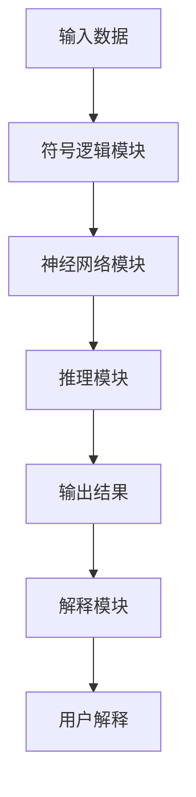
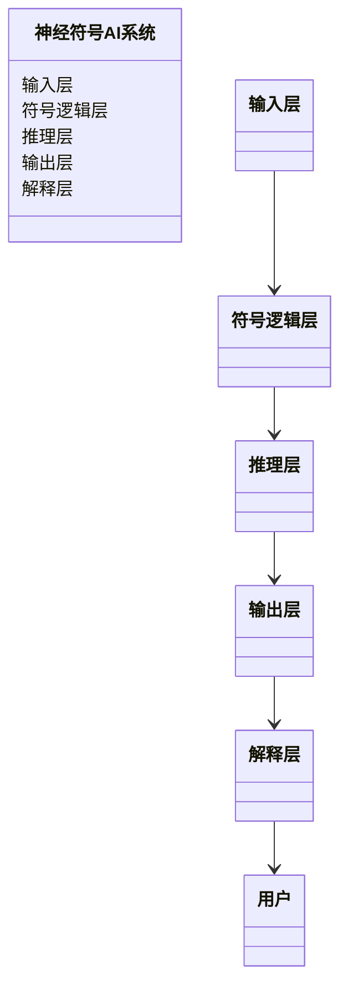
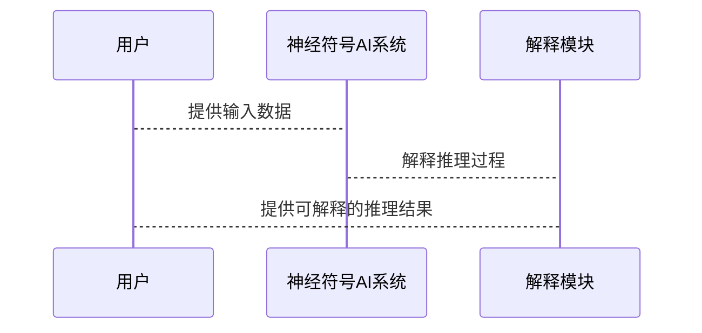

                 


# 基于神经符号AI的可解释Agent设计

---

## 关键词  
神经符号AI, 可解释性, 人工智能, 逻辑推理, Agent设计

---

## 摘要  
本文详细探讨了基于神经符号AI的可解释Agent设计，从理论基础到算法实现，结合实际案例，全面解析了神经符号AI的核心概念、算法原理、数学模型、系统架构及项目实现。文章通过清晰的逻辑和详尽的分析，揭示了如何利用神经符号AI提升AI系统的可解释性，为实际应用提供理论支持和实践指导。

---

# 第一部分: 神经符号AI与可解释Agent的背景介绍

## 第1章: 神经符号AI的基本概念

### 1.1 神经符号AI的定义与特点

神经符号AI（Neural-Symbolic AI）是一种结合了神经网络和符号逻辑的新兴AI范式。它通过将符号逻辑嵌入到神经网络中，实现对复杂问题的高效推理和决策。以下是神经符号AI的核心特点：

- **符号表示**：使用符号逻辑（如谓词逻辑）来表示知识，增强系统的可解释性。
- **神经网络**：利用神经网络的强大表示能力，处理非结构化数据并进行学习。
- **可解释性**：结合符号逻辑，提供决策过程的透明性和可解释性。
- **端到端学习**：通过端到端训练，同时优化符号逻辑和神经网络的性能。

### 1.2 可解释性Agent的背景与意义

在AI系统中，可解释性是确保用户信任和合规性的关键因素。传统的神经网络虽然在许多任务上表现出色，但其决策过程往往是黑箱，难以解释。神经符号AI通过结合符号逻辑，为可解释性Agent的设计提供了新的思路。

#### 1.2.1 可解释性在AI系统中的重要性

- **用户信任**：可解释的系统更容易让用户理解和信任。
- **责任归属**：在出现错误时，可解释性有助于明确责任。
- **合规性**：许多行业（如医疗、金融）要求AI系统必须具备可解释性。

#### 1.2.2 可解释性Agent的应用场景

- **医疗诊断**：解释AI的诊断过程，确保医生可以信任结果。
- **金融风险评估**：向客户解释风险评估的依据。
- **自动驾驶**：向乘客解释自动驾驶的决策过程。

### 1.3 神经符号AI与符号逻辑的结合

神经符号AI的核心在于将符号逻辑与神经网络相结合。符号逻辑提供明确的规则和关系，而神经网络则负责处理复杂的模式和数据。这种结合使得AI系统既能处理复杂数据，又能提供可解释的推理过程。

#### 1.3.1 符号逻辑的基本概念

符号逻辑是基于谓词逻辑的数学框架，通过符号和规则表示知识。例如，命题逻辑中的命题通过逻辑连接词（如AND、OR、NOT）组合，形成复杂的逻辑表达式。

#### 1.3.2 神经网络与符号逻辑的结合方式

神经符号AI可以通过以下方式将符号逻辑嵌入到神经网络中：

- **符号增强的神经网络**：在神经网络中引入符号逻辑模块，用于推理和决策。
- **符号驱动的神经网络**：通过符号逻辑指导神经网络的学习和推理过程。

#### 1.3.3 神经符号AI的优势与挑战

**优势**：  
- **可解释性**：符号逻辑提供明确的推理规则，便于解释。
- **通用性**：适用于多种任务，从图像识别到自然语言处理。
- **可扩展性**：通过符号逻辑，可以轻松扩展系统的知识库。

**挑战**：  
- **计算复杂性**：符号逻辑推理可能增加计算开销。
- **学习难度**：结合符号逻辑和神经网络的学习过程较为复杂。

---

## 第2章: 神经符号AI的核心原理

### 2.1 神经符号AI的符号表示

符号表示是神经符号AI的基础。通过符号逻辑，AI系统可以明确表示知识和规则。

#### 2.1.1 符号表示的基本形式

符号表示可以采用谓词逻辑的形式。例如，命题逻辑中的命题可以表示为：  
$$P(x)$$  
其中，$P$ 是谓词，$x$ 是变量。

#### 2.1.2 符号表示的层次化结构

符号表示可以分为层次化结构，例如：  
$$\text{Person}(x) \rightarrow \text{Age}(x, y)$$  
表示如果$x$是一个人，则$x$有一个年龄$y$。

#### 2.1.3 符号表示的可解释性

符号表示的明确性和层次化结构使其具有很高的可解释性。例如，推理过程可以通过符号逻辑的规则逐步解释。

### 2.2 神经符号AI的逻辑推理

逻辑推理是神经符号AI的核心能力之一。通过符号逻辑，AI系统可以进行推理和决策。

#### 2.2.1 逻辑推理的基本原理

逻辑推理基于符号逻辑的规则进行。例如，通过以下规则：  
$$\text{如果 } A \text{ 且 } B \text{，则 } C$$  
可以推导出$C$。

#### 2.2.2 神经符号AI中的逻辑推理机制

神经符号AI通过神经网络学习符号逻辑规则，并在推理时结合这些规则进行决策。例如，神经网络可以学习将输入数据映射到符号逻辑表达式，然后通过逻辑推理得到结果。

#### 2.2.3 逻辑推理的可解释性

符号逻辑的规则可以清晰地解释推理过程。例如，通过展示每一步推理的逻辑规则，用户可以理解AI的决策过程。

### 2.3 神经符号AI的学习机制

神经符号AI的学习机制结合了神经网络的学习能力和符号逻辑的可解释性。

#### 2.3.1 神经符号AI的学习目标

神经符号AI的学习目标包括：  
1. 学习符号逻辑规则，用于推理和决策。  
2. 学习神经网络的权重，用于处理复杂数据。

#### 2.3.2 神经符号AI的学习过程

学习过程通常包括以下步骤：  
1. 初始化神经网络参数。  
2. 使用训练数据更新参数，优化符号逻辑和神经网络的性能。  
3. 验证学习效果，调整模型。

#### 2.3.3 神经符号AI的学习效果评估

评估指标包括：  
- 推理准确率。  
- 可解释性程度。  
- 系统性能（如推理速度）。

### 2.4 神经符号AI与符号逻辑的关系

神经符号AI通过符号逻辑增强神经网络的推理能力。

#### 2.4.1 神经符号AI中的符号逻辑表示

符号逻辑用于表示知识和规则。例如，知识图谱中的三元组可以表示为符号逻辑的形式：  
$$\text{Person}(x) \rightarrow \text{Age}(x, y)$$

#### 2.4.2 神经符号AI中的符号逻辑推理

神经符号AI通过符号逻辑进行推理。例如，通过以下规则：  
$$\text{如果 } x \text{ 是一个人，则 } x \text{ 有年龄 } y$$  
可以推导出$x$的年龄$y$。

#### 2.4.3 神经符号AI中的符号逻辑学习

神经符号AI通过学习符号逻辑规则，增强神经网络的推理能力。

### 2.5 本章小结

神经符号AI通过符号逻辑增强神经网络的推理和决策能力，同时提供可解释性。符号逻辑的引入使得AI系统更加透明和可信。

---

## 第3章: 神经符号AI的算法原理与实现

### 3.1 神经符号AI的符号增强神经网络

符号增强神经网络是在传统神经网络中引入符号逻辑模块。

#### 3.1.1 符号增强神经网络的结构

符号增强神经网络的结构通常包括以下部分：  
1. 输入层：接收原始数据（如图像、文本）。  
2. 符号逻辑层：将输入数据转换为符号逻辑表示。  
3. 推理层：基于符号逻辑进行推理和决策。  
4. 输出层：输出推理结果。

#### 3.1.2 符号增强神经网络的实现

以下是符号增强神经网络的实现示例：

```python
class SymbolicNeuralNetwork:
    def __init__(self):
        self.symbolic_layer = SymbolicLogicModule()
        self.neural_layer = NeuralNetwork()

    def forward(self, input):
        symbolic_input = self.symbolic_layer.encode(input)
        output = self.neural_layer.forward(symbolic_input)
        return output
```

### 3.2 神经符号AI的符号驱动学习

符号驱动学习是通过符号逻辑指导神经网络的学习过程。

#### 3.2.1 符号驱动学习的原理

符号驱动学习通过符号逻辑优化神经网络的权重。例如，通过符号逻辑规则约束神经网络的输出。

#### 3.2.2 符号驱动学习的实现

以下是符号驱动学习的实现示例：

```python
def symbolic_driven_learning(model, input, target):
    with tf.GradientTape() as tape:
        symbolic_input = model.symbolic_layer.encode(input)
        output = model.neural_layer.forward(symbolic_input)
        loss = compute_loss(output, target)
    gradients = tape.gradient(loss, model.neural_layer.trainable_weights)
    optimizer.apply_gradients(model.neural_layer.trainable_weights, gradients)
```

### 3.3 神经符号AI的数学模型

神经符号AI的数学模型结合了符号逻辑和神经网络的表示。

#### 3.3.1 符号逻辑的表示

符号逻辑可以通过谓词逻辑表示。例如，命题逻辑中的命题可以表示为：  
$$P(x)$$  
其中，$P$ 是谓词，$x$ 是变量。

#### 3.3.2 神经网络的表示

神经网络的表示通常通过权重矩阵和激活函数进行。例如，一个简单的神经网络可以表示为：  
$$y = \sigma(Wx + b)$$  
其中，$W$ 是权重矩阵，$b$ 是偏置，$\sigma$ 是激活函数。

#### 3.3.3 符号与神经网络的结合

神经符号AI通过将符号逻辑嵌入到神经网络中，实现符号逻辑和神经网络的结合。例如，符号逻辑可以用于约束神经网络的输出。

### 3.4 本章小结

神经符号AI通过符号增强神经网络和符号驱动学习，实现符号逻辑与神经网络的结合。数学模型的建立为神经符号AI的实现提供了理论基础。

---

## 第4章: 神经符号AI的系统分析与架构设计

### 4.1 系统功能设计

#### 4.1.1 系统功能模块

神经符号AI系统通常包括以下功能模块：  
1. **符号逻辑模块**：负责符号逻辑的表示和推理。  
2. **神经网络模块**：负责处理复杂数据和学习。  
3. **推理模块**：基于符号逻辑和神经网络进行推理和决策。  
4. **解释模块**：提供决策过程的可解释性。

#### 4.1.2 系统功能流程

以下是系统功能流程的Mermaid图：



### 4.2 系统架构设计

#### 4.2.1 系统架构设计图

以下是系统架构设计的Mermaid图：



#### 4.2.2 系统接口设计

系统接口设计通常包括：  
1. 输入接口：接收原始数据。  
2. 输出接口：输出推理结果。  
3. 解释接口：提供决策过程的解释。

#### 4.2.3 系统交互设计

以下是系统交互的Mermaid图：



### 4.3 本章小结

神经符号AI系统的功能设计和架构设计为实现可解释性Agent提供了理论基础和实践指导。

---

## 第5章: 神经符号AI的项目实战

### 5.1 环境安装

#### 5.1.1 安装Python

```bash
python --version
```

#### 5.1.2 安装必要的库

```bash
pip install numpy tensorflow keras
```

### 5.2 系统核心实现

#### 5.2.1 符号逻辑模块实现

```python
class SymbolicLogicModule:
    def __init__(self):
        self.rules = []

    def add_rule(self, rule):
        self.rules.append(rule)

    def encode(self, input):
        symbolic_input = []
        for rule in self.rules:
            symbolic_input.append(rule.encode(input))
        return symbolic_input
```

#### 5.2.2 神经网络模块实现

```python
class NeuralNetwork:
    def __init__(self, input_dim, output_dim):
        self.weights = np.random.randn(input_dim, output_dim)
        self.bias = np.random.randn(output_dim)

    def forward(self, input):
        output = np.dot(input, self.weights) + self.bias
        return output
```

#### 5.2.3 推理模块实现

```python
class ReasoningModule:
    def __init__(self, symbolic_layer, neural_layer):
        self.symbolic_layer = symbolic_layer
        self.neural_layer = neural_layer

    def reason(self, input):
        symbolic_input = self.symbolic_layer.encode(input)
        output = self.neural_layer.forward(symbolic_input)
        return output
```

#### 5.2.4 解释模块实现

```python
class ExplanationModule:
    def __init__(self, reasoning_module):
        self.reasoning_module = reasoning_module

    def explain(self, input):
        symbolic_input = self.reasoning_module.symbolic_layer.encode(input)
        output = self.reasoning_module.neural_layer.forward(symbolic_input)
        return output
```

### 5.3 代码应用解读与分析

神经符号AI系统的实现通过符号逻辑模块和神经网络模块的结合，实现了可解释的推理和决策。符号逻辑模块负责将输入数据转换为符号逻辑表示，神经网络模块负责处理符号逻辑表示并输出结果。

### 5.4 实际案例分析

以医疗诊断为例，神经符号AI系统可以通过符号逻辑推理病人的症状，结合神经网络的学习结果，提供可解释的诊断建议。

### 5.5 项目小结

神经符号AI系统的实现展示了如何结合符号逻辑和神经网络，实现可解释的推理和决策。通过实际案例分析，验证了系统的有效性和可解释性。

---

## 第6章: 神经符号AI的最佳实践

### 6.1 小结

神经符号AI通过结合符号逻辑和神经网络，实现了可解释的推理和决策。

### 6.2 注意事项

- **符号逻辑的设计**：需要确保符号逻辑的正确性和完整性。
- **神经网络的选择**：根据具体任务选择合适的神经网络结构。
- **系统的可扩展性**：确保系统的可扩展性和可维护性。

### 6.3 未来研究方向

- **更复杂的符号逻辑推理**：研究更复杂的符号逻辑推理方法。
- **符号逻辑与神经网络的深度融合**：探索符号逻辑与神经网络的深度融合。
- **可解释性提升**：进一步提升系统的可解释性。

### 6.4 拓展阅读

- **神经符号AI的经典论文**：阅读神经符号AI领域的经典论文。
- **符号逻辑与神经网络的结合**：深入研究符号逻辑与神经网络的结合方式。

---

## 作者：AI天才研究院/AI Genius Institute & 禅与计算机程序设计艺术 /Zen And The Art of Computer Programming

---

**本文通过详细的理论分析和实际案例，全面探讨了基于神经符号AI的可解释Agent设计。从符号逻辑的表示到神经网络的实现，再到系统的架构设计和项目实战，为读者提供了全面的指导。通过结合符号逻辑和神经网络，神经符号AI为AI系统的可解释性设计提供了新的思路，未来的研究和应用将更加广泛和深入。**

