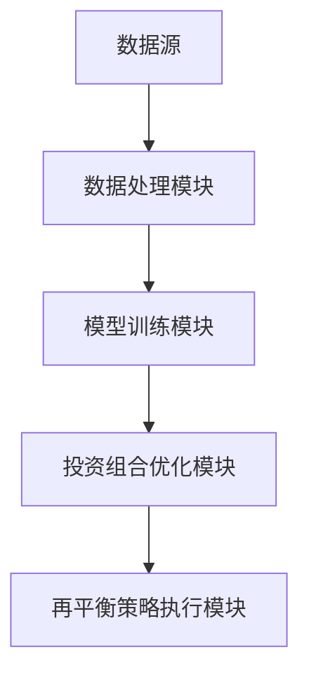
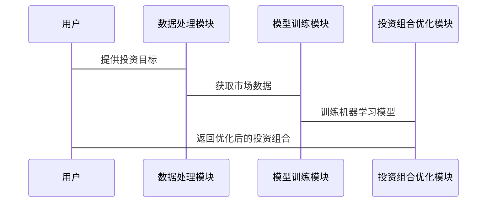

                 


# 开发智能化的个人投资组合再平衡工具

## 关键词：智能化投资组合、再平衡工具、人工智能、机器学习、投资组合优化

## 摘要：  
本文详细探讨了如何利用人工智能和机器学习技术开发智能化的个人投资组合再平衡工具。通过结合现代投资组合理论和先进的算法优化技术，本文提出了一种基于机器学习的再平衡方法，能够实时分析市场动态，优化投资组合配置，以实现风险可控下的最大收益。本文从理论基础、算法设计、系统架构到实际应用，全面阐述了智能化投资组合再平衡工具的开发过程，并通过具体案例展示了其实际效果。

---

# 第1章: 投资组合再平衡的背景与问题描述

## 1.1 投资组合再平衡的基本概念

### 1.1.1 投资组合的定义与构成  
投资组合是指将资金分配到不同资产（如股票、债券、基金等）上的配置方式。一个有效的投资组合能够在风险可控的前提下，实现收益的最大化。再平衡是指根据市场变化和个人投资目标的调整，定期对投资组合进行调整的过程。

### 1.1.2 再平衡的定义与目的  
再平衡是为了维持投资组合的初始配置比例，使其在市场波动或资产价格变化后仍保持最优状态。其主要目的是：  
1. 维持目标资产配置比例；  
2. 降低投资组合的下行风险；  
3. 提高投资组合的长期收益。

### 1.1.3 再平衡的常见应用场景  
- 初期配置后的定期调整（如每年一次）；  
- 市场波动较大时的应急调整；  
- 投资目标或风险承受能力变化时的主动调整。

---

## 1.2 传统投资组合管理的局限性

### 1.2.1 传统再平衡方法的优缺点  
- **优点**：简单易行，操作成本低；  
- **缺点**：  
  - 无法适应市场快速变化；  
  - 无法有效捕捉市场机会；  
  - 依赖人工经验，存在主观性。

### 1.2.2 传统方法在复杂市场环境中的不足  
随着市场的复杂化和不确定性增加，传统再平衡方法难以应对以下问题：  
1. 多资产类别之间的相关性变化；  
2. 市场波动加剧导致的短期亏损风险；  
3. 个性化投资目标的多样化。

### 1.2.3 现代投资组合管理的新需求  
现代投资者需要一种更灵活、更智能的投资组合管理方法，能够：  
1. 实时跟踪市场变化；  
2. 自动优化投资组合配置；  
3. 提供个性化服务。

---

## 1.3 智能化投资组合再平衡的必要性

### 1.3.1 人工智能在金融领域的应用趋势  
人工智能技术的快速发展为金融行业带来了巨大变革，特别是在投资组合管理领域。AI技术能够帮助投资者更好地处理海量数据，发现潜在规律。

### 1.3.2 智能化再平衡的核心优势  
- 数据驱动：基于海量市场数据，优化投资组合配置；  
- 自适应性：能够根据市场变化实时调整；  
- 高效性：通过算法优化，提高决策效率。

### 1.3.3 智能化再平衡的潜在价值  
通过智能化再平衡工具，投资者可以实现：  
1. 精准的投资组合优化；  
2. 降低投资成本；  
3. 提高投资收益。

---

## 1.4 本书的核心目标与范围界定

### 1.4.1 本书的核心目标  
本书旨在介绍如何利用人工智能技术开发智能化的个人投资组合再平衡工具，涵盖理论、算法、系统架构和实际应用。

### 1.4.2 本书的研究范围  
- 投资组合优化的数学模型；  
- 机器学习在投资组合管理中的应用；  
- 智能化再平衡工具的系统设计与实现。

### 1.4.3 本书的结构安排  
- 第1章：背景与问题描述；  
- 第2章：核心概念与联系；  
- 第3章：算法原理；  
- 第4章：系统架构设计；  
- 第5章：项目实战；  
- 第6章：总结与展望。

---

## 1.5 本章小结  
本章从投资组合再平衡的基本概念出发，分析了传统再平衡方法的局限性，并提出了智能化再平衡工具的必要性。通过对比传统方法与智能化方法的优缺点，明确了本书的核心目标与研究范围。

---

# 第2章: 智能化投资组合再平衡的核心概念与联系

## 2.1 投资组合优化的数学模型

### 2.1.1 投资组合优化的数学表达  
投资组合优化的目标是最大化收益或最小化风险。常见的数学表达式如下：  
$$ \text{目标函数：} \min_w \sigma^2(w) \quad \text{或} \quad \max_w \mu^T w $$  
$$ \text{约束条件：} \sum_{i=1}^n w_i = 1, \quad w_i \geq 0 $$  
其中，\( w \) 是投资权重向量，\( \sigma^2(w) \) 是投资组合的方差，\( \mu \) 是资产的期望收益向量。

### 2.1.2 现代投资组合理论（MPT）的核心公式  
现代投资组合理论的核心公式是均值-方差优化模型：  
$$ \min_w \sigma^2(w) \quad \text{subject to} \quad \mu^T w = \text{target return} $$  

### 2.1.3 投资组合优化的约束条件  
- 投资权重之和为1：\( \sum_{i=1}^n w_i = 1 \)；  
- 投资权重非负：\( w_i \geq 0 \)。

---

## 2.2 机器学习在投资组合优化中的应用

### 2.2.1 机器学习的基本概念  
机器学习是一种通过数据训练模型的技术，能够从数据中提取规律并做出预测。

### 2.2.2 机器学习在风险预测中的应用  
- 使用随机森林或神经网络模型预测资产的波动性；  
- 基于历史数据预测市场风险。

### 2.2.3 机器学习在收益预测中的应用  
- 使用时间序列模型预测资产收益；  
- 基于市场情绪和新闻数据预测收益。

---

## 2.3 投资组合优化与机器学习的结合

### 2.3.1 数据驱动的优化方法  
- 使用机器学习模型预测收益和风险；  
- 基于预测结果优化投资组合。

### 2.3.2 基于模型的优化方法  
- 使用强化学习优化投资组合；  
- 基于深度学习模型进行非线性优化。

### 2.3.3 混合优化方法  
- 结合传统优化方法和机器学习模型。

---

## 2.4 核心概念之间的关系

### 2.4.1 投资组合优化与风险收益的关系  
优化目标是在风险和收益之间找到最佳平衡点。

### 2.4.2 机器学习与传统优化方法的对比  
| 对比维度 | 传统优化方法 | 机器学习方法 |
|----------|----------------|---------------|
| 数据依赖性 | 依赖历史数据 | 依赖实时数据 | 
| 计算复杂度 | 较低 | 较高 | 
| 灵活性 | 较低 | 较高 | 

### 2.4.3 数据质量对优化结果的影响  
数据质量直接影响模型的准确性和优化效果。

---

## 2.5 本章小结  
本章详细介绍了投资组合优化的数学模型和机器学习在其中的应用，探讨了智能化再平衡工具的核心概念及其之间的关系。

---

# 第3章: 投资组合再平衡的算法原理

## 3.1 投资组合优化的算法分类

### 3.1.1 基于数学规划的优化算法  
- 均值-方差优化；  
- 二次规划。

### 3.1.2 基于启发式算法的优化方法  
- 遗传算法；  
- 模拟退火。

### 3.1.3 基于机器学习的优化方法  
- 基于随机森林的收益预测；  
- 基于神经网络的风险预测。

---

## 3.2 基于数学规划的优化算法

### 3.2.1 均值-方差优化的数学模型  
$$ \min_w \sigma^2(w) \quad \text{subject to} \quad \mu^T w = \text{target return} $$  

### 3.2.2 数学规划算法的实现步骤  
1. 确定目标函数和约束条件；  
2. 选择优化算法；  
3. 进行数值求解。

### 3.2.3 均值-方差优化的优缺点  
- 优点：计算简单，易于实现；  
- 缺点：假设资产收益符合正态分布，可能不适用于实际市场。

---

## 3.3 基于启发式算法的优化方法

### 3.3.1 遗传算法的基本原理  
1. 初始化种群；  
2. 计算适应度；  
3. 选择、交叉和变异；  
4. 重复迭代。

### 3.3.2 模拟退火算法的基本原理  
1. 初始化当前解；  
2. 计算目标函数；  
3. 随机扰动解；  
4. 接受或拒绝新解；  
5. 降温迭代。

### 3.3.3 启发式算法在投资组合优化中的应用  
- 适用于非线性优化问题；  
- 能够处理大规模数据。

---

## 3.4 基于机器学习的优化方法

### 3.4.1 基于随机森林的收益预测模型  
- 使用随机森林预测资产收益；  
- 基于预测结果优化投资组合。

### 3.4.2 基于神经网络的风险预测模型  
- 使用LSTM网络预测市场波动性；  
- 基于预测结果调整投资组合。

### 3.4.3 基于强化学习的投资决策模型  
- 使用深度强化学习优化投资组合。

---

## 3.5 算法的对比与选择

### 3.5.1 不同算法的优缺点对比  
| 算法类型 | 优点 | 缺点 |
|----------|------|------|
| 数学规划 | 计算简单 | 依赖正态分布假设 |
| 启发式算法 | 灵活性高 | 计算复杂 |
| 机器学习 | 数据驱动 | 需要大量数据 |

### 3.5.2 算法选择的依据  
- 数据量与数据质量；  
- 优化目标；  
- 计算资源。

---

## 3.6 本章小结  
本章详细介绍了投资组合优化的算法分类及其原理，探讨了不同算法的优缺点及应用场景。

---

# 第4章: 智能化投资组合再平衡系统的架构设计

## 4.1 系统功能设计

### 4.1.1 系统核心功能  
- 数据采集与处理；  
- 投资组合优化；  
- 再平衡策略执行。

### 4.1.2 系统功能模块划分  
1. 数据获取模块：从数据源获取市场数据；  
2. 模型训练模块：训练机器学习模型；  
3. 策略执行模块：根据模型结果调整投资组合。

---

## 4.2 系统架构设计

### 4.2.1 模块化架构设计  
- 数据层：数据获取与存储；  
- 逻辑层：模型训练与优化；  
- 应用层：用户交互与结果展示。

### 4.2.2 系统架构图  


---

## 4.3 系统接口设计

### 4.3.1 数据接口  
- 数据获取接口：从API获取市场数据；  
- 数据存储接口：将数据存储到数据库。

### 4.3.2 模型接口  
- 模型训练接口：训练机器学习模型；  
- 模型预测接口：预测市场变化。

### 4.3.3 用户接口  
- 用户输入接口：用户输入投资目标；  
- 结果展示接口：显示优化后的投资组合。

---

## 4.4 系统交互流程

### 4.4.1 系统交互流程图  


---

## 4.5 本章小结  
本章详细介绍了智能化投资组合再平衡系统的架构设计，包括功能模块、系统架构、接口设计和交互流程。

---

# 第5章: 项目实战

## 5.1 项目背景与目标

### 5.1.1 项目背景  
开发一个智能化的个人投资组合再平衡工具，帮助投资者优化投资组合配置。

### 5.1.2 项目目标  
- 实现实时数据获取；  
- 开发智能化优化算法；  
- 提供用户友好的交互界面。

---

## 5.2 环境搭建

### 5.2.1 开发工具安装  
- Python：安装Anaconda；  
- 数据处理库：安装Pandas、NumPy；  
- 可视化库：安装Matplotlib、Seaborn；  
- 机器学习库：安装Scikit-learn、XGBoost。

### 5.2.2 数据源获取  
- 从Yahoo Finance获取股票数据。

---

## 5.3 系统核心实现

### 5.3.1 数据处理代码  
```python
import pandas as pd
import numpy as np

# 获取股票数据
def get_stock_data(tickers, start_date, end_date):
    data = pd.DataFrame()
    for ticker in tickers:
        df = pd.DataFrame(pdr.data.DataReader(ticker, 'yahoo', start_date, end_date))
        data[ticker] = df['Adj Close']
    return data
```

### 5.3.2 机器学习模型实现  
```python
from sklearn.ensemble import RandomForestRegressor

# 训练随机森林模型
def train_model(data, target):
    model = RandomForestRegressor(n_estimators=100, random_state=42)
    model.fit(data, target)
    return model
```

### 5.3.3 投资组合优化代码  
```python
import pyparetopy as paretopy

# 均值-方差优化
def mean_variance_optimization(data, target_return):
    model = paretopy.ParetoOptimizer(data, {'target_return': target_return})
    model.optimize()
    return model.portfolio
```

---

## 5.4 系统接口设计

### 5.4.1 数据接口  
- 数据获取接口：从Yahoo Finance获取数据；  
- 数据存储接口：将数据存储到本地CSV文件。

### 5.4.2 模型接口  
- 模型训练接口：训练随机森林模型；  
- 模型预测接口：预测市场变化。

### 5.4.3 用户接口  
- 用户输入接口：输入投资目标；  
- 结果展示接口：显示优化后的投资组合。

---

## 5.5 项目实战小结  
本章通过具体项目展示了智能化投资组合再平衡工具的开发过程，从环境搭建到系统实现，详细介绍了每一步的操作和代码实现。

---

# 第6章: 总结与展望

## 6.1 本项目的核心内容总结

### 6.1.1 核心内容回顾  
- 投资组合优化的数学模型；  
- 机器学习在投资组合管理中的应用；  
- 智能化再平衡工具的系统架构设计。

### 6.1.2 项目成果展示  
- 开发了一个智能化的投资组合再平衡工具；  
- 实现了基于机器学习的优化算法。

---

## 6.2 未来研究方向与展望

### 6.2.1 更复杂的优化算法  
- 研究更高效的优化算法，如基于深度学习的优化方法。

### 6.2.2 个性化投资组合服务  
- 根据投资者的风险偏好提供个性化服务。

### 6.2.3 多市场环境下的优化策略  
- 研究全球化市场环境下的投资组合优化策略。

---

## 6.3 本章小结  
本章总结了本书的核心内容，并展望了未来的研究方向，为读者提供了进一步学习和研究的参考。

---

# 附录

## 附录A: 数据源与工具安装

### 附录A.1 数据来源  
- Yahoo Finance API。

### 附录A.2 工具安装  
- Python：https://www.anaconda.com/  
- Pandas：`pip install pandas`  
- NumPy：`pip install numpy`  
- Matplotlib：`pip install matplotlib`  
- Scikit-learn：`pip install scikit-learn`

---

## 附录B: 术语表

### 附录B.1 术语解释  
- **投资组合**：指将资金分配到不同资产上的配置方式；  
- **再平衡**：指根据市场变化调整投资组合配置的过程；  
- **机器学习**：一种通过数据训练模型的技术。

---

## 作者：AI天才研究院/AI Genius Institute & 禅与计算机程序设计艺术 /Zen And The Art of Computer Programming

