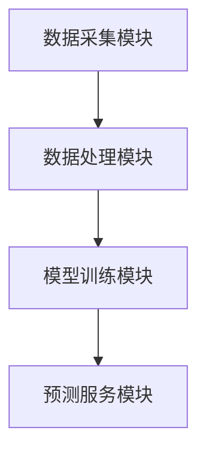
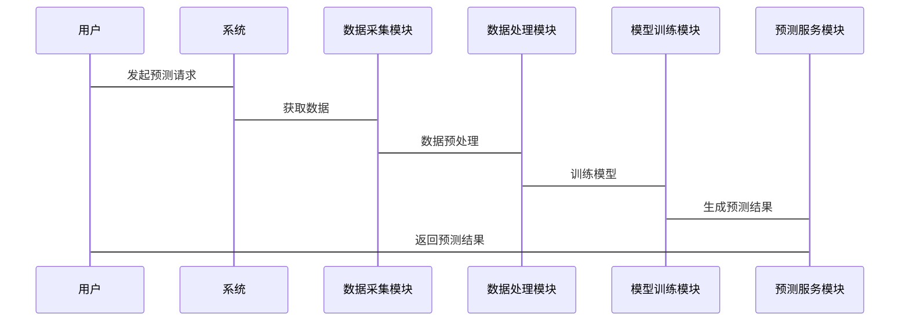

                 


# 智能保险产品需求预测模型优化

> 关键词：智能保险，需求预测，机器学习，模型优化，保险产品

> 摘要：本文深入探讨了智能保险产品需求预测模型的优化方法，从背景分析到算法实现，从系统设计到项目实战，全面解析了如何利用机器学习技术提升保险产品需求预测的准确性与效率。文章结合实际案例，详细阐述了模型优化的关键点、算法选择、数学建模、系统架构设计等核心内容，为保险行业的数字化转型提供了理论与实践的双重参考。

---

## 第1章 智能保险产品需求预测模型的背景与问题

### 1.1 保险行业的数字化转型

#### 1.1.1 保险行业的现状与发展趋势
保险行业正面临数字化转型的浪潮，传统的保险业务模式逐渐被智能化、数据驱动的模式所取代。随着大数据、人工智能等技术的快速发展，保险公司开始利用这些技术来优化产品设计、提升客户体验和运营效率。

#### 1.1.2 数字化技术对保险行业的深远影响
数字化技术的应用使得保险公司在产品设计、风险评估、客户服务等方面的能力得到显著提升。例如，通过大数据分析，保险公司可以更精准地评估客户的保险需求，从而设计出更符合客户需求的产品。

#### 1.1.3 智能保险产品的概念与特点
智能保险产品是指利用人工智能技术，通过实时数据分析和预测，为客户提供个性化、动态调整的保险产品。其特点是数据驱动、实时响应和个性化服务。

### 1.2 需求预测在保险业务中的重要性

#### 1.2.1 需求预测在保险产品设计中的作用
需求预测是保险产品设计的核心环节。通过准确的需求预测，保险公司可以更好地匹配市场需求，制定合理的保费策略，优化产品结构。

#### 1.2.2 传统需求预测方法的局限性
传统的需求预测方法通常基于统计分析和经验判断，存在数据维度单一、预测精度低、难以实时更新等问题。

#### 1.2.3 智能化需求预测的必要性与优势
智能化需求预测通过机器学习算法，能够处理海量数据，挖掘隐含规律，实现高精度的预测。其优势体现在实时性、精准性和个性化三个方面。

### 1.3 模型优化的核心问题

#### 1.3.1 需求预测模型的基本概念
需求预测模型是通过历史数据和相关特征，预测未来保险产品需求量的数学模型。其核心在于如何选择合适的算法和优化模型结构。

#### 1.3.2 模型优化的关键问题与挑战
模型优化的关键问题包括数据质量、特征选择、算法选择和模型调优。同时，模型的泛化能力、计算效率和可解释性也是需要重点关注的挑战。

#### 1.3.3 优化目标与边界条件
模型优化的目标是提高预测精度、降低计算成本、提升模型的可解释性。边界条件包括数据的可用性、计算资源的限制以及业务需求的动态变化。

### 1.4 本章小结
本章从保险行业的数字化转型出发，分析了智能保险产品的概念与特点，探讨了需求预测在保险业务中的重要性，并提出了模型优化的核心问题与目标。通过这些分析，为后续的模型优化奠定了理论基础。

---

## 第2章 智能保险需求预测模型的核心概念

### 2.1 智能保险需求预测模型的定义与组成

#### 2.1.1 模型的定义与核心要素
智能保险需求预测模型是以人工智能技术为基础，通过分析历史销售数据、客户行为数据、市场环境数据等，预测未来保险产品需求的数学模型。其核心要素包括数据输入、特征工程、算法选择和模型输出。

#### 2.1.2 模型的输入、输出与核心算法
- **输入**：历史销售数据、客户特征、市场环境数据。
- **输出**：未来保险产品的预测需求量。
- **核心算法**：机器学习算法，如线性回归、随机森林、神经网络等。

#### 2.1.3 模型的优化目标与评价指标
- **优化目标**：提高预测精度、降低预测误差。
- **评价指标**：均方误差（MSE）、平均绝对误差（MAE）、R²值等。

### 2.2 智能模型与传统模型的对比分析

#### 2.2.1 传统需求预测模型的特点与局限
传统模型通常基于统计分析，如时间序列分析，存在数据维度单一、预测精度低等问题。

#### 2.2.2 智能模型的核心优势
智能模型能够处理高维数据，挖掘非线性关系，实现高精度预测。

#### 2.2.3 两种模型的适用场景对比
- **传统模型**：适用于数据量小、关系简单的场景。
- **智能模型**：适用于数据量大、关系复杂的场景。

### 2.3 模型优化的关键要素

#### 2.3.1 数据质量与特征选择
数据质量直接影响模型性能。特征选择是优化模型性能的关键步骤，通常采用特征重要性分析和Lasso回归等方法。

#### 2.3.2 算法选择与参数调优
算法选择需要根据数据特点和业务需求进行，参数调优可以通过网格搜索或随机搜索实现。

#### 2.3.3 模型评估与性能优化
模型评估需要结合业务场景，通过交叉验证和性能指标对比选择最优模型。

### 2.4 本章小结
本章详细阐述了智能保险需求预测模型的核心概念，分析了智能模型与传统模型的优劣势，并提出了模型优化的关键要素。这些内容为后续的算法实现和系统设计奠定了基础。

---

## 第3章 智能保险需求预测模型的算法原理

### 3.1 常见需求预测算法概述

#### 3.1.1 线性回归模型
线性回归是一种简单的需求预测算法，适用于线性关系的数据。其核心思想是通过最小化预测值与实际值的平方差之和，找到最佳拟合直线。

#### 3.1.2 随机森林与梯度提升树
随机森林是一种基于决策树的集成算法，具有较高的鲁棒性和抗过拟合能力。梯度提升树是一种迭代优化算法，能够处理复杂的非线性关系。

#### 3.1.3 神经网络与深度学习模型
神经网络是一种模拟人脑神经网络的算法，具有强大的非线性拟合能力。深度学习模型通过多层神经网络，能够提取数据的深层次特征。

### 3.2 算法原理对比分析

#### 3.2.1 各算法的核心原理
- **线性回归**：通过拟合直线预测目标值。
- **随机森林**：通过集成多个决策树提升预测精度。
- **神经网络**：通过多层神经元模拟数据的非线性关系。

#### 3.2.2 算法优缺点对比
| 算法         | 优点                             | 缺点                               |
|--------------|----------------------------------|-----------------------------------|
| 线性回归     | 简单易懂，计算效率高             | 预测精度低，仅适用于线性关系       |
| 随机森林     | 鲁棒性高，抗过拟合能力强         | 计算复杂度高，特征重要性解释性差     |
| 神经网络     | 预测精度高，适用于复杂场景       | 模型复杂，训练时间长，可解释性差     |

### 3.3 算法实现流程

#### 3.3.1 数据预处理
- 数据清洗：处理缺失值、异常值。
- 特征工程：提取特征、归一化处理。

#### 3.3.2 模型训练
- 数据分割：将数据划分为训练集和测试集。
- 模型训练：选择合适的算法进行训练。

#### 3.3.3 模型评估
- 评估指标：均方误差（MSE）、平均绝对误差（MAE）。
- 调参优化：通过网格搜索或随机搜索优化模型参数。

### 3.4 本章小结
本章详细介绍了几种常见的需求预测算法，分析了它们的核心原理和优缺点，并给出了算法实现的流程。这些内容为后续的模型优化提供了理论支持。

---

## 第4章 智能保险需求预测模型的数学模型

### 4.1 线性回归模型的数学公式

线性回归的数学公式如下：
$$ y = \beta_0 + \beta_1 x + \epsilon $$
其中，$y$ 是目标变量，$x$ 是自变量，$\beta_0$ 和 $\beta_1$ 是回归系数，$\epsilon$ 是误差项。

### 4.2 随机森林模型的数学公式

随机森林模型的预测公式为：
$$ y = \frac{1}{n} \sum_{i=1}^{n} \text{Tree}_i(x) $$
其中，$n$ 是决策树的数量，$\text{Tree}_i(x)$ 是第 $i$ 棵树的预测值。

### 4.3 神经网络模型的数学公式

神经网络模型的前向传播公式为：
$$ a^{(l+1)} = \sigma(w^{(l)} a^{(l)} + b^{(l)}) $$
其中，$a^{(l)}$ 是第 $l$ 层的激活值，$w^{(l)}$ 是权重矩阵，$b^{(l)}$ 是偏置项，$\sigma$ 是激活函数。

### 4.4 本章小结
本章通过数学公式详细阐述了三种常见算法的实现原理，为后续的模型优化提供了数学基础。

---

## 第5章 智能保险需求预测模型的系统架构设计

### 5.1 系统功能设计

#### 5.1.1 数据采集模块
负责采集保险产品的销售数据、客户数据和市场数据。

#### 5.1.2 数据处理模块
对采集到的数据进行清洗、特征提取和归一化处理。

#### 5.1.3 模型训练模块
选择合适的算法，对数据进行训练，生成预测模型。

#### 5.1.4 预测服务模块
接收预测请求，调用模型进行预测，并返回结果。

### 5.2 系统架构设计

#### 5.2.1 系统架构图


#### 5.2.2 系统接口设计
- 数据接口：提供数据读取和写入接口。
- 模型接口：提供模型训练和预测接口。

### 5.3 系统交互流程

#### 5.3.1 系统交互图


### 5.4 本章小结
本章通过系统架构设计，详细描述了智能保险需求预测模型的各个组成部分及其交互流程，为后续的系统实现提供了指导。

---

## 第6章 智能保险需求预测模型的项目实战

### 6.1 环境安装与配置

#### 6.1.1 安装Python
安装Python 3.8及以上版本，并安装必要的库：
```bash
pip install numpy pandas scikit-learn
```

#### 6.1.2 安装Jupyter Notebook
```bash
pip install jupyter
```

### 6.2 系统核心实现源代码

#### 6.2.1 数据预处理代码
```python
import pandas as pd
from sklearn.impute import SimpleImputer
from sklearn.preprocessing import StandardScaler

# 读取数据
data = pd.read_csv('insurance.csv')

# 处理缺失值
imputer = SimpleImputer(strategy='mean')
data_imputed = imputer.fit_transform(data)

# 归一化处理
scaler = StandardScaler()
data_scaled = scaler.fit_transform(data_imputed)
```

#### 6.2.2 模型训练代码
```python
from sklearn.ensemble import RandomForestRegressor
from sklearn.metrics import mean_squared_error

# 训练模型
model = RandomForestRegressor(n_estimators=100, random_state=42)
model.fit(X_train, y_train)

# 预测结果
y_pred = model.predict(X_test)
print('均方误差:', mean_squared_error(y_test, y_pred))
```

### 6.3 代码应用解读与分析

#### 6.3.1 数据预处理
- 数据清洗：处理缺失值和异常值。
- 特征工程：提取关键特征并进行归一化处理。

#### 6.3.2 模型训练
- 选择随机森林算法进行训练。
- 通过交叉验证评估模型性能。

### 6.4 实际案例分析与详细讲解

#### 6.4.1 数据来源与特征分析
数据来源包括保险产品的历史销售数据、客户特征数据和市场环境数据。特征分析包括客户年龄、保费、购买渠道等。

#### 6.4.2 模型调优
通过网格搜索优化随机森林模型的参数，如n_estimators、max_depth等。

#### 6.4.3 模型部署
将训练好的模型部署到生产环境中，提供预测服务接口。

### 6.5 项目小结
本章通过一个实际项目，详细展示了智能保险需求预测模型的实现过程，包括环境配置、数据预处理、模型训练和部署。

---

## 第7章 总结与展望

### 7.1 本章小结
本文从智能保险需求预测模型的背景出发，详细探讨了模型优化的关键点、算法选择、数学建模、系统架构设计和项目实战。通过理论分析与实践结合，为保险行业的数字化转型提供了参考。

### 7.2 最佳实践 tips

#### 7.2.1 数据质量的重要性
数据质量直接影响模型性能，建议在数据预处理阶段投入更多精力。

#### 7.2.2 模型选择的策略
根据数据特点和业务需求选择合适的算法，避免盲目追求复杂模型。

#### 7.2.3 模型调优的注意事项
通过交叉验证和网格搜索优化模型参数，避免过拟合和欠拟合。

### 7.3 未来研究方向

#### 7.3.1 更复杂的模型
探索深度学习模型，如LSTM和Transformer，以应对更复杂的预测场景。

#### 7.3.2 实时预测能力
研究实时数据处理技术，提升模型的实时预测能力。

#### 7.3.3 可解释性增强
通过可解释性增强技术，提升模型的业务应用价值。

### 7.4 本章小结
本文总结了智能保险需求预测模型的优化方法，并提出了未来的研究方向和实践建议。这些内容为保险行业的数字化转型提供了理论与实践的双重参考。

---

## 作者：AI天才研究院/AI Genius Institute & 禅与计算机程序设计艺术 /Zen And The Art of Computer Programming

