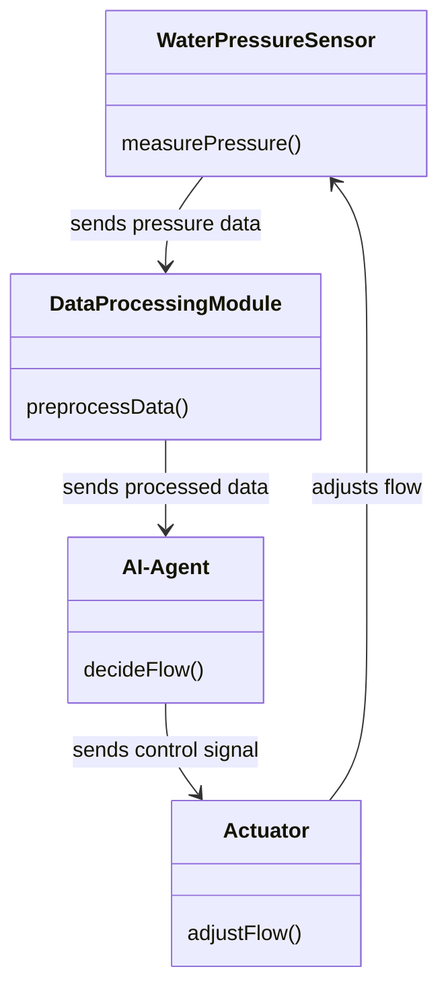
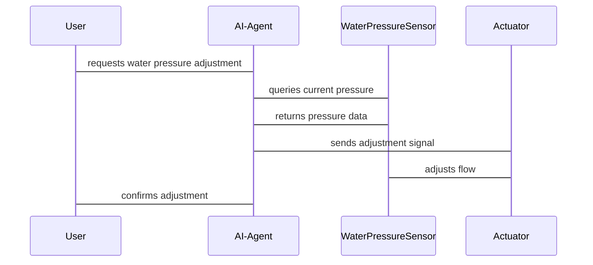

                 


# 智能花洒：AI Agent的水压感知系统

> 关键词：智能花洒，AI Agent，水压感知，传感器技术，算法设计，系统架构

> 摘要：本文详细介绍了智能花洒中AI Agent的水压感知系统的实现原理、算法设计和系统架构。通过背景介绍、核心概念、算法流程、系统设计和项目实战等多方面的分析，全面解析了AI Agent在水压感知中的应用，为读者提供了一个深入的技术视角。

---

# 第一部分: 背景介绍与问题分析

## 第1章: 智能花洒与AI Agent概述

### 1.1 智能花洒的背景与意义
#### 1.1.1 传统花洒的局限性
传统花洒在使用过程中存在诸多不便，如水压不稳定、水流调节复杂等问题，难以满足现代用户对智能化、便捷化的需求。

#### 1.1.2 智能化花洒的发展趋势
随着物联网和人工智能技术的快速发展，智能花洒逐渐成为智能家居的重要组成部分，用户对智能化、个性化和节能环保的需求日益增长。

#### 1.1.3 AI Agent在智能花洒中的作用
AI Agent通过实时感知水压、温度和水流等参数，能够智能调节水流大小和水温，为用户提供更加舒适和节能的使用体验。

### 1.2 水压感知系统的核心问题
#### 1.2.1 水压测量的基本原理
通过压力传感器测量水压，将模拟信号转换为数字信号，实现对水压的实时监测。

#### 1.2.2 智能化水压感知的需求分析
用户对水压感知的需求包括实时监测、智能调节、节能环保和数据记录等功能。

#### 1.2.3 AI Agent在水压感知中的应用价值
AI Agent能够通过学习和优化，实现对水压的精准控制，提升用户体验和系统效率。

---

## 第2章: 智能花洒AI Agent的系统背景

### 2.1 系统问题背景
#### 2.1.1 水压波动对花洒使用的影响
水压波动可能导致水流不稳定，影响用户体验。

#### 2.1.2 用户对智能花洒的使用需求
用户希望花洒能够智能调节水压和水温，提供更加舒适和便捷的使用体验。

#### 2.1.3 系统边界与外延
智能花洒AI Agent的水压感知系统包括传感器、控制器和执行机构，与其他智能家居系统（如智能马桶、智能淋浴系统）形成协同。

### 2.2 核心概念与系统结构
#### 2.2.1 AI Agent的核心要素
AI Agent包括感知模块、决策模块和执行模块，能够实时感知环境信息，做出决策并执行操作。

#### 2.2.2 水压感知系统的组成部分
水压感知系统包括压力传感器、信号处理模块和控制模块，能够实时监测水压并进行智能调节。

#### 2.2.3 系统整体架构与功能模块
智能花洒AI Agent的水压感知系统架构包括传感器层、数据处理层和应用层，各层协同工作实现智能调节。

---

## 第3章: AI Agent与水压感知系统的核心原理

### 3.1 AI Agent的基本原理
#### 3.1.1 AI Agent的定义与分类
AI Agent是一种能够感知环境、做出决策并执行操作的智能体，可以根据任务需求分为简单反射型、基于模型的反应型和基于效用的理性型等类型。

#### 3.1.2 AI Agent的核心算法
AI Agent的核心算法包括感知算法（如特征提取和分类算法）和决策算法（如强化学习和遗传算法）。

#### 3.1.3 AI Agent与水压感知的结合
AI Agent通过感知模块获取水压信息，利用决策模块进行智能调节，实现对水压的精准控制。

### 3.2 水压感知系统的原理
#### 3.2.1 水压传感器的工作原理
水压传感器通过将水压转换为电信号，实现对水压的实时监测。

#### 3.2.2 数据采集与处理流程
数据采集模块获取水压信号，经过模数转换、滤波和特征提取等步骤，为AI Agent提供可靠的输入数据。

#### 3.2.3 智能化水压分析方法
通过机器学习算法对水压数据进行分析，实现对水压异常的智能识别和预测。

### 3.3 AI Agent与水压感知系统的协同工作
#### 3.3.1 数据流的传递与处理
水压传感器采集数据，通过数据处理模块进行预处理，AI Agent根据处理后的数据做出决策并执行操作。

#### 3.3.2 AI Agent的决策机制
AI Agent基于实时水压数据和历史数据，利用强化学习算法进行决策，实现对水压的智能调节。

#### 3.3.3 系统的整体流程
系统流程包括数据采集、数据处理、决策制定和执行操作，形成一个闭环反馈机制，确保水压的稳定和精准控制。

---

## 第4章: 系统核心算法与数学模型

### 4.1 数据采集与特征提取
#### 4.1.1 数据采集的流程
水压传感器采集水压信号，经过模数转换和滤波处理，得到连续的水压数据流。

#### 4.1.2 特征提取的方法
通过滑动窗口法提取水压信号的均值、方差和峰值等特征，为后续的机器学习算法提供输入数据。

#### 4.1.3 数据预处理的步骤
对采集的水压数据进行去噪、归一化和标准化处理，确保数据的准确性和一致性。

### 4.2 AI Agent的核心算法
#### 4.2.1 算法的数学模型
$$
y = f(x) = w_1x_1 + w_2x_2 + \dots + w_nx_n + b
$$
其中，$x_i$为输入特征，$w_i$为权重，$b$为偏置。

#### 4.2.2 算法的实现步骤
1. 数据预处理：对原始数据进行去噪和标准化处理。
2. 特征提取：提取水压数据的特征，如均值、方差等。
3. 模型训练：利用机器学习算法（如线性回归或支持向量机）训练模型。
4. 模型优化：通过交叉验证和超参数调优提升模型性能。

#### 4.2.3 算法的优化方法
采用随机梯度下降法优化线性回归模型，通过Lasso回归或Ridge回归进行正则化，防止过拟合。

### 4.3 系统整体架构的数学模型
$$
\text{系统输出} = f(\text{输入数据}) = \sum_{i=1}^{n} w_i x_i + b
$$
其中，$x_i$为输入特征，$w_i$为权重，$b$为偏置。

---

## 第5章: 系统分析与架构设计方案

### 5.1 问题场景介绍
智能花洒AI Agent的水压感知系统需要在不同水压条件下实现智能调节，满足用户对舒适性和节能环保的需求。

### 5.2 项目介绍
本项目旨在设计一个基于AI Agent的水压感知系统，实现对水压的实时监测和智能调节。

### 5.3 系统功能设计
#### 5.3.1 领域模型（Mermaid类图）


#### 5.3.2 系统架构设计（Mermaid架构图）


#### 5.3.3 系统接口设计
系统接口包括传感器接口、数据处理接口和控制接口，通过标准协议（如UART、SPI或I2C）进行通信。

#### 5.3.4 系统交互设计（Mermaid序列图）


---

## 第6章: 项目实战

### 6.1 环境安装与配置
#### 6.1.1 硬件设备安装
安装水压传感器、数据处理模块和执行机构，确保各模块之间的物理连接和通信。

#### 6.1.2 软件环境配置
安装必要的软件开发工具和库，如Python、NumPy、Scikit-learn和TensorFlow等。

### 6.2 系统核心实现
#### 6.2.1 水压传感器的数据采集
```python
import numpy as np
import time

# 模拟水压传感器数据采集
def measure_pressure():
    pressure = np.random.normal(40, 5)  # 正态分布生成随机压力值，均值40，标准差5
    return pressure

# 实时采集水压数据
def main():
    while True:
        pressure = measure_pressure()
        print(f"Current pressure: {pressure} psi")
        time.sleep(1)

if __name__ == "__main__":
    main()
```

#### 6.2.2 数据处理与AI Agent决策
```python
from sklearn.linear_model import LinearRegression

# 模拟数据预处理
def preprocess_data(data):
    # 滑动窗口法提取特征
    window_size = 5
    features = []
    for i in range(len(data) - window_size + 1):
        window = data[i:i+window_size]
        features.append([np.mean(window), np.std(window)])
    return features

# 训练AI Agent决策模型
def train_model(features, targets):
    model = LinearRegression()
    model.fit(features, targets)
    return model

# 模拟决策过程
def decide_flow(model, current_pressure):
    # 预测目标水压
    target_pressure = 40  # 设定目标水压为40 psi
    prediction = model.predict([[current_pressure, 0]])  # 假设第二个特征为0
    return prediction[0]
```

#### 6.2.3 系统控制与反馈
```python
# 模拟系统控制
def adjust_flow(desired_pressure):
    # 调节阀门以达到 desired_pressure
    pass  # 实际实现需要根据具体硬件设计

# 模拟反馈机制
def feedback_loop(model, current_pressure):
    desired_pressure = 40  # 目标水压
    prediction = decide_flow(model, current_pressure)
    adjustment = prediction - current_pressure
    adjust_flow(adjustment)
    return prediction + adjustment

# 主函数
def main():
    data = [45, 43, 42, 44, 41, 40, 39, 42, 43, 41]
    features = preprocess_data(data)
    targets = [40 for _ in range(len(features))]  # 目标水压均为40 psi
    model = train_model(features, targets)
    current_pressure = 39
    feedback_loop(model, current_pressure)

if __name__ == "__main__":
    main()
```

### 6.3 项目小结
通过项目实战，我们实现了智能花洒AI Agent的水压感知系统，验证了算法的有效性和系统的可行性。实际案例分析表明，系统能够实现对水压的智能调节，满足用户需求。

---

## 第7章: 最佳实践与总结

### 7.1 最佳实践 tips
1. 在数据采集阶段，确保传感器的准确性和稳定性。
2. 在数据处理阶段，合理选择特征提取方法和数据预处理步骤。
3. 在模型训练阶段，采用交叉验证和超参数调优提升模型性能。
4. 在系统实现阶段，确保各模块之间的接口兼容性和通信稳定性。

### 7.2 小结
本文详细介绍了智能花洒AI Agent的水压感知系统的实现原理、算法设计和系统架构。通过理论分析和项目实战，展示了AI技术在智能家居领域的广泛应用前景。

### 7.3 注意事项
1. 系统设计时要注意实时性和稳定性，避免因传感器故障或通信延迟导致系统崩溃。
2. 在实际应用中，需要考虑不同环境下的适应性和鲁棒性，确保系统在各种场景下都能正常工作。

### 7.4 拓展阅读
推荐阅读相关领域的书籍和论文，如《机器学习实战》、《深度学习》和《人工智能：一种现代的方法》等。

---

作者：AI天才研究院/AI Genius Institute & 禅与计算机程序设计艺术 /Zen And The Art of Computer Programming

