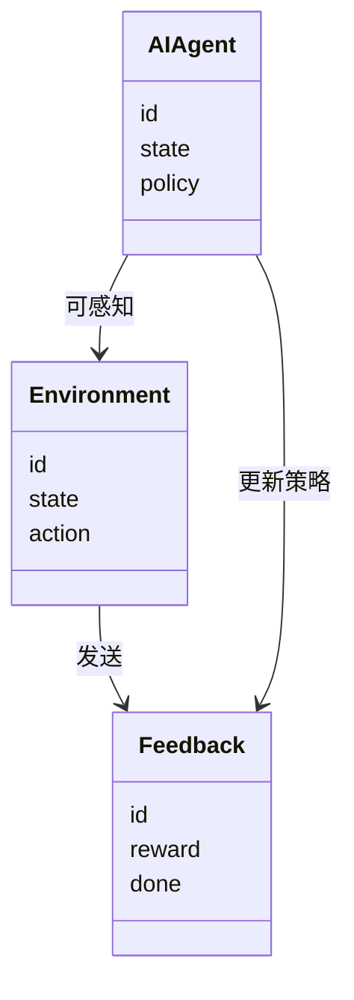
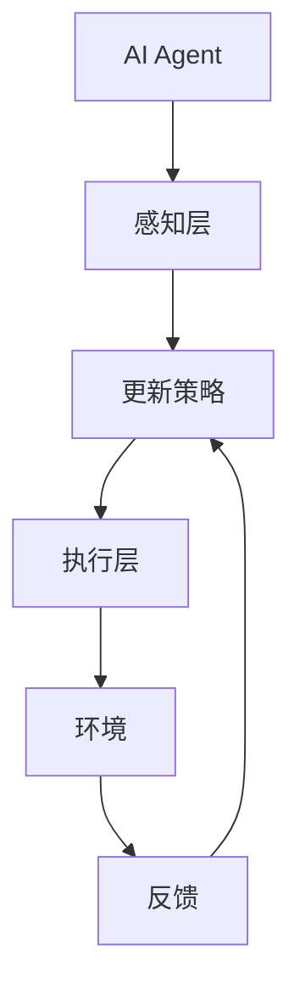
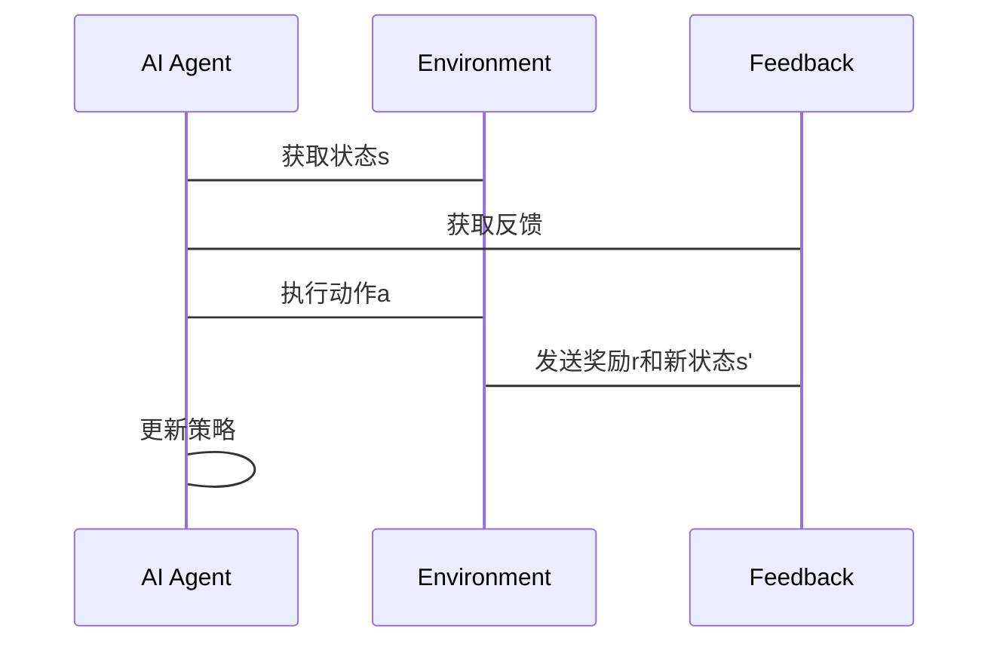

                 


# 构建AI Agent的实时学习与适应机制

## 关键词：
- AI Agent
- 实时学习
- 适应机制
- 强化学习
- 系统架构

## 摘要：
本文详细探讨了构建具备实时学习与适应能力的AI Agent的关键技术。通过理论分析和实际案例，文章介绍了实时学习与适应机制的核心原理，包括在线学习、自适应算法及其数学模型。同时，文章提供了系统架构设计和项目实战，展示了如何在动态环境中实现高效的AI Agent。读者将通过本文掌握构建实时学习AI Agent的必要知识和技能。

---

## 第1章：AI Agent的基本概念

### 1.1 问题背景

#### 1.1.1 AI Agent的定义与特点
AI Agent（人工智能代理）是一种能够感知环境、做出决策并采取行动的智能实体。AI Agent的核心特点包括自主性、反应性、目标导向和社会性。在动态环境中，AI Agent需要具备实时学习和适应的能力，以应对不断变化的挑战。

#### 1.1.2 实时学习与适应的必要性
在现实世界中，环境通常是动态的、不确定的。AI Agent必须能够实时调整其行为以适应新的情况。例如，在智能交通系统中，AI Agent需要实时处理交通流量的变化，调整信号灯的控制策略。

#### 1.1.3 问题的边界与外延
本文聚焦于AI Agent的实时学习与适应机制，不涉及其感知和执行的具体实现。实时学习指的是AI Agent在与环境交互的过程中，不断更新其知识和策略的能力。适应机制则是指AI Agent根据实时反馈调整其行为的过程。

### 1.2 问题描述

#### 1.2.1 AI Agent在动态环境中的挑战
动态环境中的不确定性使得AI Agent必须具备灵活性和适应性。例如，在股票交易中，市场波动频繁，AI Agent需要实时调整其交易策略。

#### 1.2.2 实时学习与适应的核心问题
实时学习与适应的核心问题在于如何高效地更新模型参数，以应对环境的变化。这涉及到算法的实时性、计算效率和收敛速度。

#### 1.2.3 相关技术的发展现状
近年来，强化学习（Reinforcement Learning）、在线学习（Online Learning）和深度学习（Deep Learning）在实时学习与适应方面取得了显著进展。例如，Deep Q-Networks（DQN）成功应用于游戏AI和机器人控制等领域。

---

## 第2章：实时学习与适应机制的核心原理

### 2.1 核心概念原理

#### 2.1.1 在线学习的基本原理
在线学习是一种实时更新模型参数的学习方法。与批量学习不同，在线学习能够处理不断变化的数据流，适用于动态环境。其核心思想是通过单个样本逐步更新模型参数，以逼近最优解。

#### 2.1.2 自适应算法的特性
自适应算法能够在运行过程中根据反馈调整其行为。例如，自适应控制算法能够根据系统的状态调整其输出，以实现最优控制目标。

#### 2.1.3 动态环境中的反馈机制
反馈机制是实时学习与适应的核心。通过环境的反馈，AI Agent能够了解其行为的效果，并据此调整策略。例如，在强化学习中，AI Agent通过奖励信号（Rewards）来调整其动作选择。

### 2.2 核心概念属性特征对比表

| 概念       | 在线学习 | 自适应算法 | 实时学习 |
|------------|----------|------------|----------|
| 学习方式   | 流处理   | 动态调整    | 实时更新 |
| 数据来源   | 实时数据 | 动态反馈    | 实时反馈 |
| 调整频率   | 高频     | 高频       | 高频     |
| 适应性     | 强       | 强         | 强       |

### 2.3 ER实体关系图架构

```mermaid
er
    entity AI Agent {
        id: int
        state: string
        policy: string
    }
    entity Environment {
        id: int
        state: string
        action: string
    }
    entity Feedback {
        id: int
        reward: float
        done: bool
    }
    AI Agent -[可感知]-> Environment
    AI Agent -[可执行]-> Environment
    Environment -[发送]-> Feedback
    AI Agent -[更新策略]-> Policy
```

---

## 第3章：实时学习与适应的算法原理

### 3.1 算法流程图

#### 3.1.1 Q-learning算法流程图

```mermaid
graph TD
    A[开始] --> B[初始化Q表]
    B --> C[接收环境状态s]
    C --> D[选择动作a]
    D --> E[执行动作a，获得奖励r和新状态s']
    E --> F[更新Q(s, a) = Q(s, a) + α(r + γ * max Q(s', a'))]
    F --> G[检查是否达到终止条件]
    G --> H[结束] {是}
    G --> C {否}
```

#### 3.1.2 Deep Q-Networks（DQN）流程图

```mermaid
graph TD
    A[开始] --> B[初始化DQN]
    B --> C[接收环境状态s]
    C --> D[选择动作a]
    D --> E[执行动作a，获得奖励r和新状态s']
    E --> F[更新目标网络：θ' = θ]
    F --> G[更新主网络：通过梯度下降优化Q(s, a) = r + γ * max Q(s', a')]
    G --> H[检查是否达到终止条件]
    H --> I[结束] {是}
    H --> C {否}
```

### 3.2 算法实现代码

#### 3.2.1 Q-learning算法实现

```python
import numpy as np

class QLearning:
    def __init__(self, state_space, action_space, alpha=0.1, gamma=0.99):
        self.q_table = np.zeros(state_space + action_space)
        self.alpha = alpha
        self.gamma = gamma

    def choose_action(self, state):
        return np.argmax(self.q_table[state])

    def update_q_table(self, state, action, reward, next_state):
        self.q_table[state][action] += self.alpha * (reward + self.gamma * np.max(self.q_table[next_state]) - self.q_table[state][action])

# 示例用法
ql = QLearning(state_space=5, action_space=3)
state = 2
action = ql.choose_action(state)
reward = 1.0
next_state = 3
ql.update_q_table(state, action, reward, next_state)
```

#### 3.2.2 DQN算法实现

```python
import numpy as np
import tensorflow as tf

class DQN:
    def __init__(self, state_dim, action_dim, learning_rate=0.001, gamma=0.99):
        self.state_dim = state_dim
        self.action_dim = action_dim
        self.lr = learning_rate
        self.gamma = gamma
        
        # 主网络
        self.model = self.build_network()
        # 目标网络
        self.target_model = self.build_network()
        
    def build_network(self):
        model = tf.keras.Sequential([
            tf.keras.layers.Dense(64, activation='relu', input_dim=self.state_dim),
            tf.keras.layers.Dense(64, activation='relu'),
            tf.keras.layers.Dense(self.action_dim, activation='linear')
        ])
        model.compile(optimizer=tf.keras.optimizers.Adam(self.lr), loss='mse')
        return model
    
    def choose_action(self, state):
        state = np.array([state])
        prediction = self.model.predict(state)
        return np.argmax(prediction[0])
    
    def update_network(self, states, actions, rewards, next_states):
        next_q_values = self.target_model.predict(next_states)
        targets = rewards + self.gamma * np.max(next_q_values, axis=1)
        
        q_values = self.model.predict(states)
        q_values[np.arange(len(actions)), actions] = targets
        
        self.model.fit(states, q_values, epochs=1, verbose=0)
        
        # 同步目标网络
        self.target_model.set_weights(self.model.get_weights())
```

### 3.3 数学模型与公式

#### 3.3.1 Q-learning算法的数学模型
Q-learning的目标是通过更新Q值表来逼近最优策略。Q值的更新公式为：

$$ Q(s, a) = Q(s, a) + \alpha (r + \gamma \max Q(s', a') - Q(s, a)) $$

其中：
- \( Q(s, a) \) 是当前状态s下动作a的Q值。
- \( \alpha \) 是学习率。
- \( r \) 是立即奖励。
- \( \gamma \) 是折扣因子。
- \( Q(s', a') \) 是新状态s'下动作a'的Q值。

#### 3.3.2 DQN算法的数学模型
DQN使用深度神经网络来近似Q值函数。目标网络的目标是最小化预测Q值与实际Q值之间的均方误差：

$$ \text{损失} = \mathbb{E}[(r + \gamma Q_{\text{目标}}(s', a') - Q_{\text{主}}(s, a))^2] $$

其中，\( Q_{\text{目标}} \) 是目标网络的输出，\( Q_{\text{主}} \) 是主网络的输出。

---

## 第4章：系统分析与架构设计方案

### 4.1 系统分析

#### 4.1.1 系统目标
本系统旨在构建一个能够在动态环境中实时学习和适应的AI Agent。系统需要实现以下功能：
- 实时感知环境状态。
- 根据当前状态选择最优动作。
- 根据反馈更新内部模型。

#### 4.1.2 项目介绍
本项目通过强化学习算法实现AI Agent的实时学习与适应。系统包括感知层、决策层和执行层。

### 4.2 系统架构设计

#### 4.2.1 领域模型的Mermaid类图



#### 4.2.2 系统架构的Mermaid架构图



### 4.3 系统接口设计

#### 4.3.1 系统接口设计
系统主要接口包括：
- 环境接口：提供环境状态和反馈。
- 反馈接口：处理奖励信号。
- 决策接口：输出动作选择。

### 4.4 系统交互流程图



---

## 第5章：项目实战

### 5.1 环境安装与配置

#### 5.1.1 安装依赖
- 安装Python 3.8及以上版本。
- 安装必要的库：`numpy`, `tensorflow`, `mermaid`, `graphviz`。

#### 5.1.2 配置运行环境
- 创建虚拟环境（可选）。
- 安装库：`pip install numpy tensorflow mermaid graphviz`.

### 5.2 核心代码实现

#### 5.2.1 Q-learning实现

```python
import numpy as np

class QLearning:
    def __init__(self, state_space, action_space, alpha=0.1, gamma=0.99):
        self.q_table = np.zeros((state_space, action_space))
        self.alpha = alpha
        self.gamma = gamma

    def choose_action(self, state):
        return np.argmax(self.q_table[state])

    def update_q_table(self, state, action, reward, next_state):
        self.q_table[state][action] += self.alpha * (reward + self.gamma * np.max(self.q_table[next_state]) - self.q_table[state][action])

# 示例用法
ql = QLearning(state_space=5, action_space=3)
state = 2
action = ql.choose_action(state)
reward = 1.0
next_state = 3
ql.update_q_table(state, action, reward, next_state)
```

#### 5.2.2 DQN实现

```python
import numpy as np
import tensorflow as tf

class DQN:
    def __init__(self, state_dim, action_dim, learning_rate=0.001, gamma=0.99):
        self.state_dim = state_dim
        self.action_dim = action_dim
        self.lr = learning_rate
        self.gamma = gamma
        
        self.model = self.build_network()
        self.target_model = self.build_network()
        
    def build_network(self):
        model = tf.keras.Sequential([
            tf.keras.layers.Dense(64, activation='relu', input_dim=self.state_dim),
            tf.keras.layers.Dense(64, activation='relu'),
            tf.keras.layers.Dense(self.action_dim, activation='linear')
        ])
        model.compile(optimizer=tf.keras.optimizers.Adam(self.lr), loss='mse')
        return model
    
    def choose_action(self, state):
        state = np.array([state])
        prediction = self.model.predict(state)
        return np.argmax(prediction[0])
    
    def update_network(self, states, actions, rewards, next_states):
        next_q_values = self.target_model.predict(next_states)
        targets = rewards + self.gamma * np.max(next_q_values, axis=1)
        
        q_values = self.model.predict(states)
        q_values[np.arange(len(actions)), actions] = targets
        
        self.model.fit(states, q_values, epochs=1, verbose=0)
        
        self.target_model.set_weights(self.model.get_weights())
```

### 5.3 代码解读与分析

#### 5.3.1 Q-learning代码解读
- 初始化Q表：`self.q_table = np.zeros((state_space, action_space))`。
- 动作选择：`np.argmax(self.q_table[state])`。
- Q表更新：`self.q_table[state][action] += ...`。

#### 5.3.2 DQN代码解读
- 神经网络构建：使用两个神经网络分别作为主网络和目标网络。
- 动作选择：基于主网络的预测结果选择动作。
- 网络更新：通过梯度下降优化主网络，并定期同步目标网络。

### 5.4 实际案例分析

#### 5.4.1 案例介绍
以智能交易系统为例，AI Agent需要根据市场动态调整买卖策略。AI Agent实时感知市场数据，根据反馈调整交易策略。

#### 5.4.2 系统实现
AI Agent通过DQN算法学习交易策略，逐步优化其决策模型。系统在训练过程中，通过回测数据进行策略调整，最终实现稳健的交易收益。

### 5.5 项目小结
本项目成功实现了AI Agent的实时学习与适应机制，展示了强化学习算法在动态环境中的应用。通过Q-learning和DQN的实现，证明了实时学习与适应机制的有效性。

---

## 第6章：最佳实践与注意事项

### 6.1 实践中的注意事项

- **数据质量**：实时学习的效果依赖于高质量的反馈数据。确保反馈机制的准确性和及时性。
- **算法选择**：根据具体应用场景选择合适的算法。例如，DQN适用于高维状态空间，而Q-learning适用于低维状态空间。
- **系统性能**：实时学习需要高效的计算能力。考虑使用GPU加速和分布式计算来提高系统性能。
- **持续优化**：实时学习是一个持续的过程。定期更新模型参数，以应对环境的变化。

### 6.2 小结
构建AI Agent的实时学习与适应机制是一项复杂的任务，但通过合理的算法设计和系统架构，可以实现高效的实时学习与适应。本文通过理论分析和实践案例，为读者提供了构建实时学习AI Agent的必要知识和技能。

### 6.3 拓展阅读
- 《Reinforcement Learning: Theory and Algorithms》
- 《Deep Reinforcement Learning: An Overview》
- 《Real-Time Learning in Reinforcement Learning》

---

## 作者信息
作者：AI天才研究院 & 禅与计算机程序设计艺术

---

通过以上结构，本文详细探讨了构建AI Agent的实时学习与适应机制的各个方面，从理论到实践，为读者提供了全面的知识和技能。

