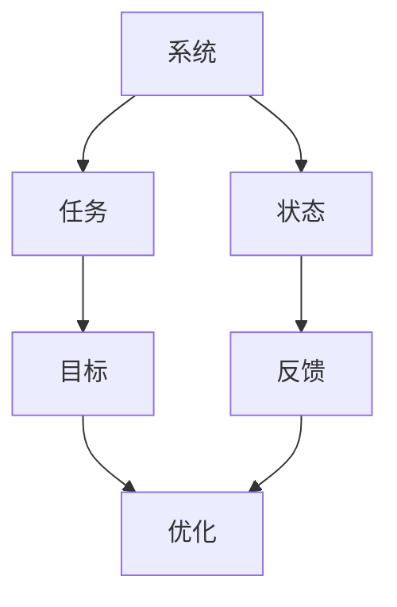
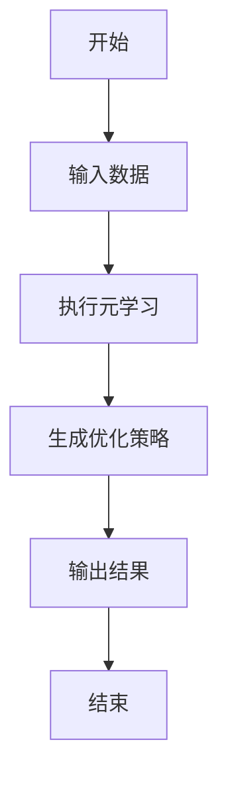
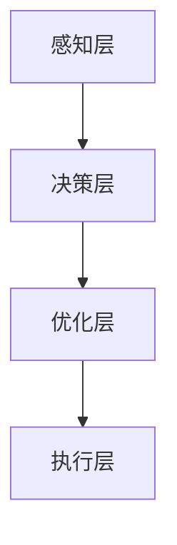
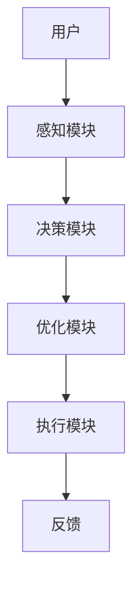

                 


# 构建具有自我评估与优化能力的AI Agent系统

## 关键词：AI Agent、自我评估、优化能力、系统架构、算法原理

## 摘要：  
本文详细探讨了构建具有自我评估与优化能力的AI Agent系统的各个方面。从背景介绍、核心概念、算法原理到系统架构设计、项目实战，再到最佳实践和扩展阅读，文章全面解析了如何设计和实现一个能够自我评估并持续优化的AI Agent系统。通过详细的理论分析、算法推导和实际案例，读者可以掌握构建此类系统的知识和方法。

---

# 第一部分：AI Agent系统概述

## 第1章：背景介绍

### 1.1 问题背景

#### 1.1.1 当前AI系统的发展现状  
人工智能（AI）技术近年来取得了长足进步，从图像识别、自然语言处理到机器人控制，AI 已经渗透到各个领域。然而，大多数AI系统仍依赖于外部输入的规则和数据，缺乏自我评估与优化能力。这种依赖性使得系统在面对复杂动态环境时，难以适应变化，无法实现真正的自治。

#### 1.1.2 AI Agent系统的概念与特点  
AI Agent（智能体）是一种能够感知环境、自主决策并执行任务的实体。与传统AI系统不同，AI Agent具备以下特点：  
1. **自主性**：能够在没有外部干预的情况下独立运行。  
2. **反应性**：能够实时感知环境并做出反应。  
3. **目标导向**：具备明确的目标，并能为实现目标采取行动。  
4. **学习能力**：能够通过经验改进自身性能。  

#### 1.1.3 自我评估与优化能力的重要性  
在动态和不确定的环境中，AI Agent需要能够评估自身的性能，并根据评估结果优化自身的行为策略。自我评估与优化能力是AI Agent实现自治和高效运行的关键，能够显著提升系统的适应性和智能性。

---

### 1.2 问题描述

#### 1.2.1 AI Agent系统的核心问题  
AI Agent的核心问题在于如何在复杂环境中实现自主决策和持续优化。具体包括：  
1. 如何感知环境并提取有效信息？  
2. 如何制定和优化决策策略？  
3. 如何实现自我评估与反馈机制？  

#### 1.2.2 自我评估与优化的必要性  
自我评估是AI Agent了解自身性能的基础，而优化则是提升性能的关键。通过自我评估，AI Agent可以识别自身的优缺点，并通过优化算法调整行为策略，以适应环境的变化。

#### 1.2.3 系统边界与外延  
AI Agent系统的边界包括感知模块、决策模块和执行模块。外延则涉及与外部环境的交互，以及与其他AI系统的协作。

---

### 1.3 问题解决

#### 1.3.1 自我评估与优化的基本思路  
1. 通过感知模块获取环境信息。  
2. 使用评估算法对自身性能进行评估。  
3. 根据评估结果优化决策策略。  

#### 1.3.2 系统设计的总体框架  
1. **感知层**：负责收集环境数据。  
2. **决策层**：基于感知数据制定决策。  
3. **优化层**：根据评估结果优化决策策略。  

#### 1.3.3 核心技术与实现方法  
1. 元学习（Meta-Learning）：用于快速适应新任务。  
2. 自适应优化算法：用于动态调整系统参数。  

---

### 1.4 本章小结

#### 1.4.1 知识回顾  
- AI Agent的基本概念与特点。  
- 自我评估与优化的重要性。  

#### 1.4.2 下一章的展望  
下一章将详细讲解AI Agent系统的核心概念与联系，包括自我评估与优化机制的基本原理。

---

## 第2章：核心概念与联系

### 2.1 自我评估与优化机制

#### 2.1.1 元学习（Meta-Learning）的概念  
元学习是一种通过学习如何学习的方法。其核心思想是训练模型在不同任务之间快速迁移，从而减少对数据的依赖。

#### 2.1.2 自适应优化算法的基本原理  
自适应优化算法通过动态调整学习率或参数，使模型能够更好地适应变化的环境。

#### 2.1.3 系统自我评估的核心要素  
1. **评估指标**：用于衡量系统性能。  
2. **评估方法**：通过对比实际结果与预期结果进行评估。  
3. **优化目标**：通过优化算法调整系统参数，以提升性能。

---

### 2.2 核心概念对比

#### 2.2.1 元学习与传统机器学习的对比分析  
| 特性       | 元学习                          | 传统机器学习                  |
|------------|--------------------------------|------------------------------|
| 数据依赖性 | 低，适用于小样本数据            | 高，需要大量数据              |
| 适应性     | 高，能够快速适应新任务          | 低，需要重新训练              |

#### 2.2.2 自适应优化与静态优化的差异  
- **自适应优化**：动态调整参数，适应环境变化。  
- **静态优化**：参数固定，无法适应变化。  

#### 2.2.3 自我评估与外部评估的优缺点  
| 评估方式   | 优点                            | 缺点                          |
|------------|--------------------------------|------------------------------|
| 自我评估   | 灵活性高，能够实时调整          | 可能存在自我偏差              |
| 外部评估   | 客观性强，结果可信              | 实时性差，难以快速反馈        |

---

### 2.3 ER实体关系图



---

### 2.4 本章小结

#### 2.4.1 核心概念总结  
- 元学习与自适应优化是实现AI Agent自我评估与优化的核心技术。  

#### 2.4.2 系统架构的初步框架  
- 系统架构包括感知层、决策层和优化层，各层之间通过数据和反馈进行交互。

---

## 第3章：算法原理讲解

### 3.1 元学习算法

#### 3.1.1 Meta-Learning的基本原理  
元学习的目标是训练一个模型，使其能够快速适应新任务。其核心思想是通过在多个任务上训练，使模型学会如何学习。

#### 3.1.2 MAML算法的实现流程  
1. **初始化**：设置初始参数θ。  
2. **内循环**：在每个任务上进行梯度下降。  
3. **外循环**：更新θ以最小化所有任务的损失。  

#### 3.1.3 Reptile算法的优缺点  
- **优点**：简单高效，适用于小样本数据。  
- **缺点**：可能存在过拟合问题。

---

### 3.2 自适应优化算法

#### 3.2.1 自适应学习率调整  
自适应学习率算法（如Adam）通过动态调整学习率，使模型在训练过程中更高效。

#### 3.2.2 程序的自适应优化流程  
1. **初始化**：设置初始参数。  
2. **评估**：计算当前性能。  
3. **优化**：根据评估结果调整参数。  
4. **执行**：执行优化后的策略。  

#### 3.2.3 算法的收敛性分析  
- **收敛性**：自适应优化算法通常比静态算法更快收敛。  

---

### 3.3 算法流程图



---

### 3.4 数学模型与公式

#### 3.4.1 元学习的数学表达  
$$ \theta_{t+1} = \theta_t + \alpha \nabla_{\theta_t} \mathcal{L}_t $$  

#### 3.4.2 自适应优化的数学模型  
$$ \eta_{t+1} = \eta_t + \beta (g_t - \eta_t) $$  

#### 3.4.3 示例说明  
例如，在强化学习（RL）中，AI Agent通过不断尝试动作，根据奖励信号调整策略参数，以最大化累积奖励。

---

## 第4章：系统分析与架构设计

### 4.1 系统功能设计

#### 4.1.1 系统功能模块  
1. **感知模块**：负责收集环境数据。  
2. **决策模块**：基于感知数据制定决策。  
3. **优化模块**：根据评估结果优化决策策略。  

#### 4.1.2 系统功能流程  
1. 感知模块收集环境数据。  
2. 决策模块基于数据制定决策。  
3. 系统执行决策并获得反馈。  
4. 优化模块根据反馈优化决策策略。  

---

### 4.2 系统架构设计

#### 4.2.1 系统架构图  


#### 4.2.2 系统交互流程图  


---

### 4.3 接口设计

#### 4.3.1 系统接口  
1. **输入接口**：接收环境数据。  
2. **输出接口**：输出决策结果。  
3. **反馈接口**：接收执行结果的反馈。  

---

## 第5章：项目实战

### 5.1 环境配置

#### 5.1.1 环境需求  
- 操作系统：Linux/Windows/macOS  
- 语言：Python 3.8+  
- 库：TensorFlow/PyTorch、Mermaid、Jupyter Notebook  

---

### 5.2 核心代码实现

#### 5.2.1 元学习代码实现  
```python
import torch

class MetaLearner:
    def __init__(self, model):
        self.model = model
        self.meta_optimizer = torch.optim.Adam(self.model.parameters(), lr=1e-3)

    def inner_loop(self, x, y):
        # 内循环优化
        loss = self.model.compute_loss(x, y)
        return loss

    def meta_loop(self, tasks):
        # 外循环优化
        for task in tasks:
            x, y = task
            loss = self.inner_loop(x, y)
            self.meta_optimizer.zero_grad()
            loss.backward()
            self.meta_optimizer.step()
```

#### 5.2.2 自适应优化代码实现  
```python
class AdaptiveOptimizer:
    def __init__(self, model):
        self.model = model
        self.optimizer = torch.optim.Adam(self.model.parameters(), lr=1e-3)

    def adapt(self, x, y):
        # 自适应优化
        loss = self.model.compute_loss(x, y)
        self.optimizer.zero_grad()
        loss.backward()
        self.optimizer.step()
```

---

### 5.3 代码解读与分析

#### 5.3.1 元学习代码解读  
- **MetaLearner类**：负责元学习的实现。  
- **inner_loop**：内循环优化，用于处理单个任务。  
- **meta_loop**：外循环优化，用于处理多个任务。  

#### 5.3.2 自适应优化代码解读  
- **AdaptiveOptimizer类**：负责自适应优化的实现。  
- **adapt**：根据输入数据优化模型参数。  

---

### 5.4 实际案例分析

#### 5.4.1 案例背景  
以智能客服系统为例，AI Agent需要根据用户需求动态调整回答策略。

#### 5.4.2 案例实现  
1. **感知模块**：收集用户问题。  
2. **决策模块**：根据问题生成回答。  
3. **优化模块**：根据用户反馈优化回答策略。  

---

## 第6章：最佳实践与总结

### 6.1 最佳实践 tips

#### 6.1.1 系统设计  
- 明确系统目标，避免功能过于复杂。  
- 选择合适的算法，结合实际需求进行优化。  

#### 6.1.2 开发建议  
- 使用成熟的框架（如TensorFlow、PyTorch）进行实现。  
- 注重模块化设计，便于后续维护和优化。  

---

### 6.2 小结

#### 6.2.1 核心内容回顾  
- AI Agent系统的自我评估与优化能力是实现自治的关键。  
- 元学习与自适应优化算法是实现自我评估与优化的核心技术。  

#### 6.2.2 未来展望  
随着技术的发展，AI Agent系统将更加智能化，具备更强的自我评估与优化能力。

---

## 第7章：注意事项与拓展阅读

### 7.1 注意事项

#### 7.1.1 系统设计  
- 确保系统具备足够的鲁棒性，能够处理异常情况。  
- 定期监控系统性能，及时发现和解决问题。  

#### 7.1.2 技术实现  
- 注意算法的收敛性，避免陷入局部最优。  
- 定期更新模型，保持系统的先进性。  

---

### 7.2 拓展阅读

#### 7.2.1 推荐书籍  
1. 《深度学习》——Ian Goodfellow  
2. 《机器学习实战》——Cathy O’Neil  

#### 7.2.2 推荐论文  
1. "Learning to learn by gradient descent by gradient descent" —— V. Mnih et al.  
2. "A Survey on Meta-Learning" —— Y. Liu et al.  

---

## 作者：AI天才研究院/AI Genius Institute & 禅与计算机程序设计艺术 /Zen And The Art of Computer Programming

