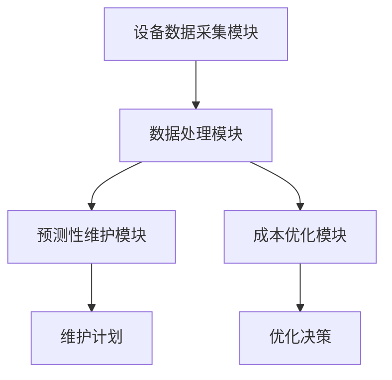
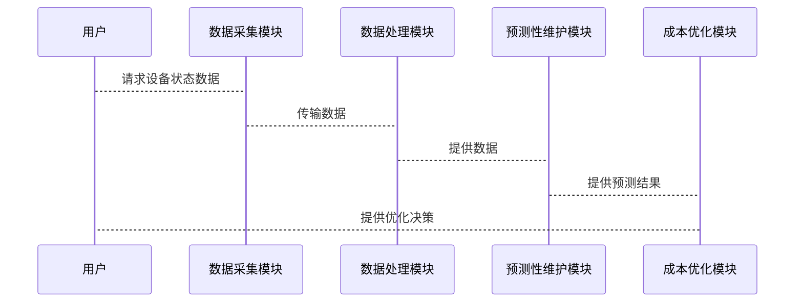

                 


# 构建智能企业资产管理平台：全生命周期成本优化与预测性维护

> **关键词**: 企业资产管理、智能平台、预测性维护、成本优化、物联网、大数据、人工智能

> **摘要**: 本文详细探讨了构建智能企业资产管理平台的核心技术与方法，重点分析了全生命周期成本优化与预测性维护的实现策略。通过结合物联网、大数据和人工智能技术，本文提出了基于时间序列分析和机器学习的预测性维护算法，并通过系统架构设计与项目实战，展示了如何实现高效的资产管理和优化。

---

# 第一部分: 智能企业资产管理平台概述

## 第1章: 企业资产管理平台背景与需求

### 1.1 企业资产管理的现状与挑战

#### 1.1.1 传统企业资产管理的痛点
传统的企业资产管理主要依赖人工操作，存在以下痛点：
- **数据孤岛**: 各部门资产数据分散，缺乏统一的管理平台。
- **维护成本高**: 依赖人工巡检，维护效率低，成本高。
- **缺乏预测能力**: 维护计划基于经验而非数据，可能导致过度维护或维护不足。
- **资产利用率低**: 缺乏对资产全生命周期的监控，难以优化资产使用效率。

#### 1.1.2 数字化转型对企业资产管理的要求
随着企业数字化转型的推进，资产管理需要：
- **智能化**: 利用人工智能和大数据技术实现智能化管理。
- **实时监控**: 实时采集资产数据，快速响应问题。
- **预测性维护**: 基于历史数据和实时状态预测设备故障，减少停机时间。
- **全生命周期管理**: 覆盖资产从采购、使用到报废的全生命周期。

#### 1.1.3 智能化资产管理的必要性
智能化资产管理能够：
- 提高资产利用率，降低维护成本。
- 实现预测性维护，减少设备故障停机时间。
- 通过数据驱动的决策优化资产运营效率。

### 1.2 智能企业资产管理平台的定义与目标

#### 1.2.1 定义与核心功能
智能企业资产管理平台（Intelligent Enterprise Asset Management Platform，IEAMP）是一种基于物联网、大数据和人工智能技术的智能化管理平台，旨在实现企业资产的全生命周期管理。其核心功能包括：
- **资产实时监控**: 实时采集资产状态数据，可视化展示。
- **预测性维护**: 基于历史数据和实时状态预测设备故障，制定维护计划。
- **成本优化**: 通过数据分析优化维护成本，提高资产利用率。
- **决策支持**: 提供数据驱动的决策支持，帮助管理层优化资产运营。

#### 1.2.2 平台的目标与价值
平台的目标是通过智能化管理，实现以下价值：
- **降低维护成本**: 通过预测性维护和优化策略，减少不必要的维护开支。
- **提高设备可靠性**: 通过实时监控和预测性维护，减少设备故障停机时间。
- **提升资产利用率**: 通过全生命周期管理，优化资产使用效率。

#### 1.2.3 平台的边界与外延
智能企业资产管理平台的边界包括：
- **数据采集层**: 通过物联网设备采集资产状态数据。
- **数据处理层**: 对数据进行清洗、存储和分析。
- **应用层**: 提供预测性维护、成本优化等功能。
- **用户界面层**: 提供可视化界面供用户操作。

平台的外延包括与企业ERP、CRM等系统的集成，实现数据共享和业务协同。

### 1.3 企业资产管理的全生命周期管理

#### 1.3.1 全生命周期管理的概念
全生命周期管理（全生命周期管理，CLM）是指从资产的规划、采购、使用到报废的全过程管理。包括：
- **规划阶段**: 确定资产需求，制定采购计划。
- **采购阶段**: 选择供应商，签订合同。
- **使用阶段**: 实际使用资产，进行维护和保养。
- **报废阶段**: 处理不再使用的资产。

#### 1.3.2 全生命周期管理的关键环节
- **资产规划与采购**: 基于企业需求和预算制定采购计划。
- **资产使用与维护**: 实时监控资产状态，制定维护计划。
- **资产更新与报废**: 定期更新设备，及时报废不再使用的资产。

#### 1.3.3 全生命周期管理的优化目标
- **提高资产利用率**: 通过优化采购和使用策略，减少资产闲置。
- **降低维护成本**: 通过预测性维护和优化维护计划，降低维护成本。
- **延长资产寿命**: 通过科学的维护策略延长设备使用寿命。

---

## 第2章: 预测性维护与成本优化的核心概念

### 2.1 预测性维护的原理与优势

#### 2.1.1 预测性维护的定义
预测性维护（Predictive Maintenance）是一种基于设备状态数据的维护策略，旨在通过预测设备故障来制定维护计划，避免设备故障停机。

#### 2.1.2 预测性维护的核心原理
预测性维护的核心原理是通过分析设备的历史数据和实时状态数据，预测设备的健康状态，从而制定维护计划。常用的技术包括：
- **时间序列分析**: 基于设备的历史运行数据预测未来状态。
- **机器学习**: 使用算法分析设备状态数据，识别潜在故障。

#### 2.1.3 预测性维护的优势与应用场景
- **优势**: 减少设备故障停机时间，降低维护成本，提高设备利用率。
- **应用场景**: 制造业、能源行业、交通行业等领域，适用于高价值设备的管理。

### 2.2 成本优化的数学模型与方法

#### 2.2.1 成本优化的基本概念
成本优化是指通过优化资源配置和决策，降低企业运营成本。在资产管理中，成本优化主要体现在维护成本的降低和资产利用率的提高。

#### 2.2.2 数学模型与公式
成本优化的线性规划模型如下：
$$
\min \sum_{i=1}^{n} c_i x_i
$$
其中，$c_i$ 是第 $i$ 项成本，$x_i$ 是第 $i$ 项的决策变量。

#### 2.2.3 成本优化的算法选择
常用的优化算法包括：
- **线性规划**: 适用于简单的优化问题。
- **遗传算法**: 适用于复杂的优化问题。
- **动态规划**: 适用于分阶段的优化问题。

### 2.3 预测性维护与成本优化的关联

#### 2.3.1 预测性维护如何降低维护成本
预测性维护通过提前发现设备故障，避免突发故障停机，从而降低维护成本。

#### 2.3.2 成本优化如何驱动预测性维护
成本优化的目标是降低维护成本，而预测性维护是一种有效的降低维护成本的方法。

#### 2.3.3 两者结合的协同效应
预测性维护与成本优化的结合可以实现设备的最优维护策略，降低维护成本，提高设备利用率。

---

## 第3章: 智能企业资产管理平台的技术基础

### 3.1 物联网技术在资产管理中的应用

#### 3.1.1 物联网技术的基本概念
物联网（Internet of Things，IoT）是指通过各种信息传感设备，如传感器、射频识别（RFID）技术、全球定位系统、红外感应器等，按约定的协议，把任何物品与互联网相连接，进行信息交换和通信，以实现智能化识别、定位、跟踪、监控和管理。

#### 3.1.2 物联网在资产监控中的作用
物联网在资产管理中的作用包括：
- **实时数据采集**: 通过传感器实时采集设备状态数据。
- **数据传输**: 将采集到的数据传输到云端进行分析。
- **远程监控**: 通过物联网平台实现设备的远程监控和管理。

#### 3.1.3 物联网与企业资产管理的结合
物联网与企业资产管理的结合主要体现在：
- **设备状态实时监控**: 通过物联网设备实时采集设备状态数据。
- **预测性维护**: 基于物联网数据实现预测性维护。

### 3.2 大数据分析在资产管理中的应用

#### 3.2.1 大数据分析的基本原理
大数据分析是指对海量数据进行处理、分析和挖掘，以提取有价值的信息。常用的大数据分析技术包括：
- **数据清洗**: 对数据进行预处理，去除噪声数据。
- **数据存储**: 将数据存储在分布式存储系统中，如Hadoop、HBase等。
- **数据分析**: 使用数据挖掘算法对数据进行分析，提取有价值的信息。

#### 3.2.2 数据分析在资产健康监测中的应用
数据分析在资产健康监测中的应用包括：
- **设备故障预测**: 通过分析设备的历史数据和实时数据，预测设备故障。
- **资产利用率分析**: 通过分析设备使用数据，优化资产利用率。

#### 3.2.3 数据分析在成本优化中的作用
数据分析在成本优化中的作用包括：
- **成本预测**: 通过分析历史成本数据，预测未来的维护成本。
- **成本控制**: 通过分析成本构成，优化资源配置，降低维护成本。

### 3.3 人工智能技术在预测性维护中的应用

#### 3.3.1 人工智能的基本概念
人工智能（Artificial Intelligence，AI）是指计算机系统模拟人类智能的技术，包括学习、推理、自我改进等能力。

#### 3.3.2 机器学习在预测性维护中的应用
机器学习在预测性维护中的应用包括：
- **监督学习**: 通过训练有标签的数据，预测设备故障。
- **无监督学习**: 通过聚类分析，发现设备状态的异常情况。

#### 3.3.3 深度学习在资产状态预测中的作用
深度学习在资产状态预测中的作用包括：
- **神经网络**: 通过多层神经网络模型，学习设备状态数据的特征。
- **卷积神经网络（CNN）**: 用于图像数据的分析。
- **循环神经网络（RNN）**: 用于时间序列数据的分析。

---

## 第4章: 预测性维护的算法原理与实现

### 4.1 时间序列分析在预测性维护中的应用

#### 4.1.1 时间序列分析的基本概念
时间序列分析是一种基于时间顺序的数据分析方法，常用于预测未来趋势。

#### 4.1.2 ARIMA模型的原理与实现
ARIMA（AutoRegressive Integrated Moving Average）模型是一种常用的时间序列预测模型，其核心思想是通过自回归（AR）和移动平均（MA）来预测未来值。

#### 4.1.3 LSTM模型在时间序列预测中的应用
长短期记忆网络（LSTM）是一种特殊的循环神经网络（RNN），能够有效处理时间序列数据。

### 4.2 基于机器学习的故障预测算法

#### 4.2.1 机器学习的基本原理
机器学习是一种人工智能技术，通过训练数据模型，实现对未知数据的预测和分类。

#### 4.2.2 基于决策树的故障预测
决策树是一种常见的机器学习算法，通过构建树状结构，对数据进行分类和预测。

#### 4.2.3 基于支持向量机的故障分类
支持向量机（SVM）是一种常用的分类算法，适用于高维数据的分类和回归。

### 4.3 成本优化的数学模型与算法实现

#### 4.3.1 成本优化的线性规划模型
线性规划模型是一种常用的优化方法，适用于目标函数和约束条件均为线性的情况。

#### 4.3.2 基于遗传算法的优化方法
遗传算法是一种模拟自然选择的优化算法，适用于复杂的非线性优化问题。

#### 4.3.3 基于动态规划的优化策略
动态规划是一种分阶段的优化方法，适用于问题可以分解为多个子问题的情况。

---

## 第5章: 系统架构设计与实现

### 5.1 系统架构设计

#### 5.1.1 系统模块划分
智能企业资产管理平台的系统架构包括以下几个模块：
- **设备数据采集模块**: 负责采集设备状态数据。
- **数据处理模块**: 负责数据的清洗、存储和分析。
- **预测性维护模块**: 负责设备故障预测和维护计划制定。
- **成本优化模块**: 负责维护成本优化和决策支持。

#### 5.1.2 系统功能设计
系统功能设计包括：
- **实时监控**: 实时显示设备状态数据。
- **预测性维护**: 基于算法预测设备故障，制定维护计划。
- **成本优化**: 优化维护成本，提高资产利用率。

#### 5.1.3 系统架构图
以下是系统架构的Mermaid图：



### 5.2 系统接口设计

#### 5.2.1 数据采集接口
数据采集接口负责与物联网设备进行数据交互，常用协议包括：
- **HTTP**: 基于REST的API接口。
- **MQTT**: 轻量级的物联网协议。

#### 5.2.2 数据分析接口
数据分析接口负责与大数据平台进行数据交互，常用接口包括：
- **Hadoop**: 分布式文件系统接口。
- **Spark**: 分布式计算框架接口。

### 5.3 系统交互流程

#### 5.3.1 系统交互序列图
以下是系统交互的Mermaid序列图：



---

## 第6章: 项目实战

### 6.1 项目背景与目标

#### 6.1.1 项目背景
某制造企业希望优化设备维护策略，减少维护成本，提高设备利用率。

#### 6.1.2 项目目标
- 实现设备状态实时监控。
- 实现设备故障预测和维护计划制定。
- 优化维护成本，提高设备利用率。

### 6.2 环境配置与安装

#### 6.2.1 系统环境
- **操作系统**: Linux（ CentOS 7）
- **编程语言**: Python 3.8+
- **框架**: Flask、Django
- **数据库**: MySQL、PostgreSQL
- **大数据平台**: Hadoop、Spark
- **人工智能框架**: TensorFlow、Keras

#### 6.2.2 依赖安装
安装以下依赖：
```bash
pip install flask
pip install numpy
pip install pandas
pip install scikit-learn
pip install tensorflow
pip install keras
```

### 6.3 核心实现代码

#### 6.3.1 时间序列预测代码
以下是一个基于ARIMA模型的时间序列预测代码：

```python
import pandas as pd
from statsmodels.tsa.arima_model import ARIMA

# 加载数据
data = pd.read_csv('data.csv')

# 训练模型
model = ARIMA(data['value'], order=(5,1,0))
model_fit = model.fit()

# 预测未来值
forecast = model_fit.forecast(steps=10)
print(forecast)
```

#### 6.3.2 机器学习预测代码
以下是一个基于随机森林的故障预测代码：

```python
from sklearn.ensemble import RandomForestClassifier
from sklearn.model_selection import train_test_split
from sklearn.metrics import accuracy_score

# 加载数据
data = pd.read_csv('fault_data.csv')
X = data.drop('fault', axis=1)
y = data['fault']

# 划分训练集和测试集
X_train, X_test, y_train, y_test = train_test_split(X, y, test_size=0.2)

# 训练模型
model = RandomForestClassifier(n_estimators=100)
model.fit(X_train, y_train)

# 预测测试集
y_pred = model.predict(X_test)

# 计算准确率
print(accuracy_score(y_test, y_pred))
```

### 6.4 项目小结

#### 6.4.1 项目成果
- 实现了设备状态实时监控。
- 实现了设备故障预测和维护计划制定。
- 优化了维护成本，提高了设备利用率。

#### 6.4.2 经验总结
- 数据质量对模型性能影响较大，需要做好数据清洗和特征工程。
- 模型选择需要根据实际场景进行调整，不能一味追求高精度。
- 系统架构设计需要充分考虑扩展性和可维护性。

---

## 第7章: 总结与展望

### 7.1 总结
本文详细探讨了构建智能企业资产管理平台的核心技术与方法，重点分析了全生命周期成本优化与预测性维护的实现策略。通过结合物联网、大数据和人工智能技术，提出了基于时间序列分析和机器学习的预测性维护算法，并通过系统架构设计与项目实战，展示了如何实现高效的资产管理和优化。

### 7.2 展望
未来，随着人工智能和大数据技术的不断发展，智能企业资产管理平台将更加智能化和自动化。以下是未来的发展方向：
- **边缘计算**: 将计算能力推向设备端，实现本地化的实时分析。
- **数字孪生**: 建立数字孪生模型，实现资产的虚拟化管理。
- **自适应优化**: 基于实时数据动态调整维护策略，实现自适应优化。

---

# 作者：AI天才研究院 & 禅与计算机程序设计艺术

