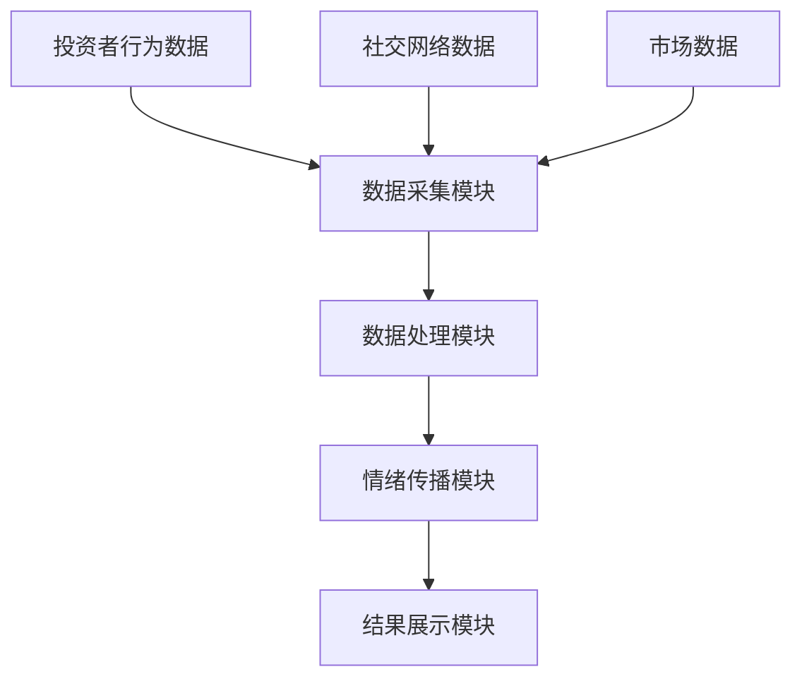
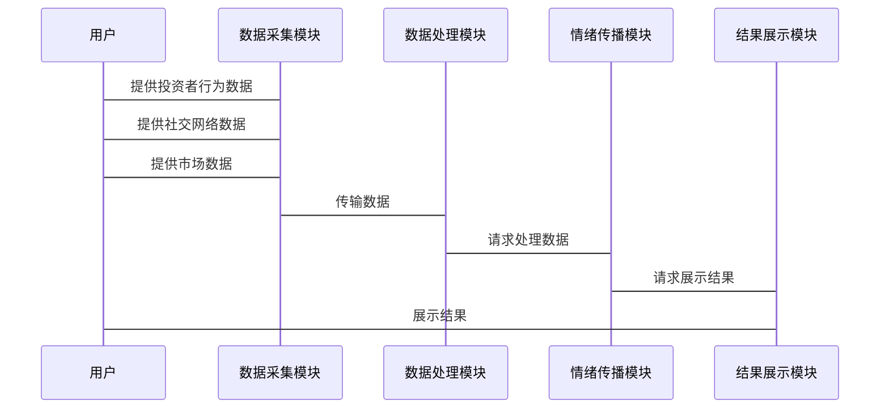

                 


# 金融市场情绪传染模型

> 关键词：金融市场情绪传染，情绪传播机制，网络结构，投资者行为分析，概率模型，算法实现，系统设计

> 摘要：本文详细探讨了金融市场中情绪传染模型的构建与应用。首先，从背景与意义出发，分析了情绪传染现象及其对金融市场的深远影响。接着，深入阐述了情绪传播的核心概念，包括投资者行为、传播机制和网络结构。然后，通过数学建模和算法实现，详细讲解了情绪传播的概率模型和网络模型，并提供了具体的代码实现。最后，结合实际案例，分析了系统的架构设计和项目实战，总结了模型的局限性和未来研究方向。

---

## 第1章 金融市场情绪传染模型的背景与意义

### 1.1 情绪传染的金融现象

#### 1.1.1 金融市场中的情绪传播现象
金融市场中的投资者行为往往受到情绪的影响，这种情绪可以通过社交网络、媒体传播等方式在投资者之间传染，进而影响市场价格的波动。例如，当市场出现利好消息时，投资者的情绪会变得乐观，从而推动价格上涨；反之，当出现利空消息时，投资者的情绪会变得悲观，导致价格下跌。

#### 1.1.2 情绪传染对市场波动的影响
情绪传染会导致市场波动加剧，尤其是在市场恐慌或狂热时，情绪传播的速度和范围都会显著扩大。这种现象在金融危机中表现得尤为明显，例如2008年的全球金融危机中，投资者的恐慌情绪迅速蔓延，导致市场大幅下跌。

#### 1.1.3 情绪传染的经济学与行为学基础
情绪传染的经济学基础主要来源于行为金融学，认为投资者的行为不仅仅受到理性因素的影响，还受到情绪、认知偏差等因素的影响。行为学研究表明，情绪可以通过社交网络中的互动传播，从而影响个体的决策行为。

### 1.2 问题背景与研究意义

#### 1.2.1 金融市场中的情绪传染问题
金融市场中的情绪传染问题主要体现在以下几个方面：
- 投资者的情绪波动会影响市场参与度和交易活跃度。
- 情绪传染会导致市场的非理性波动，增加市场的不确定性和风险。
- 情绪传染可能影响金融监管的效果，使得监管政策的实施变得更加复杂。

#### 1.2.2 情绪传染模型的研究现状
目前，关于情绪传染模型的研究主要集中在以下几个方面：
- 基于网络的传播模型，如随机网络模型和小世界网络模型。
- 基于概率论的情绪传播模型，如马尔可夫链模型和贝叶斯网络模型。
- 结合实际情况的情绪传播模型，如考虑投资者个体差异的动态传播模型。

#### 1.2.3 情绪传染模型的现实应用价值
情绪传染模型在金融市场的实际应用中具有重要的价值，主要体现在以下几个方面：
- 帮助投资者更好地理解市场波动的内在机制。
- 为金融监管机构提供参考，制定更有效的监管政策。
- 为金融机构的风险管理提供支持，帮助其更好地应对市场波动。

---

## 第2章 情绪传染模型的核心概念与联系

### 2.1 投资者行为分析

#### 2.1.1 投资者情绪的形成机制
投资者情绪的形成机制主要包括以下几个方面：
- 信息获取：投资者通过各种渠道获取市场信息，信息的多寡和质量会影响情绪的形成。
- 认知加工：投资者会对获取的信息进行加工，形成对市场的看法和预期。
- 情感反应：投资者的情绪反应是其对市场信息的主观感受，受到个体差异的影响。

#### 2.1.2 投资者行为的网络效应
投资者行为的网络效应主要体现在以下几个方面：
- 社交网络的影响：投资者通过社交网络获取信息，情绪会通过网络传播。
- 群体行为：投资者在群体中容易受到他人行为的影响，产生从众心理。

#### 2.1.3 投资者情绪的传播路径
投资者情绪的传播路径主要包括以下几个阶段：
1. 情绪源：情绪的起点，如市场消息、新闻报道等。
2. 情绪传播：情绪通过社交网络、媒体等渠道传播。
3. 情绪扩散：情绪在投资者群体中扩散，影响更多的投资者。

### 2.2 情绪传播机制

#### 2.2.1 网络结构对情绪传播的影响
网络结构对情绪传播的影响主要体现在以下几个方面：
- 网络的密度：网络密度越高，情绪传播的速度越快。
- 网络的中心性：网络中心节点的影响更大，情绪传播的范围更广。
- 网络的异质性：网络中不同节点的特征差异会影响情绪传播的路径和速度。

#### 2.2.2 情绪传播的数学模型
情绪传播的数学模型主要包括以下几个方面：
- 概率传播模型：通过概率论描述情绪传播的过程。
- 网络扩散模型：通过网络理论描述情绪传播的路径和速度。

#### 2.2.3 情绪传播的动态过程
情绪传播的动态过程主要包括以下几个阶段：
1. 初始阶段：情绪从情绪源开始传播。
2. 发展阶段：情绪在投资者群体中逐渐扩散。
3. 高峰阶段：情绪传播达到峰值，市场波动加剧。
4. 衰退阶段：情绪传播逐渐减弱，市场恢复稳定。

---

## 第3章 情绪传染模型的数学建模

### 3.1 情绪传播的概率模型

#### 3.1.1 概率传播的基本假设
概率传播模型的基本假设包括以下几个方面：
- 投资者的行为是随机的，情绪传播具有不确定性。
- 情绪传播的概率与投资者的社交网络结构有关。

#### 3.1.2 情绪传播的概率方程
情绪传播的概率方程可以用以下公式表示：
$$ P(i, t+1) = P(i, t) \cdot (1 - \lambda) + (1 - P(i, t)) \cdot \lambda \cdot w_i $$
其中，\( P(i, t) \) 表示在时间 \( t \) 时投资者 \( i \) 的情绪概率，\( \lambda \) 是情绪传播的衰减系数，\( w_i \) 是投资者 \( i \) 的社交网络权重。

#### 3.1.3 情绪传播的马尔可夫链模型
马尔可夫链模型可以用来描述情绪传播的动态过程，其状态转移矩阵可以表示为：
$$
\begin{pmatrix}
P_{00} & P_{01} & \cdots & P_{0n} \\
P_{10} & P_{11} & \cdots & P_{1n} \\
\vdots & \vdots & \ddots & \vdots \\
P_{n0} & P_{n1} & \cdots & P_{nn}
\end{pmatrix}
$$

### 3.2 情绪传播的网络模型

#### 3.2.1 网络结构的定义与特征
网络结构的定义与特征包括以下几个方面：
- 网络节点：代表投资者。
- 网络边：代表投资者之间的关系。
- 网络权重：代表投资者之间关系的强度。

#### 3.2.2 情绪传播的网络扩散模型
网络扩散模型可以用以下公式表示：
$$ S_i(t+1) = S_i(t) + \sum_{j=1}^{n} (1 - S_j(t)) \cdot w_{ij} \cdot \beta $$
其中，\( S_i(t) \) 表示在时间 \( t \) 时投资者 \( i \) 的情绪状态，\( w_{ij} \) 是投资者 \( i \) 和 \( j \) 之间的网络权重，\( \beta \) 是情绪传播的速率。

#### 3.2.3 网络模型的参数估计
网络模型的参数估计可以通过最大似然估计或贝叶斯估计来实现。例如，网络权重 \( w_{ij} \) 可以通过投资者之间的社交关系数据来估计。

---

## 第4章 情绪传染模型的算法实现

### 4.1 算法选择与实现步骤

#### 4.1.1 情绪传播的算法选择
情绪传播的算法选择主要基于以下几个方面：
- 算法的复杂度：算法需要在合理的时间内完成计算。
- 数据的规模：算法需要能够处理大规模的数据。
- 模型的准确性：算法能够准确地描述情绪传播的过程。

#### 4.1.2 算法实现的基本步骤
算法实现的基本步骤包括以下几个方面：
1. 数据预处理：对投资者数据和社交网络数据进行预处理。
2. 模型训练：利用训练数据对情绪传播模型进行训练。
3. 情绪传播：基于训练好的模型，模拟情绪传播的过程。
4. 结果分析：对模拟结果进行分析，评估模型的准确性。

#### 4.1.3 算法实现的优化策略
算法实现的优化策略包括以下几个方面：
- 并行计算：利用多核处理器或分布式计算来加速计算。
- 参数优化：通过调整模型参数来提高模型的准确性。
- 数据优化：通过数据降维等技术来减少数据规模。

### 4.2 算法实现的代码示例

#### 4.2.1 基于网络的传播算法实现
以下是一个基于网络的传播算法实现的示例代码：
```python
import networkx as nx
import numpy as np

def spread_emotion(network, beta, initial_emotion):
    n = network.nodes()
    emotion = {node: 0 for node in n}
    emotion[initial_emotion] = 1
    while True:
        new_emotion = emotion.copy()
        for node in n:
            if emotion[node] == 1:
                for neighbor in network.neighbors(node):
                    if emotion[neighbor] == 0:
                        new_emotion[neighbor] = 1
        if new_emotion == emotion:
            break
        emotion = new_emotion
    return emotion

network = nx.random_graphs()
beta = 0.5
initial_emotion = 'A'
result = spread_emotion(network, beta, initial_emotion)
print(result)
```

#### 4.2.2 基于概率的传播算法实现
以下是一个基于概率的传播算法实现的示例代码：
```python
import numpy as np

def spread_emotion_prob(network, beta, initial_emotion):
    n = network.nodes()
    emotion_prob = {node: 0 for node in n}
    emotion_prob[initial_emotion] = 1
    while True:
        new_emotion_prob = emotion_prob.copy()
        for node in n:
            if emotion_prob[node] < 1:
                for neighbor in network.neighbors(node):
                    influence = network[node][neighbor]['weight']
                    new_emotion_prob[node] += emotion_prob[neighbor] * influence * beta
        if max(new_emotion_prob.values()) < 0.99:
            emotion_prob = new_emotion_prob
        else:
            break
    return emotion_prob

network = nx.random_graphs()
beta = 0.5
initial_emotion = 'A'
result = spread_emotion_prob(network, beta, initial_emotion)
print(result)
```

#### 4.2.3 算法实现的代码解读
上述代码示例展示了两种不同的情绪传播算法：基于网络的传播算法和基于概率的传播算法。基于网络的传播算法是一种确定性算法，情绪一旦传播到某个节点，该节点的情绪状态就会被立即设为1；而基于概率的传播算法则是一种概率性算法，情绪传播的概率由参数 \( \beta \) 和网络权重共同决定。

---

## 第5章 情绪传染模型的系统分析与架构设计

### 5.1 系统分析

#### 5.1.1 系统目标与功能需求
系统目标是建立一个能够模拟金融市场中情绪传播的模型，功能需求包括：
- 数据采集：采集投资者行为数据和社交网络数据。
- 情绪分析：分析投资者情绪的变化趋势。
- 情绪传播模拟：模拟情绪传播的过程。
- 结果展示：展示模拟结果，帮助用户理解情绪传播的影响。

#### 5.1.2 系统的输入输出分析
系统的输入包括投资者行为数据、社交网络数据和市场数据，输出包括情绪传播的模拟结果和市场波动的预测结果。

#### 5.1.3 系统的性能需求
系统的性能需求包括：
- 处理大规模数据的能力。
- 快速计算情绪传播的能力。
- 高精度的模拟结果。

### 5.2 系统架构设计

#### 5.2.1 项目介绍
本项目旨在构建一个能够模拟金融市场中情绪传播的模型，帮助投资者和监管机构更好地理解市场波动的内在机制。

#### 5.2.2 系统功能设计
系统功能设计包括以下几个方面：
- 数据采集模块：采集投资者行为数据和社交网络数据。
- 数据处理模块：对采集的数据进行预处理。
- 情绪传播模块：模拟情绪传播的过程。
- 结果展示模块：展示模拟结果。

#### 5.2.3 系统架构图
以下是一个系统架构图的Mermaid示例：


#### 5.2.4 系统交互图
以下是一个系统交互图的Mermaid示例：


---

## 第6章 情绪传染模型的项目实战

### 6.1 项目实战概述

#### 6.1.1 项目背景
本项目旨在通过模拟社交媒体上的投资者情绪传播，分析情绪传播对金融市场的影响。

#### 6.1.2 项目目标
项目的最终目标是构建一个能够模拟社交媒体上投资者情绪传播的模型，并分析情绪传播对金融市场的影响。

### 6.2 核心代码实现

#### 6.2.1 环境搭建
项目需要以下环境：
- Python 3.8及以上版本
- NetworkX库
- NumPy库
- Matplotlib库

#### 6.2.2 核心代码实现
以下是一个核心代码实现的示例：
```python
import networkx as nx
import numpy as np
import matplotlib.pyplot as plt

def spread_emotion(network, beta, initial_emotion):
    n = network.nodes()
    emotion = {node: 0 for node in n}
    emotion[initial_emotion] = 1
    while True:
        new_emotion = emotion.copy()
        for node in n:
            if emotion[node] == 1:
                for neighbor in network.neighbors(node):
                    if emotion[neighbor] == 0:
                        new_emotion[neighbor] = 1
        if new_emotion == emotion:
            break
        emotion = new_emotion
    return emotion

network = nx.random_graphs()
beta = 0.5
initial_emotion = 'A'
result = spread_emotion(network, beta, initial_emotion)
print(result)
```

#### 6.2.3 代码解读
上述代码实现了基于网络的情绪传播模型，其中 `network` 是一个随机生成的网络，`beta` 是情绪传播的速率，`initial_emotion` 是初始情绪源。代码通过不断迭代，模拟情绪传播的过程，直到情绪传播停止。

### 6.3 案例分析与结果解读

#### 6.3.1 案例分析
以社交媒体上的投资者情绪传播为例，假设有一个投资者在社交媒体上发布了一条乐观的市场消息，情绪开始从该投资者传播到其社交网络中的朋友，朋友再传播到他们的朋友，以此类推。

#### 6.3.2 模拟结果解读
模拟结果表明，情绪传播的速度和范围受到网络结构和情绪传播速率的影响。在网络结构较为密集的情况下，情绪传播的速度更快，范围更广；在网络结构较为分散的情况下，情绪传播的速度较慢，范围较小。

---

## 第7章 情绪传染模型的扩展与展望

### 7.1 模型的局限性与改进方向

#### 7.1.1 模型的局限性
情绪传染模型的局限性主要体现在以下几个方面：
- 模型假设过于简化，忽略了投资者个体差异的影响。
- 模型难以捕捉复杂的情绪传播路径。
- 模型的参数设置可能影响模拟结果的准确性。

#### 7.1.2 情绪传染模型的改进方向
未来的研究可以考虑以下几个方向：
- 引入个体差异因素，如投资者的风险偏好和信息获取能力。
- 开发更复杂的网络结构模型，如多层网络和时空网络。
- 结合实时数据，提高模型的实时性和准确性。

### 7.2 情绪传染模型的实际应用

#### 7.2.1 情绪传染模型在金融监管中的应用
情绪传染模型可以为金融监管机构提供参考，帮助其更好地理解市场波动的内在机制，制定更有效的监管政策。

#### 7.2.2 情绪传染模型在风险管理中的应用
情绪传染模型可以帮助金融机构更好地识别和管理市场风险，制定更有效的风险管理策略。

### 7.3 情绪传染模型的未来研究方向

#### 7.3.1 情绪传染模型的复杂性研究
未来的研究可以进一步探讨情绪传染模型的复杂性，如情绪传播的非线性特征和多层次网络结构。

#### 7.3.2 情绪传染模型的实时性研究
未来的研究可以进一步探讨情绪传染模型的实时性，如基于实时数据的情绪传播模拟。

#### 7.3.3 情绪传染模型的跨学科研究
未来的研究可以进一步探讨情绪传染模型的跨学科应用，如结合心理学、社会学等学科的研究成果，提高模型的准确性和实用性。

---

## 附录

### 附录A 数据集与工具

#### 附录A.1 数据集
- 投资者行为数据：包括投资者的交易记录、社交媒体互动数据等。
- 社交网络数据：包括投资者之间的社交关系数据。
- 市场数据：包括股票价格、指数走势等。

#### 附录A.2 工具
- Python编程语言
- NetworkX库
- NumPy库
- Matplotlib库

---

## 参考文献

1. Albert, R., & Barabasi, A. L. (2002). *Linked: The new science of networks*. Cambridge, MA: Harvard University Press.
2. Newman, M. E. (2003). *The structure of scientific collaboration networks*. *Proceedings of the National Academy of Sciences*, 100(2), 797-802.
3. Buchanan, M. (2003). *The worldwide web of_

