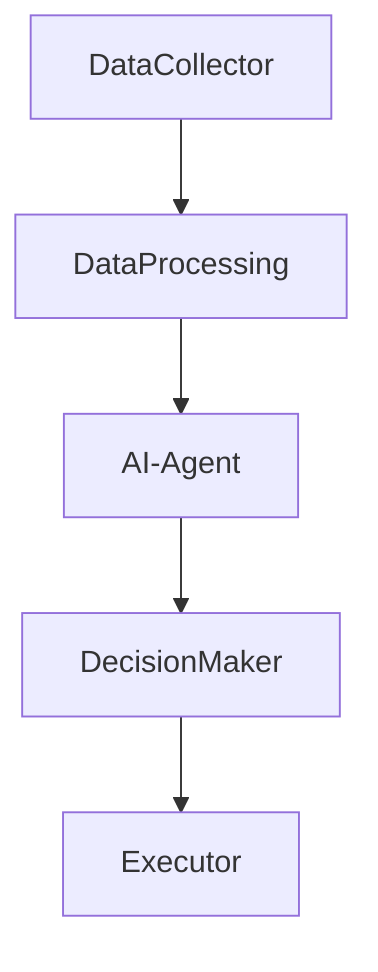
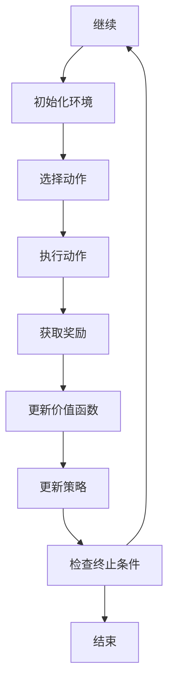
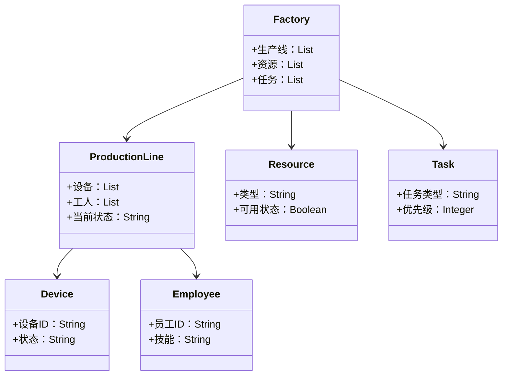
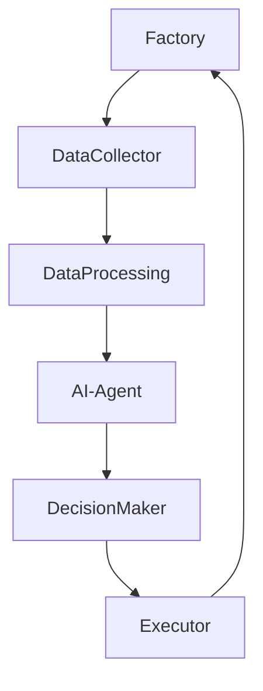

                 


# AI Agent在智能工厂管理中的角色

> 关键词：AI Agent, 智能工厂, 智能制造, 工业4.0, 优化管理, 实时决策, 数据分析

> 摘要：本文探讨了AI Agent在智能工厂管理中的核心作用，分析了其在智能制造背景下的应用价值，详细阐述了AI Agent的核心概念、算法原理、系统架构以及实际项目中的应用案例，最后总结了AI Agent在智能工厂管理中的优势与挑战，并展望了未来的发展方向。

---

# 第一部分: AI Agent与智能工厂管理的背景与概念

## 第1章: AI Agent与智能工厂管理概述

### 1.1 智能工厂管理的背景与现状

#### 1.1.1 智能制造与工业4.0的背景
工业4.0的概念源于德国在2011年提出的《 Industrie 4.0》战略，旨在通过物联网（IoT）、大数据、云计算和人工智能等技术，推动制造业向智能化、数字化方向转型。智能制造作为工业4.0的核心，强调通过智能化生产、服务和供应链管理，实现生产效率的提升和资源的优化配置。

#### 1.1.2 智能工厂管理的核心目标
智能工厂管理的核心目标是通过智能化手段，实现生产过程的实时监控、资源的优化配置、质量的精准控制以及决策的快速响应。其主要目标包括：
- **生产效率提升**：通过自动化和智能化手段减少人工干预，提高生产效率。
- **资源优化配置**：实现设备、能源和原材料的高效利用，降低浪费。
- **质量控制**：通过实时数据分析，确保产品质量的稳定性。
- **快速响应**：在生产过程中快速识别问题并采取措施，减少停机时间。

#### 1.1.3 当前智能工厂管理的主要挑战
尽管智能制造的理念已经提出多年，但在实际应用中仍然面临诸多挑战：
- **数据孤岛问题**：不同设备和系统之间缺乏有效的数据共享机制，导致信息孤岛。
- **数据处理能力不足**：生产过程中产生的海量数据对计算能力和算法提出了更高要求。
- **系统集成复杂性**：不同厂商的设备和系统需要高度集成，增加了实施难度。
- **安全与隐私问题**：工业数据的安全性和隐私保护成为重要课题。

### 1.2 AI Agent的基本概念与特点

#### 1.2.1 AI Agent的定义
AI Agent（人工智能代理）是指能够感知环境、自主决策并采取行动以实现特定目标的智能实体。它可以是一个软件程序，也可以是物理设备，通过与环境的交互来完成任务。

#### 1.2.2 AI Agent的核心特点
AI Agent具有以下核心特点：
1. **自主性**：能够自主决策和行动，无需人工干预。
2. **反应性**：能够实时感知环境并做出快速响应。
3. **目标导向**：通过目标驱动来优化决策和行动。
4. **学习能力**：能够通过数据和经验不断优化自身的算法和策略。

#### 1.2.3 AI Agent与传统自动化的区别
传统的自动化系统主要基于预设的规则和程序运行，而AI Agent则具备更强的自主性和学习能力，能够根据环境变化动态调整行为。以下是两者的对比：

| 对比维度 | 传统自动化 | AI Agent |
|----------|------------|----------|
| 决策方式 | 基于预设规则 | 基于实时数据和学习 |
| 灵活性 | 较低 | 较高 |
| 复杂环境处理能力 | 有限 | 强大 |
| 自适应能力 | 较弱 | 较强 |

### 1.3 AI Agent在智能工厂管理中的结合

#### 1.3.1 AI Agent与智能工厂管理的结合点
AI Agent在智能工厂管理中的应用主要体现在以下几个方面：
- **生产过程监控**：实时监控生产过程中的各项指标，识别异常情况。
- **资源优化配置**：根据生产需求动态调整设备和资源的分配。
- **预测性维护**：通过分析设备数据，预测设备故障，提前进行维护。
- **生产优化**：通过优化生产流程和参数，提高生产效率。

#### 1.3.2 AI Agent在智能工厂管理中的优势
AI Agent的应用为智能工厂管理带来了显著优势：
1. **高效决策**：通过实时数据分析和机器学习算法，快速做出最优决策。
2. **灵活性**：能够适应生产过程中的各种变化和不确定性。
3. **精准控制**：通过精细的算法和模型，实现对生产过程的精准控制。
4. **数据驱动**：以数据为基础，实现从经验驱动向数据驱动的转变。

#### 1.3.3 AI Agent在智能工厂管理中的应用场景
以下是AI Agent在智能工厂管理中的几个典型应用场景：
1. **生产排程优化**：根据生产任务和设备状态，动态调整生产排程。
2. **资源分配优化**：根据实时需求，优化设备、人员和物料的分配。
3. **质量控制**：通过实时数据分析，识别潜在的质量问题并采取纠正措施。
4. **预测性维护**：基于设备运行数据，预测设备故障，减少停机时间。

### 1.4 AI Agent在智能工厂管理中的挑战与解决方案

#### 1.4.1 当前的主要挑战
AI Agent在智能工厂管理中的应用面临以下挑战：
1. **数据隐私与安全**：工业数据涉及企业核心机密，数据安全和隐私保护至关重要。
2. **算法可解释性**：复杂的机器学习模型可能难以解释其决策过程，影响信任度。
3. **系统的实时性**：高频率的数据处理和决策对系统的实时性提出了更高要求。
4. **多目标优化**：生产过程中往往需要在多个目标之间进行权衡，增加了优化的难度。

#### 1.4.2 解决方案与优化思路
针对上述挑战，可以采取以下解决方案：
1. **数据加密与隐私保护**：通过数据加密、区块链等技术，确保数据的安全和隐私。
2. **可解释性增强**：采用可解释性更强的算法（如规则学习、决策树等），或者通过可视化工具帮助用户理解模型决策。
3. **边缘计算**：将计算能力部署在生产现场，减少数据传输延迟，提高实时性。
4. **多目标优化算法**：采用多目标优化算法（如NSGA-II、帕累托优化等），在多个目标之间找到平衡点。

#### 1.4.3 未来的发展趋势
随着技术的进步，AI Agent在智能工厂管理中的应用将更加广泛和深入：
1. **人机协作**：AI Agent将与人类专家协作，共同优化生产过程。
2. **自适应学习**：AI Agent将具备更强的自适应学习能力，能够更好地应对复杂的生产环境。
3. **智能化决策**：通过深度学习和强化学习，AI Agent将能够做出更加智能和优化的决策。

## 1.5 本章小结
本章介绍了AI Agent在智能工厂管理中的背景与概念，分析了智能制造和工业4.0的背景，阐述了AI Agent的核心概念与特点，并探讨了AI Agent在智能工厂管理中的结合与挑战。通过本章的介绍，读者可以对AI Agent在智能工厂管理中的作用和应用有一个清晰的认识。

---

# 第二部分: AI Agent的核心概念与系统架构

## 第2章: AI Agent的核心概念与系统架构

### 2.1 AI Agent的核心概念

#### 2.1.1 AI Agent的分类
AI Agent可以根据不同的分类标准进行划分：
1. **按智能水平**：
   - **反应式AI Agent**：基于当前感知做出反应，不具备记忆能力。
   - **认知式AI Agent**：具备记忆、推理和规划能力，能够进行复杂任务。
2. **按应用场景**：
   - **服务型AI Agent**：用于提供服务，如客服机器人。
   - **控制型AI Agent**：用于控制设备和系统，如工业机器人。

#### 2.1.2 AI Agent的功能模块
一个典型的AI Agent系统通常包含以下几个功能模块：
1. **感知模块**：负责采集环境中的数据，如传感器数据、设备状态等。
2. **决策模块**：基于感知数据和目标，通过算法做出决策。
3. **执行模块**：根据决策结果，驱动执行器或发送控制指令。
4. **学习模块**：通过机器学习算法，优化决策模型。

#### 2.1.3 AI Agent的决策机制
AI Agent的决策机制是其核心部分，常见的决策机制包括：
1. **基于规则的决策**：根据预设的规则和条件进行决策。
2. **基于模型的决策**：通过构建数学模型，预测未来状态并做出决策。
3. **基于强化学习的决策**：通过试错和奖励机制，优化决策策略。

### 2.2 智能工厂管理的核心要素

#### 2.2.1 生产过程管理
生产过程管理是智能工厂管理的核心，主要包括：
- **生产排程**：根据生产任务和设备状态，动态调整生产排程。
- **质量控制**：通过实时监控和数据分析，确保产品质量。
- **设备管理**：对设备进行预测性维护，减少停机时间。

#### 2.2.2 资源优化配置
资源优化配置是智能工厂管理的重要内容，主要包括：
- **设备优化**：合理分配设备资源，避免设备闲置或超负荷运转。
- **人员优化**：根据生产需求，动态调整人员安排。
- **物料优化**：优化物料库存，减少浪费。

#### 2.2.3 实时数据分析
实时数据分析是智能工厂管理的基础，主要包括：
- **数据采集**：通过传感器和设备采集实时数据。
- **数据分析**：通过大数据技术，分析数据并提取有价值的信息。
- **数据可视化**：通过可视化工具，直观展示数据，帮助决策者快速理解。

### 2.3 AI Agent与智能工厂管理的系统架构

#### 2.3.1 系统架构的组成
AI Agent在智能工厂管理中的系统架构通常包括以下几个部分：
1. **数据采集层**：通过传感器、设备和数据库采集实时数据。
2. **数据处理层**：对采集到的数据进行清洗、转换和分析。
3. **决策层**：通过AI Agent进行决策和优化。
4. **执行层**：根据决策结果，驱动设备和系统执行操作。

#### 2.3.2 各模块之间的关系
各模块之间的关系可以用以下流程图表示：



其中：
- **DataCollector**：数据采集模块，负责采集实时数据。
- **DataProcessing**：数据处理模块，负责清洗和转换数据。
- **AI-Agent**：AI Agent模块，负责数据分析和决策。
- **DecisionMaker**：决策模块，根据AI Agent的建议做出最终决策。
- **Executor**：执行模块，根据决策结果执行操作。

#### 2.3.3 系统架构的优缺点
以下是系统架构的主要优缺点：
- **优点**：
  - **实时性**：能够实时采集和处理数据，快速做出决策。
  - **灵活性**：可以根据生产需求动态调整，适应变化。
  - **可扩展性**：可以根据需要扩展系统功能和规模。
- **缺点**：
  - **复杂性**：系统的复杂性较高，需要较高的技术投入。
  - **成本**：建设和维护成本较高。

### 2.4 系统架构的ER实体关系图

```mermaid
er
    actor: 管理者
    system: 智能工厂管理平台
    agent: AI Agent
    production_line: 生产线
    resource: 资源
    task: 任务

    actor --> system: 请求处理
    system --> agent: 调用AI Agent
    agent --> production_line: 控制生产线
    agent --> resource: 优化资源配置
    agent --> task: 分配任务
```

该图展示了智能工厂管理平台与各个实体之间的关系：
- **管理者**：通过管理平台请求处理，如查询生产状态、调整生产计划等。
- **系统**：负责接收管理者的请求，并调用AI Agent进行处理。
- **AI Agent**：根据系统的需求，控制生产线、优化资源配置、分配任务等。
- **生产线**：根据AI Agent的指令进行生产操作。
- **资源**：包括设备、人员、物料等，AI Agent负责优化资源配置。

---

## 第3章: AI Agent的算法原理与数学模型

### 3.1 AI Agent的核心算法

#### 3.1.1 强化学习算法
强化学习是一种通过试错和奖励机制来优化决策策略的算法。AI Agent通过与环境的交互，不断学习并优化自己的行为，以获得最大的累积奖励。

#### 3.1.2 基于模型的强化学习
基于模型的强化学习算法通过构建环境的模型，模拟环境的状态和转移，从而在模型上进行学习和优化。

#### 3.1.3 基于策略的强化学习
基于策略的强化学习算法直接优化策略，即从状态到动作的映射，而不是通过值函数进行中间计算。

### 3.2 AI Agent的数学模型

#### 3.2.1 状态空间的定义
状态空间是AI Agent所有可能的状态的集合，通常用S表示。每个状态s∈S表示一个具体的环境状态。

#### 3.2.2 动作空间的定义
动作空间是AI Agent所有可能采取的动作的集合，通常用A表示。每个动作a∈A表示一个具体的行动。

#### 3.2.3 奖励函数的定义
奖励函数r(s, a)表示在状态s下采取动作a后获得的奖励值。

#### 3.2.4 状态转移概率
状态转移概率P(s'|s, a)表示在状态s下采取动作a后，转移到状态s'的概率。

#### 3.2.5 动作价值函数
动作价值函数Q(s, a)表示在状态s下采取动作a的期望累积奖励。

#### 3.2.6 策略函数
策略函数π(a|s)表示在状态s下采取动作a的概率。

### 3.3 强化学习算法流程图



### 3.4 Q-Learning算法实现

#### 3.4.1 算法流程
Q-Learning算法是一种基于值函数的强化学习算法，其流程如下：

1. 初始化Q表，通常是一个状态-动作对的价值函数表格。
2. 进入初始状态s。
3. 选择动作a，根据当前策略π(a|s)。
4. 执行动作a，观察下一个状态s'，并获得奖励r。
5. 更新Q表中的Q(s, a)值：
   $$ Q(s, a) = Q(s, a) + \alpha [r + \gamma \max Q(s', a') - Q(s, a)] $$
6. 重复步骤2-5，直到满足终止条件。

#### 3.4.2 Python实现代码
以下是Q-Learning算法的Python实现示例：

```python
import numpy as np
import random

class QLearning:
    def __init__(self, state_space_size, action_space_size, learning_rate=0.1, gamma=0.9):
        self.state_space_size = state_space_size
        self.action_space_size = action_space_size
        self.learning_rate = learning_rate
        self.gamma = gamma
        self.Q = np.zeros((state_space_size, action_space_size))

    def choose_action(self, state):
        if random.random() < 0.1:  # 探索概率
            return random.randint(0, self.action_space_size-1)
        else:
            return np.argmax(self.Q[state])

    def update_Q(self, state, action, reward, next_state):
        self.Q[state, action] += self.learning_rate * (reward + self.gamma * np.max(self.Q[next_state]) - self.Q[state, action])

# 示例应用
state_space_size = 5
action_space_size = 3
ql = QLearning(state_space_size, action_space_size)
state = 0
action = ql.choose_action(state)
next_state = ...  # 根据环境反馈得到
ql.update_Q(state, action, reward, next_state)
```

### 3.5 数学公式解释
在Q-Learning算法中，Q表的更新公式为：

$$ Q(s, a) = Q(s, a) + \alpha [r + \gamma \max Q(s', a') - Q(s, a)] $$

其中：
- α 是学习率，控制更新步长。
- γ 是折扣因子，平衡当前奖励和未来奖励的重要性。
- r 是立即奖励。
- max Q(s', a') 是下一个状态下的最大动作价值。

### 3.6 算法应用实例
假设我们有一个简单的生产排程问题，AI Agent需要根据当前设备状态和生产任务，动态调整生产排程。通过Q-Learning算法，AI Agent可以在不同的状态下选择最优的动作，从而实现生产排程的优化。

---

## 第4章: 系统分析与架构设计方案

### 4.1 系统分析

#### 4.1.1 问题场景介绍
假设我们有一个汽车制造厂，需要优化生产线的资源分配和生产排程。生产线包括冲压、焊接、涂装和总装四个工段，每个工段有若干设备和工人。目标是通过AI Agent实现生产线的实时监控和优化管理。

#### 4.1.2 系统功能设计
系统功能设计包括以下几个方面：
1. **数据采集**：通过传感器和设备采集生产线的实时数据，如设备状态、生产进度、资源使用情况等。
2. **数据处理**：对采集到的数据进行清洗、转换和分析，提取有价值的信息。
3. **AI Agent决策**：通过AI Agent对数据进行分析，优化生产排程和资源分配。
4. **执行与反馈**：根据AI Agent的决策结果，驱动设备和系统执行操作，并将反馈数据回传给AI Agent，形成闭环。

### 4.2 系统架构设计

#### 4.2.1 领域模型类图
以下是系统的领域模型类图：



#### 4.2.2 系统架构图
以下是系统的架构图：



其中：
- **Factory**：工厂管理模块，负责协调各个生产线和资源。
- **DataCollector**：数据采集模块，负责采集实时数据。
- **DataProcessing**：数据处理模块，负责清洗和转换数据。
- **AI-Agent**：AI Agent模块，负责数据分析和决策。
- **DecisionMaker**：决策模块，根据AI Agent的建议做出最终决策。
- **Executor**：执行模块，根据决策结果驱动设备和系统执行操作。

#### 4.2.3 系统交互序列图
以下是系统的交互序列图：

```mermaid
sequenceDiagram
   参与者 管理者
    参与者 系统
    参与者 AI Agent
    参与者 生产线
    参与者 资源
    参与者 任务

    管理者 -> 系统: 请求处理
    系统 -> AI Agent: 调用AI Agent
    AI Agent -> 生产线: 控制生产线
    AI Agent -> 资源: 优化资源配置
    AI Agent -> 任务: 分配任务
    生产线 -> 系统: 反馈生产状态
    资源 -> 系统: 反馈资源状态
    任务 -> 系统: 反馈任务状态
```

### 4.3 项目实战

#### 4.3.1 项目背景
假设我们有一个汽车制造厂，需要优化生产线的资源分配和生产排程。生产线包括冲压、焊接、涂装和总装四个工段，每个工段有若干设备和工人。目标是通过AI Agent实现生产线的实时监控和优化管理。

#### 4.3.2 环境配置
项目环境配置包括以下内容：
- **硬件环境**：需要高性能计算服务器和边缘设备。
- **软件环境**：需要安装Python、TensorFlow、Kafka、Redis等工具。

#### 4.3.3 核心代码实现
以下是项目的Python核心代码实现：

```python
# 生产线管理模块
class ProductionLineManager:
    def __init__(self, lines):
        self.lines = lines

    def get_line_status(self, line_id):
        return self.lines[line_id].status

    def set_line_status(self, line_id, status):
        self.lines[line_id].status = status

# AI Agent模块
class AIAgent:
    def __init__(self, lines, resources):
        self.lines = lines
        self.resources = resources

    def optimize_resource_allocation(self):
        # 具体优化逻辑根据实际情况实现
        pass

    def schedule_production(self):
        # 具体生产排程逻辑根据实际情况实现
        pass

# 系统主程序
def main():
    # 初始化生产线和资源
    lines = [Line(0, "冲压"), Line(1, "焊接"), Line(2, "涂装"), Line(3, "总装")]
    resources = [Resource(0, "设备", True), Resource(1, "工人", True)]

    # 初始化AI Agent
    agent = AIAgent(lines, resources)

    # 进入优化循环
    while True:
        agent.optimize_resource_allocation()
        agent.schedule_production()
        # 获取反馈
        status = agent.get_feedback()
        # 更新状态
        agent.update_state(status)

if __name__ == "__main__":
    main()
```

#### 4.3.4 案例分析
通过上述代码实现，AI Agent可以实时优化资源分配和生产排程，从而提高生产效率和资源利用率。例如，在生产过程中，AI Agent可以根据设备状态和生产任务，动态调整设备的使用顺序和工人的分配，避免设备闲置和工人不足的情况。

#### 4.3.5 项目小结
通过本项目，我们实现了AI Agent在智能工厂管理中的应用，验证了AI Agent在资源优化和生产排程中的有效性。同时，我们也发现了系统中存在的不足之处，例如数据处理的实时性和系统的可扩展性需要进一步优化。

---

## 第5章: 总结与展望

### 5.1 总结
本文详细探讨了AI Agent在智能工厂管理中的角色，从背景与概念、核心概念与系统架构、算法原理与数学模型、系统分析与架构设计以及项目实战等方面进行了全面分析。我们发现，AI Agent的应用能够显著提升智能工厂的生产效率和资源利用率，同时优化生产过程中的决策和控制。

### 5.2 未来展望
随着人工智能和大数据技术的不断发展，AI Agent在智能工厂管理中的应用前景广阔。未来的研究方向包括：
1. **强化学习的可解释性**：进一步提高强化学习算法的可解释性，增强用户对AI Agent决策的信任。
2. **多智能体协作**：研究多智能体协作机制，实现更复杂的生产场景管理。
3. **边缘计算与雾计算**：结合边缘计算和雾计算技术，提高系统的实时性和安全性。
4. **人机协作**：探索人机协作新模式，充分发挥人类专家和AI Agent的优势。

### 5.3 最佳实践 Tips
1. **数据安全与隐私保护**：在实际应用中，应高度重视数据的安全和隐私保护，采用加密和区块链等技术。
2. **算法优化**：根据实际场景和需求，选择合适的算法和模型，进行针对性优化。
3. **系统集成**：在系统集成过程中，应注重模块之间的协调与配合，确保系统的稳定性和可扩展性。
4. **持续学习**：AI Agent应具备持续学习能力，能够根据新的数据和环境变化，不断优化自身的算法和策略。

### 5.4 作者寄语
AI Agent作为人工智能技术的重要组成部分，正在逐步改变智能工厂的管理方式。我们相信，随着技术的进步和应用的深入，AI Agent将在智能工厂管理中发挥越来越重要的作用，为制造业的智能化转型提供强有力的支持。

---

# 作者：AI天才研究院/AI Genius Institute & 禅与计算机程序设计艺术 /Zen And The Art of Computer Programming

