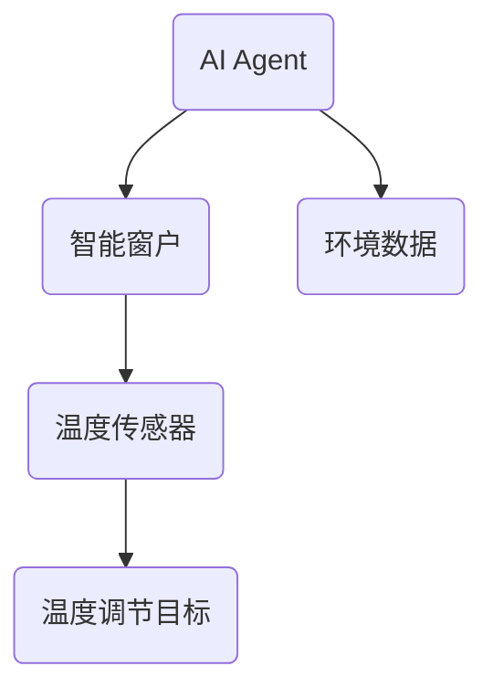
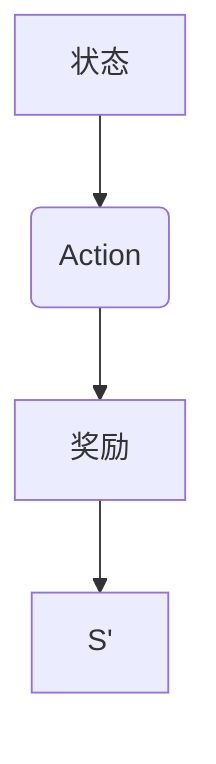
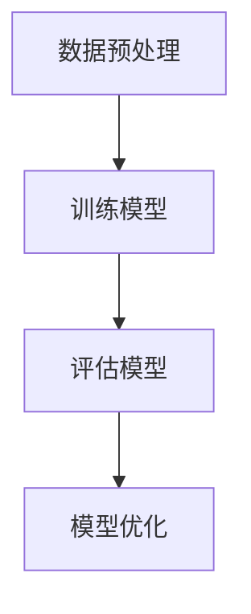
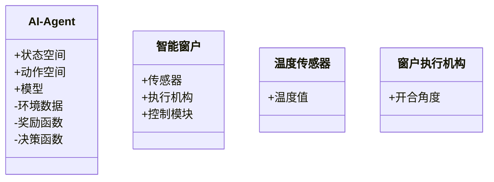
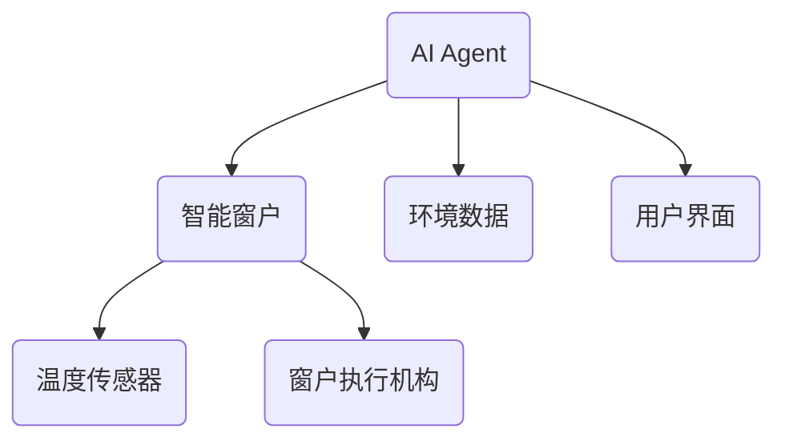
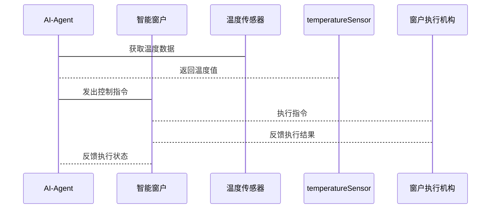

                 


# AI Agent在智能窗户中的室内温度自动调节

> 关键词：AI Agent, 智能窗户, 室内温度, 自动调节, 物联网, 机器学习

> 摘要：本文探讨AI Agent在智能窗户中的应用，通过详细分析背景、核心概念、算法原理、系统架构、项目实战及最佳实践，阐述如何利用AI Agent实现室内温度的自动调节，结合物联网技术，提供高效的温度控制解决方案。

---

# 第一部分: 背景介绍

## 第1章: 问题背景与描述

### 1.1 问题背景
#### 1.1.1 室内温度调节的重要性
室内温度直接影响居住舒适度和能源消耗。传统空调系统存在能耗高、调节滞后等问题，亟需更智能的解决方案。

#### 1.1.2 智能窗户的发展现状
智能窗户通过传感器和执行机构实现开合自动化，但缺乏智能决策能力，无法根据环境变化主动调节。

#### 1.1.3 AI Agent在智能窗户中的应用潜力
AI Agent具备感知、决策和执行能力，可提升智能窗户的智能化水平，优化室内温度调节。

### 1.2 问题描述
#### 1.2.1 室内温度调节的挑战
温度调节需要实时感知环境变化，动态调整窗户开合，平衡舒适性与能耗。

#### 1.2.2 智能窗户的现有技术局限
传感器精度不足，决策算法简单，无法应对复杂环境变化。

#### 1.2.3 AI Agent在温度调节中的角色
作为智能窗户的核心决策单元，AI Agent通过分析环境数据，优化窗户开合策略，实现精准温度调节。

### 1.3 问题解决
#### 1.3.1 AI Agent的核心作用
AI Agent通过机器学习算法，实时分析环境数据，制定最优窗户控制策略。

#### 1.3.2 智能窗户与AI Agent的结合
将AI Agent集成到智能窗户系统中，实现智能化温度调节。

#### 1.3.3 温度调节的优化目标
在保证舒适度的前提下，降低能耗，实现绿色建筑目标。

### 1.4 系统边界与外延
#### 1.4.1 系统边界定义
系统包括AI Agent、智能窗户、温度传感器和执行机构，与其他系统（如空调）通过API交互。

#### 1.4.2 系统外延与扩展
未来可扩展至多房间、多设备协同，结合能源管理系统进一步优化。

#### 1.4.3 系统与外部环境的交互
AI Agent通过传感器获取环境数据，通过执行机构调节窗户开合，同时与外部系统（如空调）联动。

### 1.5 核心概念与系统结构
#### 1.5.1 AI Agent的基本概念
AI Agent具备感知、决策和执行能力，可自主完成任务。

#### 1.5.2 智能窗户的功能模块
包括传感器模块、执行机构和控制模块，实现窗户的智能控制。

#### 1.5.3 温度调节的系统结构
由AI Agent、智能窗户、温度传感器和执行机构组成，形成闭环调节系统。

---

# 第二部分: 核心概念与联系

## 第2章: 核心概念与联系

### 2.1 AI Agent与智能窗户的核心原理
#### 2.1.1 AI Agent的感知与决策机制
AI Agent通过传感器获取环境数据，利用机器学习模型做出决策。

#### 2.1.2 智能窗户的执行机构
包括电机和驱动电路，根据AI Agent的指令调节窗户开合角度。

#### 2.1.3 温度调节的反馈机制
通过温度传感器实时反馈室内温度，AI Agent根据反馈调整策略。

### 2.2 核心概念属性对比
#### 2.2.1 AI Agent属性对比表

| 属性       | 描述                                         |
|------------|----------------------------------------------|
| 感知能力   | 能够采集环境数据                             |
| 决策能力   | 基于数据做出最优决策                         |
| 执行能力   | 通过执行机构实现动作                         |

#### 2.2.2 智能窗户属性对比表

| 属性       | 描述                                         |
|------------|----------------------------------------------|
| 传感器     | 温度、光照、湿度等传感器                     |
| 执行机构   | 电机驱动窗户开合                             |
| 控制模块   | 处理信号并发出指令                           |

#### 2.2.3 温度调节属性对比表

| 属性       | 描述                                         |
|------------|----------------------------------------------|
| 调节目标   | 实现舒适温度区间                             |
| 能耗目标   | 最小化能源消耗                               |
| 反应速度   | 快速响应环境变化                             |

### 2.3 实体关系图


---

# 第三部分: 算法原理讲解

## 第3章: AI Agent算法原理

### 3.1 强化学习算法
#### 3.1.1 算法流程图


#### 3.1.2 算法实现步骤
1. 初始化状态空间、动作空间和奖励函数。
2. AI Agent在环境中执行动作，获取奖励。
3. 根据奖励更新策略，优化动作选择。

#### 3.1.3 强化学习代码示例
```python
class AI-Agent:
    def __init__(self, state_space, action_space):
        self.state_space = state_space
        self.action_space = action_space
        self.model = self.build_model()

    def build_model(self):
        # 构建神经网络模型
        pass

    def act(self, state):
        # 根据状态选择动作
        pass

    def remember(self, state, action, reward, next_state):
        # 存储经验
        pass

    def replay(self, batch_size):
        # 重放经验，更新模型
        pass
```

#### 3.1.4 数学模型
强化学习的目标是最大化累积奖励：
$$ Q(s, a) = r + \gamma \max Q(s', a') $$
其中，$s$ 是状态，$a$ 是动作，$r$ 是奖励，$\gamma$ 是折扣因子。

### 3.2 机器学习模型
#### 3.2.1 机器学习流程图


#### 3.2.2 机器学习实现步骤
1. 数据预处理：收集并清洗环境数据。
2. 模型训练：使用神经网络模型训练温度预测模型。
3. 模型评估：通过测试数据评估模型性能。
4. 模型优化：调整参数，提升预测精度。

#### 3.2.3 机器学习代码示例
```python
import numpy as np
from sklearn.metrics import mean_squared_error

class TemperaturePredictor:
    def __init__(self):
        self.model = self.build_model()

    def build_model(self):
        # 构建回归模型
        pass

    def train(self, X, y):
        # 训练模型
        pass

    def predict(self, X):
        # 预测温度
        pass

# 示例训练
X_train = np.random.rand(100, 5)
y_train = np.random.rand(100, 1)
model = TemperaturePredictor()
model.train(X_train, y_train)
y_pred = model.predict(X_train)
print(mean_squared_error(y_train, y_pred))
```

#### 3.2.4 数学模型
温度预测模型通常采用回归模型：
$$ y = \theta x + \beta $$
其中，$y$ 是预测温度，$x$ 是输入特征，$\theta$ 是权重，$\beta$ 是截距。

---

# 第四部分: 系统分析与架构设计方案

## 第4章: 系统分析与架构设计

### 4.1 问题场景介绍
智能窗户系统需要实时监测室内温度、光照、湿度等参数，通过AI Agent决策窗户开合角度，实现温度调节。

### 4.2 项目介绍
本项目旨在开发一个基于AI Agent的智能窗户系统，实现室内温度的自动调节。

### 4.3 系统功能设计
#### 4.3.1 领域模型


#### 4.3.2 系统架构图


#### 4.3.3 系统接口设计
- AI Agent接口：接收环境数据，输出控制指令。
- 智能窗户接口：接收控制指令，反馈执行状态。
- 温度传感器接口：提供实时温度数据。

#### 4.3.4 系统交互流程


---

# 第五部分: 项目实战

## 第5章: 项目实战

### 5.1 环境安装
安装Python、TensorFlow、Keras、Mermaid等工具，配置开发环境。

### 5.2 系统核心实现
#### 5.2.1 AI Agent实现
```python
class AI-Agent:
    def __init__(self):
        self.model = self.build_model()

    def build_model(self):
        model = Sequential()
        model.add(Dense(64, input_dim=5, activation='relu'))
        model.add(Dense(1, activation='linear'))
        model.compile(optimizer='adam', loss='mean_squared_error')
        return model

    def train(self, X, y):
        self.model.fit(X, y, epochs=100, batch_size=32)
```

#### 5.2.2 温度传感器集成
使用Raspberry Pi和DS18B20温度传感器，读取温度数据并传递给AI Agent。

#### 5.2.3 窗户执行机构控制
通过PWM信号控制电机，调节窗户开合角度。

### 5.3 代码实现
#### 5.3.1 AI Agent训练
```python
# 训练AI Agent
agent = AI-Agent()
X_train = ...  # 输入特征
y_train = ...  # 目标温度
agent.train(X_train, y_train)
```

#### 5.3.2 温度调节案例分析
在不同天气条件下，AI Agent如何调整窗户开合，维持室内温度在20-25℃之间。

### 5.4 项目小结
通过项目实战，验证了AI Agent在智能窗户中的有效性，实现了室内温度的自动调节。

---

# 第六部分: 最佳实践

## 第6章: 最佳实践

### 6.1 小结
AI Agent通过感知、决策和执行，优化了智能窗户的温度调节能力，提升了居住舒适度和能效。

### 6.2 注意事项
- 数据采集的准确性影响调节效果，需确保传感器精度。
- 算法模型的泛化能力需通过交叉验证提升。
- 系统安全性和稳定性需重点考虑。

### 6.3 拓展阅读
推荐阅读《强化学习入门》和《机器学习实战》，深入理解算法原理和应用。

---

# 结语

AI Agent在智能窗户中的应用展现了人工智能技术在物联网领域的巨大潜力。通过不断优化算法和系统设计，未来可实现更智能、更高效的室内温度调节。

---

# 作者：AI天才研究院 & 禅与计算机程序设计艺术

---

